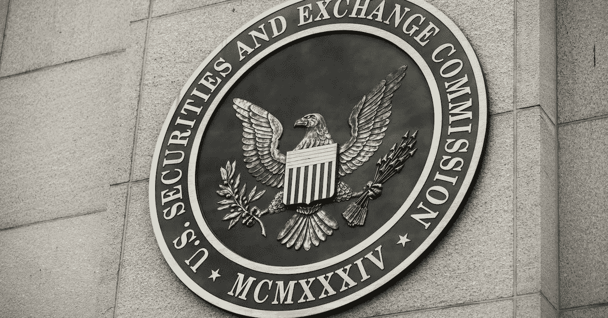

# 兄弟姐妹因超过 1 . 24 亿美元的加密诈骗操作被 SEC 起诉——Derev 博客

> 原文：<https://medium.com/coinmonks/siblings-charged-by-sec-over-124m-crypto-scam-operations-derev-blog-83eea1e5573c?source=collection_archive---------75----------------------->

据报道，通过两次未注册的欺诈发行，这对兄弟姐妹已经诈骗了投资者超过 1 . 24 亿美元。

*   据称巴克斯代尔夫妇通过**“奥美斯币”诈骗投资者**
*   巴克斯代尔的兄弟姐妹甚至举行路演来宣传他们的骗局硬币。
*   证券交易委员会指控这对兄妹…