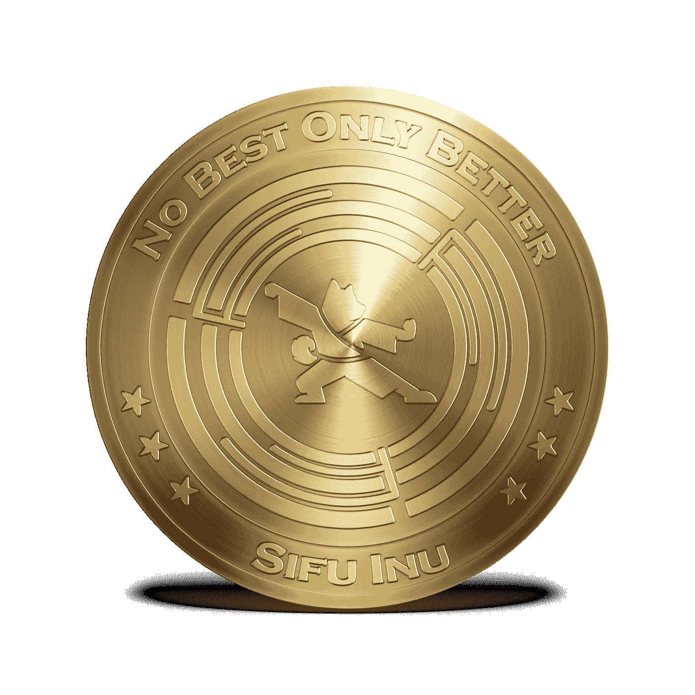

# Sifu Inu:你必须知道的改变游戏规则的通货紧缩奖励标志

> 原文：<https://medium.com/coinmonks/sifu-inu-a-gamechanger-deflationary-rewards-meme-token-c1a0531781a2?source=collection_archive---------8----------------------->

迷因令牌现在是加密领域的主流，尤其是像 Dogecoin、Shibu Inu 等令人兴奋的选项。然而，Sifu Inu 与其他同类不同，因为它带来了不确定性和乐趣。这种通货紧缩奖励 meme token 已经彻底改变了收入产生，成为当今加密宇宙中最好的 meme 硬币。

**简介**

如果你认为加密货币是严肃的、商业的，你会大吃一惊。这里有一个符号， [Sifu Inu](http://sifuinu.io/) ，一个迷因符号，它引入了抓住它的乐趣元素。当你知道你持有 Sifu Inu 赚取了可观的收入时，成为游戏的一部分并享受美好时光就变得值得了。让我们看看 Sifu Inu 是什么，你如何赚取被动收入，以及它如何成为通货紧缩奖励的象征。

什么是模因令牌，为什么它们会成为头条新闻？

迷因令牌是受互联网迷因或笑话启发的加密资产。例如，2021 年谈论最多的迷因币是 Dogecoin，它的名字来自一种著名的日本狗品种。虽然最初是作为一个笑话创建的，但许多 meme 令牌已经在加密货币市场上蓬勃发展，人们获得了可观的收入。知名影响者发挥了关键作用，例如埃隆·马斯克的推文[将 Dogecoin 的价值](https://www.news18.com/news/buzz/elon-musks-interstellar-meme-on-cryptocurrency-stress-sends-dogecoin-to-the-moon-4678001.html#:~:text=In%20December%2C%20Musk%20said%20Tesla,to%20%240.20%20after%20the%20tweet.)提高了 24%。最近成为头条新闻的一些最受欢迎的迷因币是 Dogecoin，Shiba Inu，Dogelon Mars，SafeMoon Inu 等。与 Dogecoin 类似，柴犬在 2021 年通过升值近 2500 万% 成功击败了大男孩、比特币和以太坊。

**什么是四福 Inu？**

Sifu Inu 可能看起来像任何其他具有类似特征的加密令牌，允许产生收入、分享利润和订阅通用令牌组学。然而，相似之处到此为止，因为 Sifu Inu 引入了乐趣元素及其不确定性，为其持有者带来了革命性的创收。

**独特的 Sifu Inu 标记组学及其区别于其他模因币的原因**

关于记号组学的多种因素使 Sifu Inu 有别于其他最受欢迎的模因记号，例如:

● Sifu Inu 被认为是第一批超级通缩硬币之一，它准备在推出 1000 天内烧掉最大供应量的很大一部分。

● Sifu Inu 目前最高供应 250 亿代币。81%的流通供应量将由上市前买家持有。剩余 19%的流通供应量将在上市时提供。

●剩余电流最大供应的大部分将分布在 1000 个卷轴中，卷轴中的数量各不相同。

●这些卷轴将在 1000 天内一次打开一个，600 个挣日，400 个烧日。电视直播的抽奖决定了特定的卷轴是挣日还是烧日。

●相应地，卷轴被实时打开，并且卷轴中存在的 Sifu Inu 令牌被相应地处理。

●一个挣日导致代币根据持有者持有代币的百分比通过空投进入流通供应。不同的促销活动将被引入，并将决定 Sifu Inu 硬币将如何以及何时进入持有者的钱包。

●燃烧日导致代币燃烧，因此从最大供应量中取出，永远不会进入流通供应。

●根据 Sifu Inu 持有人持有的代币，所有 Sifu Inu 持有人也按比例分享利润

● 70%的税收通过每周空投进行分配，10%构成回购。营销和业务费用占 10%，团队 Sifu 拿 10%的余额。

这种记号经济学机制使得 Sifu Inu 成为通货紧缩的迷因记号和最佳迷因硬币投资。

**游戏改变者:为什么 Sifu Inu 可能是你最好的迷因币投资**

浏览代币组学可以发现，Sifu Inu 不同于其他的 meme 硬币/代币。因此，让我们剖析一下为什么 Sifu Inu 可能是你最好的 meme 硬币投资。

**1。** **一种独特的&有趣的方法诱导高交易量**

Sifu Inu 有一种独特的运作方式，将乐趣和不确定性结合起来，创造稀缺和过剩，并诱导高交易量。

●如前所述，Sifu Inu token 供应总量的很大一部分被随机分配到 1000 个卷轴中，其中一个卷轴将在 1000 天内每天打开。

●六百个这样的卷轴构成了挣日，而燃烧日占了剩余的 400 天。

●太平洋标准时间每天中午都有电视直播抽签，以决定这一天是赚还是赔。

●在收入日打开的卷轴将 Sifu Inu 令牌释放到循环流中；他们最有可能以阶段性的速度推出，以免压低价格。促销将到位，以激励持有；例如，一天收入卷轴中的所有代币可能只空投给那些得到帮助超过一个月的人或从未出售过的人。所以，持有时间越长，收益越高。

●相比之下，燃烧日会破坏附带的 Sifu Inu 令牌，并将其从总供应中移除。因此，它增加了需求和价格。它鼓励持有者购买更多的 Sifu Inu 代币，并增加他们的总持有量，以获得更高比例的利润份额。

因此，你会看到交易量的增加，无论是赚还是赔。Sifu Inu 最好的一面是整个过程充满乐趣。此外，关于日期类型和在特定日期释放/燃烧的令牌的数量的不确定性使得它更有趣。因此，与密码行业的同行相比，Sifu Inu 有资格成为最好的 meme token。

**2。** **定期被动收入:代币持有者每周利润分成**

这个游戏最有趣的地方在于，每个 Sifu Inu 代币持有者每周都有被动收入。如前所述，在盈利日发行到流通中的代币刺激持有者购买代币并增加他们的持有量。随着供应量的增加，它可能会导致价格下降，从而使购买代币有利可图。持股越高，你每周的利润份额就越大。70%的收入由所有代币持有者按其持有比例分享。

1.  **一个通货紧缩的奖励符号**

就像挣日增加流通供给一样，烧日会大大减少流通供给，导致稀缺，从而提高价格。与此同时，取消代币会导致零供应。这种情况鼓励人们购买 Sifu Inu，并增加他们的持股比例，以在每周利润空投中获得更高的份额。Sifu Inu 有资格成为通货紧缩奖励 meme token，因为它允许持有者即使在供应减少时也能获得奖励。这一因素毫无疑问地证明了《四福 Inu》是传播中最好的模因符号。

1.  **最佳创收分红代币**

Sifu Inu tokenomics 是独一无二的，因为它允许在所有代币持有者之间按其持股比例分享每周产生的 70%的收入。此外，2%的税收构成回购，因此，更多的收入为各自的贸易商。Sifu Inu 最棒的地方在于，它让持有者即使不参与交易活动，也能获得被动收入。这种独特的功能使 Sifu Inu 成为商业上最好的 meme token。

**你凭什么相信四福 Inu！**

Sifu Inu 区别于其他代币的一个重要方面是它的趣味性和不确定性。然而，尽管存在不确定性，一些因素会加强信任因素。

● **经验丰富的团队:**

Sifu Inu 有一个经验丰富、身经百战的团队在后台工作。在 DeFi 工作了几年，参与了各种区块链的项目，这个团队已经吃足了苦头，以确保其客户不会经历类似的磨难。该团队由具有不同技能的人员组成，如开发、会计、营销和法律人员，核心的两个创始团队成员是会计和开发人员。在七年多的时间里，这位会计师为丰田汽车销售部拥有的 120 亿美元的 CD 和债券库管理一个新的尖端软件的会计和实施。该开发人员在一家世界领先的软件公司的开发和数据分析方面拥有 25 年以上的经验，其中大部分是监督和管理项目。

● **强大且不断发展的社区支持:**

Sifu Inu 团队活跃于所有社交媒体渠道，每个成员都有一个庞大的社区追随者。然而，Sifu Inu 需要强大和不断发展的社区支持来提高它在当今加密世界的受欢迎程度，并确保 Sifu Inu 仍然是最好的 meme token。

**为什么现在加入很重要:Sifu Inu 路线图简介**

SIFU 的预售已经在雪崩网络上开始，第一次利润分享空投发生在推出的第一周。Sifu Inu 启动日将是第一次“赚或烧”抽奖的日子。在发布之前，每 3 天会有一个 0.0001 的提价。此外，还会推出一些激励措施来吸引人们购买。例如，在接下来的 24 小时内，任何购买 Sifu Inu 的人都将获得 50%的 Sifu！Sifu 将在未来两个月内推出。

**遗言**

加密交易已经抓住了今天人们的想象力，因为它能够为用户创造良好的主动和被动收入。因此，你有大量的加密货币代币在加密宇宙中流通。迷因代币和迷因硬币也让人们感受到了它们的存在，同时允许用户使用不同的方法赚取收入，如交易、赌博、借贷，甚至持有他们的加密资产。像 [Sifu Inu](http://sifuinu.io/) 这样的 Meme tokens 通过采用游戏方法和引入不确定性元素来提高乐趣系数，同时确保其用户获得足够的被动收入。相对于柴犬、Dogecoin 等同类产品，通货紧缩的奖励特性使[四福犬](http://sifuinu.io/)成为最好的 meme token。

**私服 INU:** [**电报**](https://t.me/sifuinuofficial) **|** [**不和**](https://discord.com/invite/xaF78EQG) **|** [**推特**](https://twitter.com/sifu_inu) **|** [**网页**](http://sifuinu.io)

**参考文献**

1.sifu Inu——最佳创收分红令牌。(未注明)。检索于 2022 年 2 月 6 日，来自 Sifuinu.io 网站:

[https://sifuinu.io/](https://sifuinu.io/)

2.www。facebook.com/thecoinrepublic.(2022 年 2 月 5 日)。出于安全考虑，仙境体验关闭。2022 年 2 月 6 日检索，来自市场期刊网站:[https://themarketperiod . com/2022/02/05/wonderland-experiences-closure-immediate-safety-concerns/](https://themarketperiodical.com/2022/02/05/wonderland-experiences-closure-amidst-safety-concerns/)