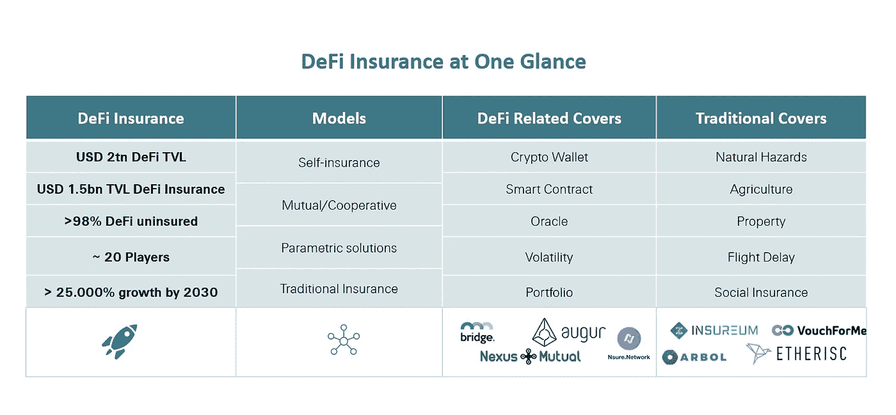
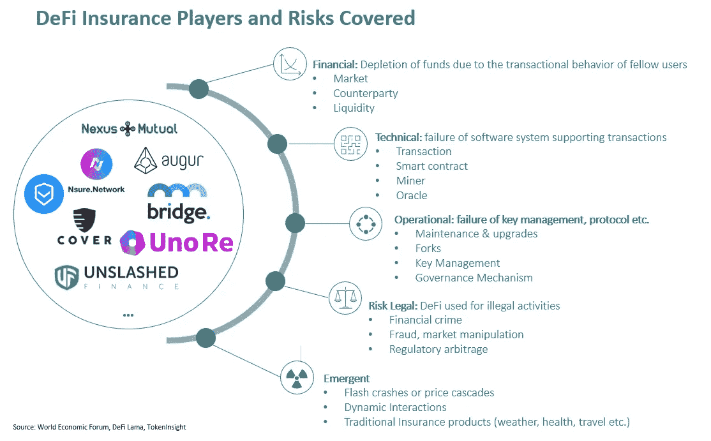
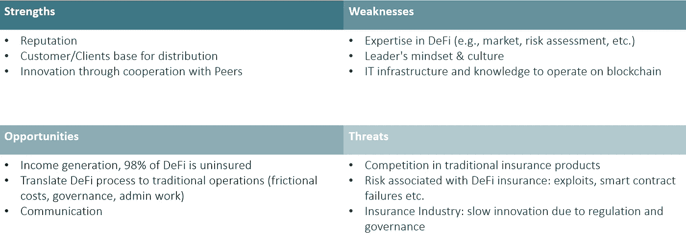

# DeFi 保险对传统再保险人的意义

> 原文：<https://medium.com/coinmonks/significance-of-defi-insurance-for-traditional-re-insurers-6f03779a4ce0?source=collection_archive---------9----------------------->

Photo by [Joshua Sortino](https://unsplash.com/@sortino?utm_source=medium&utm_medium=referral) on [Unsplash](https://unsplash.com?utm_source=medium&utm_medium=referral)

在过去的几年里，去中心化已经影响了货币(如比特币)、投资和金融服务(定义资产管理、借贷、赌博等)。)管理着超过[**2 万亿美元的资产**](https://www.theasianbanker.com/updates-and-articles/digital-asset-outlook-2022-how-will-the-momentum-continue) **，人们不能忽视数字资产的重要性。因此，中央集权当局一直在努力开发中央银行数字货币(CBDCs)或将区块链上的证券和其他传统资产令牌化。作为 DeFi 金融服务产品的一部分，保险是一个快速增长的领域，估值** [**数十亿美元**](https://www.stelareum.io/en/defi-tvl/insurance.html) **和三位数增长率。对于传统的保险公司来说，DeFi 是一个巨大的新业务线，可以产生新的收入，但它也引发了紧急情况，因为新的公司正在进入保险领域，并提供与 DeFi 相关的传统保险产品。随着数字资产、DeFi 和 Web3 令人眩晕的增长预测，DeFi 保险产品类型的不断丰富和资本效率的提高，传统(再)保险公司对进入 DeFi 领域的兴趣不可避免。**

# **DeFi 保险**

类似于传统保险，DeFi insurance 通过支付保险费为密码持有者提供风险保障。然而，当保费和索赔由保险公司管理时，在 DeFi 中，一切都是分散的。用户欢迎保险覆盖，以保护他们免受灾难性风险，否则他们将很容易受到伤害，使生态系统更加安全，并降低新来者和机构的准入门槛。

DeFi 保险围绕[四种保险模式](https://www.internationalinsurance.org/Insights_decentralized_finance#_edn1):

*   **自我保险**:愿意承担风险的参与者将获得更高的赌注收益，而其他寻求保险的人将购买索赔令牌，从而降低他们的收益，大部分保费将进入资金池以覆盖风险。当事件发生时，令牌持有者、网络参与者将成为风险评估者和索赔处理者。
*   **数字互助/合作社**:作为一个分散的自治组织(DAO)运作，由成员参与购买保险，保费进入资金池，改善互助的资金状况。治理、风险和索赔评估由成员完成，利润由成员分享。
*   **参数** : [智能合约的设计方式是，如果满足某些参数，它将单独支付](/coinmonks/why-parametric-insurance-is-the-only-solution-for-defi-insurance-20db375d9f74)，从而确保参与的每一方都知道何时激活支付机制。感谢区块链，一切都可以被激活，不依赖于任何人类的决定。
*   **传统模式**:以传统保险公司的方式运营，但采用连锁经营。

# **承保的风险&玩家**

到目前为止，DeFi insurance 由一个相对封闭的“公司”(约 20 家)群体组成，向个人和 DeFi 项目提供服务，以保护他们的资金免受钱包黑客攻击，抵消意外波动、智能合同中的错误或避免任何声誉问题。分散金融生态系统面临着各种独特而新颖的风险，这也为保险产品提供了机会。今天的主要产品涉及三个主要类别:

*   **加密钱包保险:**在多项调查中，用户表示需要更广泛、更便捷的钱包保险。根据[大多数受访者的观点](https://blog.etherisc.com/the-ideal-crypto-wallet-insurance-should-cover-hacks-theft-and-fraud-survey-ee57a6fa0d4f)理想的加密钱包保险应该涵盖黑客攻击、盗窃和欺诈。
*   **智能合约封面:**智能合约容易出现编码错误，一旦公开，黑客就可以利用这些错误，转移存储在智能合约中的价值或使其不可访问。截至今天，已经发生了不下 83 起 DeFi 攻击，这些攻击造成了 23 亿美元的损失。最著名的智能合约保险提供商是 Nexus Mutual insuring，价值超过[10 亿美元](https://stockhead.com.au/cryptocurrency/while-defi-suffers-more-hacks-we-chat-to-the-aussie-founder-of-crypto-insurance-solution-nexus-mutual/)。其他的供应商有 Cover 或 Nsure，但也有像安联保险公司([自动化灾难掉期交易](https://www.allianz.com/en/press/news/commitment/sponsorship/160615-blockchain-technology-successfully-piloted.html))这样的传统参与者。
*   **甲骨文 Ris** k: [正如韦尔](https://www.weil.com/-/media/mailings/2021/q3/insurance-bulletin_q4_november-2021.pdf)所解释的，“甲骨文是将外界的信息传递到区块链系统的系统或第三方”。[他们是 DeFi 的支柱，没有他们，区块链就像没有互联网接入的电脑。它们不仅提供外部信息或带来链外数据，而且它们还验证数据的可信度，并且它们有可能实现参数化保险产品(可信的真实世界数据)。然而，对于恶意行为者来说，它们是一个潜在的弱点，恶意行为者可以向区块链提供经过操纵的数据，最终窃取资金。](https://www.forbes.com/sites/lawrencewintermeyer/2021/10/14/cryptohacks-oraclesthe-invisible-backbone-of-defi-and-applied-blockchain-apps/)

除了这三个主要方面之外，还有更多与操作、技术设置、监管等相关的 DeFi 风险。已确定(见下表)。此外，人们还可以通过分散的提供商签署传统的保单，如 Etherisc、Arbol 或 Insureum 提供的航班延误保险、农作物保险或自然灾害保护。

# **DeFi 保险对传统玩家的意义**

传统的(再)保险公司开始拥有强大的竞争优势，即他们的业绩记录。经过数百年的活动，他们已经建立了强大的声誉，信任和可以依赖的历史，忠诚的客户群。然而，应该注意的是，DeFi 对他们来说是最新的，需要不可忽略的投资来获得所需的知识，以便能够了解市场并在分散的环境中运营。此外，尽管已向数字资产和分散金融服务投入了数万亿美元，但传统(再)保险公司的许多领导者并不认为 crypto、DeFi 和 Web3 会长期存在，而是采取了鸵鸟路线方法。虽然 98%的 DeFi 运营没有保险，但预计 Web3 将在未来十年代表数万亿的机会，预计到 2030 年，比特币或以太坊生态系统等资产将分别增长 25%和 56%。最重要的是，通过 DeFi 接触到区块链，传统企业可以将基于区块链的运营模式移植到他们的标准业务中，避免不必要的成本。事实上，[根据麦肯锡](https://www.mckinsey.com/industries/financial-services/our-insights/what-drives-insurance-operating-costs)的数据，总保险费的大约 35%是由于系统中的摩擦成本(管理、监管、资本成本等)而损失的。)而区块链可以削减大约[总摩擦成本](https://nexusmutual.io/assets/docs/nmx_white_paperv2_3.pdf)的 18%。更不用说，在加密、DeFi 领域进行创新的传统(再)保险公司将从随之而来的营销曝光中受益，就像安盛保险公司获得比特币溢价支付期权一样。

此外，即使 DeFi 的可保风险仍然难以理解和评估，也有必要紧急采取行动，因为许多金融机构正在探索如何将数字资产和分散金融(DeFi)等产品纳入其保险范围，如 AON、Arch 或 MunichRe。此外，新兴的分散保险项目将继续以远快于其传统对手的速度迭代，迈向一个重要的里程碑:第一个分散的许可保险。

SWOT Analysis

下一篇文章将关注 DeFi 资产管理对传统玩家的意义。请点赞并评论继续讨论！

> 加入 Coinmonks [电报频道](https://t.me/coincodecap)和 [Youtube 频道](https://www.youtube.com/c/coinmonks/videos)了解加密交易和投资

# 另外，阅读

*   [3 商业评论](/coinmonks/3commas-review-an-excellent-crypto-trading-bot-2020-1313a58bec92) | [Pionex 评论](https://coincodecap.com/pionex-review-exchange-with-crypto-trading-bot) | [Coinrule 评论](/coinmonks/coinrule-review-2021-a-beginner-friendly-crypto-trading-bot-daf0504848ba)
*   [莱杰 vs n rave](/coinmonks/ledger-vs-ngrave-zero-7e40f0c1d694)|[莱杰 nano s vs x](/coinmonks/ledger-nano-s-vs-x-battery-hardware-price-storage-59a6663fe3b0) | [币安评论](/coinmonks/binance-review-ee10d3bf3b6e)
*   [Bybit Exchange 审查](/coinmonks/bybit-exchange-review-dbd570019b71) | [Bityard 审查](https://coincodecap.com/bityard-reivew) | [Jet-Bot 审查](https://coincodecap.com/jet-bot-review)
*   [3 commas vs crypto hopper](/coinmonks/3commas-vs-pionex-vs-cryptohopper-best-crypto-bot-6a98d2baa203)|[赚取加密利息](/coinmonks/earn-crypto-interest-b10b810fdda3)
*   最好的比特币[硬件钱包](/coinmonks/hardware-wallets-dfa1211730c6) | [BitBox02 回顾](/coinmonks/bitbox02-review-your-swiss-bitcoin-hardware-wallet-c36c88fff29)