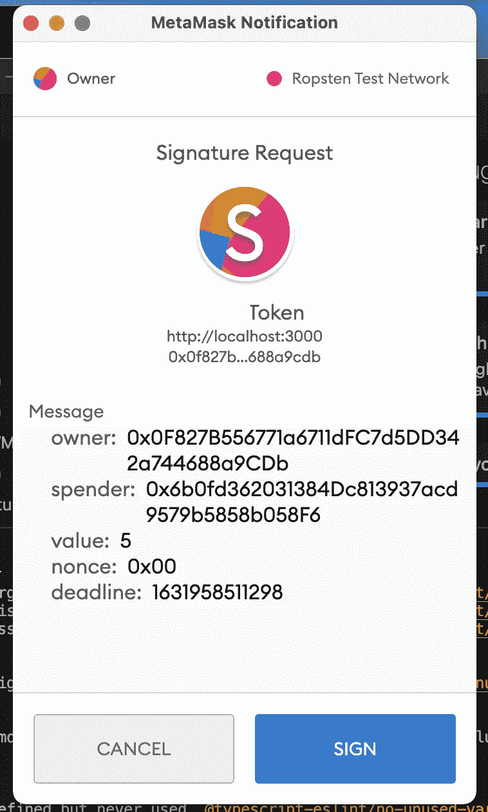

# 使用 React 签署交易，允许交易 EIPS712

> 原文：<https://medium.com/coinmonks/signing-transactions-with-react-permit-transactions-eips712-ec58b239bc7e?source=collection_archive---------0----------------------->

在本文中，我将讨论使用数字签名来代替[批准](https://ethereum.org/en/developers/tutorials/transfers-and-approval-of-erc-20-tokens-from-a-solidity-smart-contract/)事务。批准与任何智能合同的数字资产交互相关的一般交易。例如，如果你想用一些 ERC20 代币支付费用，将你的 NFT 列入智能市场合同。您需要授权智能合约来执行此操作。或者你可以从你的外部拥有的账户手动地做这件事( [EOA](https://ethdocs.org/en/latest/contracts-and-transactions/account-types-gas-and-transactions.html#:~:text=Externally%20owned%20account%20(EOAs)%3A,and%20is%20controlled%20by%20code.) )可以调用`transfer`事务，因为它们依赖于`msg.sender`(如果你在契约内部调用它，`msg.sender`将返回契约地址并且[失败](https://ethereum.stackexchange.com/questions/112644/approve-erc20-token-inside-a-contract-function))。这就是为什么我们有`approve`交易来授权智能合约使用您的令牌。总之，您有两个事务。第一个是用于智能合约授权的`approve`，第二个是你从智能合约中需要的任何东西，比如锁定资金、支付费用、在市场/拍卖中列出 NFT 等等。我们都知道交易费有多贵！这就是为什么 [EIPS712](https://github.com/ethereum/EIPs/blob/master/EIPS/eip-712.md) 提出，`permit`交易使用签名来批准令牌。



# 数字签名

以太坊和区块链大多都使用[椭圆曲线数字签名](https://en.m.wikipedia.org/wiki/Elliptic_Curve_Digital_Signature_Algorithm)。我将涵盖从前端制作签名(反应)。但是我假设您使用的是 OpenZeppelin 库；我推荐它，因为它提供了一个方便的[签名恢复库](https://github.com/OpenZeppelin/openzeppelin-contracts/blob/master/contracts/utils/cryptography/ECDSA.sol)，如果您对构建产品代码感兴趣的话，这个库已经被审计并且是安全的。

数字签名类似于任何原始交易。您需要创建消息和数据对象，然后使用提供者对它们进行签名。

1.  创建`DOMAIN_SEPERATOR`常量。
2.  为 ERC20/ERC721 常量创建`PERMIT_INTERFACE`。
3.  创建事务处理`Message`对象。
4.  创建事务`Date`对象。
5.  签署交易。

## 域`Separator`

域分隔符是协定名称、版本、链 ID 和智能协定地址。全部使用`keccak256`散列。当创建签名时，用户使用这个散列，并且在执行许可时必须匹配。这确保了签名仅对一份合同有效。

域分隔符类型:

```
const EIP712Domain = [  
    { name: "name", type: "string" },  
    { name: "version", type: "string" },  
    { name: "chainId", type: "uint256" },  
    { name: "verifyingContract", type: "address" },
];
```

域分隔符值:

```
const contractName = await contract.name();  
const { chainId } = library.network;const domain = {    
      name: contractName,    
      version: "1",    
      chainId,    
      verifyingContract: contract.address 
 };
```

## 许可界面

permit 接口是传递给事务的参数。(名称和类型)许可接口常量将像上面的域分隔符一样散列

```
const Permit = [  
   { name: "owner", type: "address" },  
   { name: "spender", type: "address" }, 
   // In case ERC20 `tokenId` will be `value` 
   { name: "tokenId", type: "uint256" }, 
   { name: "nonce", type: "uint256" },    
   { name: "deadline", type: "uint256" },
];
```

现在，我创建了制作事务消息所需的两个常量。

## 创建交易`Message`对象

交易消息需要帐户地址、account [nonce](/coinmonks/the-account-nonce-in-ethereum-explained-c087bd4a3c29) 、My account、spender 和我想授权使用我的资产的智能合同地址。令牌 ID 是我想要使用的 ERC721 的 ID。(市场/拍卖智能合同上的列表)。如果我允许一些 ERC20 代币支付费用。我将用我想支付的值(ERC20)更改令牌 ID。

```
const [account] = await provider.listAccounts();
const nonce = await contract.nonces(account);
const transactionDeadline = Date.now() + 20 * 60;const message = {    
    owner: account,    
    spender,// address of the smart contract that I want to allow    
    tokenId: tokenId.toString(),// value in case of ERC20 
    nonce: nonce.toHexString(),    
    deadline: transactionDeadline , //permit for 20 minutes only
};
```

## 创建交易`Data`对象

智能合约交易需要数据属性，因为它们包含您希望执行的智能功能以及任何参数。我将把事务消息、类型、接口和域添加到要由提供者签名的字符串中。

```
const data = JSON.stringify({    
        types: {      
        EIP712Domain,      
        Permit: ERC721PermitInterface,    
        },    
       domain,    
       primaryType: "Permit",    
       message, 
  });
```

## 签署交易

要验证交易的来源，您必须签署数据。为了对交易进行签名，我将使用`eth_signTypedData_v4`最新版本的签名方法。你可以在这里阅读更多关于他们的信息[。](https://docs.metamask.io/guide/signing-data.html#sign-typed-data-v1)

```
const signature = await library.send("eth_signTypedData_v4", [account, data]);
const signData = ethers.utils.splitSignature(signature);  
const { v,r,s} = signData;
```

就是这样！现在您需要做的就是返回签名参数`deadline,v,r,s`并将其传递给您的事务

```
return{
 deadline,
 v,
 r,
 s
}
// inside you transaction file
contract.interface.transactionNeedSignature(...params,deadline,     v,r,s)
```

你可以在这个[要点](https://gist.github.com/yehia67/352984028a7955a7bc3e6f991eb6c2a0)上看到所有的 erc721 许可功能。erc20 [许可功能](https://gist.github.com/yehia67/06b43c3280b9e35eda89a784c4b753b1)也是如此。我希望我说清楚了。如果你有任何问题，不要犹豫问我。

# 资源

[](https://hackernoon.com/how-to-code-gas-less-tokens-on-ethereum-43u3ew4) [## 如何在以太坊上编码无气代币|黑客正午

### 每个人都在谈论“无气”以太坊交易，因为没有人喜欢为气付钱。但是以太坊网络…

hackernoon.com](https://hackernoon.com/how-to-code-gas-less-tokens-on-ethereum-43u3ew4) [](https://github.com/makerdao/developerguides/blob/master/dai/how-to-use-permit-function/how-to-use-permit-function.md) [## 主 makerdao/developerguides 上的 developer guides/how-to-use-permit-function . MD

### 如何在 Dai 中使用许可证功能和继电器为 Dai 交易支付天然气费用了解 Dai 许可证功能…

github.com](https://github.com/makerdao/developerguides/blob/master/dai/how-to-use-permit-function/how-to-use-permit-function.md) [](https://soliditydeveloper.com/erc20-permit) [## 路漫漫其修远兮:论无气代币和 ERC20-Permit

### 现在是 2019 年 4 月的悉尼。在这里，我正在寻找悉尼大学建筑群内的 Edcon 黑客马拉松。它…

soliditydeveloper.com](https://soliditydeveloper.com/erc20-permit) [](/coinmonks/eip712-a-full-stack-example-e12185b03d54) [## EIP712，全栈示例

### 我当时正在做一个需要使用 EIP712 的项目。GitHub 中有很多文章和例子解释了…

medium.com](/coinmonks/eip712-a-full-stack-example-e12185b03d54) 

> 加入 Coinmonks [电报频道](https://t.me/coincodecap)和 [Youtube 频道](https://www.youtube.com/c/coinmonks/videos)了解加密交易和投资

## 也阅读

[](/coinmonks/leveraged-token-3f5257808b22) [## 杠杆代币[多头代币]终极指南

### 杠杆化令牌是具有杠杆化风险敞口的 ERC20 令牌，不考虑保证金、要求、管理…

medium.com](/coinmonks/leveraged-token-3f5257808b22) [](https://coincodecap.com/crypto-exchange) [## 最佳加密交易所| 2022 年十大加密货币交易所| CoinCodeCap

### 哪一个是最好的加密交换？在本文中，我们将根据多种加密货币列出 10 大加密货币交易所

coincodecap.com](https://coincodecap.com/crypto-exchange) [](https://coincodecap.com/top-3-gaming-tokens-to-look-out-for-in-february-2022) [## 2022 年 2 月值得关注的三大游戏代币| CoinCodeCap

### 排名前 3 位的游戏也占交易总量的 85%以上。Defi 王国、Axie Infinity 和 Pegaxy…

coincodecap.com](https://coincodecap.com/top-3-gaming-tokens-to-look-out-for-in-february-2022) [](https://coincodecap.com/best-swap-platforms) [## 2022 年最佳加密交换平台| CoinCodeCap

### 随着时间的推移，我们大多数人将转向 dex 以获得更好的安全性和隐私。因此。在这里，我们将讨论…

coincodecap.com](https://coincodecap.com/best-swap-platforms) [](https://coincodecap.com/best-online-casinos) [## 10 大最佳在线赌场|赢得并赢取免费 BTC 2022 | CoinCodeCap

### 接收、支付和赚取加密货币| |有各种各样的最佳在线赌场可供选择，有可能…

coincodecap.com](https://coincodecap.com/best-online-casinos) [](/coinmonks/top-5-crypto-lending-platforms-in-2020-that-you-need-to-know-a1b675cec3fa) [## 2021 年最佳加密借贷平台| 6 大比特币借贷平台

### 获得比特币和其他加密货币的最佳贷款利率

medium.com](/coinmonks/top-5-crypto-lending-platforms-in-2020-that-you-need-to-know-a1b675cec3fa) [](/coinmonks/the-best-cryptocurrency-hardware-wallets-of-2020-e28b1c124069) [## 2021 年 6 大最佳硬件钱包|顶级加密硬件钱包[更新]

### 最好的加密货币硬件钱包是绝对必要的。我们将在 NGRAVE、Ledger Nano X 和…

medium.com](/coinmonks/the-best-cryptocurrency-hardware-wallets-of-2020-e28b1c124069) [](/coinmonks/crypto-trading-bot-c2ffce8acb2a) [## 加密交易机器人——19 款最佳免费加密交易机器人

### 2022 年币安、比特币基地、库币和其他密码交易所的最佳密码交易机器人。四进制，位间隙…

medium.com](/coinmonks/crypto-trading-bot-c2ffce8acb2a)