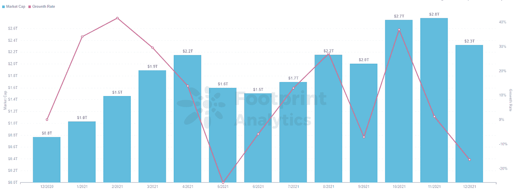
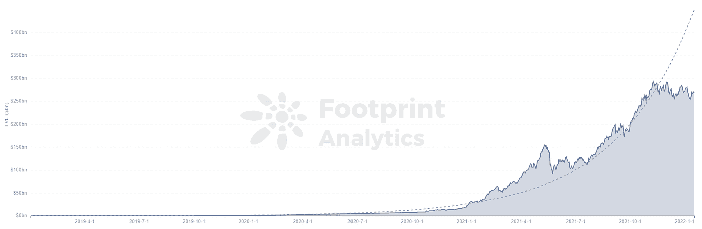
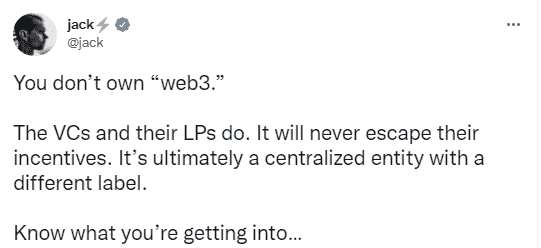

# 硅谷员工从大公司跳槽到 Web3。互联网的未来是什么？

> 原文：<https://medium.com/coinmonks/silicon-valley-employees-go-away-from-large-companies-to-web3-what-is-the-future-of-the-internet-b9d8d5693199?source=collection_archive---------72----------------------->

数据来源:足迹分析

Twitter Spaces 前首席数据科学家 Julien Gaillard[在 Twitter](https://twitter.com/juliengaillard/status/1479467505127145475?s=20) 上宣布，他将离开硅谷社交媒体巨头，成为 DeFi 借贷平台 Aave 的数据科学主管。

*Source: Twitter*

他在 twitter 的评论中说，Web3 的核心价值观是去中心化、创新、公平和实验，这概括了早期互联网的许多感觉。

与此同时，脸书(现名 Meta)的加密货币项目负责人 David Marcus 也在 1 月 1 日开始了他自己的 Web3 项目[。](https://twitter.com/davidmarcus/status/1465740041339092994?s=20)

另一名 Meta 员工 Evan Cheng 也于 9 月离职，创办了“MystyLab”。他目前专注于建设区块链的基础设施，并在[一次采访中透露](https://www.nytimes.com/2021/12/20/technology/silicon-valley-cryptocurrency-start-ups.html)他的团队中 80%的员工来自 Web2 互联网行业。

这些都证明了一个 web3 的时代正在向我们走来。在本文中，我们将介绍 web3 及其解决的问题。

# Web3 的世界

Web3 是基于区块链技术的互联网的新版本，其核心是去中心化和授权。

Web1 是一个内容交付网络，Web2 构建了社交媒体生态系统，而 Web3 的目标是成为一个分布式、去中心化的网络。

尽管 Web3 的概念仍然很模糊，但大多数人设想更广泛分布的管理和监督权限，社区成员和用户能够讨论、提议、投票和实施变更。

*Footprint Analytics — Crypto Market Cap*

区块链起源于比特币，这是第一种不依赖信用中介的主要货币，而是将信任放在分布式、去中心化的公共账本中。这是一个分散的共识机制，不受中央集权机构的约束。

作为区块链技术应用层的先驱，去中心化金融(DeFi)是互联网迈向 Web3 的重要一步。DeFi 继续主导区块链技术的应用层，而 [Footprint Analytics](https://www.footprint.network/guest/chart/de-fi-tvl-fp-62fe47be-89d6-41e6-8b57-7bdb6c36bc9c?channel=u-DBc983) 已经计算出去年分散式金融项目的锁定总量(TVL ),显示出自 2020 年以来的大幅增长

*Footprint Analytics — DeFi TVL*

Web3 下一步何去何从？

分散自治组织(DAO)已经在区块链、NFT 和元宇宙的项目中广泛使用。云存储等其他领域也在快速增长。

# Web3 解决了哪些问题？

互联网由少数大型互联网公司主导，如谷歌、Youtube 和脸书，它们使用大数据来推荐内容。人们对他们处理隐私和言论自由的方式越来越不满，许多人希望逃离由少数公司控制的生态系统。

**问题 1:隐私问题**

科技公司收集数万亿字节的用户数据，引发了人们对数据安全和个人隐私的担忧。2021 年 11 月，[华盛顿邮报](https://www.washingtonpost.com/technology/2021/12/22/tech-trust-survey/)的一项民意调查显示，72%的公众不信任脸书。

目前，类似的数据和隐私滥用主要通过政府立法来解决，但公众对政府的信任也有所下降。一种完全不同的模式可能是解决办法。

在 Web3 中，人们使用分布式数据存储来保存数据，避免个人数据被集中式组织使用。目前致力于此的项目包括分散存储协议 [Arweave](https://www.footprint.network/guest/dashboard/de-fi-data-analytics-footprint-network-fp-102523be-d937-4133-bf2d-71b1c6c8886f?days=past30days&name=sushiswap&channel=u-DBc983) ，以及专门为数据隐私而构建的秘密网络。

问题 2:言论自由

2021 年 1 月，推特屏蔽了唐纳德·特朗普煽动暴力的账户，这也引发了世界范围内对言论自由的讨论。

这些讨论的核心问题是，一家社交媒体公司是否有权审查言论。但是，如果 Web3 时代真的到来，世界会有一个更自由的网络环境吗？这是很有可能的，因为控制权分散给了每个连接的用户。

# 通往 Web3 的艰难之路

去年 12 月，Twitter 创始人兼 Block 首席执行官杰克·多西[在 Twitter 上表示](https://twitter.com/jack/status/1473139010197508098?s=20)他不认为人们可以拥有 Web3，但资本可以。

*Source: Twitter*

Web3 需要技术和资本，Web3 的最终形态很大程度上取决于技术和资本的态度。

此外，Web3 的进入壁垒比 Web2 高得多

DeFi 比传统金融更难上手，DeFi 比传统金融更难上手。它不是那么容易使用，因为它远离菲亚特和我们的生活。学习不是那么容易，因为教育体系和基础设施不是那么完备。

区块链应用层的其他领域也是如此。在人们适应了集中化的技术公司之后，接受全新的平台和系统总是需要时间的。Web2 时代的到来使得降低网络贡献的门槛成为可能。Web2 允许每个人在互联网上贡献内容。与 Web2 网络的门槛低到每个人都可以加入不同，Web3 目前似乎需要每个人在进入门槛方面做更多的工作。

**什么是足迹分析**

足迹分析是一个一体化的分析平台，用于可视化区块链数据和发现见解。它清理和整合链上数据，因此任何经验水平的用户都可以快速开始研究令牌，项目和协议。凭借一千多个仪表板模板和一个拖放界面，任何人都可以在几分钟内构建自己的定制图表。发掘区块链数据，利用足迹进行更明智的投资。

*足迹网址:*[*https://www . Footprint . network*](https://www.footprint.network/)

*不和:*[*https://discord.gg/3HYaR6USM7*](https://discord.gg/3HYaR6USM7)

*推特:*[*https://twitter.com/Footprint_DeFi*](https://twitter.com/Footprint_DeFi)

*电报:*[*https://t.me/joinchat/4-ocuURAr2thODFh*](https://t.me/joinchat/4-ocuURAr2thODFh)

*Youtube:*[*https://www.youtube.com/channel/UCKwZbKyuhWveetGhZcNtSTg*](https://www.youtube.com/channel/UCKwZbKyuhWveetGhZcNtSTg)

> *加入 Coinmonks* [*电报频道*](https://t.me/coincodecap) *和* [*Youtube 频道*](https://www.youtube.com/c/coinmonks/videos) *了解加密交易和投资*

# 另外，阅读

*   [3 商业评论](/coinmonks/3commas-review-an-excellent-crypto-trading-bot-2020-1313a58bec92) | [Pionex 评论](https://coincodecap.com/pionex-review-exchange-with-crypto-trading-bot) | [Coinrule 评论](/coinmonks/coinrule-review-2021-a-beginner-friendly-crypto-trading-bot-daf0504848ba)
*   [莱杰 vs Ngrave](/coinmonks/ledger-vs-ngrave-zero-7e40f0c1d694) | [莱杰 nano s vs x](/coinmonks/ledger-nano-s-vs-x-battery-hardware-price-storage-59a6663fe3b0) | [币安评论](/coinmonks/binance-review-ee10d3bf3b6e)
*   [Bybit Exchange 评论](/coinmonks/bybit-exchange-review-dbd570019b71) | [Bityard 评论](https://coincodecap.com/bityard-reivew) | [Jet-Bot 评论](https://coincodecap.com/jet-bot-review)
*   [3 commas vs crypto hopper](/coinmonks/3commas-vs-pionex-vs-cryptohopper-best-crypto-bot-6a98d2baa203)|[赚取加密利息](/coinmonks/earn-crypto-interest-b10b810fdda3)
*   最好的比特币[硬件钱包](/coinmonks/hardware-wallets-dfa1211730c6) | [BitBox02 回顾](/coinmonks/bitbox02-review-your-swiss-bitcoin-hardware-wallet-c36c88fff29)
*   [BlockFi vs 摄氏](/coinmonks/blockfi-vs-celsius-vs-hodlnaut-8a1cc8c26630) | [Hodlnaut 点评](/coinmonks/hodlnaut-review-best-way-to-hodl-is-to-earn-interest-on-your-bitcoin-6658a8c19edf) | [KuCoin 点评](https://coincodecap.com/kucoin-review)
*   [Bitsgap 审查](/coinmonks/bitsgap-review-a-crypto-trading-bot-that-makes-easy-money-a5d88a336df2) | [Quadency 审查](/coinmonks/quadency-review-a-crypto-trading-automation-platform-3068eaa374e1) | [Bitbns 审查](/coinmonks/bitbns-review-38256a07e161)