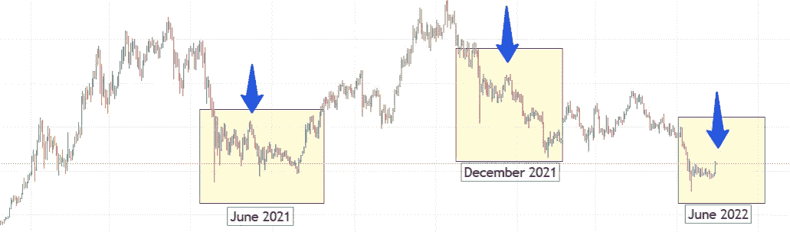
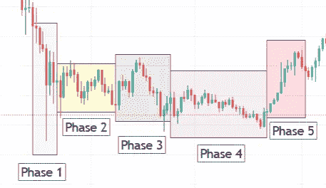

# 五阶段模式:相似的模式，相似的结果？

> 原文：<https://medium.com/coinmonks/similar-patterns-similar-outcomes-f3adafa2f89f?source=collection_archive---------60----------------------->

> 在金融领域，技术分析是一种通过研究过去的市场数据(主要是价格和交易量)来预测价格方向的分析方法。

分析师试图从特定的价格变动中理解价格的走向，这种预期也是基于过去已经发生的事情。因此，他们计算并绘制阻力、支撑、趋势线、均线、布林线、斐波那契指标等。等等。它们也使价格模式个性化，价格模式是价格图表中的特殊结构，可以告诉我们一些关于价格起诉的信息:二次/三次底部/顶部，三角旗，三角形，旗帜，楔形，头肩底，等等。等等。

另一方面，人类的大脑和眼睛也能识别我们周围世界的相似结构。然而，幻觉，我们感官的局限，或者我们没有考虑的因素会让我们得出错误的结论，混淆因果，让我们得出无法成立的结论。就本文的主题而言，我们必须考虑到，对相似价格模式的解释不能是微不足道的，它们的未来演变不能遵循或不遵循我们认为的方向:这些解释是概率性的。有了这些前提，

> 我知道平淡的 prite 模式，也就是说，我认为我看到了相同的价格模式(来自一个 Tweety 句子)

我已经注意到 BTC/美元价格图表上的一些非常相似的模式，这在去年出现了两次，现在可能再次出现。我在下图中突出显示了它们。

The BTC perpetual price chart, daily candles are shown. The period shown is from November 2020 up today.

我强调了 3 个相似的模式:

*   在 2021 年 5 月的崩盘期间，BTC 价格从约 60k 美元下跌至最低约 27k 美元，在此期间开始时达到一根蜡烛的下影线，这一趋势直到 2021 年 7 月底才反转；
*   在 2021 年 11 月，价格达到了它的 ATH (~70k$),然后开始下降，首先达到~40k$,并带有一个长长的下影线，然后继续逐渐下降到~33k$。
*   在 2022 年 5 月(最近)，价格再次暴跌，被 Luna 灾难推低，从约 38k 美元下跌到最低约 25k 美元，我们仍然不知道价格将如何移动。

这些模式遵循所谓的降价阶段，在分销期之后，发生在价格图表的最大值。6 月和 9 月的两个模式具有相似的特征，但如果我们去除最大值和最小值，一个不同的平均趋势，因为在 2021 年 6 月，平均随时间的变化比 2021 年 12 月更平缓，因为在 2021 年 6 月模式结束时达到的价格在模式开始时的蜡烛下影线内，而在 2021 年 12 月，最终价格远低于下影线达到的值。也许经济、社会和政治形势在这些不同的趋势中起了作用。但也有类似的动态。

无论如何，我可以在这些图案中找到 5 相( ***5 相图案*** )，如下图所示:

The 5 phases of the accumulation. The June 2021 pattern is taken as example

*   这个阶段开始于一次撞击和一个长长的下影线(**阶段 1** )。
*   然后价格回升然后震荡一段时间(**阶段 2** )。
*   价格似乎可以再次开始上涨，确实如此，但达到最大值后又被退回(**阶段 3** )。
*   有一个更持久和温和的趋势，有一个最大值，并以最小值结束，它可以达到比最初的下影线触及的最低价格更高的值，但也可以达到更小的值，正如我们在 2021 年 11 月看到的(**阶段 4** )。
*   在最后一个阶段，价格再次上涨。

然而，在 2021 年 6 月和 12 月观察到的两个过去模式之间的差异不仅在于随时间的平均斜率，还在于阶段 5 之后的情况，因为在 2021 年 6 月，阶段 5 是新牛市趋势的前奏，该趋势到达了新 ATH，而在 2021 年 12 月，紧随其后的是一个几乎静止的时期，该时期以 2022 年 5 月的新崩盘结束。

2022 年 6 月的这种新模式会延续 2021 年 6 月和 12 月已经出现的模式吗？这种新模式会跟随 2021 年 6 月的温和下跌还是 2021 年 12 月的急剧下跌？就目前而言，新趋势似乎与 2022 年 6 月的趋势一样温和。当然，我希望我们正生活在一个积累期，这给了我们在夏季后开始新一轮牛市的基础。不幸的是，这也将取决于经济和世界形势。

附注:我不是专家，也不知道所有的文献，所以这种特定的模式可能已经为人所知并被记录在案。