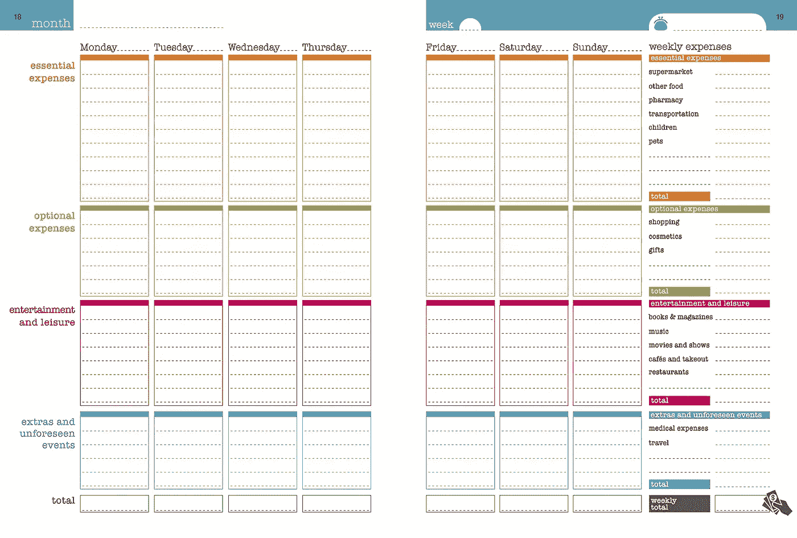

# 月底变得更富有的简单方法

> 原文：<https://medium.com/coinmonks/simple-method-to-become-richer-by-the-end-of-the-month-a19a71a5fad6?source=collection_archive---------21----------------------->

你有没有尝试过省钱，结果却不尽如人意？

嗯，今天我们想向你介绍日本的省钱艺术。

在一天结束的时候，如果这么简单，每个人都会存钱，但似乎对我们大多数人来说这是一件艰难的事情，因为，嗯，花钱比存钱容易得多。

但是为什么呢？

只是因为根据科学，我们的大脑优先考虑即时满足而不是长期目标，而不是我们。我们相信科学！

根据一些研究，大脑有两个区域:一个与我们的情绪有关，另一个与抽象推理有关。

正如你可能已经想到的，我们大脑的情感部分对即时的满足有积极的反应。

当让我们选择现在吃甜食还是以后吃蔬菜时，我们大脑的这一部分会促使我们选择甜食。

我们大脑中基于情感和逻辑的部分一直在斗争，试图向我们展示为什么我们应该选择一个选项而不是另一个。

**那么我们大脑的哪一部分最终会胜出呢？**

这取决于具体情况。研究人员得出结论，当我们大脑的情感部分战胜逻辑部分时，冲动的选择就会发生。

当人们非常接近获得奖励时，他们的情绪大脑就会接管。所以，如果一块巧克力蛋糕正盯着你，事情就会变得危险。但是这些糖果足够了，否则我们在写这篇文章的时候可能会吃一个。

现在我们知道了为什么我们的第一选择是选择即时满足，这相当于吃甜食而不是健康的东西，甚至现在就花钱买我们确实不需要的东西，而不是留着以后用；我们应该看看如何通过每月存钱来欺骗我们的大脑并创造长期目标。

**日本的省钱方法 Kakeibo 来了。**

自 1904 年以来，当记者 Hani Motoko 在《女性杂志》上写道，Kakeibo，它被翻译为“家庭账本”，是一种帮助你谨慎花钱和储蓄更多的技术。它不需要任何技术。从字面上看，你需要的只是一个笔记本和一支笔。

那么，什么是 Kakeibo，它是如何工作的？

嗯，这是一种手动追踪你的开支的方法，帮助你达到你的储蓄目标。

尽管我们是技术的粉丝，因为有时技术让我们的生活变得更加轻松和方便，但当涉及到金融时，似乎旧的学校方法更有效。

这项技术可以让我们完全脱离现实世界，当涉及到我们的预算时，我们不想失去它的踪迹。

那么，为什么老学校的方法更有效呢？

嗯，研究表明，手写是一个冥想的过程，让我们更清楚我们在写什么，为什么要写。它改善了我们的记忆，比仅仅在应用程序或软件中添加一些数字效果更好。

这当然没有错！你可以根据自己的情况调整这种方法，如果在电脑上书写效果更好，那完全没问题，但根据我们的经验，没有任何应用程序或 Excel 文档比在笔记本上手写更好。它让我们更清醒，更现实，并帮助我们对我们的支出做出更好的决定。

现在，正如我们之前提到的，为了开始使用这个方法，你需要一个笔记本和一支笔。为了方便起见，你可以从[这里](http://aucalc.com/kakebo)下载并打印这个模板，用它来创建你自己的预算。

正如你所看到的，我们将开始写下每个月的固定收入，然后是我们已经知道的固定支出，如租金、抵押贷款、保险、交通、学校、健身房或其他订阅。

一旦我们有了所有已知费用的总数，我们就可以设定一个目标，即我们希望在当月节省多少钱，写下我们可以削减哪些费用，以便在月底实现我们的目标。

在我们做了所有的计算后，我们应该得到一笔钱，这是我们可用的现金。

因此，这一点非常重要，正如沃伦·巴菲特所说:“不要把消费后剩下的钱存起来，而是把储蓄后剩下的钱花掉”。

为了能够在月底节省一些钱，我们将尝试在支付所有固定成本和支付自己的储蓄后，将预算作为可用现金来管理支出。

**这需要每个月做一次。**

在这之后，我们将使用这个模板，它将帮助我们在一天结束之前写下每天的所有支出，并相应地进行分类。(你也可以从[这里](http://aucalc.com/kakebo)下载。)

我们将我们的支出分为以下 4 类:

*   需求:住房、食品杂货、汽车贷款或学生贷款等必需品。
*   需要:愉快但不完全必要的购买，如外卖食品、爱好或娱乐。
*   文化:文化活动上的任何支出——书籍、博物馆费用、音乐会门票、电视流媒体服务等。
*   意想不到的:突然出现的其他费用，如医疗账单、汽车或房屋维修。

正如您在模板中看到的，它帮助我们记录每天在每个单独类别中花费的总金额，并计算到周末我们花费的总金额，包括每个类别的总金额。

很酷，不是吗？

现在，即使你只买了一颗糖，你也可以跟踪每一分钱的花费。

为了能够在任何地方写下任何事情，一个适合你口袋的小笔记本和一支笔应该是最好的方法。

但是，再说一次，无论什么对你更有效，那都是你应该使用的。或者，在电话上记下一天的花费，这样你就不需要到处带着笔记本，如果你回家后把之前提供的模板中的所有内容都记录下来，效果会很好。

Kakeibo 以某种方式迫使你好好思考你所购买的东西，以及你购买它们的动机。

换句话说，你会对自己的需求和愿望变得完全诚实，并且能够相应地对它们进行分类。随着时间的推移，这种方法可以帮助你更好地做出更快、更聪明、更合理的决定，决定是否在某个特定的项目上花钱。

总结这种方法，我们想向您强调 5 点您可能会考虑使用它的原因:

*   Kakeibo 可以让你变得更有条理。这是一个有用的工具，它使用一个简化的系统来组织你的开支，使它们易于阅读
*   它给你控制权，帮助你记录你的日常开销，并根据它们的必要性进行排序。
*   通过帮助您识别关键项目，它将帮助您节省 20–30%的成本。
*   它会让你更有纪律性，用手写下你花了多少钱，它会让你停止购买你不需要的东西，还能帮助你培养意志力。
*   最后但同样重要的是，Kakeibo 会让你更加自信，因为记录开销会让你更有安全感，并鼓励你相信自己的技能。这可以减轻压力，帮助你感到平静和放松。

感谢您的阅读！请通过我们的 [**社交媒体渠道**](https://linktr.ee/b.successful) 找到我们，帮助我们建设这个美丽的社区。
**下次见，小心你的钱！**

> 加入 Coinmonks [电报频道](https://t.me/coincodecap)和 [Youtube 频道](https://www.youtube.com/c/coinmonks/videos)了解加密交易和投资

# 另外，阅读

*   [如何在 Uniswap 上交换加密？](https://coincodecap.com/swap-crypto-on-uniswap) | [A-Ads 审查](https://coincodecap.com/a-ads-review)
*   [WazirX vs CoinDCX vs bit bns](/coinmonks/wazirx-vs-coindcx-vs-bitbns-149f4f19a2f1)|[block fi vs coin loan vs Nexo](/coinmonks/blockfi-vs-coinloan-vs-nexo-cb624635230d)
*   [本地比特币审核](/coinmonks/localbitcoins-review-6cc001c6ed56) | [加密货币储蓄账户](https://coincodecap.com/cryptocurrency-savings-accounts)
*   [什么是保证金交易](https://coincodecap.com/margin-trading) | [美元成本平均法](https://coincodecap.com/dca)
*   [支持卡审核](https://coincodecap.com/uphold-card-review) | [信任钱包 vs 元掩码](https://coincodecap.com/trust-wallet-vs-metamask)
*   [Exness 回顾](https://coincodecap.com/exness-review)|[moon xbt Vs bit get Vs Bingbon](https://coincodecap.com/bingbon-vs-bitget-vs-moonxbt)