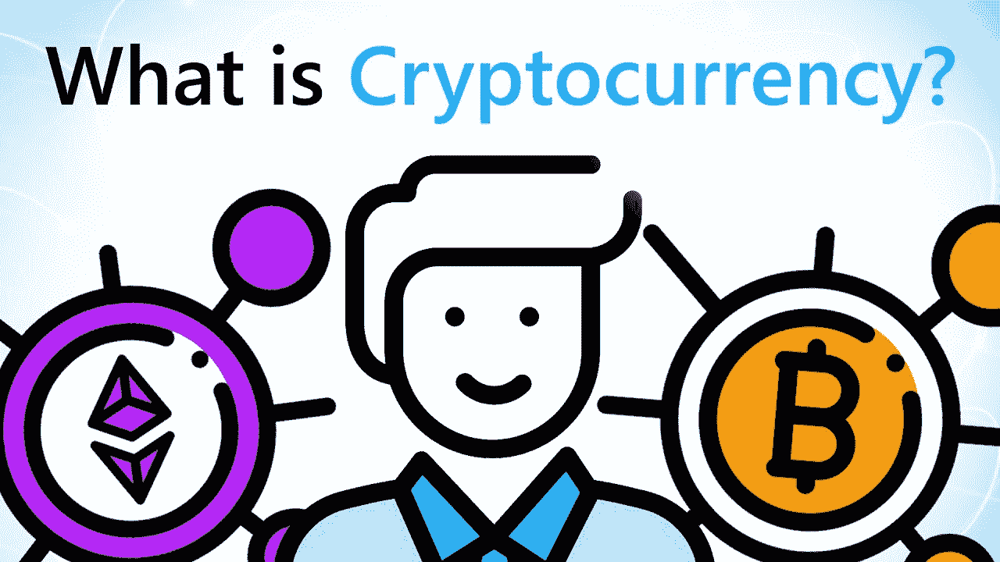
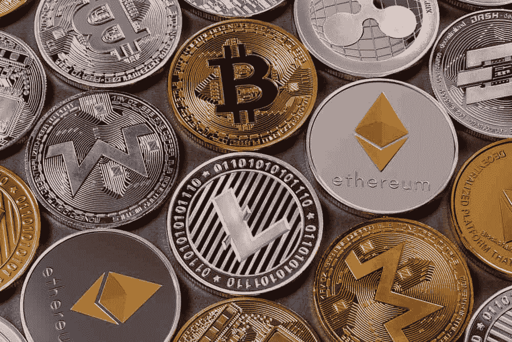

# 通过日常例子理解加密货币的简单方法。了解什么是比特币，如何运作。

> 原文：<https://medium.com/coinmonks/simple-way-to-understand-cryptocurrency-by-day-to-day-examples-9f3bb62f7c9c?source=collection_archive---------27----------------------->

今天的全球金融和经济体系正在经历彻底的变革。过去十年，随着技术进步创造了日常生活中更容易的支付方式，金融领域出现了重大创新。

技术使得每个人赚钱和经济独立变得更加容易。金融知识在我们的指尖变得更容易和更容易使用。

每一种金融工具和货币市场资产，如股票、债券、共同基金和保险，都因技术升级而发生了革命性的变化。

在这样的动态技术下，加密货币是一种越来越受欢迎的进入主流经济的金融工具。

说到对加密货币的了解，我们大多数人只听说过比特币和一些处理虚拟资产的数字货币。嗯，加密货币是一个巨大的领域，是即将到来的金融系统的整个生态系统。

许多人认为理解加密货币很复杂。对于外行人来说，加密货币是一种过于超前的技术，要学习它，你必须在这种背景下忘掉中央集权的概念。

考虑到没有定义和认可的知识术语以及对加密货币的幼稚理解的局限性，我决定让加密货币和区块链变得简单易懂，即使对于一个小孩子来说也是如此。

## **什么是加密货币？**

Image source: Fortune builders

> “加密货币是一种数字资产或货币，它承载着货币交换价值，可以像我们正常的货币一样处理买卖。”

考虑 A 从 b 处购买苹果的情况，假设苹果是以比特币(类似 Google Pay 的数字支付)购买的，所有数字货币交易都存储在连接到该网络的每部手机中。人 A 用一个比特币从人 B 那里购买了一个苹果。该交易被记录在由网络中所有设备数字控制的账簿中。

该交易以及类似的其他交易被记录在一系列代码中，这些代码与之前的交易代码相对应。现在已经创建了一组类似的交易代码。每笔比特币交易都遵循相同的模式。区块链是按顺序堆叠和链接块。

区块链与传统金融系统的区别在于，在传统金融环境中，所有交易只有买方、卖方和中间人(银行、交易所等)知道。然而，在加密市场中，每笔交易都被数字化记录，并由连接到该网络的所有设备单独保存。

该事务对网络中的每个人都是可见的，并且不能被修改。这是由于其独一无二的编码，与以前和即将发生的交易相关联。任何改变或破解交易的企图都会导致编码序列被破解，其他设备会立即发现欺诈行为。

加密货币没有中央服务器，因为每笔交易都在每个设备上单独记录，没有中央实体使其分散化。

## **如何进行加密货币交易？**

Image Source: Invest in blockchain

当你在股票市场上通过购买一家公司的一些股票进行交易时，以类似的方式，你可以购买整个或部分加密硬币(就像有一小块馅饼！).市场上加密硬币的供给和需求以及进行交易的买方和卖方的数量决定了硬币的交易价格。

各种加密交易所应用程序，如币安、比特币基地、BitMex、CoinDCX 等，都提供加密货币买卖服务。这些加密交易所提供类似的服务，如现货交易和在你的加密银行账户中持有硬币，以及通过存入保证金金额进行合约交易。

加密货币交易价格受到美国美联储和其他经济强国制定的宏观经济新闻和货币政策决定的影响，以及商人的影响(如埃隆马斯克)。

交易时市场上自由流通硬币的数量也会影响加密货币的价格。

加密货币交易背后的想法是，通过投资你能承受的金额，在下跌时简单地获得重要的加密硬币，高价出售，并预订利润。

**底线:**

理解加密货币需要一点自己的研究和努力。互联网上有丰富的加密货币知识，数以千计的文章形式的学习资料为您提供了加密货币发展的基础。

然而，对于外行人来说，需要由公认的实体(如大学、政府)提供可靠的信息来源，这限制了理解加密货币和区块链的方法。

*感谢您阅读我的文章。这是我简化加密货币的一个尝试，并希望它有助于对加密货币及其交易和投资的基本概念有一个潜在的被动收入来源。*

> 加入 Coinmonks [电报频道](https://t.me/coincodecap)和 [Youtube 频道](https://www.youtube.com/c/coinmonks/videos)了解加密交易和投资

# 另外，阅读

*   [如何在 FTX 交易所交易期货](https://coincodecap.com/ftx-futures-trading) | [OKEx vs 币安](https://coincodecap.com/okex-vs-binance)
*   [CoinLoan 评论](https://coincodecap.com/coinloan-review) | [YouHodler 评论](/coinmonks/youhodler-4-easy-ways-to-make-money-98969b9689f2) | [BlockFi 评论](https://coincodecap.com/blockfi-review)
*   [XT.COM 评论](https://coincodecap.com/profittradingapp-for-binance)币安评论 |
*   [SmithBot 评论](https://coincodecap.com/smithbot-review) | [4 款最佳免费开源交易机器人](https://coincodecap.com/free-open-source-trading-bots)
*   [比特币基地僵尸程序](/coinmonks/coinbase-bots-ac6359e897f3) | [AscendEX 审查](/coinmonks/ascendex-review-53e829cf75fa) | [OKEx 交易僵尸程序](/coinmonks/okex-trading-bots-234920f61e60)
*   [如何在印度购买比特币？](/coinmonks/buy-bitcoin-in-india-feb50ddfef94) | [瓦济克斯审查](/coinmonks/wazirx-review-5c811b074f5b)