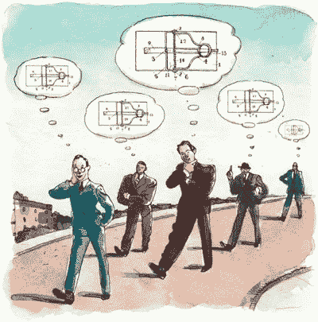
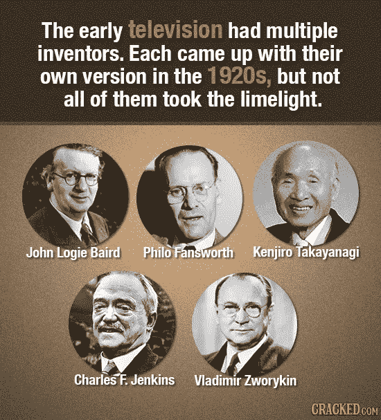
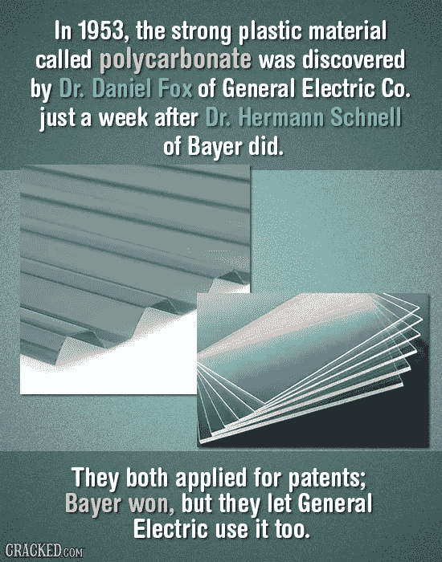

# 同步发明🔧

> 原文：<https://medium.com/coinmonks/simultaneous-inventions-781884244b4f?source=collection_archive---------31----------------------->

*   事实上，不止一个人偶然发现了类似的发现或发明，这表明现在正是这个想法展翅飞翔的时候。
*   大自然不会就这样抛弃优秀的想法，它通常会在准备好促进其进化时这样做。

这里有一些不可思议的同时发明的例子

点击[链接查看更多例子。](https://www.cracked.com/pictofacts-687-12-inventions-created-by-different-people-at-same-time)

> 在过去的十年里，分类账系统和分布式共识也发生了类似的事情。

# 2008 年:

Photo by [André François McKenzie](https://unsplash.com/@silverhousehd?utm_source=medium&utm_medium=referral) on [Unsplash](https://unsplash.com?utm_source=medium&utm_medium=referral)

中本聪发明了[比特币纸](https://bitcoin.org/bitcoin.pdf)、*一种点对点电子现金系统。*

# 2013 年至 2014 年:

Photo by [Shubham Dhage](https://unsplash.com/@theshubhamdhage?utm_source=medium&utm_medium=referral) on [Unsplash](https://unsplash.com?utm_source=medium&utm_medium=referral)

Vitalik Buterin 在一份白皮书中描述了[以太坊](https://ethereum.org/en/developers/docs/intro-to-ethereum/#what-is-ethereum)，并为区块链带来了可编程性。

# 2012 年至 2018 年:

Leemon Baird 博士开发了 [Hashgraph](https://docs.hedera.com/guides/core-concepts/hashgraph-consensus-algorithms) ，并形成了 [Hedera](https://docs.hedera.com/guides/) 公共分布式分类账。

这里显然有一个模式。

虽然我们不能做出任何预测，但我们可以肯定地看到，在这些发明之后，世界并没有保持不变。

> *加入 Coinmonks* [*电报频道*](https://t.me/coincodecap) *和* [*Youtube 频道*](https://www.youtube.com/c/coinmonks/videos) *了解加密交易和投资*

# 另外，阅读

*   [Bookmap 评论](https://coincodecap.com/bookmap-review-2021-best-trading-software) | [美国 5 大最佳加密交易所](https://coincodecap.com/crypto-exchange-usa)
*   最佳加密[硬件钱包](/coinmonks/hardware-wallets-dfa1211730c6) | [Bitbns 评论](/coinmonks/bitbns-review-38256a07e161)
*   [新加坡十大最佳加密交易所](https://coincodecap.com/crypto-exchange-in-singapore) | [购买 AXS](https://coincodecap.com/buy-axs-token)
*   [红狗赌场评论](https://coincodecap.com/red-dog-casino-review) | [Swyftx 评论](https://coincodecap.com/swyftx-review) | [造币厂评论](https://coincodecap.com/coingate-review)
*   [投资印度的最佳密码](https://coincodecap.com/best-crypto-to-invest-in-india-in-2021)|[WazirX P2P](https://coincodecap.com/wazirx-p2p)|[Hi Dollar Review](https://coincodecap.com/hi-dollar-review)