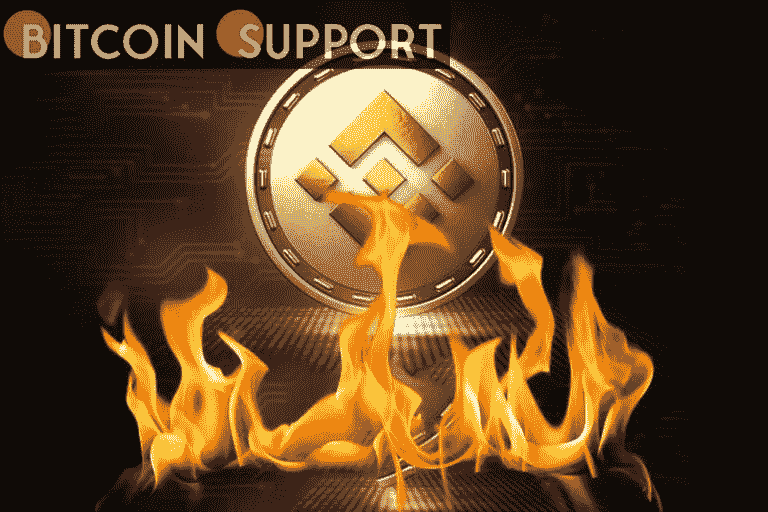

# 自 BEP-95 升级以来，价值 2，400 万美元的 50，000 币安硬币(BNB)已被烧毁

> 原文：<https://medium.com/coinmonks/since-the-bep-95-upgrade-50-000-binance-coin-bnb-worth-24-million-has-been-burned-45ad5cf797bd?source=collection_archive---------43----------------------->

[**https://bitcoinsupports.com/**](https://bitcoinsupports.com/)

在 BEP-95 升级后，BNB，币安的本地硬币，现在每一次交易都会被烧掉，很像 ETH。

11 月 30 日，BEP-95 升级发布。此次升级采用了一种新的实时 BNB 燃烧机制，其结果是由验证者收取的固定比例的 BNB 燃气费在每个街区燃烧。自从 BEP-95 实时燃烧更新以来，价值超过 2400 万美元的 50，000 辆 BNB 已经被焚烧。

代币随着不断被烧，变得通货紧缩。ETH 是目前最具通缩性的资产；在 ETH 费燃烧更新(EIP-1559)之后，几天内燃烧的 ETH 比开采的多。

币安从季度烧转到 EIP-1559 让 BNB 通缩(BNB 自动烧升级)。迄今为止，币安已经完成了 17 次 BNB 季度烧伤。第 17 场大火烧毁了 1，335，888 BNB，价值约 639，462，868 美元，这是 BNB 有史以来最大的火灾。

本季度，BNB 首次进行了季度 BNB 自动燃烧。从流通中取出的 BNB 总数为 1684387.11 枚。这包括来自先锋燃烧计划的 6296.305493 BNB，它已被销毁。

**以下是 BNB 第一次自动燃烧的详情:**

—BNB 燃烧总量:1，684，387.11 BNB

—先锋燃烧计划 BNB 燃烧量:6296.305493 BNB

自 2017 年引入币安和 BNB 以来，Binance 已承诺燃烧 1 亿 BNB，即总供应量的一半，以清除它与之前的季度烧录不同，本季度移除的令牌数量是使用自动烧录方法自动确定的。

**访问我们的网站:-**[**https://bitcoinsupports.com/**](https://bitcoinsupports.com/)

**免责声明:以上为作者观点，不应视为投资建议。读者应该自己做研究。**

> 加入 Coinmonks [电报频道](https://t.me/coincodecap)和 [Youtube 频道](https://www.youtube.com/c/coinmonks/videos)了解加密交易和投资

# 另外，阅读

*   《XT.COM 评论》的|[T42](https://coincodecap.com/xt-com-review)
*   [SmithBot 评论](https://coincodecap.com/smithbot-review) | [4 款最佳免费开源交易机器人](https://coincodecap.com/free-open-source-trading-bots)
*   [比特币基地僵尸程序](/coinmonks/coinbase-bots-ac6359e897f3) | [AscendEX 审查](/coinmonks/ascendex-review-53e829cf75fa) | [OKEx 交易僵尸程序](/coinmonks/okex-trading-bots-234920f61e60)
*   [如何在印度购买比特币？](/coinmonks/buy-bitcoin-in-india-feb50ddfef94) | [WazirX 审查](/coinmonks/wazirx-review-5c811b074f5b)
*   [CryptoHopper 替代品](/coinmonks/cryptohopper-alternatives-d67287b16d27) | [HitBTC 审查](/coinmonks/hitbtc-review-c5143c5d53c2)
*   [CBET 评论](https://coincodecap.com/cbet-casino-review) | [库科恩 vs 比特币基地](https://coincodecap.com/kucoin-vs-coinbase)
*   [折叠 App 审核](https://coincodecap.com/fold-app-review) | [Kucoin 交易机器人](/coinmonks/kucoin-trading-bot-automate-your-trades-8cf0ca2138e0) | [Probit 审核](https://coincodecap.com/probit-review)
*   [如何匿名购买比特币](https://coincodecap.com/buy-bitcoin-anonymously) | [比特币现金钱包](https://coincodecap.com/bitcoin-cash-wallets)