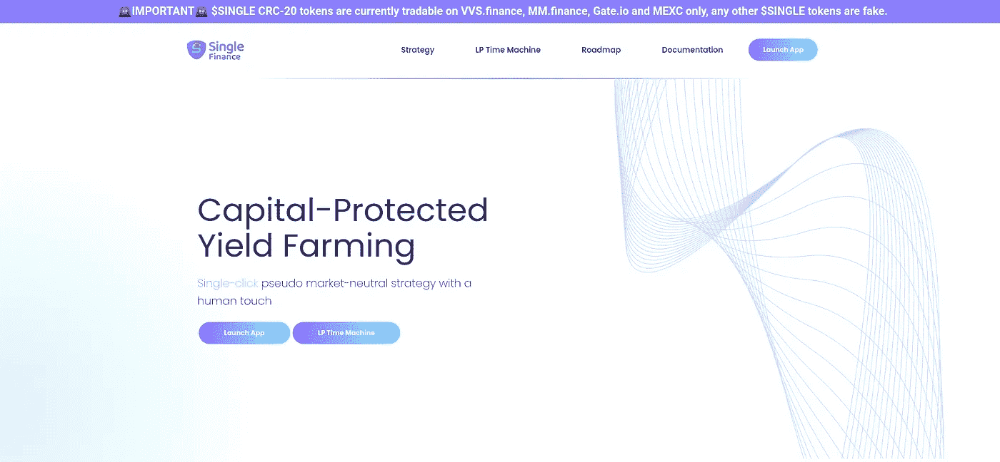

# 单一融资和杠杆收益农业

> 原文：<https://medium.com/coinmonks/single-finance-and-leverage-yield-farming-7e134478c696?source=collection_archive---------8----------------------->

# 什么是单一金融？

单一金融是一个分散金融(DEFI)平台，为用户提供参与**杠杆收益农业(LYF)** 的能力。

Front page of Single Finance Website

# 什么是杠杆收益农业(LYF)？

杠杆收益农业是一种让你**增加你的收益农业头寸** …