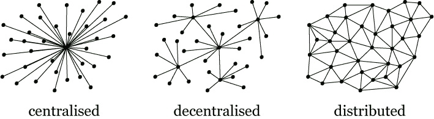
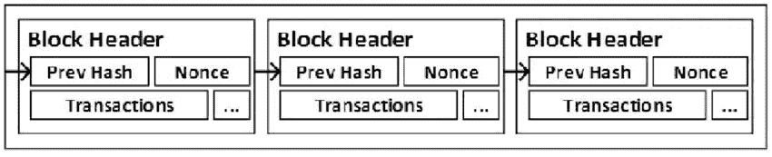

# 真理的单一来源

> 原文：<https://medium.com/coinmonks/single-source-of-truth-90ed0378c3c1?source=collection_archive---------37----------------------->

‘区块链’顾名思义就是区块链。但不是这样。它要多得多。

**简介:**

它是一个分布式数据库或数字分类账。它可以是无许可的公共记录，也可以是有许可的私有记录，或者介于两者之间，这取决于它是如何实现的。每个条目都用密码签名并打上时间戳。公开的有一个共识(协议)机制。所有节点都有一个分类帐副本。

它有两个主要用途:

1.  加密货币的交易。
2.  管理贸易和商业记录(智能合同)。

**历史:**

区块链的黎明始于密码学。1978 年，随着 [RSA](https://en.wikipedia.org/wiki/RSA_(cryptosystem)) 拥有公钥和私钥，密码学中发生了一件大事。1991 年，Stuart Haber 和 Stornetta 首先研究了密码安全链。他们使用 Merkle 树在每个块中放置几个事务。1998 年，尼克·萨伯设计了第一种数字货币。

2008 年，中本聪在其著名的比特币白皮书中引入了“工作证明”(一种共识机制)。由于 2008 年的金融危机，人们开始对中央集权的*信任的*系统失去信任。维基解密的捐赠是一个让人们谈论比特币和区块链的重要事件。

**类型:**

区块链网络有四种类型:公共、私有、联盟和混合。

**公共:**

由相互连接节点组成的庞大网络。它对所有人开放，并且是分布式的。它适用于更广泛的人群。透明度得以保持。

例如比特币、以太坊等。

**私人:**

部署在组织内预定义的参与者组之间。其他任何人都不能访问它。

**联合体:**

类似二等兵区块链。唯一的区别是它有多个组织。

**杂交:**

在这里，有些功能任何人都可以使用，而有些功能只能由指定的人使用。它是部分分散的。

**用于加密货币的区块链:**

加密货币日益流行。所以有必要对它们有所了解。

加密货币使用巨大的分布式网络，节点验证交易并将其放入块中。

节点是运行验证事务的特定软件的计算机。寻找下一个街区和赚取硬币的过程被称为挖掘。事务按节点组织成块。每个块都有事务集合和前一个块的加密指纹。在共识机制的帮助下，决定哪个节点将制造块并为此获得奖励。

**共识机制:**

共识机制是任何加密货币的核心。它的目标是在参与节点之间达成最大程度的一致。有许多可以插入任何加密网络共识机制。

工作证明、利益证明、利益委托证明等。

比特币使用工作证明。所有的矿工竞相猜测正确的数字“*随机数*”。谁赢了就有奖励。

以太坊正转向股权证明。在这种情况下，矿商必须先购买股份，然后才能成为网络中的一个节点。

**商贸区块链:**

随着工业的发展，他们开始在区块链的领导下制造更多的技术。尼克·萨伯首先创造了“智能合同”这个术语。他把它定义为一系列承诺，在某种程度上使关系正式化。当满足某些条件时，智能合约会自动部署。

中本聪在他的论文中也谈到了智能合约，但比特币的主要团队将其从代码中删除，以加快代码速度。2014 年晚些时候，Vitalik Buterin 将它添加到他的以太坊论文中，并开发了一种语言——可靠性。

传统交易需要几天时间和人工汇款，而智能合约需要几分钟和自动汇款。它要求实际存在，而智能合同包含数字签名(虚拟存在)。

区块链的主要特征是不可逆的，即它是不可变的，因为改变块中的一个字符将完全改变散列，并使另一个块指向另一个。因此，你将不得不改变所有的障碍，这实际上是不可行的，使区块链账本成为“唯一的真相来源”。