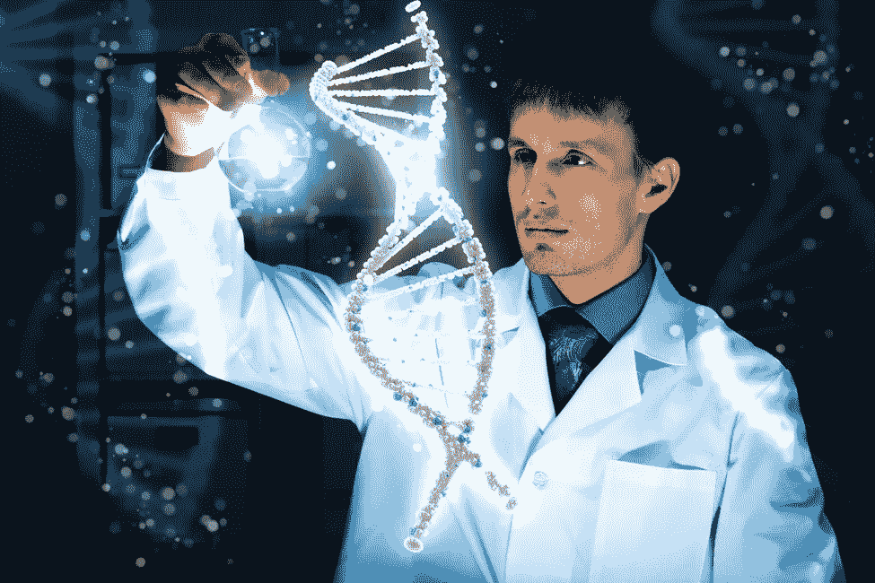
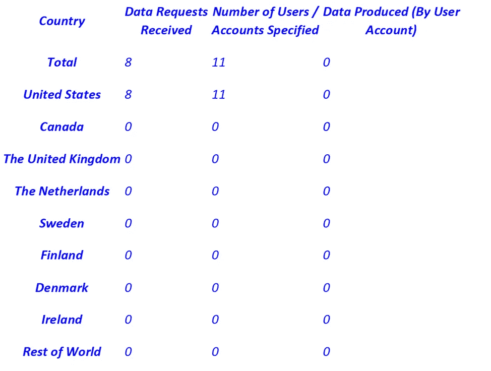
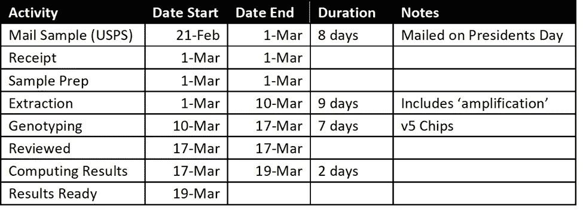

# 关于 23andMe 你可能不知道的六件事

> 原文：<https://medium.com/coinmonks/six-things-you-may-not-know-about-23andme-bb410a2e38bf?source=collection_archive---------20----------------------->

当医护人员想知道你的家族病史时，你是否被难住了？

环境、生活方式有多少是遗传(遗传倾向？

你有没有想过像 23andMe 这样的服务？

在这篇文章中，我将介绍 23andMe，他们的隐私声明，这项服务是如何工作的，可以获得的见解，他们的产品，以及我可能得到的意想不到的好处。

请继续阅读，并确保在社交媒体上关注、喜欢和分享。

根据维基百科，23andMe 是一家上市的个人基因组和生物技术公司，成立于 2006 年 4 月。它位于加利福尼亚州的桑尼维尔，以提供基于唾液样本的直接面向消费者的基因检测而闻名。对样本进行分解和分析，以生成与客户的祖先和遗传倾向相关的报告。

# 项目 1–23 和我的数据隐私

对我来说，最大的犹豫是对个人数据隐私和匿名化的担忧。在云计算的今天，数据比以往任何时候都更容易跨平台访问；但是即使在云计算出现之前，你仍然可以通过导出和导入路径在系统之间传输数据。虽然 HIPPA 保证了隐私的某些方面，但你真的不知道谁在分享什么。例如，对于司机保险，公司可以访问您的州驾驶记录、您的信用评分等，他们使用这些数据来评估您对其财务的风险，并根据这些因素建立保单费率。随着数据可访问性的普及，他们确保了盈利的可能性对他们有利。

健康保险公司做同样的事情会令人惊讶吗？基于您 DNA 中确定的风险因素的医疗保健政策。老实说，公司做生意是为了给股东赚钱。就是这样。

作为自由职业者，我支付自己的健康保险。我的公司太小，无法为员工(甚至包括我)提供保险，所以保费完全是自掏腰包。在过去的 10 年里，我已经不得不几次降低我的政策，以保持价格合理。

尽管有时个体经营很有挑战性，但幸运的是，我一生中大部分时间都很健康，但我正在变老。说真的，保险公司权衡任何此类信息的可能性让我感到担忧。

我姐姐经常有不同的观点，这意味着她经常“全力”支持医疗保健。很主动，很牛逼。她很聪明。博士聪明。几年前，她订阅了 23andMe，因为她想知道自己可能存在的任何风险因素，以便以更知情的方式与她的医疗保健提供者合作。再说一次，我认为这很好。我认为保险公司的担忧从未影响她使用这项服务的决定。

在我们讨论我对数据隐私的担忧时，她像所有优秀的研究人员一样，上网开始研究 23andMe 使用条款和数据隐私。以下是她发现的情况:

> 获取您的信息
> 
> *您的个人信息可能会通过以下方式共享:*
> 
> ***与我们的服务提供商*** *，视需要为他们向我们提供服务。*
> 
> ***与合格的研究合作者*** *，前提是您提供明确的同意。*
> 
> *未经您的明确同意，23andMe 不会将您的个人信息出售、出租或租借给第三方用于研究目的。*
> 
> ***我们不会*** *与任何* ***公共数据库*** *共享您的数据。*
> 
> ***我们不会*** *向* ***保险公司*** *或* ***雇主*** *提供任何人的数据(基因或非基因)。*
> 
> **我们不会向* ***执法部门*** *或* ***监管部门*** *提供信息，除非法律要求遵守有效的法院命令、传票或基因或个人信息搜查令(请访问我们的* [*透明度报告*](https://www.23andme.com/transparency-report/) *)。**

*这缓解了我对数据隐私的大部分担忧。毕竟，你可以偏执，但在某些时候，你需要信任。对于硬核人士来说，这种说法可能不够充分，但我曾在医疗保健提供商的研究中与大数据领域的人合作过。我从那些可信的人那里了解到，数据总是匿名的，所以…好吧。我加入。*

*尽职调查，不过，确实提高了我的好奇心；我不得不检查他们的透明度报告。从他们的网站上，这是我发现的:*

> *透明度报告*
> 
> **尊重客户隐私和透明度是指导 23andMe 回应法律请求和维护客户信任的核心原则。除非法律要求，否则我们不会在未征得客户明确同意的情况下向任何第三方披露客户的个人信息。**
> 
> **更具体地说，我们将密切审查所有执法和监管要求，我们将只遵从法院命令、传票、搜查令或我们认为合法有效的其他要求。**
> 
> **我们在透明度报告中分享的信息是我们承诺向客户提供信息并保护其隐私的众多方式之一。**
> 
> **关于数字**
> 
> **我们透明度报告中包含的统计数据反映了以下内容:**
> 
> **我们收到的政府索取客户信息的数量。**
> 
> **我们收到的请求中指定的客户或账户数量。**
> 
> **未经请求中指定的个人事先明确同意而产生数据(全部或部分)的情况数量。**
> 
> **本报告首次发布于 2015 年，最后一次更新于 2022 年 1 月 12 日，并将继续每季度更新一次。以下信息反映了自 2015 年首次发布本报告以来收到的请求的累计数量。**

**

> **国家安全请求**
> 
> **截至 2022 年 1 月 12 日，23andMe 尚未收到或被告知国家安全信函、根据《外国情报监视法》发出的命令或根据美国或任何其他国家的国家安全法发出的任何其他用户信息保密请求。**
> 
> *执法资源*
> 
> *23andMe 需要有效的法律程序来考虑提供我们客户的信息。执法机构在联系 23andMe 之前，应阅读 23andMe 的 [*执法指南*](https://www.23andme.com/law-enforcement-guide/) *文件。**

*很高兴知道，但不是一种威慑。我怀疑政府是在寻找有关我 DNA 的信息——小鱼大海洋。遵守传票的组织不同于出售或任意允许访问我的数据的组织，迄今为止，他们没有提供任何订户不同意的信息。*

*好了，我放心了…*

# *第二项——简单无痛(无血样)*

*所以，如果你读过或看过我以前发表的关于迷幻辅助疗法的文章，你可能会知道我有一种与医疗保健常规程序相关的针头恐惧症。*

*23andMe 非常简单，它只对唾液样本有效。(吐在管子里。明白了！)*

*这就像 1–2–3–4 一样简单*

*1)请务必在—[https://www.23andme.com/start](https://www.23andme.com/start)注册您的套件*

*2)下载并安装应用程序，苹果和安卓设备均可使用。*

*3)吐口水以将唾液样本管填充到适当的水平。关闭样本管上的盖子，这样会刺破密封，从而向样本中添加稳定剂。*

*4)将样本管放入带有预先分配的匿名代码的样本袋中，并放入邮件中。*

*稳定剂有助于保存/确保样品的完整性，直至收到样品。这很聪明…我以前做过唾液测试，但是没有人用过这个。样品通过 USPS 的运输时间总共为 8 天。*

*您可以通过 USPS 应用程序跟踪邮件包裹，然后通过 23andMe 应用程序，您可以通过处理跟踪您的 DNA。在 23andMe 应用程序上，许多步骤都有简短的视频来解释他们在做什么。我发现它们很容易理解，很有启发性。*

# *第 3 项—流程*

*虽然 23andMe 应用程序在通过视频通知您大多数活动期间发生的事情方面做得非常好，但我想分享几句话，并就我对时间线和其他引起我注意的事情的个人经历提供一些见解。*

*一篇非常好的文章和视频详细介绍了 23andMe 的过程，请访问— [我的 DNA 样本在实验室会发生什么情况？— 23andMe 客户服务](https://customercare.23andme.com/hc/en-us/articles/202904590-What-Happens-to-My-DNA-Sample-at-the-Lab-)*

*在 23andMe 收到我的 spit 工具包后不久，我收到了 3 月 29 日至 4 月 12 日之间准备好结果的预测日期。然而，令我高兴的是，他们远远超出了我的预料。*

**

*我的样本中时间线的实际日期在上表中。*

*引起我注意的是，在提取步骤中，你的 DNA 会被“放大”,以确保有足够的数量进行基因分型。这引起了我的注意。可能排除数字数据，物理复制过程容易出错和/或丢失，所以我对 DNA 扩增很好奇。我做了一点研究，我相信他们使用的过程被称为聚合酶链式反应(PCR)。*

*以下是我对 PCR 的发现:*

> *聚合酶链式反应(PCR)有时被称为“分子影印”，是一种快速而廉价的技术，用于“扩增”——复制 DNA 的小片段。因为大量的 DNA 样本是分子和遗传分析所必需的，如果没有 PCR 扩增，对分离的 DNA 片段的研究几乎是不可能的。”—[https://www . genome . gov/about-genomics/Fact-sheets/Polymerase-Chain-Reaction-Fact-Sheet](https://www.genome.gov/about-genomics/fact-sheets/Polymerase-Chain-Reaction-Fact-Sheet)*
> 
> **“在受控的实验室研究中已经显示了 PCR 伪影的基本类型，并且可以分为两类:导致序列伪影(PCR 错误)的伪影，以及由于不等的扩增(PCR 偏差)或克隆效率而使 PCR 产物的分布偏斜的伪影。序列伪影的出现可能是由于(I)嵌合分子的形成…, (ii)异源双链分子的形成…，以及(iii) Taq DNA 聚合酶的错误… PCR 偏差被认为是由于模板扩增效率的内在差异…或者是由于扩增后期最丰富模板的自退火抑制了扩增…然而，仍然很难将这些结果转化为环境样品，其中靶基因的浓度比对照实验室研究中通常使用的简单模板混合物高几个数量级。”*——【https://www.ncbi.nlm.nih.gov/pmc/articles/PMC1317340/ *

*最终，虽然不是所有的 DNA 片段都可以被正确复制，但很多片段是可以的。由于在 PCR 过程中产生大量的 DNA 复制体，可能会有更多的有效氨基酸暴露出来。在我看来，这种基因分析类似于对量子态的思考。*

*这是样本进入下一步基因分型、审查和计算步骤的地方。这些才是真正让这项服务变得切实和有意义的地方。目前，23andMe 正在开发第五代基因分型芯片。我从事信息技术，所以我了解芯片，尤其是烤面包机，但是生物技术是完全不同的领域。回到研究模式。*

*我发现扩增的 DNA 被“切割”成更小的片段，然后放在 DNA 芯片上。这种芯片本质上是一个表面带有微小“珠子”的玻璃载玻片。这些珠子被附着在“探针”上。探针是一小段 DNA，与 23andMe 测试的基因变异之一相匹配。然后，你的 DNA 切割片段与匹配的探针配对，每个探针上的荧光标签识别你的 DNA 对应的遗传变异版本。*

*这些变异表明遗传倾向。*

# *第 4 项——为遗传倾向提供见解*

*让我们在这里明确一点，遗传倾向 ***不是*** 对一种状况的诊断。生活方式经常扮演一个角色。*

> **“遗传倾向(或遗传易感性)并不等同于遗传病；这只是一个指标，在适当的条件下，你更有可能患上疾病*【或条件】*。除了易患病体质之外，通常还需要至少一个因素才能引发你易患的疾病。”—*[https://www . verywell health . com/genetic-precision-5087879](https://www.verywellhealth.com/genetic-predisposition-5087879)*

*当我回顾我的结果时，我被深深打动了。我在两件事上表现出了与生俱来的优势:*

*1)近视*

*2)高血压*

*第一个，是的，在六年级的时候注意到了。中学。戴眼镜的好时机，孩子们很善解人意。Lol。2018 年左右，终于有了 LASIK 早上醒来就能重见光明真好！*

*关于高血压，几年来，我把它归因于白大褂综合症。一旦它出现在我的雷达上，成为我真正需要处理的事情，我就试图通过饮食和锻炼来解决它。这两者似乎都有来有往，但总的来说，我吃得很健康，生活方式也很积极。我的职业选择，tho，确实让自己变得相当久坐和孤独。我所做的一切似乎都没有产生很大的影响。现在我意识到，这实际上是编码在我的 DNA 里的。尽管环境和生活方式因素仍然在起作用，但我明白我正在处理的事情不仅仅是由我的日常习惯造成的。现在，我定期吃药。不要再否认了，面对它，管理它。这是长期的。*

# *第 5 项—本服务可提供哪些套件？*

*在撰写本文时，23andMe 提供了(3)种产品:*

**基础**

***血统+特质(99 美元)***

*包括:*

*2000 多个地理区域*

*自动家谱生成器*

*30 多份特质报告*

*DNA 相对搜索器*

**基本**

***健康+祖先服务(199 美元)***

*包括:*

**中的一切基本*，加上…*

*65 种以上的健康报告和功能，包括:*

*o 健康素质报告[*了解健康素质报告、携带者状态报告和遗传健康风险的注意事项和限制](https://www.23andme.com/#carrier-status)*

*o 健康报告*

*o 携带者状态报告[*了解健康倾向报告、携带者状态报告和遗传健康风险的注意事项和限制](https://www.23andme.com/#carrier-status)*

*o 包括 FDA 授权的报告*

*家族健康史树*

**溢价**

***23andMe+会员(198 美元)***

*折扣健康+血统服务套装(169 美元)*

*一年会员(29 美元/年)*

**中的一切都必不可少*，再加上…*

*即时访问独家报告和功能，包括:*

*o 心脏健康报告*

*o 药物遗传学报告(如何处理某些药物)[* *了解药物遗传学报告的注意事项和限制](https://www.23andme.com/#pgt)*

*o 偏头痛报告(由 23andMe research 提供支持)*

*o 皮肤癌(基底细胞癌和鳞状细胞癌)和皮肤癌(黑色素瘤)报告(由 23andMe research 提供)*

*随着更多发现的出现，还有新的报道和特写*

*我在 2021 年 6 月购买了高级套装，但直到 2022 年 2 月我才开始取样。不管是不是疫情，2021 年都是忙碌的一年。*

*这些工具包可以从亚马逊上的其他供应商那里购买，但我选择直接从 23andMe 购买我的工具包，我不得不说，到目前为止这是一次毒品之旅…*

# *第 6 项—一个不寻常的用例*

*我姐姐和我都是在很小的时候被收养的，她 2 岁，我 6 岁。我们俩没有血缘关系，我们俩都和我们的亲生父母没有关系，也不知道他们的家族病史。能够发现我们的遗传倾向对我们来说是一个巨大的胜利。*

*但是等等，瑞克，还有更多！一个意想不到的收获是我姐姐告诉我通过 23andMe 找到了一个失散多年的亲人。DNA 不会说谎。*

*几年前，我在印第安纳收养登记处登记。虽然我尊重母亲的个人决定，但如果她来找我，我想让自己有时间。我从未试图通过一个保密的中介来工作，也没有试图通过其他第三方来挖掘法庭记录。我们的养母在 2014 年去世了。*

*我的基因结果告诉我，我有一个同父异母的姐姐和其他一些血亲也使用了 23andMe。在写这篇文章的时候，我已经开始联系了，我仍然在处理这个发现。*

*如果你是被收养或寄养的，这可能是一种绕过你的亲生父母和法庭寻找亲属的方法。*

# *结论*

*虽然 23andMe 似乎是健康报告收益方面的最佳游戏，但祖先成分可能是尝试这项服务的一个强有力的理由。如果你只是在寻找联系，还有其他服务可以使用 DNA 找到你的亲属(例如 Ancestry.com)。*

*我认为这项服务是完全值得的，而且价格相对低廉。有了这些见解，我觉得自己在前进的道路上有了更好的准备。*

*我强烈推荐。*

# *附加参考*

*23andMe(根据维基百科)*

*【https://en.wikipedia.org/wiki/23andMe *

*23 和我的隐私政策*

*[https://www.23andme.com/about/privacy/](https://www.23andme.com/about/privacy/)*

*23andMe 透明度报告*

*[https://www.23andme.com/transparency-report/](https://www.23andme.com/transparency-report/)*

*用于 DNA 片段扩增的聚合酶链反应(PCR)*

*[https://www . sigmaaldrich . com/US/en/technical-documents/technical-article/genomics/PCR/聚合酶链式反应](https://www.sigmaaldrich.com/US/en/technical-documents/technical-article/genomics/pcr/polymerase-chain-reaction)*

*PCR 扩增产生的 DNA 片段中的错误*

*【https://www.ncbi.nlm.nih.gov/pmc/articles/PMC1544370/ *

*通过单分子测序检查 PCR 中的误差来源*

*[https://www.ncbi.nlm.nih.gov/pmc/articles/PMC5218489/](https://www.ncbi.nlm.nih.gov/pmc/articles/PMC5218489/)*

*PCR 诱导的序列伪影和偏倚:来自比较从相同样品构建的两个 16S rRNA 克隆文库的见解*

*[https://www.ncbi.nlm.nih.gov/pmc/articles/PMC1317340/](https://www.ncbi.nlm.nih.gov/pmc/articles/PMC1317340/)*

*遗传变异的单核苷酸多态性(SNP)基因分型*

*[https://en.wikipedia.org/wiki/SNP_genotyping](https://en.wikipedia.org/wiki/SNP_genotyping)*

*基因芯片*

*[https://isogg.org/wiki/23andMe](https://isogg.org/wiki/23andMe)*

*23andMe 如何对我的 DNA 进行基因分型？*

*[https://customer care . 23 andme . com/HC/en-us/articles/202904610-How-Does-23 andme-Genotype-My-DNA-](https://customercare.23andme.com/hc/en-us/articles/202904610-How-Does-23andMe-Genotype-My-DNA-)*

*提供 23 种套件*

*[https://www.23andme.com/](https://www.23andme.com/)*

*23andMe 套件对比*

* [## 比较 23andMe DNA 检测试剂盒-哪一个最适合你？

### 199 美元 129+29 美元一年预付会员延期付款选项可用。。80+ 150+ 180+包括…

www.23andme.com](https://www.23andme.com/compare-dna-tests/) 

> 交易新手？试试[加密交易机器人](/coinmonks/crypto-trading-bot-c2ffce8acb2a)或者[复制交易](/coinmonks/top-10-crypto-copy-trading-platforms-for-beginners-d0c37c7d698c)*