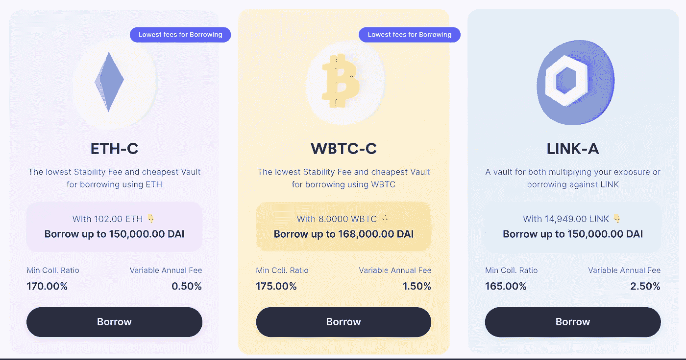
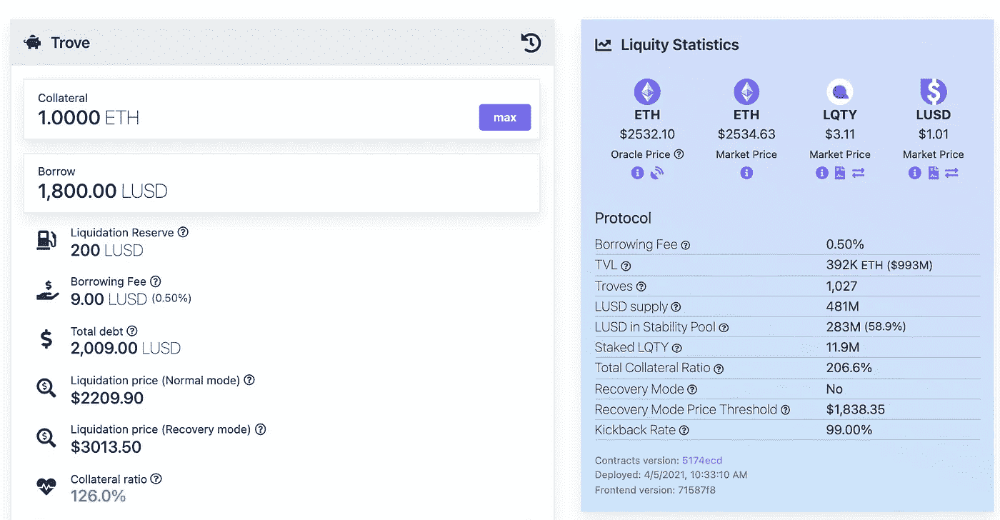

# 砍戴、奥斯德、吕德

> 原文：<https://medium.com/coinmonks/slicing-down-dai-ausd-and-lusd-294435a6b72c?source=collection_archive---------15----------------------->

这篇博客比较了三个加密支持的 stablecoins: DAI，lUSD 和 aUSD。它们都与美元挂钩，但使用不同类型的加密资产作为抵押品，并采用不同的稳定机制来保持与美元挂钩。

## TLTR

*   DAI 和 lUSD 在以太坊上运行，而 aUSD 在所有 Polkadot 生态系统中都可用，因为它被部署到 Acala
*   DAI 和 aUSD 都使用 DEX 来清算抵押不足的头寸。
*   澳元可以铸造与桩点作为抵押品
*   lUSD 引入了稳定池，作为保持与美元挂钩的第一道防线
*   下图显示了 aUSD、lUSD 和 DAI 之间的主要对比

# 介绍

有近 100 个 stablecoins，但不是所有的都兑现了区块链和 DeFi 的分权承诺。例如，hedet 是一种中央加密货币，它以法定美元(**法定支持的稳定货币**)建立储备。

**加密支持的 stablecoins** 仅依靠加密资产来维持与目标值(如美元)的挂钩。它们通常由 DAO 管理，并且代码是开放的。这些保护区是完全透明的，因为它位于区块链。

你可以在博客文章[中了解到稳定币的分类，或者看看下图:](/coinmonks/ultimate-stablecoin-classification-bd70db1ae3f3)

DAI、lUSD 和 aUSD 是分散的、加密支持的 stablecoins 的主要例子。虽然相似，但并不完全相同，了解这些差异是值得的。

# DAI——最大的密码支持稳定币

在撰写本文时，stablecoin DAI 是市值排名第一的 stablecoin 连锁抵押 stablecoin。它在区块链电子货币平台上运行，利用各种加密资产作为抵押品:以太币、比特币、股票代币和其他稳定货币。稳定的硬币抵押是完全透明的。

上图显示了戴抵押品的当前细分，其中近一半锁定在稳定币上，三分之一锁定在以太币上，只有约 11%锁定在比特币上。例如，任何用户都可以使用绿洲[和](https://oasis.app/.)来铸造戴

戴用来维持人民币与美元挂钩的稳定机制在算法中给出:

DAI stablecoin 协议由 DAO 管理，DAO 由它的管理令牌——maker DAO 的持有者组成。任何区块链用户都可以购买马克尔道并参与道投票。

# 使用案例— lUSD

总的来说，stablecoin lUSD 是市值第 13 大的 stablecoin。它也在永恒区块链上运作。与接受各种加密抵押品的 DAI stablecoin 协议不同，lUSD 硬币只能使用 Etereum 作为抵押品来铸造。任何区块链用户都可以铸造硬币。称为 Liquity 的 lUSD stablecoin 协议应用了一种特定的稳定机制，即下面的算法。

它引入了稳定池，涵盖了强制赎回过程中产生的潜在损失。任何区块链用户都可以订阅稳定池，如果在强制赎回过程中创造了潜在收益，也可以参与其中。**DAI 和 lUSD 之间最显著的区别是稳定机制的最后一层**。只有在所有前几层都失效的情况下，才启动这一层，以保持与美元的挂钩。**鉴于 DAI 将出售其治理令牌来弥补协议的损失，lUSD 正在金库的创建者之间分配损失**。

lUSD 不受道的支配。关键风险参数通过算法计算。

# 波尔卡多特和阿卡拉稳定币——澳大利亚

与部署在 Etereum block- ckain 的 DAI 和 lUSD 不同，aUSD stablecoin 在 Acala 上运行。阿卡拉区块链是波尔卡多特区块链的副链(第二层链)。aUSD 的稳定机理对应于 DAI 的稳定机理。由于被部署到不同的链，aUSD 协议接受其他加密附属类型:ACA(Acala 链的货币)、DOT(Polkadot 链的货币)和 staked DOT。

阿卡拉和新加坡币由一个道管理，基金会在新加坡成立。

# **关闭思路**

stablecoins DAI、lUSD 和 aUSD 提供了加密支持的 stablecoins 的所有优势，例如储备的完全透明性、对源代码的公共访问以及允许任何区块链用户铸造 stablecoins 的无许可创建过程。下图总结了相似之处和不同之处

**加密理财系列文章:**

1.  [理财经理在 Crypto 上的立场是什么？](/coinmonks/where-do-wealth-managers-stand-on-crypto-cdaf89b4362a)
2.  [加密如何提升财富管理](/@cyanustech/how-crypto-increases-the-role-of-wealth-managers-d2149f9d17c4)
3.  Defi 的幕后。财富经理简介
4.  从 TradeFi 到 deFi？财富经理入门指南

**Stablecoin 文章系列:**

1.  [最终稳定等级](/coinmonks/ultimate-stablecoin-classification-bd70db1ae3f3)
2.  [砍倒戴、奥斯德、吕斯德](/@cyanustech/slicing-down-dai-ausd-and-lusd-294435a6b72c)

> 加入 Coinmonks [电报频道](https://t.me/coincodecap)和 [Youtube 频道](https://www.youtube.com/c/coinmonks/videos)了解加密交易和投资

# 另外，阅读

*   [用信用卡购买密码的 10 个最佳地点](https://coincodecap.com/buy-crypto-with-credit-card)
*   [最好的卡达诺钱包](https://coincodecap.com/best-cardano-wallets) | [Bingbon 副本交易](https://coincodecap.com/bingbon-copy-trading)
*   [印度最佳 P2P 加密交易所](https://coincodecap.com/p2p-crypto-exchanges-in-india) | [柴犬钱包](https://coincodecap.com/baby-shiba-inu-wallets)
*   [8 大加密附属计划](https://coincodecap.com/crypto-affiliate-programs) | [eToro vs 比特币基地](https://coincodecap.com/etoro-vs-coinbase)
*   [最佳以太坊钱包](https://coincodecap.com/best-ethereum-wallets) | [电报上的加密货币机器人](https://coincodecap.com/telegram-crypto-bots)
*   [交易杠杆代币的最佳交易所](https://coincodecap.com/leveraged-token-exchanges) | [购买 Floki](https://coincodecap.com/buy-floki-inu-token)