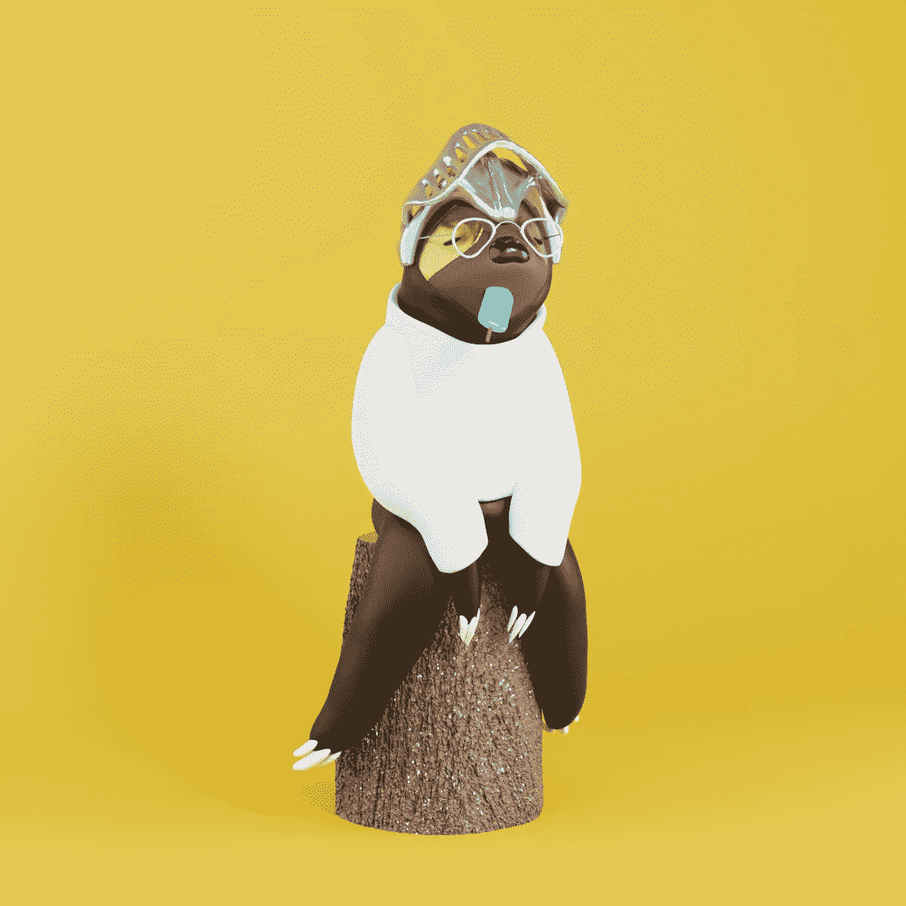
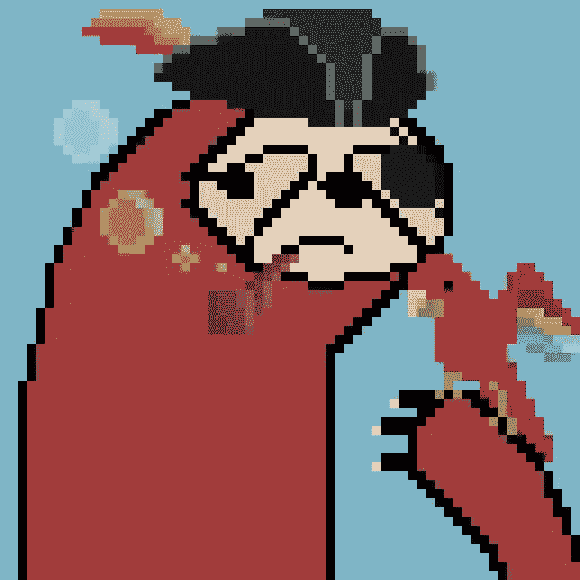
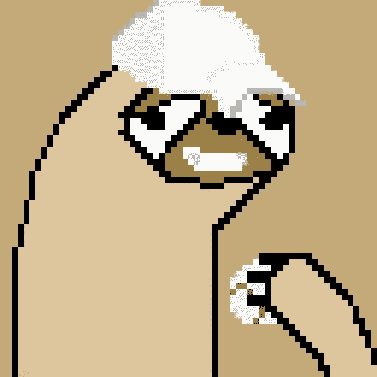
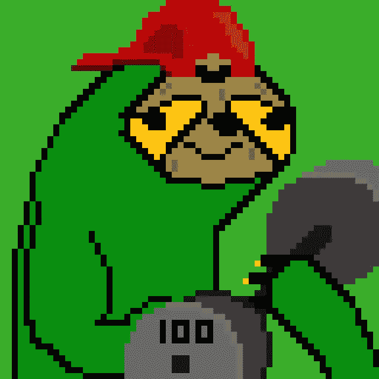
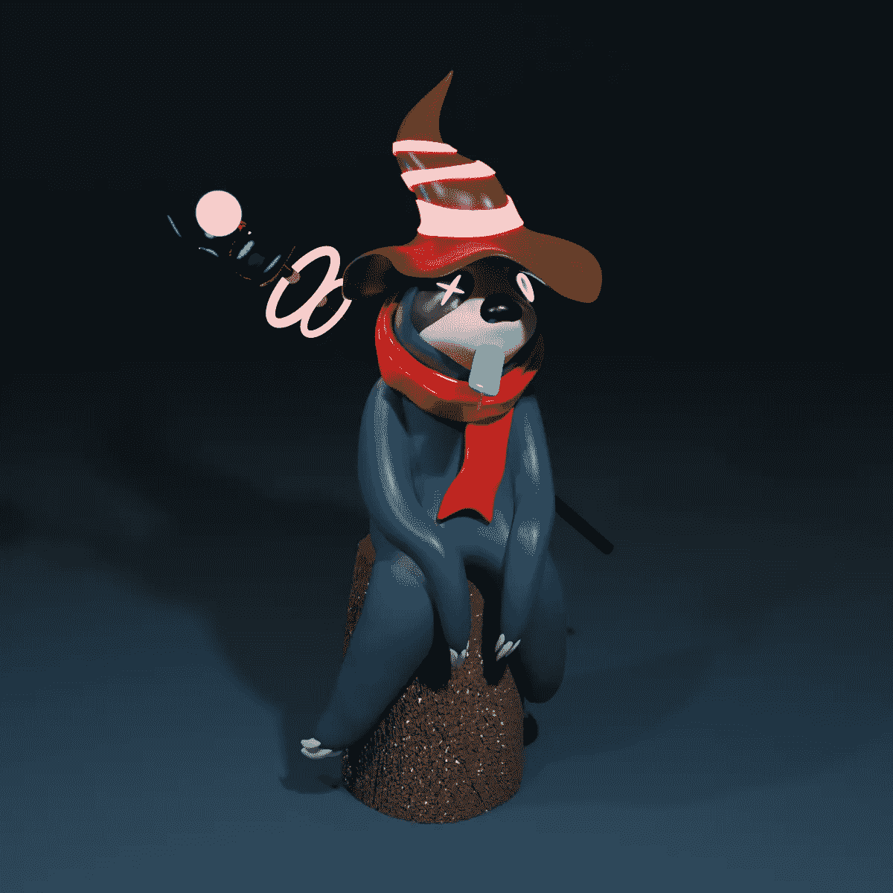
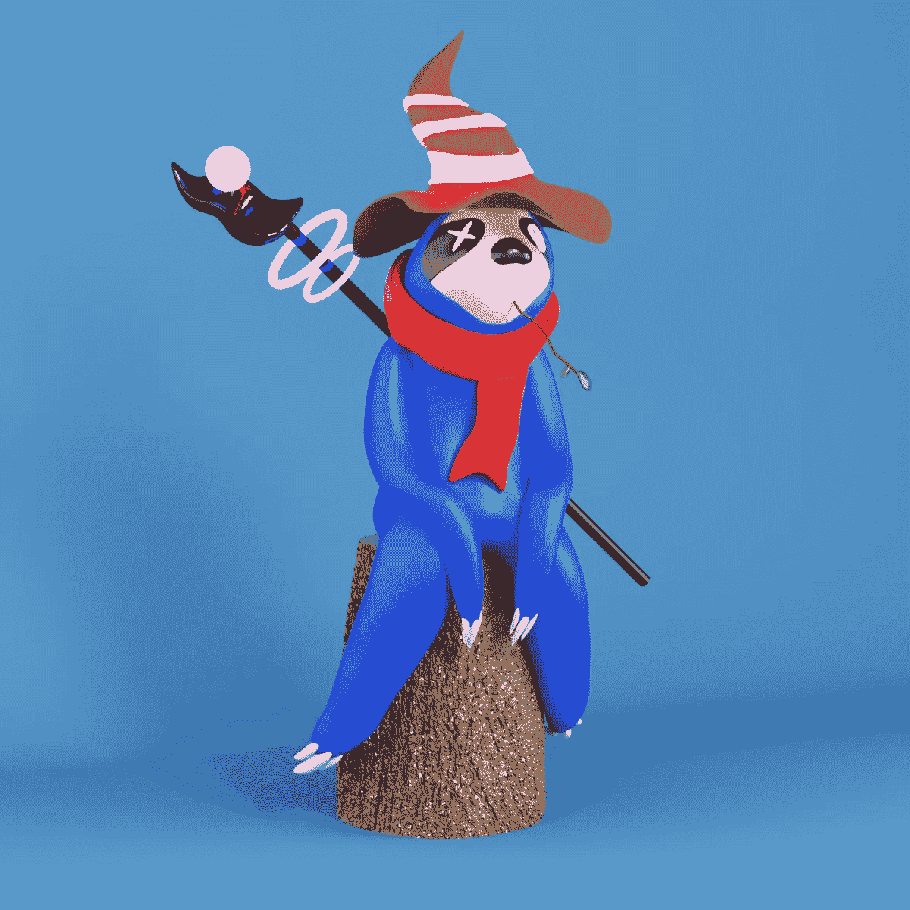

# 树懒玩具俱乐部|玩具+ NFT

> 原文：<https://medium.com/coinmonks/sloth-toy-club-toy-nft-960b8521edce?source=collection_archive---------40----------------------->

启动一个 NFT 项目正变得越来越具有挑战性。从组建你的项目团队到了解市场趋势，当另一个成功的项目诞生时，标准就提高了。

看看 [Bored Ape 游艇俱乐部](https://boredapeyachtclub.com/#/)比如衍生 NFTs 的黄金标准。就像一个 PFP (Profile Pic)项目一样简单，他们设定了大多数 genesis 项目需要考虑的最低要求，如果他们希望在 Web 3.0 上受到喜爱和欣赏的话。树懒玩具俱乐部，研究并遵循这一点。我们永远不会成为 BAYC(我们也不打算成为),但我们想为我们自己和我们的成员创造一个小小的和平角落，来简单地…挂，与我们在一起。

在这个日志记录里。我想分享我迄今为止在没有团队的情况下从事衍生 NFT 项目的经验。在这张唱片中，你会了解到我人生旅程中的起起落落。

# **艺术篇**

“Captain” from 64 Sloths

我不是训练有素的艺术家。我也没有上过艺术学校。从专业上来说，我是一个有执照的建筑师(建筑方面的)，我会在未来的日子里以这种方式支付我的账单。在追求我的数字艺术的最初几天，有两种情绪表现出来，一种是非常愉快的，对我制作的完全是我的作品感到满意，另一种是非常消极的，对任何人都会欣赏我的作品充满怀疑。但看到一些令人惊叹的数字艺术在市场上出售，如[公海](https://opensea.io/)、[魔法伊甸园](https://www.magiceden.io/)、[母鸡](https://hicetnunc.xyz/)消除了我的一些负面情绪，让我越走越远。

你可能会想，你对你的工作不满意吗，这是你做这个的原因吗？让我澄清一下，我不打算放弃我的建筑师工作，但是我从小就喜欢画画。我记得拿起一支铅笔设计怪物给我的朋友看，在这里和那里随意画丙烯画真的抚慰了我的灵魂。但是我已经很久没有这种感觉了，因为这些年来我一直在努力工作，所以我只是从我离开的地方重新开始，从高中开始。

这样做很酷，因为现在我是一个更大更老的孩子了。我的武器库中有了更多的工具，对这个世界有了更多的思考，对视觉艺术有了更多的欣赏，所以我可以设计一些非常酷的东西，对吗？所以我举起我的艺术笔，首先映入我脑海的是，一只树懒。(是的，一只树懒)

first sketch of my sloth, please ignore the double chin.

也许它开始是一个迷因，或者只是我需要咖啡(这个小家伙看起来超级悲伤)，但我的一些朋友质疑我为什么选择以树懒为基础塑造我的角色。如果我告诉你这是因为树懒很酷，他们行动缓慢，但他们执行事情自信而精确，那么这就是我刚才给你的假理由。真正的原因是，我不知道。这个小品突然出现了，我觉得很有趣，所以我想做更多。就这么简单。

# 游戏。

“Baseballer” #09 / 64 Sloths

我不知道我在做什么，没有联系，也无处开始。我打开 photoshop，我真的很喜欢像素艺术的吸引力。所以我在我的草图上描了一下。对图层的工作原理有了基本的了解后，我在 Reddit 上为一些随机的人手工设计了一些角色，还有我的一些密友和同事。

“Munson” #20 / 64 Sloths

我在玩游戏的时候很调皮。就像我在埃尔登环把一个老板扔进电梯坑，然后感觉很棒。但是我的规则很简单:

> 你最喜欢什么颜色？如果你是一只树懒，你会做什么？

我从网上随机的网友那里得到的答案是极其令人愉快的。有人想成为宙斯，另一个真的很喜欢玩口袋妖怪 Go，一个人真的很喜欢举重。所有这些原因都被数字化了，变成了……树懒。

“Lifter” #23 / 64 Sloths

“PocketMaster” #25 / 64 Sloth

最终，所有的游戏都会结束。我负担不起 Eth gas 在网上为随机的人做免费铸造和转让，所以我不得不依靠 Open Sea 的免费多边形铸造路线。当我接近数字 64 时，像素艺术项目慢慢地结束了。

# 销售额。

没有团队，没有名人，没有宣传。只有我和 photoshop，这个项目是陈旧的。一位网友之前将他们的个性化树懒标价为 420.69 $ETH，现在在公海上的标价为 0.0069 $ETH。唯一一个买过基本树懒(非个性化)的人，我还没有报答那个人对我的信任。我现在成了一名饥饿的数码艺术家，独自留在干燥的沙漠里，我和我的树懒在月光下看着彼此。

# 绿洲。

在每部电影中，每当主角被困在沙漠中，他们总能找到一片绿洲并得到救赎。嗯，这不是那种故事，我和我的树懒仍然坐在沙漠中等待某种形式的 FDNY 救援。Out gamed，out numbered，当[其他树懒](https://slothsnft.com/)(性感)长这样的时候，树懒在 Web 3.0 能做什么？真的不多，只要坚持你所创造的，享受旅程。除非你想拿出 5 位数的钱作为启动竞选的初始投资，否则沙漠中的生活可能会更简单。

# 升级。

First draft on Sloth Toys.

作为一名艺术家，只要你投入时间，你的工具就会与你一起成长。我开始我的旅程时，只知道建筑设计、Revit、AutoCAD、Enscape、Sketchup 等程序。我从来不知道任何关于 Blender 或 Maya 的事情，并且认为我永远也不需要知道。我一直喜欢收集设计师设计的乙烯基玩具，尤其是 Medicom Toys 的盲盒熊砖。在不知道会得到什么的情况下打开一个盲盒的快乐是非常令人满足的，和朋友交换复制品是永无止境的。就像我开始时一样，我克服了学习新工具时的恐惧，现在我能用自己的一点创造力做简单的基本雕塑和搅拌机(谢谢[安德鲁·普莱斯](https://www.blenderguru.com/))。我想说的结果是令人满意的(没有大多数 3D 艺术家做的那么好)。一路上我也交了很多朋友，有了他们的反馈，你的工作只会越来越好。

Second draft of Sloth Toys.

# 结论。

我在一个不同的世界工作，我设计实体建筑，使它们符合规范，尽管听起来很无聊，但确保你的屋顶是防水的。超越现实生活的期望(来自自己和他人)只是为了重温我童年时的一些激情，这是一个持续的挑战。我可以很容易地给自己买一些画笔，重新开始传统绘画，或者干脆去当地的酒吧和我的朋友&同事喝啤酒。但是当我感到有点挑战的时候，我会对自己说，遵从 easy 的乐趣在哪里？

当我写这篇日志的时候，我看到我已经走了多远，因为我们在这个新的空间，谁知道我下一步会想出什么？

哦，对不起，我忘了说，这个 NFT 将于今年晚些时候上市，整个计划是能够制作乙烯基收藏玩具。所以，如果你喜欢玩具，就加入我们吧！

# 纳米不和谐:

【https://discord.gg/NANOffice 

> 加入 Coinmonks [电报频道](https://t.me/coincodecap)和 [Youtube 频道](https://www.youtube.com/c/coinmonks/videos)了解加密交易和投资

# 另外，阅读

*   [在美国如何使用 BitMEX？](https://coincodecap.com/use-bitmex-in-usa) | [BitMEX 审查](https://coincodecap.com/bitmex-review)
*   [最佳期货交易信号](https://coincodecap.com/futures-trading-signals) | [期交所评论](https://coincodecap.com/liquid-exchange-review)
*   [南非的加密交易所](https://coincodecap.com/crypto-exchanges-in-south-africa) | [BitMEX 加密信号](https://coincodecap.com/bitmex-crypto-signals)
*   [MoonXBT 副本交易](https://coincodecap.com/moonxbt-copy-trading) | [阿联酋的加密钱包](https://coincodecap.com/crypto-wallets-in-uae)
*   [Remitano 审查](https://coincodecap.com/remitano-review)|[1 英寸协议指南](https://coincodecap.com/1inch) | [购买 Floki](https://coincodecap.com/buy-floki-inu-token)