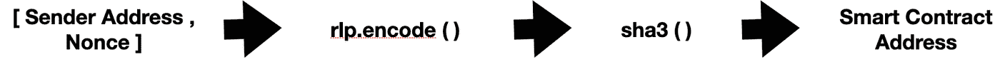

# 智能合同地址创建方法&智能合同地址和钱包地址之间的区别(EOA)。

> 原文：<https://medium.com/coinmonks/smart-contract-address-creation-method-difference-between-smart-contract-address-and-wallet-97b421506455?source=collection_archive---------1----------------------->

在这篇文章中，我将回答 3 个基本问题，作为一个聪明的合同开发者，我们需要知道事情是如何工作的。

1.  以太坊有多少种地址？

2.智能合同地址是如何创建的？

3.智能合同地址和 EOA 地址的区别？

先说一个问题。

1.以太坊有多少种地址？

以太坊有两种地址，

*   [智能合约地址](https://ethdocs.org/en/latest/contracts-and-transactions/account-types-gas-and-transactions.html)
*   [钱包地址还是 EOA。](https://ethdocs.org/en/latest/contracts-and-transactions/account-types-gas-and-transactions.html)

为了便于理解，元掩码帐户地址称为钱包地址或 EOA。

2.如何创建智能合同地址？

有两种方法可以在以太坊中创建智能合同地址。

每个智能合约通过其地址在区块链中进行标识。这个地址是一长串数字和字符。它从 0xba 开始…但问题是这个 0xba 是如何计算的。

智能合同代码部署在区块链，它是交易的一部分。当我们在区块链上部署智能合约时，我们需要一个钱包地址，以便流程

**方法一。钱包地址= >交易= >智能合约。**

当我们在以太坊网络中执行任何交易时，它都会增加一个名为 [Nonce](https://kb.myetherwallet.com/en/transactions/what-is-nonce/#:~:text=In%20Ethereum%2C%20every%20transaction%20has,can%20only%20be%20used%20once.&text=There%20are%20rules%20about%20what,enforce%20some%20of%20these%20rules.) 的数字。因此智能合约地址由其钱包地址和随机数确定。

所以结论是 Nonce 和发送者地址被放入数组中，然后使用 rlp。Encode()机制，rlp.encode()运算结果后，用 sha3()函数散列，会给出 32 字节的数据。智能合约地址使用哈希数据的最后 20 个字节。

**方法二。创建智能合同地址的另一种方法是使用名为 CREATE2 的操作码。**

CREATE2 依赖于发送方地址和合同代码来创建智能合同地址。创建一个智能合同地址并不那么容易。

**3。智能合同地址和 EOA 地址的区别？**

智能合同地址:智能合同地址唯一标识区块链上的智能合同。每个智能合同地址都与四个不同的字段相关联。

1.  Nonce: Nonce 是一个整数，每次地址发送任何事务时都会递增。因此，在智能合约部署该时间 Nonce = 0 后，在智能合约发送第一笔交易后，Nonce 将增加到 1，依此类推。
2.  余额:如果我们将余额发送到智能合同，其余额将增加，如果智能合同发送到另一个地址，其余额将减少。
3.  代码:当我们在 solidity 中编制智能合同时，该代码将进入区块链上的商店代码字段。
4.  数据:存储智能合约的所有存储变量的位置。很重要的一点是，内存变量不能存储在区块链中。

外部拥有的地址(EOA):当我们在 metamask 或其他以太坊钱包中创建帐户时，它被称为 EOA 地址。EOA 和智能合同地址的最大区别是 EOA 地址有一个相关的私钥来签署交易。所以在智能合约地址中没有任何私钥。智能合约地址唯一能做的是对执行一些智能合约功能的传入事务作出反应。

**EOA 地址也有 4 个字段**。

1.  Nonce: Nonce 是一个整数，每次地址发送任何事务时都会递增
2.  平衡:平衡会增加/抑制发送和接收的需求。
3.  代码:空
4.  数据:空

参考:1。[https://blog . smart dec . net/how-to-define-smart-contract-address-before-deploy-create 2-use-case-for-decorated-exchange-52 B7 DAA 7873 b](https://blog.smartdec.net/how-to-define-smart-contract-address-before-the-deploy-create2-use-case-for-decentralized-exchange-52b7daa7873b)

2.【https://www.zastrin.com/courses/ethereum-primer/lessons/2-4 

3.[https://eth.wiki/en/fundamentals/rlp](https://eth.wiki/en/fundamentals/rlp)

> *加入 Coinmonks* [*电报频道*](https://t.me/coincodecap) *和* [*Youtube 频道*](https://www.youtube.com/c/coinmonks/videos) *了解加密交易和投资*

# 另外，阅读

*   [币安 vs FTX](https://coincodecap.com/binance-vs-ftx) | [最佳(SOL)索拉纳钱包](https://coincodecap.com/solana-wallets)
*   [如何在 Uniswap 上交换加密？](https://coincodecap.com/swap-crypto-on-uniswap) | [A-Ads 评论](https://coincodecap.com/a-ads-review)
*   [加密货币储蓄账户](/coinmonks/cryptocurrency-savings-accounts-be3bc0feffbf) | [YoBit 审核](/coinmonks/yobit-review-175464162c62)
*   [Botsfolio vs nap bots vs Mudrex](/coinmonks/botsfolio-vs-napbots-vs-mudrex-c81344970c02)|[gate . io 交流回顾](/coinmonks/gate-io-exchange-review-61bf87b7078f)
*   [CoinFLEX 评论](https://coincodecap.com/coinflex-review) | [AEX 交易所评论](https://coincodecap.com/aex-exchange-review) | [UPbit 评论](https://coincodecap.com/upbit-review)
*   [AscendEx 保证金交易](https://coincodecap.com/ascendex-margin-trading) | [Bitfinex 赌注](https://coincodecap.com/bitfinex-staking) | [bitFlyer 审核](https://coincodecap.com/bitflyer-review)
*   [Bitget 评论](https://coincodecap.com/bitget-review) | [双子星 vs BlockFi](https://coincodecap.com/gemini-vs-blockfi) cmd| [OKEx 期货交易](https://coincodecap.com/okex-futures-trading)
*   [AscendEx Staking](https://coincodecap.com/ascendex-staking)|[Bot Ocean Review](https://coincodecap.com/bot-ocean-review)|[最佳比特币钱包](https://coincodecap.com/bitcoin-wallets-india)