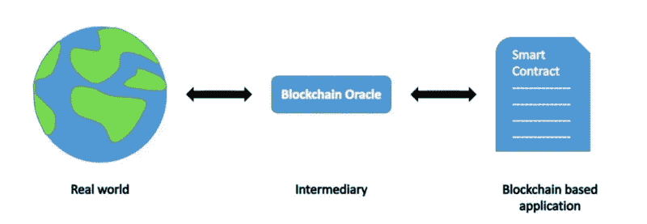

# 基于智能合同的 Oracle 削减

> 原文：<https://medium.com/coinmonks/smart-contract-based-oracle-slashing-1cf58cdd4df6?source=collection_archive---------5----------------------->

## 不可信地惩罚欺骗先知

Oracles 对于智能合约访问外部真实世界的数据是不可或缺的。数据保真对于这些智能合约的运行至关重要。提高数据保真度的一种方法是要求 oracle 为他们提供的数据存放一些抵押品。如果甲骨文行为不端，提供欺诈性数据，他会没收抵押品(称为**砍**)。如果抵押品由第三方托管，我们只是将信任问题从先知转移到第三方，我们委托第三方明智地监控和惩罚欺诈。

我们在本文中的创新是将抵押品直接锁定在智能合同中，作为公共奖金，任何人都可以收集它，只要他能找到欺诈的证据，而无需任何可信的第三方。通过确保任何不诚实的行为都将被抓住并受到经济处罚，我们激励先知诚实行事，从而使依赖他们的智能合同更加安全。我们用明智的预言作为例子来说明。

# 明智的契约和神谕

[Sensible contract](https://sensiblecontract.org/) 是一种开发和组织比特币智能合约的方式。它允许合约回溯到其发行交易，并在同一交易的输入中识别相邻的合约。它依靠一种特定类型的 oracles 来验证链外数据的完整性，称为[签名服务](https://sensiblecontract.org/docs/sensible/1.-Whitepaper/)。特别地，一个[明智的先知](https://github.com/sensible-contract/satotx)签署了下面的元组:

> **(txid，index，satoshis，scriptHash)**

基本上，它验证在一个事务中的第 ***个索引***【txid】为*的输出中有那么多*并且它的脚本散列为 ***scriptHash*** 。**

# **苛刻的合同**

**我们注意到元组中的所有信息都是公开的，每个人都可以独立检查。如果我们可以找到具有给定的 ***txid*** 但在索引输出中包含不同的 satoshi 金额或脚本的交易，我们就找到了欺诈的证据，并可以调查甲骨文的担保品。为了实现这一点，oracle 将担保品锁定在以下合同中:**

**[Contract ***SlashSensibleOracle***](https://github.com/sCrypt-Inc/boilerplate/blob/master/contracts/sensibleSlashing.scrypt)**

**第 20 行确保数据确实是由明智的先知签署的。第 23 行将数据解析成所需的格式。第 26 行验证包含欺诈证据的交易与 txid 匹配。在从第 29 行的事务中检索指定的输出后，第 32 行验证 oracle 通过签署错误的金额或脚本进行了欺骗。**

**如果发现欺诈，任何人都可以调用合同并赎回神谕的抵押品。**

## **延长**

**明智的神谕可以签署另一个元组:**

> ****(txid，index，satoshis，scriptHash，spendByTxID)****

**它不仅验证由该对( ***txid*** ， ***index*** )标识的输出具有指定的 satoshi 数量和脚本，而且它由具有 txid **spendByTxID** 的事务花费。为了检测这种欺诈，除了在契约***slashsensioleracle***中所做的之外，我们还可以找到使用不同 txid 的交易。我们可以使用技术[在没有甲骨文的情况下从比特币智能合约中访问区块链数据](https://xiaohuiliu.medium.com/access-blockchain-data-from-bitcoin-smart-contracts-without-oracles-e13b9c911d32)，来验证交易确实在链上。**

# **摘要**

**我们只展示了如何使用智能契约来削减欺骗性的明智预言。它适用于任何可以在智能合同中验证欺诈证据的 oracle。**

**例如，oracle 可以进行纯/无状态但复杂的计算，并签署结果。因此，智能契约可以导入已签名的结果并获得结果，而无需重新运行所有昂贵的计算。与此同时，每当先知作弊时，他就会失去锁定在合同中的抵押品，这只是计算出不同但正确的结果。**