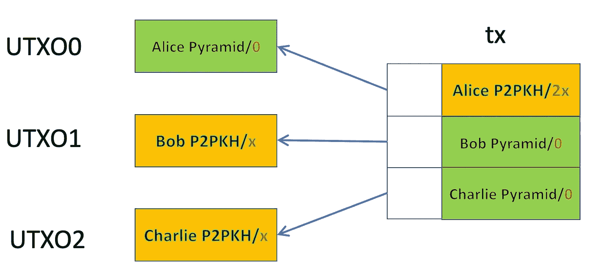

# 基于智能合同的比特币传销

> 原文：<https://medium.com/coinmonks/smart-contract-based-pyramid-scheme-on-bitcoin-41fc3e0e46a1?source=collection_archive---------13----------------------->

## 世界上最透明的传销

根据维基百科:

> **金字塔计划**是一种商业模式，它通过承诺为其他人加入该计划支付报酬或服务来招募成员，而不是提供投资或销售产品。

我们开发了一个基于智能合同的金字塔计划。为了加入，每个参与者都必须付费才能与合同互动。合同保证新参与者有 100%的回报，只要他能再招募两个参与者。由于整个传销是通过智能合约自动执行的，所以是透明的，不可信的。

Pyramid Transactions: numbers in red after **/** denote satoshis

在上面的例子中，爱丽丝已经支付了 ***x*** 的报名费，这使她有权成为 *UTXO0* 中的受益人。如果她说服鲍勃和查理加入，每人支付 ***x*** ，她保证获得 ***2x*** 的报酬，这又更新了该方案，但是鲍勃和查理是新的受益人。只要能找到新的投资者，这个计划就会继续下去。

完整的代码如下所示。

[Contract Pyramid](https://github.com/sCrypt-Inc/boilerplate/blob/master/contracts/pyramid.scrypt)

第 15 行使用 ***ANYONECANPAY*** 这样鲍勃和查理可以独立地添加他们的输入，每个人都有 ***x*** 的智慧。

[1]这假设粉尘极限可以忽略不计。第一个参与者赚取超过 100%,因为他只需支付交易费来部署合同。

[2]我们忽略交易费用，它很容易被另一个投入所覆盖。

> 加入 Coinmonks [电报频道](https://t.me/coincodecap)和 [Youtube 频道](https://www.youtube.com/c/coinmonks/videos)了解加密交易和投资

# 另外，阅读

*   [如何使用 Solidity 在以太坊上创建 DApp？](https://coincodecap.com/create-a-dapp-on-ethereum-using-solidity)
*   [币安 vs FTX](https://coincodecap.com/binance-vs-ftx) | [最佳(SOL)索拉纳钱包](https://coincodecap.com/solana-wallets)
*   [如何在 Uniswap 上交换加密？](https://coincodecap.com/swap-crypto-on-uniswap) | [A-Ads 评论](https://coincodecap.com/a-ads-review)
*   [加密货币储蓄账户](/coinmonks/cryptocurrency-savings-accounts-be3bc0feffbf) | [YoBit 评论](/coinmonks/yobit-review-175464162c62)
*   [Botsfolio vs nap bots vs Mudrex](/coinmonks/botsfolio-vs-napbots-vs-mudrex-c81344970c02)|[gate . io 交流回顾](/coinmonks/gate-io-exchange-review-61bf87b7078f)
*   [CoinFLEX 评论](https://coincodecap.com/coinflex-review) | [AEX 交易所评论](https://coincodecap.com/aex-exchange-review) | [UPbit 评论](https://coincodecap.com/upbit-review)