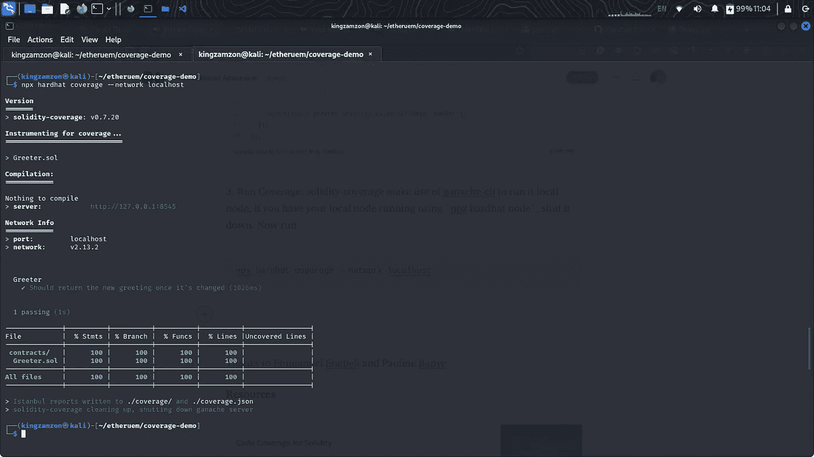

# Hardhat 中的智能合同代码覆盖率

> 原文：<https://medium.com/coinmonks/smart-contract-code-coverage-in-hardhat-d4a5ff6c9ba6?source=collection_archive---------2----------------------->

**什么是代码覆盖率？**
代码覆盖率是一个可以帮助你了解你的源代码有多少被测试的度量标准。


source: [https://www.pymnts.com/blockchain/2021/what-is-a-smart-contract/](https://www.pymnts.com/blockchain/2021/what-is-a-smart-contract/)

**为什么要为你的智能合约运行代码覆盖率？**
智能合约被黑在今天的系统中并不是什么新闻，虽然代码覆盖率不会告诉你智能合约开发的最佳实践，但它保证你正在测试你的功能的所有可能结果。100%通过测试是很好的，但是如果测试只覆盖了你代码库的 10%,你仍然不能在没有被覆盖的地方捕捉到回归。什么代码覆盖率来拯救。
在本教程中，我们将使用 **solidity-coverage** 包，这是一个用于运行您的智能合约的代码覆盖的包，它为 [*跳过测试、webflow 挂钩、gas cost e.t.c*](https://github.com/sc-forks/solidity-coverage/blob/master/docs/advanced.md) *提供了更多的功能和能力。好吧，让我们开始吧💌*

1.  **安装包:**我假设你已经安装了 hardhat。我们将使用**可靠性覆盖**和**加纳切-cli** 。ganache-cli 是一个用于测试和开发的快速以太坊 RPC 客户端，solidity-coverage 将使用它来运行其覆盖和测试。

```
*npm i solidity-coverage ganache-cli*
```

2.**写测试:**一个新的安全帽项目，附带 [**Greeter.sol**](https://gist.github.com/kingzamzon/1e3abb55590e0820934a022094873c38) 我们要为它运行代码覆盖。它的测试写在 **simple-test.js** 里。您可以使用`npx hardhat test`进行简单的测试

3.**给 hardhat 配置添加 solidity-coverage:**打开你的*hard hat . config . js*；在您的安全帽配置中导入/需要。

require / import solidity-coverage

**4。运行覆盖:** *坚固性覆盖*利用 *ganache-cli* 运行它本地节点，如果你使用 *npx hardhat node* 运行你的本地节点，关闭它。现在快跑

```
npx hardhat coverage --network localhost
```



coverage test for Greeter.sol

恭喜🙌根据上面的截图，由于 Emmanuel Enebeli 和 Pauline Banye，您已经成功地运行了 **Greeter.sol.**
的代码覆盖率

**资源**

[](https://blog.colony.io/code-coverage-for-solidity-eecfa88668c2/) [## 可靠性的代码覆盖率

### 确保已部署以太坊合约的安全性是以太坊开发者面临的最重要挑战之一…

blog.colony.io](https://blog.colony.io/code-coverage-for-solidity-eecfa88668c2/) [](/edgefund/testing-and-code-coverage-of-solidity-smart-contracts-660cb6291701) [## Solidity 智能合约的测试和代码覆盖

### 众所周知，持续集成和持续部署是应用程序的重要组成部分…

medium.com](/edgefund/testing-and-code-coverage-of-solidity-smart-contracts-660cb6291701) 

> 加入 Coinmonks [电报频道](https://t.me/coincodecap)和 [Youtube 频道](https://www.youtube.com/c/coinmonks/videos)了解加密交易和投资

# 另外，阅读

*   [最佳期货交易信号](https://coincodecap.com/futures-trading-signals) | [流动性交易回顾](https://coincodecap.com/liquid-exchange-review)
*   [南非的加密交易所](https://coincodecap.com/crypto-exchanges-in-south-africa) | [BitMEX 加密信号](https://coincodecap.com/bitmex-crypto-signals)
*   [MoonXBT 副本交易](https://coincodecap.com/moonxbt-copy-trading) | [阿联酋的加密钱包](https://coincodecap.com/crypto-wallets-in-uae)
*   [雷米塔诺评论](https://coincodecap.com/remitano-review)|[1 英寸协议指南](https://coincodecap.com/1inch) | [购买弗洛基](https://coincodecap.com/buy-floki-inu-token)
*   [MoonXBT vs Bybit vs 币安](https://coincodecap.com/bybit-binance-moonxbt) | [Arbitrum:第二层解决方案](https://coincodecap.com/arbitrum)