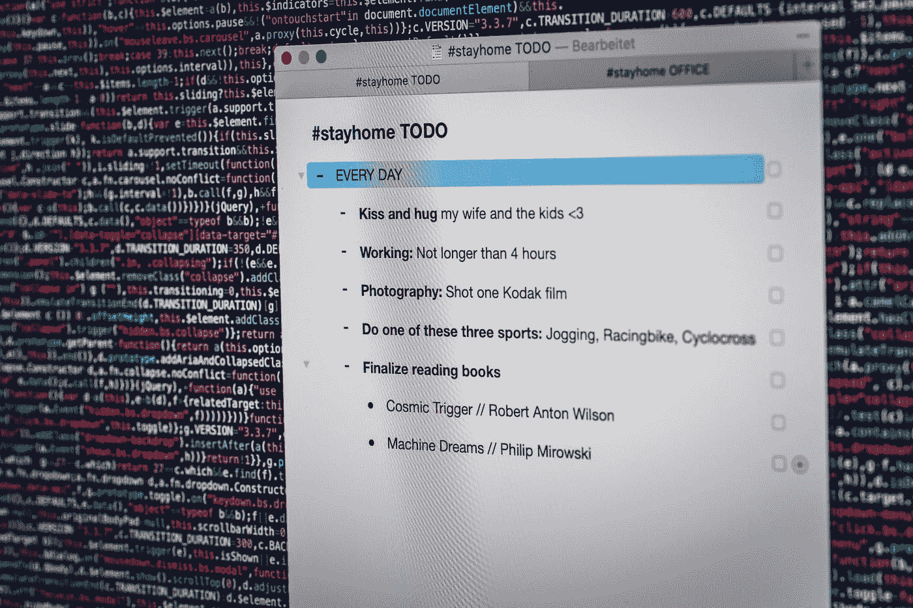

# 智能合约:2022 简介

> 原文：<https://medium.com/coinmonks/smart-contracts-2022-introduction-945ff43162b2?source=collection_archive---------14----------------------->

## 智能合约的简史、利弊。

Photo by [Markus Spiske](https://unsplash.com/@markusspiske?utm_source=medium&utm_medium=referral) on [Unsplash](https://unsplash.com?utm_source=medium&utm_medium=referral)

什么是智能合约？我们很高兴你问了…

智能合同是自动执行的合同，买方和卖方之间的协议条款被直接写入代码，以便自动执行商定的操作。有道理吗？嗯，等一下——给我们一个解释的机会……

智能合约最初是由计算机科学家尼克·萨伯在 1994 年提出的，但直到在区块链技术上实现后，它们才获得广泛的关注。让我们仔细看看智能合同是如何工作的，以及它们的一些潜在用例！

首先，让我们讨论一下尼克·萨伯和他对世界的贡献。官方说法是，一名计算机科学家创造了[比特币](https://www.investopedia.com/terms/b/bit-gold.asp)，并获得了乔治·华盛顿大学的法律学位。非正式地，一些人相信比特币的创造者中本聪。甚至[埃隆·马斯克也称赞萨博](https://en.cryptonomist.ch/2022/01/04/elon-musk-identifies-satoshi-nakamoto-nick-szabo/)，“比任何人都更应该为这些想法的发展负责。”

# 好吧，回到智能合约:

智能合同是一种计算机协议，旨在以数字方式促进、验证或执行合同的协商或履行。(嗯，什么？—让我们再试一次)

智能合约允许在没有第三方的情况下进行可信的交易。好吧，说真的，再来一次…

首先，智能合约用于数字交易。尽管它们发展很快，但据我所知，基本概念是想象某种交通工具。任何一种交通方式都可以，但是想象一下，这辆车只有一条进出的路。要进入车辆，您必须通过验证，要离开车辆，必须发生特定的、预先批准的事件，然后您必须再次通过验证。这就是智能合约的基本运作方式，也是它们在金融交易中如此受欢迎的原因。一进，验证，一出。EZPZ。

换句话说，智能合约是作为一段具有特定用途的代码创建的。它可以识别一组传入的数据，一个“触发”事件，然后是一组传出的数据。创建者、目的和“触发器”由其他用户验证。人多力量大，所以更多的用户验证可以确保安全性。然后，契约会耐心地等待特定事件的发生。一旦事件发生，被确认，智能合约自动触发效果或退出门，协议完成。然后，“汽油”是控制交易速度的相关费用。(但我们将在另一个时间讨论“汽油”费用)

它开始变得更有意义了吗？(哦，对于那些比我们聪明得多的人——如果我们错了，请纠正我们——我们知道外面有很多不好的信息，所以如果我们误解了，请纠正我们)

有人说智能合同的潜在用途是无穷无尽的！我们会说接下来会有几次迭代。但是，就目前而言，这些用例想法如何:

-付款和开具发票

-保险理赔

-房地产交易

-供应链管理

-智能合同也可以用来创建一个“分散的自治组织”(DAO)——DAO 是另一种对话。我们稍后会到达那里)

Photo by [agus prianto](https://unsplash.com/@agusprianto?utm_source=medium&utm_medium=referral) on [Unsplash](https://unsplash.com?utm_source=medium&utm_medium=referral)

# 利弊:

智能合同的优点是它们是可跟踪的、透明的和不可逆的。这意味着，一旦创建了智能合同，就不能更改。合同条款是一成不变的，所有相关方都能看到合同以及合同将如何执行。智能合同也是不可逆转的，这意味着一旦它启动，就没有回头路了！

智能合同的缺点是它们通常很复杂，可能包含错误和/或 bug。这是因为智能合同是由人类写的，我们都知道人类会犯错！如果智能合同出了问题，可能很难跟踪并修复错误。此外，因为智能合同是数字的，并且运行在代码上，所以并非每个人都可以访问它们。不是每个人都能上网或知道如何使用电脑/智能手机。

希望这能对智能合同这个话题有所帮助。我们讨论了他们来自哪里，他们做什么，他们如何工作，以及一些优点和缺点。给我们鼓掌。我们很感谢你。