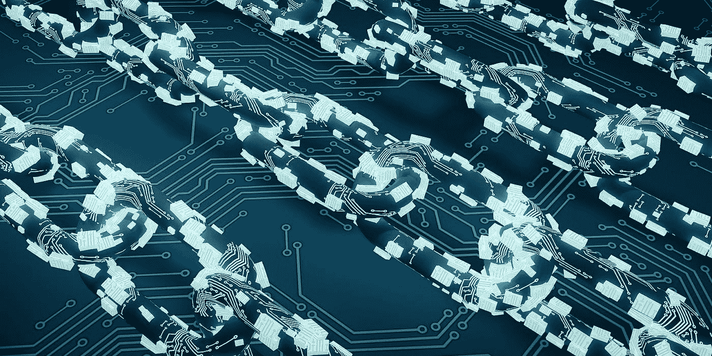
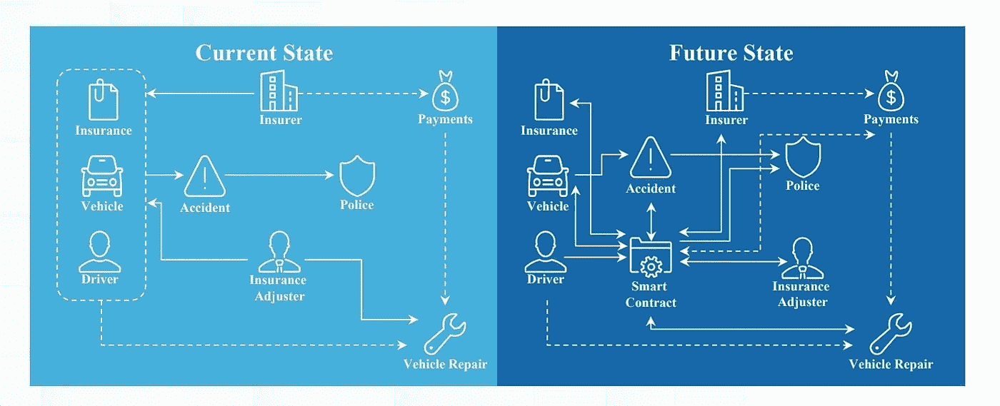

# 智能合同和使用领域

> 原文：<https://medium.com/coinmonks/smart-contracts-and-usage-areas-87c41c38862a?source=collection_archive---------34----------------------->

**简介**

当我们把这个叫做历史的计数器带回到 90 年代，当互联网和计算机技术在人们中间还是新事物的时候，**美国律师和计算机科学家 Nick Szabo** 揭示了智能合同协议。在那些日子里，Nick Szabo 删除了用传统方法创建的合同中的第三人，即国家，并将其在合同中的角色加载到软件中。如果我们快进柜台，来到 2008 年，这一年我们看到美联储，它在 2007 年造成了美利坚合众国的房地产泡沫，并在一年后蔓延到全球，导致世界第四大投资银行雷曼兄弟破产，负债 6130 亿美元。它面临着一场巨大的危机，在这场危机中，政府以廉价的流动性进行干预，而这种流动性导致了通货膨胀。还有一个事件发生了，尽管当时没有考虑到。昵称为中本聪的人发布了一份白皮书，在这份白皮书中，**中本聪**指出，发生的金融危机是由提供流动性的政府和分配流动性的银行造成的。它旨在消除无能的政府和贪婪的银行，并通过比特币(它在白皮书中详细描述的加密货币)以 P2P(点对点)方式进行交易。当你看着中本聪和尼克·萨伯时，你注意到什么了吗？当我们把时间往前推一点，回到 2014 年，出生于俄罗斯、天赋异禀的**维塔利克·布特林**因经济困难移民到加拿大，他向世界介绍了一款在区块链系统上运行的智能合同软件，就好像它是中本聪和尼克·萨博的翻译一样。

pixabay

**区块链技术**

2008 年的全球危机摧毁了人们对国家货币以及控制和管理这些货币的人的信任。中本聪在他的后危机白皮书中，将危机的原因归咎于管理货币的金融机构的贪婪和控制货币的国家的麻木不仁。在同一份白皮书中，Nakamoto 介绍了一种称为比特币的加密货币，它通过区块链技术加密，我们称之为 crypto。那天中本聪形成了链条的第一环。虽然当时人们对这项技术了解不多，但中本聪向人类历史展示的这项技术将在未来让国家成为我们生活的中心，并将我们带到一个无状态、分散的系统，但这项技术将如何实现呢？

虽然区块链在首次宣布时只是作为加密货币背后的技术而被披露，但它在未来几天已经揭示了它的潜力。技术让用户成为系统的一部分，而不是使用系统，因为发生的每一笔交易都是系统本身。在比特币白皮书中，种种迹象表明 P2P 方法，即点对点交易，提供了这种机会。目前，个人必须使用中介机构来转移资金，而转移资金的系统的用户，中介机构是系统的管理员。得益于比特币或其他加密货币，区块链技术去除了中介机构，即管理系统的行为者，允许使用系统的各方管理系统和转移资金，但如何做到呢？这个系统实际上完全由数字组成。16 位数字代表一个块，该块的事务，即它包含的数据。现在，A 通常会去银行转账，将钱存入银行，银行或中间的银行会进行转账，钱会到达收款人手中。在区块链技术中，这个过程是通过一个 16 位数字序列发生的。人 A 有比特币，B 想发给自己，这个 A 拥有的比特币是用这个 16 位的字符串加密的。而 A 的比特币去 B，没有实物或虚拟的交割，只有这一个或几个 16 位的字符串把 A 的比特币换成 B 的比特币。这个过程称为哈希，所有这些变化形成了一个链。这些事务发生在区块链上，在散列完成并达成一致后，添加到该链的块不能再被改变。另一方面，共识是链条中其他参与者的认可，链条是通过我们的交易形成的，正如我在开始时所说，我们在每笔交易发生之前都保持着共识。

当区块链技术首次出现时，它只是为了实现我给出的例子而创建的，中本聪希望用软件控制的去中心化系统将中央化系统的参与者排除在系统之外，这个系统跟踪加密资金，但那些追随中本聪的人就好像他们在为他燃烧的这场革命之火燃烧木材。他们还使用区块链技术分散了其他关键事务，另一个例子是智能合同，这也是本文的主题。

**智能合约和以太坊**

智能合同是由律师兼计算机科学家 Nick Szabo 于 1990 年首次提出的。Nick Szabo 提出了这个协议，他认为传统的合同已经不能满足需要，并且在今天的条件下是不够的，他一直认为软件更快，更可靠。在 90 年代，技术还不是很先进；计算机、互联网和软件等词汇刚刚开始在我们的生活中出现，因此完全由代码组成并相互管理各方需求的计算机程序并没有对人们产生预期的影响。日历显示 2014 年时，Vitalik Buterin 年仅 20 岁，住在加拿大，以太坊推出了一种名为以太坊的加密货币，像比特币一样提供去中心化金融，但不仅仅是其先进的技术将以太坊与比特币分开，因为与比特币不同，除了开放链系统外，它还提供了一个封闭链。换句话说，在那天的白皮书中，这位年轻的天才提出了除加密货币之外的区块链技术的另一种替代方案，除了提供比特币的替代方案之外，这种替代方案就是智能合约。

尼克·萨伯(Nick Szabo)在推广智能合同时，总是以零食自动售货机为例。购买者选择购买薄饼，作为该选择的结果，他通过自动售货机中的智能合同协议创建的软件要求付费。一旦购买者从机器料斗传输该费用，保持晶片的臂被释放，晶片到达购买者。这个例子是简化的，让我们来看一些细节。

目前，智能合约 Vitalik Buterin 在引入以太坊后正在研究区块链技术。每个模块都可以更快、更安全、更先进地工作，就像合同一样。该系统完全通过加密货币在区块链上运行。我想结合 NFTs 来解释一下工作方法。NFTs 是智能合约技术的另一项创新。在本文中，我不想详细解释 NFT，我只想作为一个例子来展示它们，并详细说明智能合约是如何工作的，因为它们是基于相同的技术构建的，相互了解就足够了。在我们的例子中，有两个人，一个是非常成功的数字艺术品软件开发人员，另一个是这些作品的收藏家。我们的艺术家已经准备了征服前的伊斯坦布尔的三维状态，并希望出售它。为此，这件艺术品被艺术家变成了 NFT 交易所的 NFT。这位艺术家将他的作品上传到交易所的网站，并将他的加密钱包连接到交易所，然后交易所 NFT 的作品并在区块链铸造它。在 Mint 交易之后，它将块的密码转发到作者的钱包。工作完成后，拍卖开始在股票市场进行。当提供请求的价格时，以太坊从买家的钱包转到卖家的钱包，卖家钱包中的 NFTized 神器转到买家的钱包，智能合约执行所有这些转移。所有细节，例如在创建合同时要出售的价格(价格必须在以太坊上确定，因为该合同是在以太坊链上铸造的)，拍卖将持续多长时间，可以被处理到算法中，并且合同可以以这种方式铸造。NFT 只是一个地区，智能合同可以在几十个地区使用。

**使用智能合同的领域**

智能合同现在被用于房地产销售和租赁。从金融数据记录到衍生交易，它被用于许多领域。该系统取消了房地产销售中的中央权力和银行，提供了更快、更安全的服务。更重要的是，它消除了他们之间的距离。现在美国流行一种做法。多亏了智能合同，只要轻轻一点，土地所有者就可以在一定时期内把他们的土地租给你，无论你在哪里。或者过去几年的房地产销售交易，一个乌克兰人通过智能合同将他的房子卖给了一个欧洲买家。卖方和买方能够在自己国家的计算机上进行销售交易。目前世界贸易最重要的问题之一是供应链。即使每小时的中断也会造成数十亿美元的损失。最近几个月，我们都看到了苏伊士运河供应链的中断对世界贸易至关重要。如下图所示，由于智能合同，供应链可以得到更快、更安全的管理。因为产品从出厂到交付的所有流程都可以在链条上进行存储和管理。

[*Smart Contracts: 12 use cases for business& beyond*](http://digitalchamber.org/assets/smart-contracts-12-use-cases-for-business-and-beyond.pdf)

另一个应用领域是车辆保险。目前，监控该系统是不容易的，并且很多时候，由于警察报告没有到达保险公司，服务报告没有到达保险公司，或者即使完成了所有的交易，保险公司也没有按时付款，所以由于不能很好地管理该系统，车主遭受损失。我所提到的这些问题的唯一原因是存在不止一个中心，并且这些中心不能相互协调。当保险公司在做一个单独的动作，执法部门在做一个单独的动作的时候，系统就变成了一个无法管理的无法退出的局面。如下图所示，在所有这些交易都由一个代码(即智能合约)管理的情况下，所有交易都将更快、更可靠。

[*Smart Contracts: 12 use cases for business& beyond*](http://digitalchamber.org/assets/smart-contracts-12-use-cases-for-business-and-beyond.pdf)

结论

区块链技术正在像雪崩一样增长。这项技术在当时只为一项加密货币交易而提出，通过吸收我们今天所有的关键系统，为我们提供了安全性、速度和低成本。今天，仅中央系统的数据存储成本就高达数十亿美元。虽然这项技术的目的是将中央当局排除在系统之外，但这是不可能的，但在今天之后，当这种技术存在时，中央当局不能像以前一样运行这一系统，因此当局应该采用和规范这一技术。如果这项技术是在中央政府的控制和管理下使用的，它将更加可靠，也将更快地被采用。

[*你可以访问链接阅读土耳其语的文章……*](https://hukukvebilisim.org/akilli-sozlesmeler-ve-kullanim-alanlari/)

**参考文献**

1.  [智能合同的法律和合法性/乔治敦法律技术评论 304/马克斯·拉斯金](https://papers.ssrn.com/sol3/papers.cfm?abstract_id=2959166)
2.  [智能合同和法律的作用/加布里埃尔·奥利维尔·本杰明·雅各布卡](https://papers.ssrn.com/sol3/papers.cfm?abstract_id=3099885)
3.  [智能合同:初步评估/Maria Perugini ve Laolo Dal Checco/博洛尼亚](https://papers.ssrn.com/sol3/papers.cfm?abstract_id=2729548) [大学](https://papers.ssrn.com/sol3/papers.cfm?abstract_id=2729548)
4.  [智能合同:合同使用的新时代/ Paul Catchlove](https://papers.ssrn.com/sol3/papers.cfm?abstract_id=3090226)
5.  [智能合同——区块链技术将如何影响合同实践？/克里斯蒂安·劳斯拉蒂，朱里·马蒂拉·维蒂莫·塞帕拉](https://www.researchgate.net/publication/312211462_Smart_Contracts_-_How_will_Blockchain_Technology_Affect_Contractual_Practices)
6.  [智能合同术语、技术限制和现实世界的复杂性 Eliza Mik 博士](https://papers.ssrn.com/sol3/papers.cfm?abstract_id=3038406)
7.  [智能合同:超越](http://digitalchamber.org/assets/smart-contracts-12-use-cases-for-business-and-beyond.pdf)的&业务的 12 个用例
8.  [以太坊/白皮书](https://ethereum.org/en/whitepaper/)

> *加入 Coinmonks* [*电报频道*](https://t.me/coincodecap) *和* [*Youtube 频道*](https://www.youtube.com/c/coinmonks/videos) *了解加密交易和投资*

# 另外，阅读

*   [Bookmap 评论](https://coincodecap.com/bookmap-review-2021-best-trading-software) | [美国 5 大最佳加密交易所](https://coincodecap.com/crypto-exchange-usa)
*   最佳加密[硬件钱包](/coinmonks/hardware-wallets-dfa1211730c6) | [Bitbns 评论](/coinmonks/bitbns-review-38256a07e161)
*   [新加坡十大最佳密码交易所](https://coincodecap.com/crypto-exchange-in-singapore) | [收购 AXS](https://coincodecap.com/buy-axs-token)
*   [红狗赌场评论](https://coincodecap.com/red-dog-casino-review) | [Swyftx 评论](https://coincodecap.com/swyftx-review) | [CoinGate 评论](https://coincodecap.com/coingate-review)
*   [投资印度的最佳加密软件](https://coincodecap.com/best-crypto-to-invest-in-india-in-2021)|[WazirX P2P](https://coincodecap.com/wazirx-p2p)|[Hi Dollar Review](https://coincodecap.com/hi-dollar-review)
*   [加拿大最好的加密交易机器人](https://coincodecap.com/5-best-crypto-trading-bots-in-canada) | [库币评论](https://coincodecap.com/kucoin-review)
*   [用于 Huobi 的加密交易信号](https://coincodecap.com/huobi-crypto-trading-signals) | [HitBTC 审查](/coinmonks/hitbtc-review-c5143c5d53c2)
*   [如何在 FTX 交易所交易期货](https://coincodecap.com/ftx-futures-trading) | [OKEx vs 币安](https://coincodecap.com/okex-vs-binance)