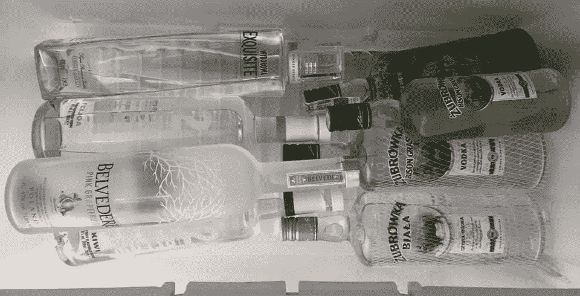

# 智能合同不是自动售货机，自我执行是一个误称

> 原文：<https://medium.com/coinmonks/smart-contracts-clarifying-some-misunderstandings-358e2961d96f?source=collection_archive---------2----------------------->

…或者:为什么伏特加不会自己喝，为什么你总是需要一个“友好的”教父…

让我们解决在智能合约的许多讨论中出现的两个常见误解。我怀疑这些误解已经使整个辩论脱轨，并造成了许多混乱……我在谈论与自动售货机和术语“自我实施”的比较。

**自动售货机**

许多技术著作将自动售货机视为智能合同的早期例子。“推理”有些模糊，但原则上是这样的:

## **智能合同就像自动售货机**

## **自动售货机是一份合同**

## **因此:智能合约就是合约**

问题是自动售货机不是合同。从法律角度来看，自动售货机是向全世界提供的。要约不是合同——它是一个初步阶段，如果/当它被接受时，可能会导致合同。这个提议是由卖主提出的，他使用这个机器来公开展示他的商品。无论谁选择其中一个选项(糖果？碳酸饮料？后者可以混合伏特加……)并插入所需的和。原则上，接受要约发生在选择和支付…

自动售货机使合同的形成和履行自动化。它还确保交易只能以一种特定的方式进行，并且，除了故意破坏或故障之外，还保证碳酸饮料只分配给那些提供付款的人。然而，声称自动售货机是合同是 100%不正确的。所以，如果出发点是错误的——那么整个后续分析，嗯，“没有说服力。”

使合同的形成和/或履行*自动化的“某物”非常有用，但是“它”不是合同。*

顺便说一句:关于自动售货机的判例法确认，合同的形成过程和合同的执行过程都可以自动化。缺少人类的直接参与不是问题。

**【自我执行】**

我怀疑“自我实施”的概念可能来源于技术术语“自我执行”。“自执行”指的是根据预定义的规则自动(即，不需要正在进行的人工输入/指令)改变其状态的计算机程序。从这个意义上来说，“自我执行”意味着代码的运行与外部环境无关，从而保证实现预先编程的结果。

不幸的是，在一些著作中，“自我实施”的意思类似于“表现”。例如，人们经常声称，区块链“而不是国家的任何附属物”确保了业绩。这种说法毫无意义。履行和强制执行是合同生命周期中两个不同的阶段。你不能把它们结合起来。履行与合同产生的义务有关，只能由合同双方“完成”。强制执行涉及对履行的保护。

让我们进一步研究强制执行的法律概念…毕竟，区块链寻求取代传统的法律强制执行机制，因此，对该术语的法律含义的一些最低限度的理解可能是有用的。

根据定义，合同是可执行的协议。强制是强制遵守义务的行为。在法律方面，强制执行与国家批准的在履行合同中保护各方经济利益相关联。

(注意:性能和性能保护是有区别的，强制执行只涉及后者！)

实际上，执行合同意味着去找法官(或仲裁人)寻求帮助:

“大人！这个没用的人拒绝[付款、送货、修理缺陷，不管这个人答应做什么]。”

当当事人行使其合同权利时，他们寻求获得向他们承诺的东西。然而，在实践中，法院很少强迫违约方实际履行义务，而是对不履行义务或有缺陷的履行义务所造成的损失判给损害赔偿金。这样做的目的是将受害方置于如果合同得到履行她/他本应处于的同样地位。

**重点是在大多数情况下:**

**强制执行=法院判给你$$$以补偿你因不履行或有缺陷的履行而造成的损失**

当然，双方可以同意不上法庭，将争议提交私人仲裁，也就是说(我稍微简化了一下)提交专门的法庭，在那里，一群非法官评估各方的主张，并以仲裁裁决的形式做出决定。问题在于(简而言之)，如果一方当事人拒绝实际遵循仲裁裁决的指示，就需要法院的协助来执行仲裁裁决。回到起点。这可能会变得相当混乱，尤其是在国际交易中，你需要一个专门的律师来解决这种混乱……(不要来找我，我只做实体合同法……但我的表弟 Motoko 可能会有空。)

重点是:当事情变糟时，你需要违约方所在辖区法院的协助…

如果我们想采取一种更广泛的方法来执行，一种不涉及法院或仲裁人的方法，让我们想想一群可疑的个人(想想:运动服+纹身)参与秘密交易的情况，比如说，非法蒸馏的酒精。如果在这种交易中出现任何问题，你不能向法官寻求帮助。“法官大人，Marco/Darek/Igor 未能交付[插入非法物质名称]，请提供帮助！”

你们会一起进监狱。(那会很有趣……)

在这种情况下，合同不是法律上可执行的，而是“私人可执行的”鉴于你交易的可疑性，你需要寻求法律之外的帮助。所以，你让你友好的当地黑手党老板派几个人去鼓励 Marco/Darek/Igor 送货(并劝阻他们不要报警)。(如果你不明白“私人执行”的意思，那就看看《教父》。所有三个部分。很快。)

## 要点是:强制执行总是需要第三方。

## **任何合同都不能强制执行。**

## **这就像说伏特加会自己喝。**

this is vodka. (my private collection)

相信我。伏特加本身从不喝酒。我喝了它。

这就引出了下一点。就像合同不能自我执行一样，它们也不能自我履行。合同由当事人履行。

如果有人说“智能合同”会做一些事情或“自我执行”，他们是在无意中承认“智能合同”不是合同。(他们兰博基尼的安全气囊不起作用……)

总之:合同的执行需要第三方，只有合同的当事人才能履行合同的义务。

顺便说一句:我不太明白为什么这么多区块链人问我智能合同是否合法。他们为什么在乎？智能合同应该是自我执行的，并且存在于法律之外(取决于你问的是谁)。所以:如果他们在区块链自我强制执行，谁在乎他们是否在法律上强制执行…

## 如果你不关心法律，你为什么要担心某件事是否合法？

此外，如果智能合同可以防止违约和/或保证履约——执行合同的需要就永远不会出现……那么为什么要担心呢……

完整的学术版，带花哨的脚注等，见:

 [## 智能合约:术语、技术限制和现实世界的复杂性

### 26 页发布时间:2017 年 9 月 19 日最后修改时间:2020 年 1 月 27 日撰写日期:2017 年 8 月 17 日如果人们相信流行的…

papers.ssrn.com](https://papers.ssrn.com/sol3/papers.cfm?abstract_id=3038406) 

***免责声明:本博客与我在 CUHK 法学院的教学职位无关。所有精彩和不精彩的观点都是我的。***

> 加入 Coinmonks [电报频道](https://t.me/coincodecap)和 [Youtube 频道](https://www.youtube.com/c/coinmonks/videos)了解加密交易和投资

## 另外，阅读

*   [Bookmap 点评](https://coincodecap.com/bookmap-review-2021-best-trading-software) | [美国 5 大最佳加密交易所](https://coincodecap.com/crypto-exchange-usa)
*   最佳加密[硬件钱包](/coinmonks/hardware-wallets-dfa1211730c6) | [Bitbns 评论](/coinmonks/bitbns-review-38256a07e161)
*   [新加坡十大最佳加密交易所](https://coincodecap.com/crypto-exchange-in-singapore) | [购买 AXS](https://coincodecap.com/buy-axs-token)
*   [红狗赌场评论](https://coincodecap.com/red-dog-casino-review) | [Swyftx 评论](https://coincodecap.com/swyftx-review) | [CoinGate 评论](https://coincodecap.com/coingate-review)
*   [投资印度的最佳密码](https://coincodecap.com/best-crypto-to-invest-in-india-in-2021)|[WazirX P2P](https://coincodecap.com/wazirx-p2p)|[Hi Dollar Review](https://coincodecap.com/hi-dollar-review)
*   [加拿大最佳加密交易机器人](https://coincodecap.com/5-best-crypto-trading-bots-in-canada) | [库币评论](https://coincodecap.com/kucoin-review)
*   [10 本关于加密的最佳书籍](https://coincodecap.com/best-crypto-books) | [英国 5 个最佳加密机器人](https://coincodecap.com/uk-trading-bots)
*   [德国最佳加密交易所](https://coincodecap.com/crypto-exchanges-in-germany) | [Arbitrum:第二层解决方案](https://coincodecap.com/arbitrum)
*   [比诺莫评论](https://coincodecap.com/binomo-review) | [斯多葛派 vs 3Commas vs TradeSanta](https://coincodecap.com/stoic-vs-3commas-vs-tradesanta)
*   【Capital.com】|[港加密借贷平台](https://coincodecap.com/crypto-lending-hong-kong)
*   [支持卡审核](https://coincodecap.com/uphold-card-review) | [信任钱包 vs 元掩码](https://coincodecap.com/trust-wallet-vs-metamask)
*   [赢取注册奖金——10 大最佳加密平台](https://coincodecap.com/earn-sign-up-bonus)