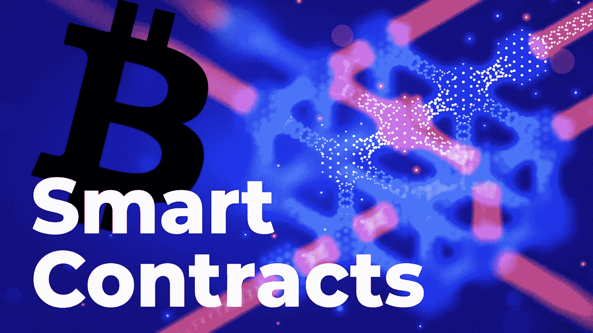

# 区块链上的智能合同解释|智能合同如何工作

> 原文：<https://medium.com/coinmonks/smart-contracts-on-the-blockchain-explained-how-smart-contracts-works-a617e1328bfc?source=collection_archive---------8----------------------->

智能合同类似于现实世界中使用的传统合同；但是，前者完全是数字化的，不像后者。因此，我们可以将智能合同定义为存储在区块链中的计算机程序，旨在以数字方式强制执行合同的履行或协商。

Smart Contracts On The Blockchain Explained | How Smart contracts Works

它们促进交易的执行，而不需要银行、经纪人或政府等第三方的调解。

什么是智能合约？

智能合同的主要功能类似于“多签名”账户，只要一定比例(或大多数)的人同意一组预先确定的条件，就可以在其中花费资金。一旦协议的需求得到满足，智能合同就可以自动执行。因此，智能合约可以帮助你以无冲突和透明的方式交换财产、股份、金钱或任何有价值的东西，同时避免中间人的服务。

**智能合约能做什么？**

人们使用智能合约将资产或货币转移到程序中。该程序执行该代码，并自动验证一个或多个条件，以确定是否应该将支架移动或归还给原始所有者。与此同时，分散的分类帐记录和复制文档，使其具有不变性和安全性。

在这里阅读更多。

> ***NFT，比特币，Web3.0，DeFi，以及针对初学者的加密货币***
> 
> *使用*[*CryptoWeb*](http://cryptoweb.wiki/)*免费的初学加密指南掌握 web3.0 世界的基础知识，在这里，我们深入了解了该领域中一些顶级的 NFT、加密和元宇宙项目，以便您在投资之前得到通知。*

加入 Coinmonks [电报频道](https://t.me/coincodecap)和 [Youtube 频道](https://www.youtube.com/c/coinmonks/videos)了解加密交易和投资

# 另外，阅读

*   [加密保证金交易交易所](/coinmonks/crypto-margin-trading-exchanges-428b1f7ad108) | [赚取比特币](/coinmonks/earn-bitcoin-6e8bd3c592d9)
*   [WazirX vs CoinDCX vs bit bns](/coinmonks/wazirx-vs-coindcx-vs-bitbns-149f4f19a2f1)|[block fi vs coin loan vs Nexo](/coinmonks/blockfi-vs-coinloan-vs-nexo-cb624635230d)
*   [BlockFi 信用卡](https://coincodecap.com/blockfi-credit-card) | [如何在币安购买比特币](https://coincodecap.com/buy-bitcoin-binance)
*   [火币交易机器人](https://coincodecap.com/huobi-trading-bot) | [如何购买 ADA](https://coincodecap.com/buy-ada-cardano) | [Geco？一次回顾](https://coincodecap.com/geco-one-review)
*   [加密副本交易平台](/coinmonks/top-10-crypto-copy-trading-platforms-for-beginners-d0c37c7d698c) | [五大 BlockFi 替代方案](https://coincodecap.com/blockfi-alternatives)