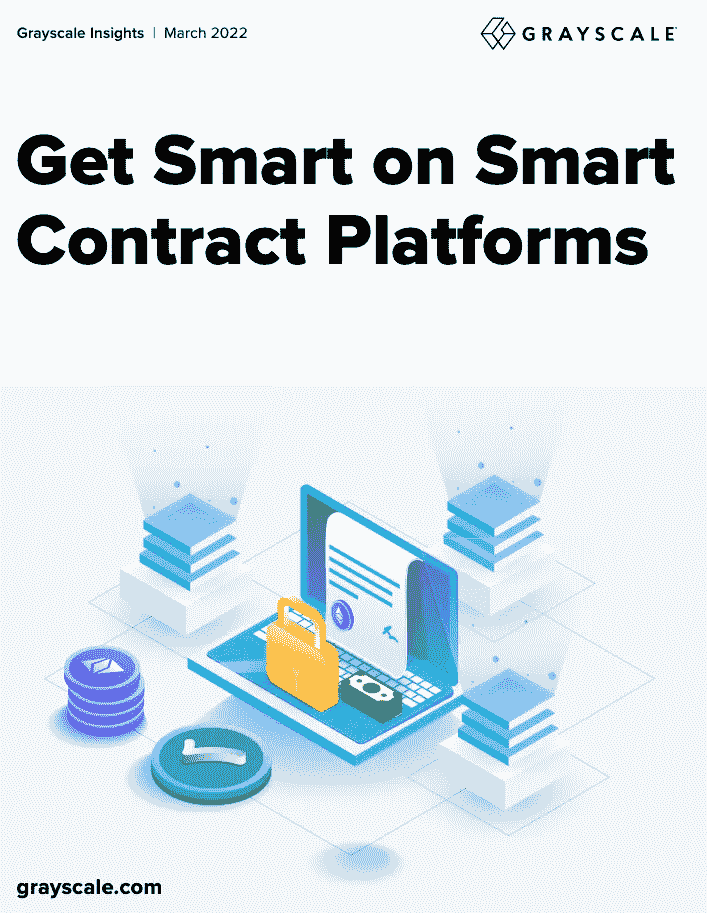
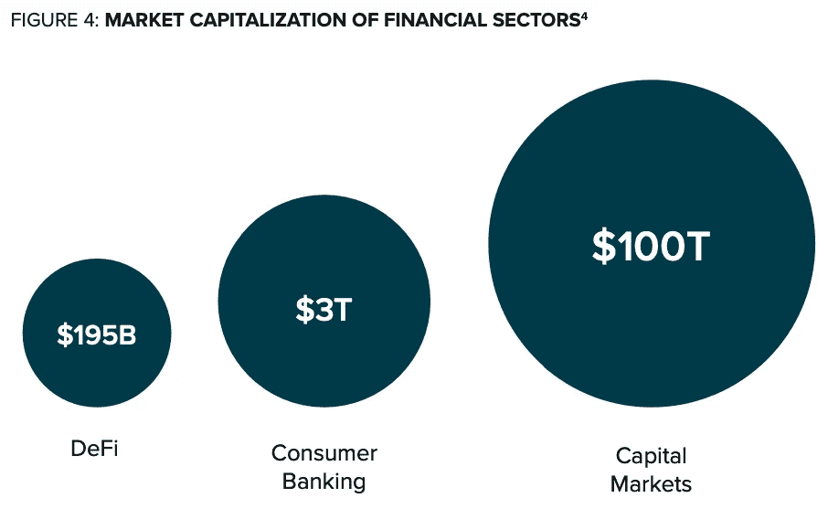

# 智能合同平台，汇总灰度报告

> 原文：<https://medium.com/coinmonks/smart-contracts-platform-grayscale-report-in-summary-db83c055063e?source=collection_archive---------54----------------------->

昨天，数字货币集团的子公司 Group 发表了一份长达 17 页的名为“智能合约平台”的报告。我将为你缩短这篇论文，所以你不需要读整篇论文。一句话，灰度坚持认为，人们应该认为每个链作为城市。

Grayscale report

他们比较了 SOL、AVAX、MATIC、XLM、ALGO、DOT、ADA 和 ETH。就我个人而言，我无法理解他们忽视 LUNA 和 FTM 的原因，也许报告的作者可能是一些过时的人员。

我是说 ALGO，XLM 和艾达，真的吗？我真想知道他是谁…

网络交易费是智能合约平台的收入，经常性收入对所有链的长期健康至关重要。老实说，这篇论文中有一些关键的观点，但这些观点已经是众所周知的隐喻了。“连锁就是城市。”

1.  以太坊是 NYC: ETH 交易费贵。但是以太坊有 500 个 Dapps，并在链上控制超过 1000 亿美元。即使网络很贵，开发人员和用户使用 ETH 安全也会感觉很舒服。
2.  多边形是纽约市的摩天大楼:L2 通过向上建造来降低交易费用。(但是作为密码学家，我们都知道当前多边形在技术上不是 L2 解。“L2 的侧链”这个概念现在我认为是一种迷因。)
3.  阿瓦伦奇是芝加哥:类似于纽约市的经济，但更小的网络和更便宜的交易。EVM 兼容性使 ETH 开发人员和用户的过渡更加容易。
4.  SOL is LA:专注于不同用例的更快网络。他们有不同于 ETH 的共识机制。溶胶是链，不需要 L2 解决方案的规模。

Source: Grayscale

# **迪菲景观**

传统金融领域存在巨大的 Defi 空间。

1.  外汇市场每天交易 6.6 吨美元**。2021 年 5 月，DEX 的历史最高月度成交量为 1 . 68 亿美元。**
2.  **2021 年，与游戏相关的 NFT 交易额为 45 亿美元。2021 年全球游戏收入为 1803 亿美元。Web3 游戏占现有游戏市场的 2%。**

# ****结论****

**区块链的潜在市场总量远远超出了智能合约平台的当前能力。他们认为，考虑到对传统金融的潜在影响，目前 2000 亿美元的 Defi 市场规模被严重低估。**

> **加入 Coinmonks [电报频道](https://t.me/coincodecap)和 [Youtube 频道](https://www.youtube.com/c/coinmonks/videos)了解加密交易和投资**

# **另外，阅读**

*   **[有哪些交易信号？](https://coincodecap.com/trading-signal) | [Bitstamp vs 比特币基地](https://coincodecap.com/bitstamp-coinbase) | [买索拉纳](https://coincodecap.com/buy-solana)**
*   **[ProfitFarmers 回顾](https://coincodecap.com/profitfarmers-review) | [如何使用 Cornix 交易机器人](https://coincodecap.com/cornix-trading-bot)**
*   **[十大最佳加密货币博客](https://coincodecap.com/best-cryptocurrency-blogs) | [YouHodler 评论](https://coincodecap.com/youhodler-review)**
*   **[my constant Review](https://coincodecap.com/myconstant-review)|[8 款最佳摇摆交易机器人](https://coincodecap.com/best-swing-trading-bots)**
*   **[MXC 交易所评论](/coinmonks/mxc-exchange-review-3af0ec1cba8c) | [Pionex vs 币安](https://coincodecap.com/pionex-vs-binance) | [Pionex 套利机器人](https://coincodecap.com/pionex-arbitrage-bot)**