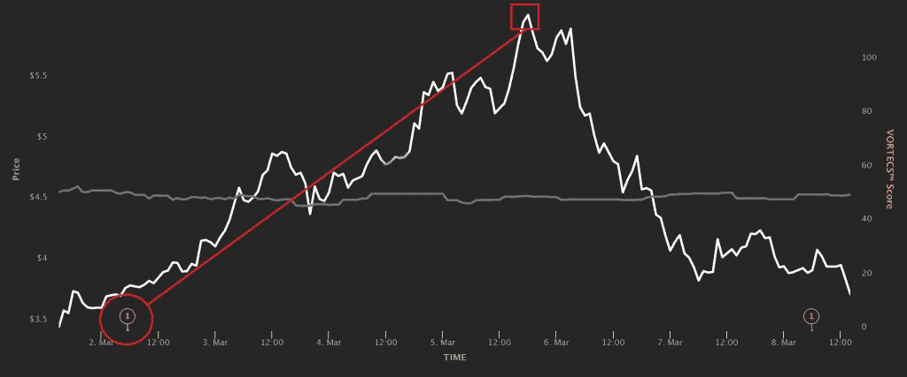

# 聪明的密码交易员在整个三月以谣言的价格三次购买突发新闻

> 原文：<https://medium.com/coinmonks/smart-crypto-traders-bought-breaking-news-three-times-for-the-price-of-a-rumour-throughout-march-df3c2e4d8a4?source=collection_archive---------52----------------------->

**Visit our website:-** [**https://bitcoinsupports.com/**](https://bitcoinsupports.com/)

在加密货币市场早期获得独家新闻通常需要购买大型集会的前排座位。

**俗话说，“买谣言，卖新闻。”**

作为一种数字原生资产类别，加密货币的价格明显受到通过互联网即时传播的市场新闻事件的影响。密切关注乐观的公告可以帮助加密交易员赚取巨额利润，但浏览加密新闻景观可能具有挑战性。两大障碍横亘在道路上:潜在相关信息的数量和总是第一个收到真正重要消息的挑战。广泛的研究表明，三种与密码相关的事件对数字资产价格的影响最持久:上市公告、赌注公告和大型合作伙伴关系。这种理解有助于交易者关注他们最感兴趣的发展。现在，密码爱好者如何确保他们是第一批了解潜在关键故事的人？有许多技术可供选择，从仔细选择一个人的 Twitter 警报到使用各种加密数据终端。

市场亲订户，有之易。他们可以访问 NewsQuakesTM，这是一种机器学习工具，可以持续监控成千上万的主要来源，并在几分钟内(如果不是几秒钟的话)立即通知 Markets Pro 社区新的内容。

三个场景说明了 Markets Pro 订户如何从 3 月份的 NewsQuakesTM 中获益。

**非国大:赌注方案的公布拉开了一场集会的序幕**

**Visit our website:-** [**https://bitcoinsupports.com/**](https://bitcoinsupports.com/)

标桩公告可能是重要的市场推动者，尤其是当某项特定资产的标桩计划在一个知名平台上推出且条款颇具吸引力时。ANC Protocol 在币安的引入是一个自然的选择，ANC 的年收益率高达 40%。

该公告以近乎即时的新闻发布，来源于币安的推特账户。消息传出时，代币交易价为 3.79 美元，并迅速上涨。18 小时后，ANC 的价格达到了 4.90 美元，然后飙升得更高，在 3 月 5 日突破了 6.00 美元的关口。

**SNX:祸不单行的上市公告**

**Visit our website:-** [**https://bitcoinsupports.com/**](https://bitcoinsupports.com/)

另一条不幸的推文将 Synthetix 网络令牌的价格推高了很多(SNX)。该公告是关于 SNX 在 Binance.US 上市的。有趣的是，Twitter 上有两条关于计划上市的公告，尽管第一条(3 月 8 日图表上的第一个 NewsQuakeTM 符号)据报道没有引起太多兴趣。然而，SNX 交易实际开盘的消息(图中的红圈)导致 SNX 价格在 23 小时内从 3.98 美元飙升至 4.77 美元——涨幅 19.8%。

**沙:巨大的合作成果丰硕**

**Visit our website:-** [**https://bitcoinsupports.com/**](https://bitcoinsupports.com/)

与上市和标桩新闻相比，合作公告在最值得关注的新闻中出现的频率略低。不过，偶尔也会有合作协议，其提价影响超过了大多数其他新闻事件。一般来说，每当你了解到一家非加密公司与一个加密项目合作，相关令牌的价格很可能会上涨。

银行业巨头汇丰银行无疑是大多数交易员都耳熟能详的名字。它在沙盒的帮助下进入元宇宙，预计会导致沙盒价值的大幅增加。事实上，沙子的价格在市场群体得到消息后约 30 分钟飙升，在不到 18 小时内从 2.85 美元飙升至 3.28 美元(涨幅 15%)。

**访问我们的网站:-**[**https://bitcoinsupports.com/**](https://bitcoinsupports.com/)

**免责声明:以上为作者观点，不应视为投资建议。读者应该自己做研究。**

> 加入 Coinmonks [电报频道](https://t.me/coincodecap)和 [Youtube 频道](https://www.youtube.com/c/coinmonks/videos)了解加密交易和投资

# 另外，阅读

*   创造并出售你的第一个 NFT | [密码交易机器人](https://coincodecap.com/best-crypto-trading-bots)
*   [如何在 CoinDCX 上购买柴犬(SHIB)币？](https://coincodecap.com/buy-shiba-coindcx)
*   [CBET 评论](https://coincodecap.com/cbet-casino-review) | [库科恩 vs 比特币基地](https://coincodecap.com/kucoin-vs-coinbase) | [拜比特 vs 比特币基地](https://coincodecap.com/bybit-vs-coinbase)
*   [折叠 App 回顾](https://coincodecap.com/fold-app-review) | [本地比特币回顾](/coinmonks/localbitcoins-review-6cc001c6ed56) | [Bybit vs 币安](https://coincodecap.com/bybit-binance-moonxbt)
*   [加密保证金交易交易所](/coinmonks/crypto-margin-trading-exchanges-428b1f7ad108) | [赚取比特币](/coinmonks/earn-bitcoin-6e8bd3c592d9) | [Mudrex 投资](https://coincodecap.com/mudrex-invest-review-the-best-way-to-invest-in-crypto)
*   [WazirX vs CoinDCX vs bit bns](/coinmonks/wazirx-vs-coindcx-vs-bitbns-149f4f19a2f1)|[block fi vs coin loan vs Nexo](/coinmonks/blockfi-vs-coinloan-vs-nexo-cb624635230d)