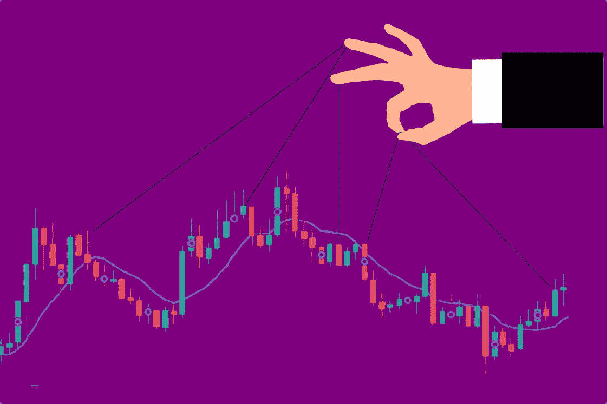

# 精明的投资者仍在建设和投资 Web3

> 原文：<https://medium.com/coinmonks/smart-money-is-still-building-and-investing-in-web3-868153fde9b7?source=collection_archive---------50----------------------->

随着加密红海中的几周过去，投资者看到替代硬币融化，BTC 保持在 30，000 美元的范围内。自上个月以来，恐惧和贪婪指数一直处于极度恐惧的水平，从 21 降至 12。现在真的是害怕的时候吗？

如果沃伦巴菲特正在配置资本，通常是在基本面显示良好买入机会的周期中。最近，伯克希尔·哈撒韦公司购买了超过 500 亿美元的股票。

去聪明钱在的地方

当普通投资者遭受投资组合融化之苦时，巴菲特等聪明的投资者正在部署资本，这也发生在加密领域:

*   在市场崩溃之际，A16z 加密基金最近筹集了[45 亿美元](https://www.forbes.com/sites/alexkonrad/2022/05/25/a16z-crypto-record-4th-fund-doubles-down-on-web3-amid-market-crash/?sh=79d768d434ff)；
*   StarkWare 在最近一轮 1 亿美元的融资后达到了[80 亿美元的估值](https://www.coindesk.com/business/2022/05/25/starkware-reaches-8b-valuation-following-latest-100m-funding-round/)；
*   Babel Finance 在融资 8000 万美元后达到了 2B 的估值。
*   NGC 风险投资公司为一个专注于网络 3 的基金筹集了 1 亿美元。

上个月，在加密风险投资公司的最近几轮融资中，市场上已有超过 48 亿美元的资本流入。

这是一个你应该时刻关注的市场动向:

(1)在 CoinDesk，定期查看[融资轮新闻](https://www.coindesk.com/tag/funding-round/)；

(2)在 Dove Metrics，向下滚动到[最近几轮融资](https://www.dovemetrics.com/)部分:你会看到一个详细的表格，上面有投资者、价值和资本流向的行业。

保持长远眼光，理性行事

在不确定时期，市场周期不利，你的头寸无利可图，投资的心理部分是最难处理的。看到你的仓位下降 10%、20%、50%是不容易的。

深呼吸，缩小视野，更清晰地了解营销的走向。在不到一年的时间里，市场从历史高点暴跌 50%以上，但仍有机构投资者大举投资于该领域，为 Web3 构建和投资扩展解决方案，并使其切实适用于传统金融。

在上一次熊市中，我们没有像今天这样直接的运动。这似乎是一个清晰的信号，表明 crypto 将继续存在。聪明的投资者会长期投资。是吗？

[*乔·罗伯特*](https://joerobert.com/) *现任罗伯特风险投资公司首席执行官，拥有超过 20 年的资产管理经验。自创业以来，乔已经为投资者和合伙人创造了可预见的两位数回报。Joe 已经投资了股权和代币的种子轮，以及比特币、以太坊和其他顶级加密货币的投资组合。*

*如果您是合格投资者，并想了解更多关于我们产品的信息，请联系我们。*