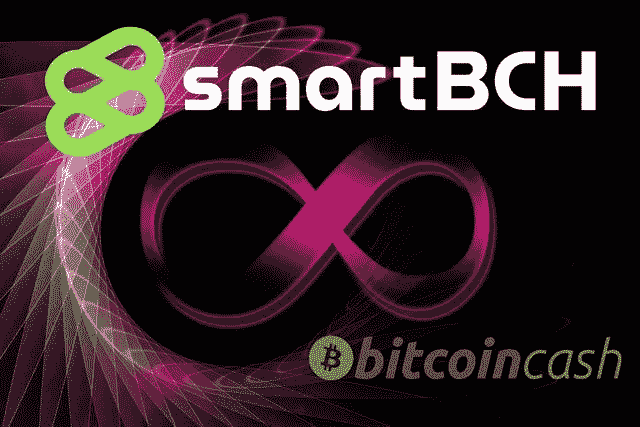
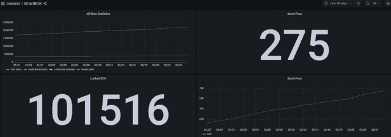
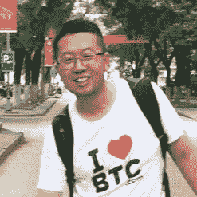
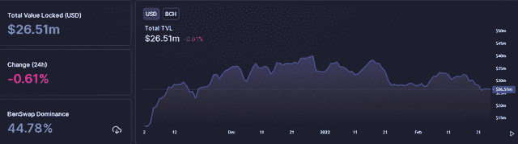
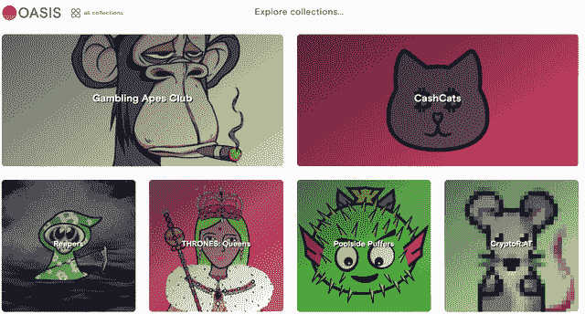
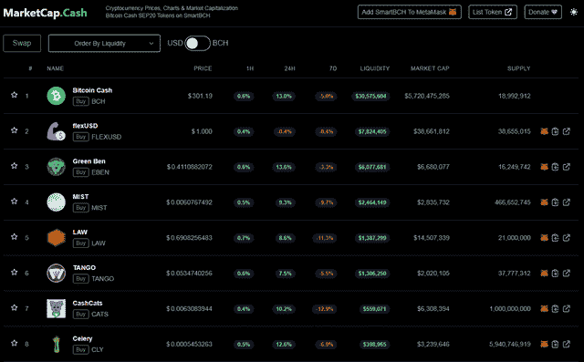

# SmartBCH:前六个月的分析

> 原文：<https://medium.com/coinmonks/smartbch-an-analysis-of-the-first-six-months-leofinance-bd9616fa40a8?source=collection_archive---------49----------------------->

Photo: by geralt on [Pixabay](https://pixabay.com/tr/illustrations/karakter-sonsuzluk-sembol-simge-4852542/) (modified)

SmartBCH 不像其他智能合约创业网络那样得到风投的支持(至少现在还没有)。

尽管如此，它已经发展成为一个具有竞争力的以太坊替代方案，一个高效且经济的 EVM 兼容智能合约网络。

有限的宣传，但广泛的发展，它已经成功地实现了 100，000BCH 锁定在网络的协议，并保持了数千名用户的忠实粉丝群。

SmartBCH 竞争力适用于其利用的高吞吐量区块链，而 consensus 则基于利益相关者和 BCH 矿商的混合 PoS & PoW 系统。

# SmartBCH 的经济模型

[Grafana](https://defillama.com/chain/smartBCH)

SmartBCH 是为比特币现金带来附加价值的工具。与同类智能合约平台(Polygon、Solana、Avalance 等)的主要区别。)的一个问题是 smartBCH 不提供本机令牌。

smartBCH 的创始人没有继续创造新的加密货币的逻辑或动机，也没有继续代币预售或溢价。

SmartBCH 使用比特币现金代替。

当然，该项目得到了密码社区一些知名人士的支持，其中一位是吴(的联合创始人，Bitdeer 和 Matrixport 的创始人)。

smartBCH 的首席开发人员是[王魁](https://twitter.com/wangkui0508)，而该网络的开发可以追溯到 2018 年。

[Source](https://twitter.com/wangkui0508)

最初，该项目的别名是“Moeing Chain”，在 2021 年 5 月发布之前，它被标记为 SmartBCH(或智能比特币现金)。

如今，BCH 和 smartBCH 之间存在多座桥梁，但主要开发项目 [SHA-Gate](https://docs.smartbch.org/smartbch/sha-gate) 将于今年(2022 年)发布。SHA-Gate 是 smartBCH、以太坊和其他 EVM 兼容网络之间的分散式网桥。

SHA-Gate 将在 2022 年 5 月[比特币现金升级](https://bch.info/upgrade)后启用，其中包括比特币现金智能合约功能的改进:

*   本土自省
*   更大的脚本整数

SmartBCH 使用比特币现金作为交易的燃料，并收取一定比例的费用。

直到今天，在 smartBCH 激活的几个月里，已经刻录了 275BCH(发送到一个经过验证的刻录地址)。虽然目前烧的费用不多，但也许随着将来 smartBCH 的广泛使用，它将达到一个相当大的规模。

按照 BCH 天然气价格计算，SmartBCH 交易费为 1.05 gwei，目前为每笔交易 0.02 美元。根据合同规定的天然气需求，在极少数情况下，费用最高可达 0.10 美元。

# smartBCH 开发的细分

到目前为止，SmartBCH 在 Defi 和 NFT 开发方面表现出色，并利用有限的资源和志愿者捐款与风投支持的网络竞争数十亿美元(Polygon、WAX、Solana、Fantom 等)。).

# 桥梁:

比特币现金区块链和 smartBCH 侧链之间的主要桥梁是:

*   [Coinflex](https://coinflex.com/) (CEX，需要注册，没有 KYC 高达 10，000 美元)
*   [错换桥](https://app.mistswap.fi/bridge) (DEX 操作桥)
*   [啤酒花。现金](https://hop.cash/)(分散桥)

用户可以使用这些服务将 BCH 转入和转出 smartBCH。

# 定义:

[DefiLlama](https://defillama.com/chain/smartBCH)

到目前为止，已有七个 DeFi 平台在 smartBCH 上运行，提供分散的融资选项，如产量农业和赌注。

*   [误交换](https://app.mistswap.fi/swap)
*   [BenSwap](https://benswap.cash/)
*   [TangoSwap](https://tangoswap.cash/swap)
*   [MuesliSwap](https://cowswap.cash/) (更名为 CowSwap)
*   [热带金融](https://app.tropical.finance/)
*   [1BCH.com](https://1bch.com/)
*   [SmartDEXBCH](https://smartdex.cash/#/swap)

# NFTs:

绿洲是 smartBCH 上唯一的 NFT 市场。这是一个 Web3 交换，与 Metamask 连接，并提供类似于 OpenSea 的选项。

2022 年 1 月，OASIS 的总交易量达到了 1000BCH 的里程碑。

许多 NFT 收藏在造币阶段几天甚至几分钟内就卖完了数千件 NFT，赌博类人猿俱乐部收藏就是如此。售出数千件 NFT 的部分系列包括:

*   小混混:造币厂 100 期 BCH ( [阅读更多](https://read.cash/@Pantera/lawpunks-nft-sold-for-record-33-bch-smartbch-volumes-spike-dfbb8256))
*   池畔河豚:薄荷相位 7.35 BCH ( [阅读更多](https://read.cash/@Pantera/poolside-puffers-a-smartbch-nft-art-project-with-a-good-purpose-e8eacb19))
*   现金猫:500 BCH
*   《权力与皇后》:300 BCH ( [阅读更多](https://read.cash/@Pantera/game-of-thrones-queens-nfts-on-smartbch-dc592178))
*   收割者:500 BCH ( [阅读更多](https://read.cash/@Pantera/reapers-nfts-sold-out-for-500bch-185k-rarity-list-437d8158))
*   赌猿俱乐部:5 分钟 400 BCH！([阅读更多](https://read.cash/@Pantera/new-smartbch-record-gambling-apes-nfts-sold-out-in-5-minutes-rarity-list-792c3d18))
*   潘达兰德:公元前 300 年
*   Pixel Guy 俱乐部:150BCH

smartBCH 的粉丝群正在增加，今天已经有数百名收藏者，大多数收藏者在 OASIS 上交易 NFT 获利。

对于 NFT 的交易者来说，smartBCH 是相当有利可图的，我们经常看到罕见的 NFT 的交易价格比造币阶段的价格高出数百倍，而在大多数 NFT 收藏中，普通 NFT 的底价高于造币价格。

# 区块链游戏

目前，两款区块链游戏正在开发中，很快将上线供 smartBCH 游戏社区欣赏:

*   [潘达兰德](https://pandaland.cash/)
*   [Pixs RPG](https://pitepi.com/)

这两款游戏都是高质量的区块链游戏，提供了“玩即赚”的功能，并带有 NFTs 和代币奖励。
这两款游戏都备受期待，具有娱乐性和边玩边赚的特点，能够吸引部分区块链游戏迷的广泛采用。

# 代币(SEP20)

SmartBCH 拥有 80 个令牌(在撰写本文时)。

MarketCap。Cash 是一个索引器，以类似于 Coinmarketcap 的方式提供 smartBCH (SEP20)令牌列表，并提供使用 SmartSwap 直接购买令牌的选项。

一些代币是在多个区块链中操作的一些流行代币，例如 FLEX Coin 和 GoCrypto。

SmartBCH 还拥有三种稳定的硬币:

FlexUSD 是由 CoinFLEX 交易所创建和运营的稳定硬币，在该交易所有相当大的市值和交易量。

# 最后

虽然 smartBCH 没有像其他具有类似(或更少)能力和效率的网络那样获得数十亿美元的资金，但它仍然设法吸引了成千上万的用户，并不间断地运营。

由于新的 smartBCH 数据块的阻塞时间平均为 6 秒，因此验证事务需要几秒钟。

用户可以获得空投、赠品和参与 smartBCH 项目的多种机会。许多项目已经在他们的团队中为不同的职位雇佣了 smartBCH 的用户。

当然，smartBCH 对于那些想要创建具有一定用途的 Web3 项目和令牌的开发者来说是最好的平台之一，而以太坊因为费用高昂无法协助他们。

在 smartBCH 中，费用是微不足道的，所以用户不会考虑它们。

目前，OASIS 还没有自动创建 NFT 的过程，但这是以后的一个预期发展。一些开发人员和艺术家可以为感兴趣的人提供他们的技能和服务。

当 NFTs 带来一个独特的概念和一个次要的用例(赌注、游戏等等)时，他们一定会成功。

Writing on: ● [ReadCash](https://read.cash/@Pantera) ● [NoiseCash](https://noise.cash/u/Pantera99) ● [Medium](/@panterabch) ● [Hive](https://hive.blog/@pantera1) ● [Twitter](https://twitter.com/Panterabch) ● [Reddit](https://www.reddit.com/user/coinflip1211) ● [email](http://pantera9999@protonmail.com/)

> 版权声明:
> 本内容中发布的所有材料均用于娱乐和教育目的，并符合合理使用准则。无意侵犯版权。如果你是或代表本文所用图片的版权所有者，并且对所述材料的使用有问题，请[通知我](http://pantera9999@protonmail.com/)。

***如果你喜欢这些内容，别忘了订阅/点赞！***

*原载于 2022 年 2 月 25 日*[*https://Leo finance . io*](https://leofinance.io/@pantera1/smartbch-an-analysis-of-the-first-six-months)*。*

