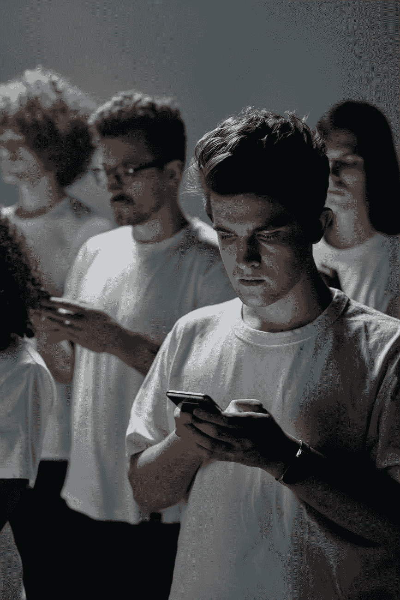

# 智能手机:是什么促使人们放弃它？

> 原文：<https://medium.com/coinmonks/smartphones-what-prompted-people-to-give-it-up-692b9b2087dd?source=collection_archive---------23----------------------->

People are looking at their smartphones without noticing what's happening around them

在一个我们许多人都坚持使用智能手机的世界里，Dulce Cowling 是一个不寻常的例子，她放弃了她的智能手机。

这位 36 岁的女性在去年年底发现，扔掉手机会改善她的心理健康。所以，她告诉她的家人和朋友，她将在圣诞假期使用一部旧的诺基亚手机，这部手机只能打电话和接收短信。

考林回忆说，导致她做出这个决定的关键时刻之一，是和她六岁和三岁的两个儿子在公园里呆了一天，她说:“我和孩子们在公园里用手机，我看着人们，每个单亲家长都有多达 20 个人在看他的手机。”

她补充道:“我心想:什么时候发生的？每个人都怀念自己的真实生活。我不认为你会在临终前说你必须花更多的时间在 Twitter 上或在线阅读文章，”她说。

考林是总部位于伦敦的广告公司 Hill Yeh 的创意总监，她补充说，在涉及 Covid 的关闭程序中，她萌生了抛弃智能手机的想法。

她补充道:“我想了想我有多少时间打电话，还能做些什么。不断接触许多服务会产生许多干扰，这对大脑处理来说是一种压力，”他说。

考林计划利用离开智能手机获得的时间多读书，多睡觉。

如今，英国约有 90%的人拥有智能手机，这一数字在发达国家也普遍存在。我们坚持使用这些设备，最近的一项研究发现，平均每个人每天花 4.8 个小时在智能手机上。

亚历克斯·达尼丁(Alex Dunedin)在两年前扔掉了他的智能手机。“从文化上来说，我们已经对这些设备上瘾了，”教育研究员兼技术专家说道。“它们会降低感知速度，阻碍生产力，”他补充道。

达尼丁先生在苏格兰生活和工作，他说他的决定背后的另一个原因是环境问题。“我们浪费了大量的能源，产生了大量的二氧化碳排放，”他指出。

他坚持认为，自从停止使用智能手机以来，他变得更快乐、更有效率。而达尼丁连一部老式手机都没有，甚至连座机都没有。而且只能通过电子邮件联系他，通过他家里的电脑。

“这改善了我的生活，”他说。他补充说:“我的思想摆脱了与一台机器的持续认知接触，我需要用能量和金钱来养活它。我认为技术的风险在于它们会掏空我们的生活，”他说。

而来自伯明翰的 53 岁教师兼作家林恩·福克斯则搬了相反的方向。在中断六年后，我于去年 8 月再次开始使用智能手机。

她表示，由于不得不处理餐馆里的二维码和所谓的 COVID 护照，以及方便与居住在巴黎的一个女儿沟通，她不得不不勉强重新购买一部智能手机。

但她表示，如果可以的话，她打算再次放弃，“在疫情结束后，当埃拉(她的大女儿)从国外回来时，我可能会再次尝试放弃。感觉像是上瘾了。

当 Voice 在 2016 年首次放弃智能手机时，是为了帮助鼓励她的女儿减少花在设备上的时间。

她说:“他们粘在手机上。我以为唯一的办法就是扔掉我的手机。这有很大的不同，”他说。

“例如，我们去餐馆，你没看到我拿着手机，”她补充道。

没有智能手机“减轻了我大脑的压力，”她说，“当我走出家门时，我不觉得我必须立即回答问题或回复信息。”

然而，尽管有些人担心他们在手机上花了多少时间，但数百万人认为智能手机是天赐之物。

英国沃达丰移动网络的一位发言人表示:“与以往任何时候相比，获得医疗保健、教育和社会服务变得更加容易，智能手机是主要的生命线。”。

他补充说:“我们还创建资源来帮助人们最大限度地利用他们使用的技术，并在他们上网时保护他们的安全——这非常重要。”

然而，心理治疗师和《手机成瘾指南》的作者希尔达·伯克说，密集使用设备与人际关系、睡眠质量、放松能力和注意力水平之间有着密切的联系。

“许多人通过他们的设备有固定的请求，很多这样的请求会造成一种错误的感觉，即他们需要迅速得到回应，”她补充道。

她说:“他们觉得无法对此设限，因此觉得有必要在睡前和早上醒来后立即查看电子邮件和信息。”

如果扔掉你的智能手机看起来很棘手，但你担心花太多时间使用它，你可以采取其他措施来减少使用它。

虽然乍一看似乎不合逻辑，但越来越多的应用正在出现，以限制智能手机的广泛使用。

例如，Freedom 应用程序允许您暂时阻止应用程序和网站，以便更加专注。离网应用程序可以让你在特定的时间停止使用手机。

伯克说，让更多的人了解他们花在智能手机上的时间会有所帮助。“开始意识到你每天花在手机上的时间可能是一个警钟，也是改变的催化剂，”她补充道。

它还建议享受手机关机或留在家里的短暂时间，并增加等待时间，直到你逐步重新检查它。

最后，伯克建议，如果你有更多的时间，选择一个图像或单词来代表你会做什么，放在手机屏幕上。

“考虑到我们大多数人每天查看他的智能手机 55 次，有些人可能会查看大约 100 次，这是一个很好的视觉提醒，告诉我们如何以更有价值的方式度过宝贵的时间，”她说。

> *加入 Coinmonks* [*电报频道*](https://t.me/coincodecap) *和* [*Youtube 频道*](https://www.youtube.com/c/coinmonks/videos) *了解加密交易和投资*

# 另外，阅读

*   [有哪些交易信号？](https://coincodecap.com/trading-signal) | [Bitstamp vs 比特币基地](https://coincodecap.com/bitstamp-coinbase) | [买索拉纳](https://coincodecap.com/buy-solana)
*   [ProfitFarmers 点评](https://coincodecap.com/profitfarmers-review) | [如何使用 Cornix 交易机器人](https://coincodecap.com/cornix-trading-bot)
*   [十大最佳加密货币博客](https://coincodecap.com/best-cryptocurrency-blogs) | [YouHodler 评论](https://coincodecap.com/youhodler-review)
*   [my constant Review](https://coincodecap.com/myconstant-review)|[8 款最佳摇摆交易机器人](https://coincodecap.com/best-swing-trading-bots)
*   [MXC 交易所评论](/coinmonks/mxc-exchange-review-3af0ec1cba8c) | [Pionex vs 币安](https://coincodecap.com/pionex-vs-binance) | [Pionex 套利机器人](https://coincodecap.com/pionex-arbitrage-bot)
*   [我的密码交易经验](/coinmonks/my-experience-with-crypto-copy-trading-d6feb2ce3ac5) | [比特币基地评论](/coinmonks/coinbase-review-6ef4e0f56064)
*   [CoinFLEX 评论](https://coincodecap.com/coinflex-review) | [AEX 交易所评论](https://coincodecap.com/aex-exchange-review) | [UPbit 评论](https://coincodecap.com/upbit-review)
*   [AscendEx 保证金交易](https://coincodecap.com/ascendex-margin-trading) | [Bitfinex 赌注](https://coincodecap.com/bitfinex-staking) | [bitFlyer 评论](https://coincodecap.com/bitflyer-review)