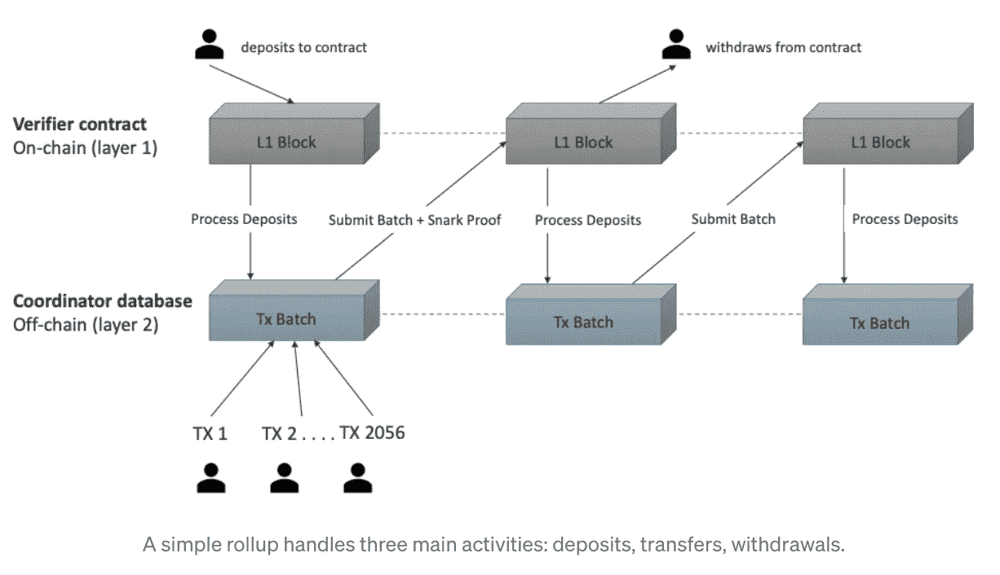

# SNARKs vs STARKs:深入探究第二层汇总

> 原文：<https://medium.com/coinmonks/snarks-vs-starks-a-deep-dive-behind-layer-2-rollups-d9b3ca6e1386?source=collection_archive---------4----------------------->

Photo: [Moralis](https://moralis.io/), all right reserved.

臭名昭著的区块链可伸缩性问题可能会被零知识证明(zkp)永久解决，这在我最近的出版物中有详细描述。它们可以卸载主要的第 1 层网络，并提高事务吞吐量。使用 ZKP 加密，一些企业已经在开发可扩展性解决方案。你可能熟悉 *zkSync* 、 *Loopring* ，或者*Starknet*；他们的团队最近公布了他们的里程碑，引发了关于可伸缩性的热烈讨论。

## **零知识汇总提醒**

Photo: [David Becker](https://unsplash.com/@beckerworks), all right reserved.

零知识汇总(ZK-汇总)将许多离线执行的第二层事务捆绑在一起，作为一个事务提交到以太坊，同时生成一个加密证明。与乐观汇总不同，乐观汇总假设事务在被证明之前是有效的，ZK 汇总使用这些有效性证明来立即证明事务是否有效。第二层上的所有传输的状态由 ZK-汇总智能合同维护，并且该状态只能用有效性证明来改变。这意味着 ZK 汇总只需要有效性证据，而不是整个交易数据。因为在 ZK 汇总中提供的数据较少，所以验证块的速度更快且成本更低。使用 ZK 累计，将资金从第 2 层移动到第 1 层时没有延迟，因为 ZK 累计合同接受的有效性证明已经验证了资金。

## **斯塔克斯 vs 斯纳克斯**

第一层提交的密码证明可以是 SNARK(**S**uccinct**N**on-interactive**Ar**gument of**K**knowledge)或 STARK(**S**calable**T**transparent**Ar**gument of**K**knowledge)的形式。ZK-斯纳克之所以如此，是因为它们具有以下品质:

- **S** uccinct:证明很容易被证实，而且远远小于它所代表的数据。

-***N***on-interactive:证明者和验证者之间没有来回的通信，因为他们之间只发送一组数据。

-

**- ***K*** 知识:基于 SNARK 的证明不能在访问底层信息的情况下创建。**

**史塔克名字中呈现的 ***T*** 代表*透明*。它取代了*非交互*属性。**

> **与 SNARKs 不同，STARKs 不需要**可信设置**。**

*****S*** 的含义从*简洁*变为*可扩展，*表示 STARKs 甚至可以比 SNARKs 更具可扩展性。**

****

**Photo: [Altoros](https://www.altoros.com/blog/zero-knowledge-proof-improving-privacy-for-a-blockchain/), all right reserved.**

## ****备注:可信设置的重要性****

****

**Photo: [Cytonn Photography](https://unsplash.com/@cytonn_photography), all right reserved.**

> **ZK-斯纳克斯使用椭圆曲线加密技术(ECC)，这是一种利用[椭圆曲线属性](https://fangpenlin.com/posts/2019/10/07/elliptic-curve-cryptography-explained/)生成安全密钥的加密技术。**

****

**Photo: [Avinetworks](https://avinetworks.com/glossary/elliptic-curve-cryptography/), all right reserved.**

**创建私人交易所需的凭证和验证这些凭证所需的密钥的初始生成事件称为可信设置。当最初创建这样的密钥时，在验证密钥和携带私人交易的密钥之间分配一个秘密参数。**

**假设在可信设置事件期间用于构造这些密钥的秘密没有被泄露。在这种情况下，它们可能被用来通过虚假验证制造交易，允许持有者做一些事情，如凭空产生新的令牌，并在交易中使用它们。但是，当然，由于 ZK-斯纳克法的隐私特性，没有办法证实凭空制造的代币确实存在。话虽如此，开发人员应该只在开始时使用一次可信设置。结果，基于 SNARK 的网络的用户必须相信可信设置已经被正确执行，这意味着与可信设置密钥相关联的秘密已经被破坏，并且不再被参加仪式的人所拥有。对环境的依赖是 SNARK 批评家们意见不一的主要原因之一。**

****

**Photo: [fcats-blockchain-incubator](/fcats-blockchain-incubator/how-zk-rollups-work-8ac4d7155b0e), all right reserved.**

## **ZK-斯纳克公司有什么优势？**

## ****1。** **高吞吐量****

**通过减少以太坊基础层的处理，ZK-斯纳克增加了吞吐量。ZK-斯纳克验证的交易数据通常大于实际的斯纳克证明。因此，潜在的区块链不那么拥挤，然后，更快的交易和更低的天然气成本成为可能。**

## ****2。** **小样张尺寸****

**由于 SNARK 样张的大小适中，所以在主链上验证起来很简单。在以太坊上，这意味着降低了离线交易验证的气体成本，从而降低了用户的累计成本。**

## ****3。**安全**

**ZK-斯纳克采用的尖端加密安全程序是 ZK 汇总被认为比其他扩展项目更安全的主要原因。计算上合理的 ZK-斯纳克证据使得误导验证者和从事恶意行为具有挑战性。**

## **ZK-斯纳克有什么缺点？**

## ****1。** **可信设置问题****

**为了建立 ZK-斯纳克协议，必须创建公共参数，它们允许证明者和验证者之间的私有通信。如果恶意参与者知道公共参数，他们可能会产生错误的有效性证明。一些项目试图通过使用涉及不同个体的多方计算(MPC)来生成公共参数，从而解决这个问题。然而，这种策略需要用户对各方的诚实有信心。鉴于区块链旨在消除对权威信任的需求，这是一个巨大的挑战。**

## ****2。暴露在量子计算威胁下****

**在其核心，ZK-斯纳克依赖椭圆曲线的安全性，以提供有效性证明。然而，在密码学中使用椭圆曲线是基于这样的假设，即不可能计算随机椭圆曲线元素相对于公共已知基点的离散对数。尽管椭圆曲线加密技术非常安全，但是量子计算的进步可能会破坏它的安全架构。**

## **STARKs:零知识证明的另一个层次**

**与 SNARKs 不同，STARKs 的核心机制是基于哈希函数的。使用哈希函数可以立即提供各种优势，比如量子抗性，或者不易受到攻击。此外，在网络中开始使用 STARKs 不需要可信的设置。**

**由于这种细微差别，史塔克家族更加安全，这消除了最初合作的危险。由于研究人员认为量子计算机可能会在未来对 SNARK 安全构成威胁，它可能会变得很重要。虽然斯塔克斯的生产速度更快，但是他们需要更多的空间和时间来检查。然而，对于大批量交易，摊销计算成本仍然较低。因此，它们允许我们更有效地扩展。**

****

**Photo: *Ethworks; image courtesy of Alex Gluchowski,* all right reserved.**

## ****ZK-斯塔克斯的优势是什么？****

## ****1。** **不需要可靠的设置****

**ZK-斯塔克斯依赖于开放的随机性，不需要一个可信的设置来工作。结果，减少了对用户部分的信任假设，并且增加了基于 STARK 的协议安全性。**

## ****2。** **可扩展特性****

**与 SNARKs 相比，STARKs 可以更快地计算和验证。然而，即使底层计算的复杂性呈指数级增长，ZK-斯塔克斯仍然保持了较低的证明和验证时间。**

## ****3。** **最大吞吐量****

**通过提供安全和可验证的离线计算，STARKs 和 SNARKs 一样，可以扩展区块链。**

## ****4。** **增强的安全保证****

**ZK-斯塔克斯采用了抗冲突散列，而不是 ZK-斯纳克斯使用的椭圆曲线加密技术。这被认为比 SNARKs 中使用的椭圆曲线更安全，因为它不受量子计算攻击的影响。**

## **ZK-斯塔克斯的缺点是什么？**

## ****1。** **较大的打样尺寸****

**虽然 STARKs 提供了比基于 SNARK 的证明更快的证明，但缺点是这些证明更庞大。因此，在以太坊上验证 STARK 证明需要更长的时间和更高的成本，因为计算更大的证明需要更高的 gas 成本。**

## ****2。** **减少收养****

**由于 SNARKs 是零知识技术在区块链的第一次使用，他们比 STARKs 拥有更大的市场份额。基于 SNARK 的 ZK 校样的开发环境和工具更大，SNARK 用于大多数 ZK 汇总。另一方面，ZK-斯塔克斯的认可度较低，尽管他们有以太坊基金会这样的知名支持者。因此，开发人员在使用 STARKs 创建 ZK 项目时可能会遇到较少的帮助和工具。**

****

**Photo: [Hackernoon](https://hackernoon.com/zk-rollups-3-cryptocurrencies-to-explode-in-2022-and-2023), all right reserved.**

## ****参考文献****

**⁃ ***知道 ZK-snarks vs ZK-starks****-**2022 年 3 月 23 日-by smita . Verma-([https://www . block chain-Council . org/区块链/ZK-SNARKs-vs-ZK-STARKs/](https://www.blockchain-council.org/blockchain/zk-snarks-vs-zk-starks/) )***

***⁃***snarks vs starks——理解差异——***2021 年 11 月 20 日——作者高拉夫(coincodecap)-([https://coincodecap.com/snarks-vs-starks-difference](https://coincodecap.com/snarks-vs-starks-difference))***

***⁃ ***斯塔克斯 vs 斯纳克斯 vs 递归斯纳克斯****-**2022 年 5 月 27 日-由炼金术-([https://www.alchemy.com/overviews/snarks-vs-starks](https://www.alchemy.com/overviews/snarks-vs-starks))****

****⁃ ***什么是 ZK-SNARKs？****-**Zcash-([https://z.cash/technology/zksnarks/](https://z.cash/technology/zksnarks/))*****

*****⁃ ***零知识证明:斯塔克斯 vs 斯纳克斯？****-**2021 年 5 月 18 日——作者马提森·阿舍、库根·布伦南-([https://consensys . net/blog/区块链-explained/zero-knowledge-proofs-starks-vs-snarks/](https://consensys.net/blog/blockchain-explained/zero-knowledge-proofs-starks-vs-snarks/))******

*****⁃***ZK-stark 是什么？****-*-**-*-*-**由斯塔克瓦尔-([-](https://starkware.co/stark/))*****

> ****加入 Coinmonks [电报频道](https://t.me/coincodecap)和 [Youtube 频道](https://www.youtube.com/c/coinmonks/videos)了解加密交易和投资****

# ****另外，阅读****

*   ****[分散交易所](https://coincodecap.com/what-are-decentralized-exchanges) | [比特恩斯 FIP](https://coincodecap.com/bitbns-fip) | [Pionex 评论](https://coincodecap.com/pionex-review-exchange-with-crypto-trading-bot)****
*   ****[用信用卡购买密码的 10 个最佳地点](https://coincodecap.com/buy-crypto-with-credit-card)****
*   ****[最好的卡达诺钱包](https://coincodecap.com/best-cardano-wallets) | [Bingbon 副本交易](https://coincodecap.com/bingbon-copy-trading)****
*   ****[如何给 MetaMask 钱包添加 Arbitrum？](https://coincodecap.com/how-to-add-arbitrum-to-metamask-wallet)****
*   ****[KuCoin vs 北海巨妖 vs BitYard](https://coincodecap.com/kucoin-vs-kraken-vs-bityard)****
*   ****[加密交易的最佳 VPN](https://coincodecap.com/best-vpns-for-crypto-trading)****