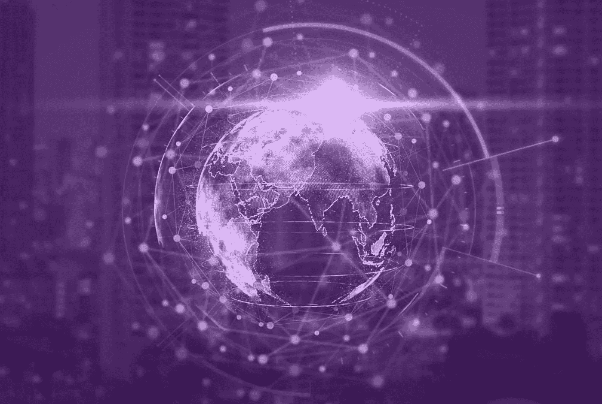

# 宏观、市场和加密的片段

> 原文：<https://medium.com/coinmonks/snippets-of-macro-markets-crypto-ac74f19ab095?source=collection_archive---------83----------------------->

Alessandro Gherzi 每周评论第 1 期

我们想用一句古老的格言作为我们第一次出行的开场白，这句格言已经并将继续为投资者服务，那就是“永远不要与美联储对抗”。推动市场的最主要因素是美联储，其余的都是白噪音，美联储一打响指，白噪音就消失了。随着这一问题的解决，不出所料，是美联储(或者更好的说法是美联储主席)在上周中期让市场朝着正确的方向发展。鲍威尔主席安抚紧张的人群(就在他拿起麦克风之前，市场明显下跌)，他不会拖我们后腿。由于确信我们可以稳稳地站在地毯上，市场出现了反弹，乐观情绪延续到了本周。

虽然大多数人希望美联储度过平静的一周，但我们有太多的地区美联储主席占据了中心舞台。总而言之，尽管鹰派中的鹰派布拉德试图通过评论 50 个基点的加息将根除所有邪恶(理解为通货膨胀)来阻止复苏的货运列车，但几乎没有造成什么损害。市场对此不屑一顾，就像一周前鲍威尔提到的 2022 年 7 次加息一样……也许这一切都是注定的，这次上涨不仅仅是一次毫无理由的事件，正如我们自去年年底以来经常看到的那样。

让我们来处理房间里的大象，所以美联储移动市场，什么，至少现在移动美联储？通货膨胀。上周一，鲍威尔主席在强调“通胀率太高”后改变了他对加息的语气，并从“稳步”转向“迅速”。除了让分析师们为“迅速”一词的解释而手忙脚乱之外，它也促使高盛(Goldman Sachs)等更知名的人士提高了至少在 5 月份的下一次美联储会议上加息 50 个基点的预期。

或许没那么快，尽管美联储承认，东欧最近的地缘政治事件是一个“游戏规则改变者”，将一年多的通胀称为“短暂的”是大错特错，但他们搞砸了吗？工资增长似乎在一段时间内首次放缓，消费者信心下降，库存增加，或许最重要的是，消费者对通胀的预期保持在一年后的 5.4%，长期为 3%。预期在经济中得到锚定，因此，善意的解读对于遏制鹰派至关重要。

为什么这些都很重要？根据经验，鹰派美联储利空股票和密码，鸽派美联储利好股票和密码。所以这很重要。

在谈到加密之前，本周股票总体表现良好，尽管我们在周五收盘时确实看到了疲劳的迹象，这让人想起了我们在过去一年中观察到的趋势。二线科技股尤其遭受了通常的蓝筹股嫌疑人的损失，这是又一次转向优质股吗？谈到飞行，大麻股票在联邦大麻合法化法案正式定于下周在众议院投票的消息后处于高位。是否会出现期待已久的将大麻从联邦管制药物清单中删除的情况？不太可能，因为这不是第一次这个问题被提到政策制定者面前，还没有白烟…

对于 crypto 来说，这是多么美好的一周，尤其是对于一些像螺旋弹簧一样存在了几个月的替代硬币来说，它们终于爆发了。这一次，反弹不是由比特币而是由 Cardano 和 Solana 等顶级 PoS 协议引领的。卡尔达诺早就应该反弹了，所以它从最近的低点上涨了 50%。23 Cardano pools 在不到半天的时间里投注了 15 亿美元的巨款，而并非巧合的是，就在比特币基地宣布最终允许为 Cardano 的象征 ADA 投注奖金的第二天。所有加密资产管理之父推出了不包括以太坊的智能合约基金。这是最大的持股？卡尔达诺，紧随其后的是索拉纳。卡尔达诺本周最高兴的事情是，与它的生态系统相关的协议，如奇点网络(Singularity Net)和 Ergo，在周五的某个时候分别上涨了 50%和 25%。

crypto 的兴衰取决于它的采用，本周是采用方面的一个好周。由于需求旺盛，俄国已经暗示可能允许 BTC 购买俄国的石油和天然气。俄罗斯杜马能源委员会主席表示，俄罗斯将灵活接受包括 BTC 在内的友好国家以替代货币支付的款项。可能听起来像无关紧要的姿态，但是对加密的影响可能是巨大的，至少最低限度是将 BTC 介绍给大众，1.5 亿人这是一个相当大的群体，再加上暴跌的本土货币…你可以将这些点联系起来。

其他可能对 crypto 产生特别深远影响的新闻，排名不分先后。美国证交会提出的一项规则改革，将扩大交易所的定义，迫使加密平台在美国证交会注册，这可能是最终解开备受期待的 BTC 交易所交易基金在美国发行的第一个现货的关键。高盛执行了有史以来第一笔柜台加密交易。顶级投资银行 Cowen 建立了一个加密部门，使其成为第一家允许现货加密交易的华尔街公司。由当代最有影响力的投资者之一雷伊·达里奥领导的 Bridgewater 对冲基金表示有意投资一只加密基金。

在过去几周收到数百万美元捐款后，主权国家也加入了乌克兰将加密合法化的行动。宏都拉斯暗示，然后否认，它可能会跟随萨尔瓦多的脚步，采取同样的蓝图，使 BTC 成为法定货币。马来西亚也在寻求将 crypto 作为法律条款的消息引起了轩然大波，但由于政府内部的意见分歧，这一消息在本周晚些时候被扑灭。随着一年一度的比特币大会即将在 4 月初召开，我们认为不排除围绕 BTC 采用的重大公告。

把最好的留到最后，这个消息至少值得一击，因为我们没有在有生之年赌上一毛钱。长期对加密持怀疑态度的财政部长耶伦在接受美国消费者新闻与商业频道 Squawk Box 采访时出人意料地表示，“加密有很大的好处，我们认识到支付系统的创新可能是一件健康的事情”。如果她改变了信仰，那么我们有信心向另外 80 亿人出售密码只是在公园里散步…

谢谢你的滚动。感谢你宝贵的时间。

亚历山德罗·盖尔齐
首席财务官
斯蒂马

查看我们的网站了解更多信息:
https://stima.io/[🟣](https://stima.io/)

关注我们:
insta gram:[https://www.instagram.com/stima.io](https://www.instagram.com/stima.io)
脸书:[https://www.facebook.com/stima.io](https://www.facebook.com/stima.io)
推特:[https://twitter.com/STIMA_Crypto](https://twitter.com/STIMA_Crypto)
Reddit:[https://www.reddit.com/r/stima](https://www.reddit.com/r/stima)

> 加入 Coinmonks [电报频道](https://t.me/coincodecap)和 [Youtube 频道](https://www.youtube.com/c/coinmonks/videos)了解加密交易和投资

# 另外，阅读

*   [WazirX vs coin dcx vs bit bns](/coinmonks/wazirx-vs-coindcx-vs-bitbns-149f4f19a2f1)|[block fi vs coin loan vs Nexo](/coinmonks/blockfi-vs-coinloan-vs-nexo-cb624635230d)
*   [比斯勒评论](https://coincodecap.com/bitsler-review)|[WazirX vs coin switch vs coin dcx](https://coincodecap.com/wazirx-vs-coinswitch-vs-coindcx)
*   [7 大副本交易平台](https://coincodecap.com/copy-trading-platforms) | [买币点评](https://coincodecap.com/buycoins-review)
*   XT.COM 评论[币安评论](https://coincodecap.com/profittradingapp-for-binance) |
*   [SmithBot 评论](https://coincodecap.com/smithbot-review) | [4 款最佳免费开源交易机器人](https://coincodecap.com/free-open-source-trading-bots)
*   [杠杆代币](/coinmonks/leveraged-token-3f5257808b22) | [最佳密码交易所](/coinmonks/crypto-exchange-dd2f9d6f3769) | [Paxful 点评](/coinmonks/paxful-review-4daf2354ab70)