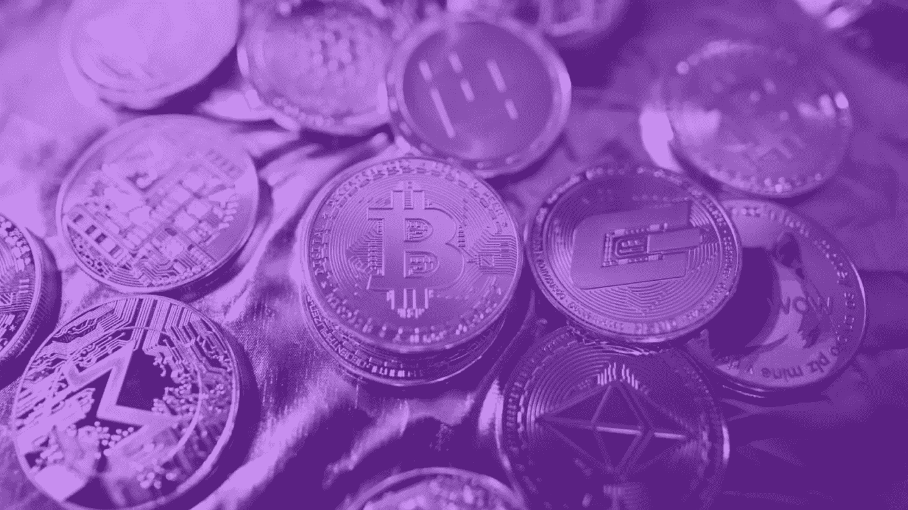

# 宏观、市场和加密的片段

> 原文：<https://medium.com/coinmonks/snippets-of-macro-markets-crypto-b5bfff797061?source=collection_archive---------30----------------------->

## Alessandro Gherzi 每周评论第 2 期

所有人的目光都集中在周五公布的就业数据上，因为市场参与者正在寻找美联储走向的线索，以及这一次可怕的国债曲线反转是否最终会发生，从而表明可能的衰退。

就业数据相当不错，市场没有花很长时间就消化了 3 月份的官方就业报告，该报告显示美国经济增加了 43.1 万个就业岗位。这一结果低于道琼斯的综合估计值 49 万，但高于一些较低的估计值。受到坚实的劳动力市场的鼓舞，鹰派人士一定在摩拳擦掌，因为这给了他们更多的弹药来证明更积极的加息是正确的，收益率曲线肯定是这样反应的…但稍后会有更多的讨论。

但鹰派(优先考虑低通胀而不是增长和就业，因此主张提高利率)和鸽派(支持增长和充分就业，因此支持低利率)之间的拉锯战并不像数字乍一看那样一边倒。工资报告的关键被埋得更深一点，它与工资增长有关，工资增长“仅”增长了 4.8%，远低于通货膨胀率。这一读数减轻了人们对工资价格螺旋上升的担忧，这是一个真正的恶魔，因为工资往往会停滞不前，使通胀持续存在。因此在这一点上，鸽派占了上风。

这使得鸽派与鹰派的比分保持在 1 比 1，但本周早些时候公布的另一项就业统计数据显示，鹰派的支持率有所上升。美国劳工统计局(Bureau of Labor Statistics)报告称，越来越多的美国人在 2 月份辞职，而空缺职位和失业人数之间的差距变得更大。与此同时，该月有超过 1，100 万个职位空缺，然而，随着失业总人数进一步下降到略高于 600 万，这比现有工人多出了创纪录的 500 万个职位空缺。在美国，现在每一个失业者对应 1.8 个工作岗位。极度紧张的就业形势帮助推高了通胀，因为有太多的雇主在追逐更少的员工。老鹰队 2 比 1。

但事情并没有就此结束，因为消费者数据公司也希望对游戏的结果有发言权。本周早些时候，尽管地缘政治紧张和通胀上升，消费者信心指数仍有所上升，显示出良好的弹性。这使得老鹰队进一步领先，所以 3-1 老鹰队。相反，我们看到中国消费者表现出疲软的迹象，这种紧张也表现在储蓄率上，与去年相比，储蓄率上升了 4 倍，毫不奇怪，中国是极少数降息而不是加息的国家之一。仅在上海就有超过 2500 万人被锁在家中，消费者支出似乎不会很快好转。真正的问题是，随着中国经济放缓，是否存在蔓延的风险？通常，当中国打喷嚏时，西方世界会感冒，尽管会有延迟。经济放缓，鸽派胜出。老鹰队以 3 比 2 领先一分。

最后，由于拜登政府承诺释放更多战略石油储备，美国基准西德克萨斯中质油价格本周回撤，并在某个时点跌破每桶 100 美元。由于石油是支出和通胀的重要组成部分，你必须把这个交给鸽派。3-3 的激烈竞争，这场鸟类之战没有胜利者，所以它去了法官和赢家出现。

债券是“真理的工具”，因此最公平的法官，他们说举起鹰的手，翅膀。首先，5-30 年期美国国债收益率曲线的较长端出现了自 2006 年以来的首次反转。然而，真正重要的是曲线反转的较短一端，在周五导致短期利率飙升的就业报告发布后，它终于出现了。我们为什么要关心？历史不一定会重演，但它经常会押韵。2 年期和 10 年期国债收益率自 2019 年 8 月以来首次反转，每一次单一收益率曲线反转都导致经济衰退。自 1978 年以来，收益率曲线出现了 7 次反转，从反转到下一次衰退的时间平均为 16 个月。

是时候找个地方躲起来，然后钻到桌子底下去了？衰退听起来很糟糕不是吗？的确如此，但收益率曲线反转不一定对市场不利。在 2019 年反转后，纳斯达克在接下来的 12 个月里上涨了 60%。因此，不管经济衰退与否，鹰派和鸽派的博弈如此接近，整个星期市场基本上没有方向。市场参与者很少像现在这样困惑。这一切将走向何方？大多数人甚至不敢表达意见，更不用说发表观点了。我们看到的是优柔寡断…

如果你需要市场失灵的线索，那就去找苹果吧。苹果公司(Apple)连续 11 天的飞速上涨势头在本周二宣告结束，但这仍然是苹果公司自 2003 年以来持续时间最长的一次上涨。尽管有报道称，由于需求疲软，苹果下季度将把计划中的 iPhone SE 产量削减 20%，而且由于最近地缘政治局势紧张，消费者信心减弱，苹果可能会因此下调销量预期，但苹果还是实现了上述增长。尽管苹果的表现给人留下了深刻印象，但手机的半导体元件却在走下坡路，其中一些明显如此，这至少有点奇怪。这很奇怪，是吗？正如我们上周所强调的那样，随着投资者陷入猜测，股市似乎正在向安全领域转移，最近防御性更强的股票似乎也在引领市场。市场过度紧张，股市也开始向衰退倾斜，否则怎么解释像沃尔玛(Walmart)和好市多(Costco)这样的便利零售企业(市盈率高达 40 倍，远远超过高科技企业市盈率的中位数)一直处于历史高点？

感谢上帝，我们总算没有落在后面。过去两年中，三大主要股指在第一个负季收盘时，跌跌撞撞地进入了 4 月。从历史上看，4 月是市场表现最好的月份，过去 16 年来上涨了 15 倍。今年会有什么不同吗？我们不会为此下注。

加密货币是一个关于好的、坏的和丑陋的故事。

好消息是。本周伊始，就有消息称，美国参议员卢米斯期待已久的加密货币监管法案获得了参议员吉利布兰德的支持。预计将在未来几周内首次亮相的这项拟议中的立法，将汇集一系列与加密货币相关的提案，旨在为美国国内的行业产品和服务提供更大程度的清晰度，包括揭开去年夏天基础设施法案之争中引发争议的有争议经纪人定义的神秘面纱。预计该立法还将部分侧重于将某些类型的加密资产归类为商品、证券等的手段。国会就是国会，所以期待意外吧，不过能有卢米思和图米这样聪明又受人尊敬的参议员站在加密货币的立场上战斗也是件好事。

国会山方面也传来了一些好消息，拜登政府并没有那么含蓄地暗示，数字加密货币将在未来的税收政策中发挥作用。在预算案中，政府预计到 2032 年加密货币的税收将达到 110 亿美元，其中近一半将在明年产生。这是另一个迹象，表明美国政府对加密货币作为一种资产类别的默许正变得越来越普遍。

坏事。新闻上到处都是流行的区块链游戏 Axie Infinity，它让用户在玩的时候赚钱，与历史上最大的 DeFi(去中心化金融)黑客攻击有关。Axie Infinity 的 Ronin Network 周二在一篇博客文章中称，它在 USDC 和以太坊损失了约 6.15 亿美元，超过了 2021 年 8 月 DeFi protocol Poly Network 遭受的 6.11 亿美元的黑客攻击。诸如此类的标题是采用的主要障碍，将使许多怀疑论者远离任何与密码相关的东西。

丑陋的…非常丑陋的。最正确的预测是，对于 crypto 而言，2022 年将是“监管”成为焦点的一年。这不是我们想要的，但我们在监管方面受到了双重打击。周四，当美国证券交易委员会表示加密货币不如其他资产透明，实体应将它们作为负债计入资产负债表时，我们看到了加密货币的风帆被吹散。更糟糕的是，欧洲议会已经批准了一项针对所谓的“无主钱包”的法案条款。3 月 31 日，ECON 和伦敦银行同业公会委员会投票通过了资金转移监管修正案，该修正案要求加密服务提供商(主要是交易所)在交易前核实与他们交易的非托管钱包所有者的身份。这是对欧洲加密扩散的一个打击，然而更让我们难过的是看到布鲁塞尔未经选举的官员正在扼杀创新。一个不太有趣的事实是，成立于 1972 年的 SAP 是欧洲最大的科技公司，这让你深思。欧盟及其官僚需要尽快唤醒我们。

秘密世界的其他新闻。Terra 基金会承诺在更长时间内购买 100 亿美元的 BTC，并在一周内每天购买约 1.25 亿美元，这无疑支持了比特币的价格。Coinshare 市场报告显示，上周有近 9000 万美元的巨额资金流入，这是自该报告问世以来最大的一次 alt coin 周流入。谈到 alt coins Solana 在上周的新闻之后，当 OpenSea 宣布从 4 月份开始支持 Solana NFTs 时，grey(如果他们的 BTC ETF 没有获得批准，他们找到时间和勇气威胁对 SEC 采取法律行动)将 SOL 作为其新推出的基金的核心地位，得到了进一步的推动。如果这还不够的话，芝加哥商业交易所集团正在考虑对索拉纳进行期货交易。这一系列积极的消息使得其母语 SOL 在同行中明显领先，跃升了约 40%。

本周的主要收获是，在经历了监管阻力之后，BTC 重新获得了 46，000 美元的关键支撑位，这表明它在面对糟糕和丑陋的情况时具有韧性。毫无疑问，在 4 月 6 日开始的 BTC 会议之前，这是一个好兆头……烟火是意料之中的，让我们希望它不会令人失望。

谢谢你的滚动。感谢你宝贵的时间。

亚历山德罗·盖尔齐
首席财务官
斯蒂马

查看我们的网站了解更多信息:
https://stima.io/[🟣](https://stima.io/)

关注我们:
insta gram:[https://www.instagram.com/stima.io](https://www.instagram.com/stima.io)
脸书:[https://www.facebook.com/stima.io](https://www.facebook.com/stima.io)
推特:[https://twitter.com/STIMA_Crypto](https://twitter.com/STIMA_Crypto)
Reddit:[https://www.reddit.com/r/stima](https://www.reddit.com/r/stima)

> 加入 Coinmonks [电报频道](https://t.me/coincodecap)和 [Youtube 频道](https://www.youtube.com/c/coinmonks/videos)了解加密交易和投资

# 另外，阅读

*   [如何在 Uniswap 上交换加密？](https://coincodecap.com/swap-crypto-on-uniswap) | [A-Ads 评论](https://coincodecap.com/a-ads-review)
*   [加密货币储蓄账户](/coinmonks/cryptocurrency-savings-accounts-be3bc0feffbf) | [YoBit 评论](/coinmonks/yobit-review-175464162c62)
*   [Botsfolio vs nap bots vs Mudrex](/coinmonks/botsfolio-vs-napbots-vs-mudrex-c81344970c02)|[gate . io 交流回顾](/coinmonks/gate-io-exchange-review-61bf87b7078f)
*   [CoinFLEX 评论](https://coincodecap.com/coinflex-review) | [AEX 交易所评论](https://coincodecap.com/aex-exchange-review) | [UPbit 评论](https://coincodecap.com/upbit-review)
*   [AscendEx 保证金交易](https://coincodecap.com/ascendex-margin-trading) | [Bitfinex 赌注](https://coincodecap.com/bitfinex-staking) | [bitFlyer 审查](https://coincodecap.com/bitflyer-review)