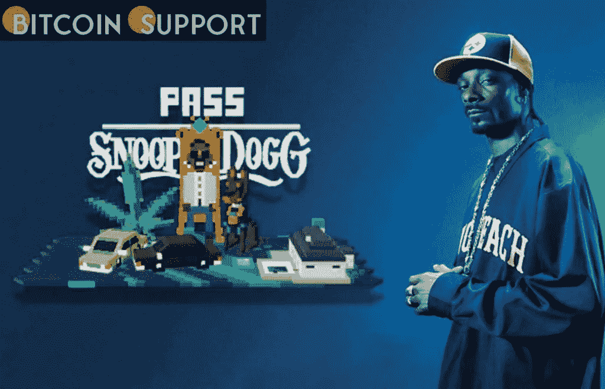

# Snoop Dogg 发布 10，000 个沙盒头像 NFT

> 原文：<https://medium.com/coinmonks/snoop-dogg-releases-10-000-sandbox-avatar-nfts-38348c6f9678?source=collection_archive---------29----------------------->

[https://bitcoinsupports.com/](https://bitcoinsupports.com/)

沙盒阿尔法的发行仍然让他们记忆犹新，Snoop Dogg 演唱会上的时髦音乐也仍然让他们记忆犹新，粉丝们一定很高兴得知第二季已经在制作中了！在新赛季开始之前，沙盒将发布一个独特的 Snoop Dogg NFT 化身的大规模收集，在游戏中完全可以玩！

铸造将于世界协调时 2 月 22 日晚 10 点在 Sandbox.game/en/snoopdogg/进行，价格为 150 砂(加汽油费)。

**为第二季获得一只狗**

沙盒，区块链最受欢迎的元宇宙游戏体验之一，将于 2022 年 2 月 22 日发布 10，000 只史努比狗狗化身 NFT，就在阿尔法第二季开始之前。这对史努比狗狗和沙盒迷来说都是令人兴奋的消息。10，000 个 Snoop Dogg 化身是体相关的，通过编程生成的 NFT，具有超过 150 个特征。在游戏的第二季中，每个独特的小狗化身都可以参加活动和音乐会，完成任务，与朋友一起闲逛，像名人一样探索元宇宙。考虑以一个时髦的狗狗形象参加一场史努比狗狗演唱会，或者出现在一个完全在沙盒中拍摄的音乐视频中！

[https://twitter.com/SnoopDogg/status/1494053108988596224](https://twitter.com/SnoopDogg/status/1494053108988596224)

人类、蓝色、外星人、僵尸、狗狗、机器人、金色是 10000 个史努比狗狗头像 NFT 的稀有等级。虽然三分之二的狗狗是普通的，但是将会有三种狗狗有独特的个性和特征，使它们与众不同。

“兴奋剂化身”是由沙盒和史努比狗狗自己设计的兴奋剂、新鲜和时髦的小狗的集合。每一个都是独一无二的。

“经典头像”是根据史努比狗狗的历史改编的狗狗合集。你可以很容易地通过听这些独家小狗来识别 Snoop 多年来最伟大的歌曲。其中之一是 Snoop 2007 年的 anthem 的天鹅绒般优雅的外观，性感的诱惑和令人陶醉的深情复古 80 年代的氛围。

“签名版”是完全独一无二的狗狗合集。与元宇宙一些最伟大的创造者合作创造的签名小狗，似乎是史努比从星际、多维旅程的回归。这意味着什么？想了解一下，应该去官网看看。

在 Twitter 上关注狗狗们，查看更多该系列的神气狗狗。

**如何创建狗狗头像**

《史努比狗狗头像合集》定于 2022 年 2 月 22 日发售。那是 2022 年 2 月 22 日，一个将被铭记的日子。那些已经拥有独家 Snoop NFTs，如 Snoopverse 早期访问通行证，Snoop Party 通行证，JADU Jetpack，JADU Hoverboard，SupDucks 和 FLUF 陋居，将能够在公众面前 24 小时铸造小狗。每只小狗将被铸造并以每 NFT 150 沙的价格出售。那些在 12 月份完成 Alpha 版本并从游戏中获得慷慨的 5000 沙子作为奖励的人将别无选择，只能以最酷的方式花费沙子。更多狗狗收藏状态更新可以在 Twitter 和 Discord 上找到。

**访问我们的网站:-**[**https://bitcoinsupports.com/**](https://bitcoinsupports.com/)

**免责声明:以上为作者观点，不应视为投资建议。读者应该自己做研究。**

> 加入 Coinmonks [电报频道](https://t.me/coincodecap)和 [Youtube 频道](https://www.youtube.com/c/coinmonks/videos)了解加密交易和投资

# 另外，阅读

*   [折叠 App 审核](https://coincodecap.com/fold-app-review) | [Kucoin 交易机器人](/coinmonks/kucoin-trading-bot-automate-your-trades-8cf0ca2138e0) | [Probit 审核](https://coincodecap.com/probit-review)
*   [如何匿名购买比特币](https://coincodecap.com/buy-bitcoin-anonymously) | [比特币现金钱包](https://coincodecap.com/bitcoin-cash-wallets)
*   [币安 vs FTX](https://coincodecap.com/binance-vs-ftx) | [最佳(SOL)索拉纳钱包](https://coincodecap.com/solana-wallets)
*   [比诺莫评论](https://coincodecap.com/binomo-review) | [斯多葛派 vs 3Commas vs TradeSanta](https://coincodecap.com/stoic-vs-3commas-vs-tradesanta)
*   [Capital.com 评论](https://coincodecap.com/capital-com-review) | [香港的加密借贷平台](https://coincodecap.com/crypto-lending-hong-kong)
*   如何在 Uniswap 上交换加密？ | [A-Ads 审查](https://coincodecap.com/a-ads-review)
*   [WazirX vs coin dcx vs bit bns](/coinmonks/wazirx-vs-coindcx-vs-bitbns-149f4f19a2f1)|[block fi vs coin loan vs Nexo](/coinmonks/blockfi-vs-coinloan-vs-nexo-cb624635230d)
*   [本地比特币评论](/coinmonks/localbitcoins-review-6cc001c6ed56) | [加密货币储蓄账户](https://coincodecap.com/cryptocurrency-savings-accounts)