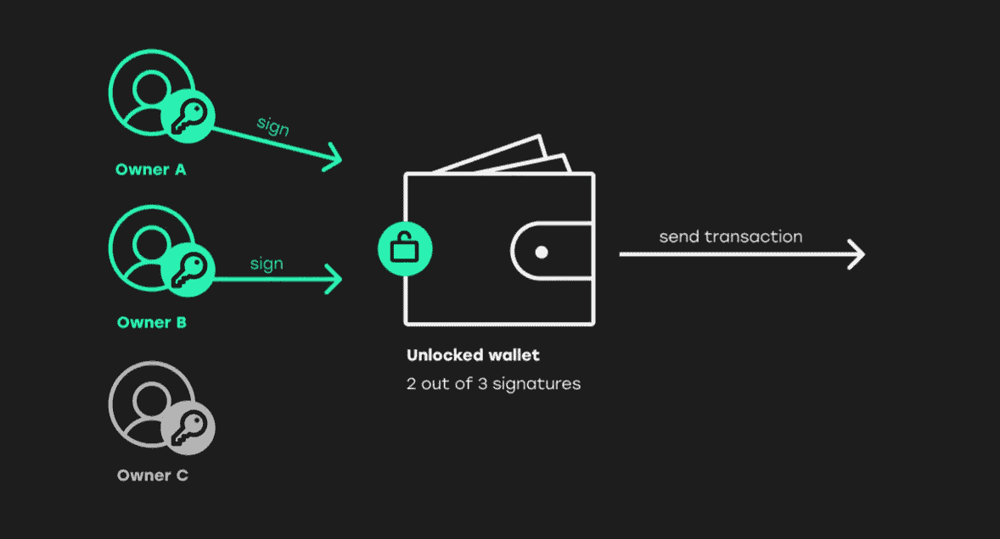

# Solana Multisig —雪花安全

> 原文：<https://medium.com/coinmonks/snowflake-safe-multisig-is-here-e5a8c402bab9?source=collection_archive---------5----------------------->

## Solana 最安全、功能最丰富的 multisig 钱包就在这里。

雪花很自豪地宣布，我们最新的多签名产品在索拉纳，**雪花保险箱上市。雪花保险箱是索拉纳的灵识保险箱。**

**在过去的几个月里，我们非常努力地构建链上自动化，我们正在利用我们以前的经验为 Solana 带来功能最丰富、最安全、最可靠的多重签名产品。**

**下面先睹为快，体验一下是什么感觉。**

# ****什么是多签名钱包？****

**多签名钱包允许一组用户在执行交易之前批准交易。许多个人和团队希望在交易执行之前有多方签署，例如付款或提款。这允许更强大的安全性，因为它将您的数字资产的责任分散到多方，并避免在个人或钱包受损的情况下出现单点故障。**

****

**image reference: [https://multis.co/post/multisignature-wallets-the-gold-standard-for-companies](https://multis.co/post/multisignature-wallets-the-gold-standard-for-companies)**

# ****多重签名产品的市场前景****

**今天最著名的 multisig 产品是 [Gnosis-Safe](https://gnosis-safe.io/) ，它只适用于以太坊和 EVM 连锁店。**

**对于 Solana 生态系统，多签名产品仍处于早期阶段，许多团队选择利用 [Serum Multisig](https://github.com/project-serum/multisig) 构建自己的工具。Whistle 是一款非常可靠的开源产品，Serum multisig 主要关注面向开发人员工作流的高技术用例。**

**随着雪花安全的推出，我们的目标是创造一个更加丰富，高度安全和令人愉快的产品体验，每个 web3 用户都喜欢使用，无论他们的技术经验如何。**

**我们不打算只是创建一个 Gnosis-Safe 的克隆。Solana 理应获得该领域最好的工具，而 Snowflake 打算在为我们的用户提供一流的 multisig 平台方面领先一步。**

# ****雪花为什么要打造 multisig 产品？****

**我们最初创建雪花是因为我们想帮助协议在链上集成自动化。市场迫切需要能够以极高的成功率自动化或调度作业，而无需管理底层基础架构。我们建造这个是因为我们想帮助生态系统和项目在世界上最快的区块链上建造惊人的产品。**

**在与许多团队交谈后，我们意识到对多签名产品也有强烈的需求。Solana 上尚未提供安全、开放和可扩展的 multisig 产品，该产品具有与多个第三方集成的自动化功能，利用 Snowflake 深厚的技术专业知识和基础设施，我们意识到我们拥有构建该产品的工具。我们的最终目标是发展和改善生态系统，雪花安全是一个机会，为一个已经充满活力和不断增长的社区添加一个安全和功能丰富的 multisig。**

# ****安全****

**自 Solana 早期以来，雪花团队一直在开发多种产品。我们的产品和 [SDK](https://github.com/snowflake-so) 已经被生态系统中许多知名团队使用。雪花也被领先的安全公司审计，包括 [Certik](https://www.certik.com/) 和 [OtterSec](https://osec.io/)**

# ****雪花保险箱的主要特点是什么？****

*   ****创建保险箱** —创建保险箱&只需点击几下鼠标即可配置保险箱所有者**
*   ****资产管理器** —在安全的 multisig 环境中存储您的所有资产、硬币&NFT**
*   ****创建并跟踪建议** —轻松创建建议并跟踪其从创建到批准&执行的进度**
*   ****通讯录** —使用雪花安全通讯录安全管理重要客户和联系人**
*   ****经常性付款** —直接从雪花保险箱安排工资、经常性付款和未来付款**
*   ****代币授权** —直接从外管局进行代币授权**
*   ****令牌交换** —直接使用 Orca 交换令牌，使用 Pyth 的 price oracle 触发自动化**
*   ****自定义操作** —直接从保险箱执行开发人员自定义指令**
*   ****集成—** 与许多平台集成，更多平台即将推出**

# **雪花保险箱的未来是什么样的？**

**我们希望雪花保险箱成为市场上最值得信赖、最安全、功能最丰富的 multisig 产品。雪花安全为用户和团队提供了空前数量的协议集成。从今天起，您可以使用雪花保险箱直接与 Orca 进行代币授权、定期支付、定期交易和代币互换。**

**但我们不会就此止步。我们希望能够集成尽可能多的第三方协议。我们希望用户在使用他们的 Solana 钱包时能够获得最安全、最丰富的体验。**

# ****致谢****

**非常感谢您加入我们的旅程。我们如此努力地发布我们的产品，我们感谢所有支持我们的人。我们要特别感谢琥珀集团、GBV、Petrock Capital、Staking Facilities 和 Token Ventures 的投资者。也非常感谢来自 Melior 的 Victor，以及在这个旅程中帮助我们的所有令人惊叹的项目。**

**这只是开始，我们不会很快停止。请随时联系我们，讨论您的 multisig 需求、集成到我们的平台或任何链上自动化。**

**雪花网址:https://snowflake.so**

**雪花安全 App:[https://Safe . snow flake . so](https://safe.snowflake.so)**

**推特:【https://twitter.com/snowflake_sol **