# $SYNR-成为元宇宙的黑手党

> 原文：<https://medium.com/coinmonks/snyr-become-a-mafia-in-the-metaverse-9e56ff0ed837?source=collection_archive---------24----------------------->

# CoinDCXpathbreaker

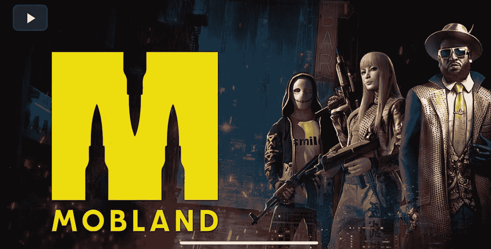

**项目名称:** MobLand

***项目描述摘自白皮书:***

"*第三层:黑手党的基础设施:这不仅仅是一个游戏。每个游戏都有一个生命周期。你还在玩愤怒的小鸟吗？还有人持有 Rovio 的股票吗？*

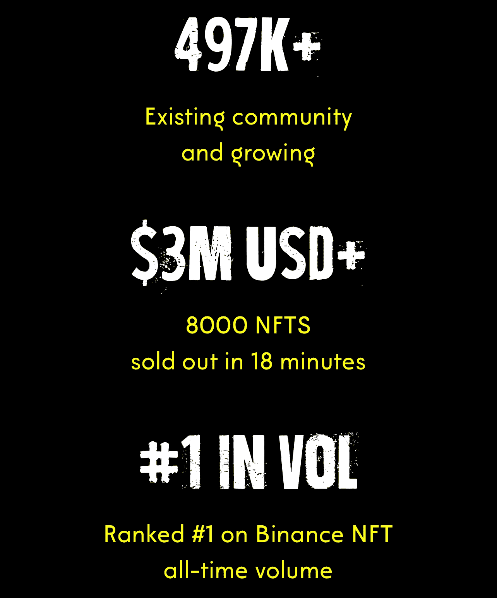

[*MOBLAND*](https://medium.com/u/22cc893f384c?source=post_page-----9e56ff0ed837--------------------------------) *不仅仅是一款游戏，它是一个平台，是第三层，即黑手党元宇宙内部产生和利用的资产的黑手党基础设施。将会有新的游戏&为这个生态系统生成收入模块，例如第一人称射击游戏、策略游戏、农业游戏，甚至 MMO 游戏，所有这些游戏都直接来自生成的资产和现有的基础设施*。"

用于访问项目的网络地址

*   **以太坊网络(ERC 20)**0 xbc 6 e 06778708177 a 18210181 b 073 da 747 c 88490 a

## **项目独特卖点:**

*   根据总交易量，NFT 在币安市场排名第一
*   游戏中的 NFT 包括:

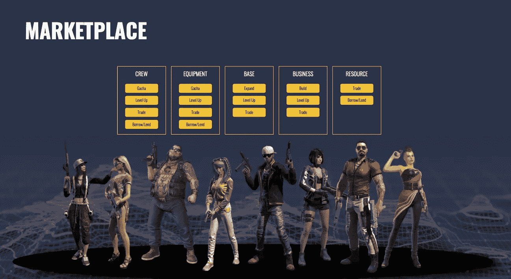

1.  专用市场(即将推出)
2.  **synr pass**(NFT drop 的一部分)
3.  蓝图 NFT (这些是可以升级的游戏内功能和功能的非功能桌面)
4.  草坪-元宇宙房地产(即将推出)

## 计划和项目布局

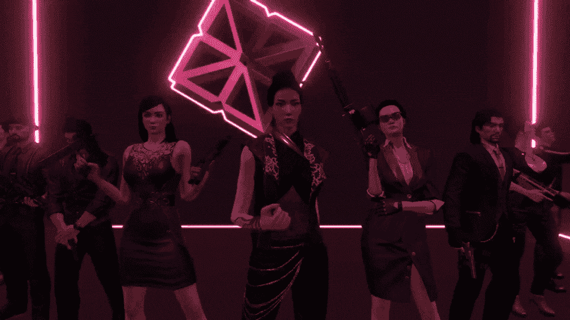

Different Class of Mafia families in MobLand

*   更新计划将项目扩展到其他连锁店(如 BNB 智能连锁店和索拉纳)，这将使玩家有跨链黑手党战争(如跨平台游戏机游戏)🔥
*   MobLand 认为自己是一个第三层的游戏保真项目🎮
*   多种玩法，包括:

1.  **大型多人在线** (MMO)
2.  **第一人称射击游戏** (FPS)
3.  **基于策略的转盘游戏**
4.  **农业**
5.  **无价格壁垒进入，自由发挥**(并赚取)

## 将有四种主要收入制度:

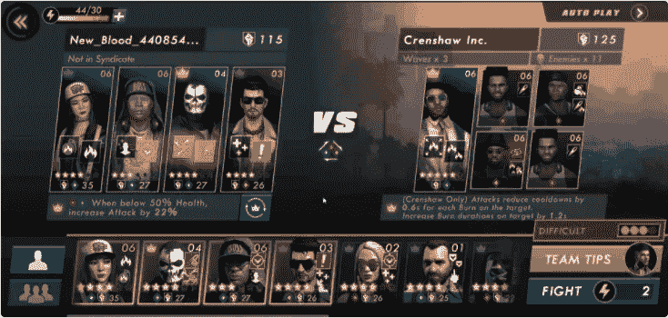

1.  资本家 -玩家可以在元宇宙黑手党的生态系统中重新分配他们获得的资产，而不是直接在公开市场出售。这可以通过各种工具和产品来实现，如 Turf 和 License，以产生额外的收入
2.  **持有者** -用户可以 **HODL** 并下注他们赢得的资产，以获得额外的收益、游戏内提升和其他游戏特权。
3.  **Grinder** -玩家将能够通过每日活动、PvE 任务、PvP 任务、定期活动、排行榜活动、辛迪加活动等&等方式参与游戏，以赢取奖励
4.  **治理** -玩家可以下注 **$SYNR** 令牌来加入元宇宙治理委员会

**这款元宇宙游戏可以在 PC 和移动平台上玩**

## 项目审计报告:

该团队通过[认证](https://medium.com/u/48cc71597f8a?source=post_page-----9e56ff0ed837--------------------------------)成功完成了他们的项目审计

审计报告的调查结果是:

> ***没有发现关键或者重大的 bug。引起我们注意的小错误已经被修复。我们正在进行迭代，其中大部分已经完成。***

来源: [MOBLAND](https://medium.com/u/22cc893f384c?source=post_page-----9e56ff0ed837--------------------------------) Medium post

## 项目团队:

从表面上看，这个团队并不完全是复杂的，但我在谷歌搜索时发现了以下信息…

**罗伊·刘**(mob land 联合创始人):[https://www.linkedin.com/in/roy-liu-35656618a/](https://www.linkedin.com/in/roy-liu-35656618a/)

**米海·pohonţu**(mob land 联合创始人):[https://www.linkedin.com/in/mihaipohontu/](https://www.linkedin.com/in/mihaipohontu/)

## 风险资本投资者:

我发现这个项目非常合法，因为投资者名单上有两个人的名字——权道&贾斯汀·坎。如果他们在投资，那么这个项目肯定是有价值的。毕竟，**Terra Luna**&**Discord**这些家伙知道他们在做什么🌝

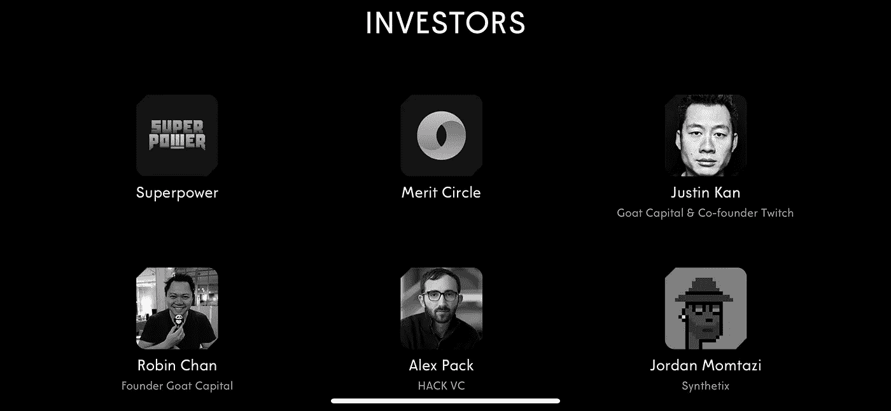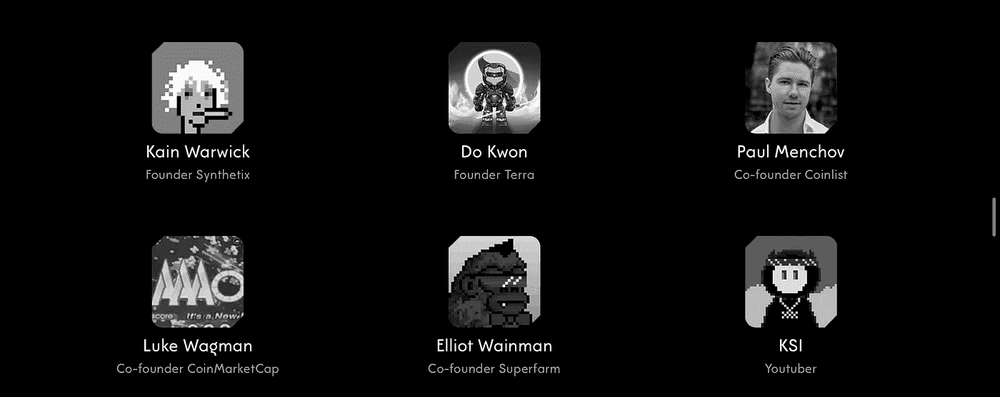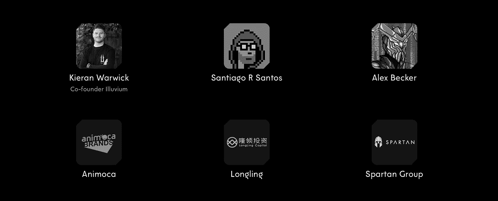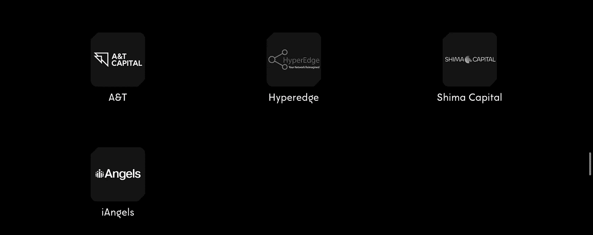

## 合作伙伴:

看到合作伙伴名单上的名字，可以肯定地说，该项目已经获得了坚实的支持和资金…拥有如此众多的知名投资者始终是一个项目长寿的重要标志，MobLand 做得对…

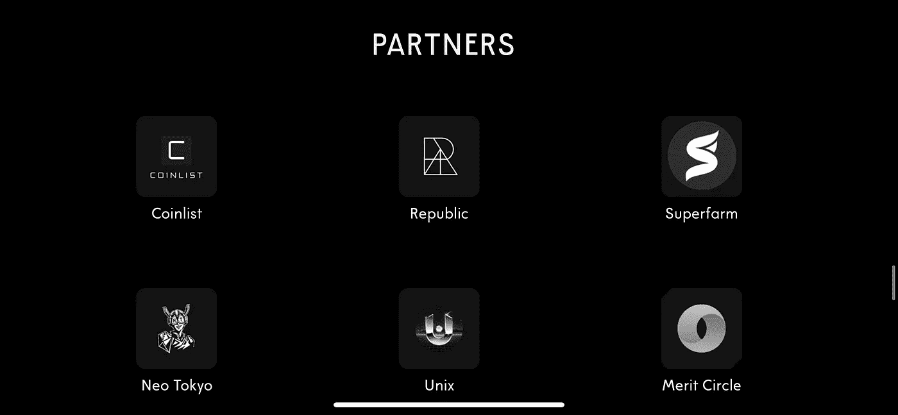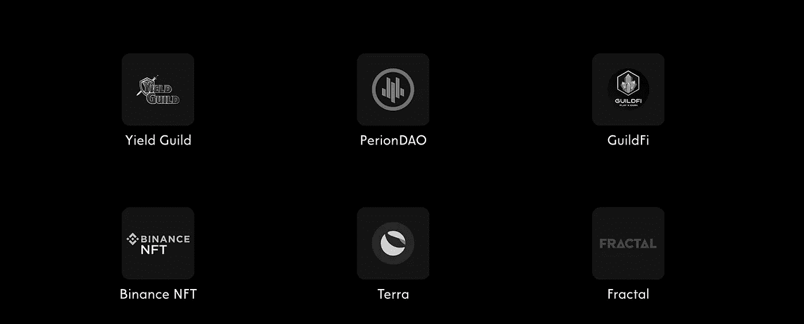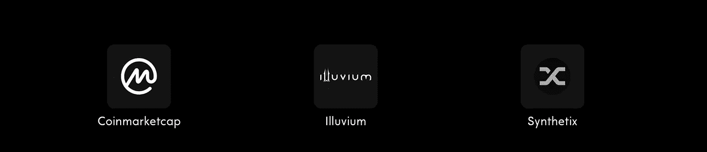

## 项目路线图:

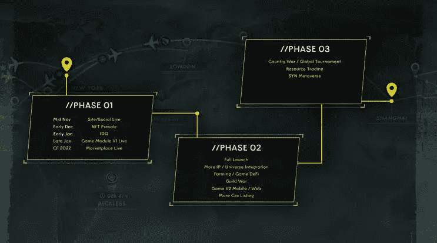

与传统的项目路线图相比，MobLand 路线图没有按季度划分的时间戳或阶段。

我对上述项目路线图的理解是，团队已经完成了**第一阶段** &现在将专注于**第二阶段** & **第三阶段**。

## 令牌组学:

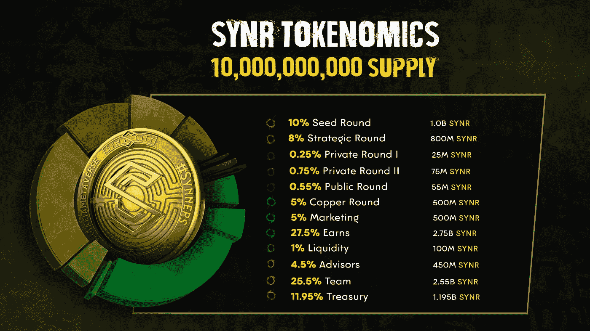

*   **$SYNR** 是 **MobLand 的原生令牌，**将用于费用支付&奖励支出

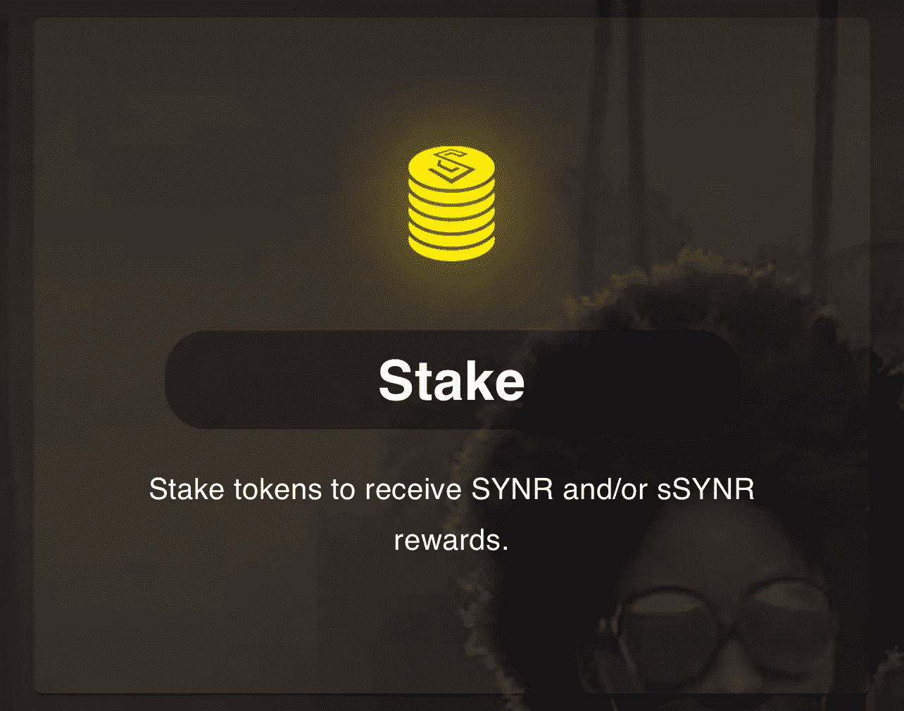

*   **$SYNR** 令牌可以下注以获得$sSYNR，这将用于在市场中购买游戏内物品(即将推出)
*   **$SYNR** 令牌的赌注将在设定的时间段内锁定，该时间段在 **16-52 周**之间变化。

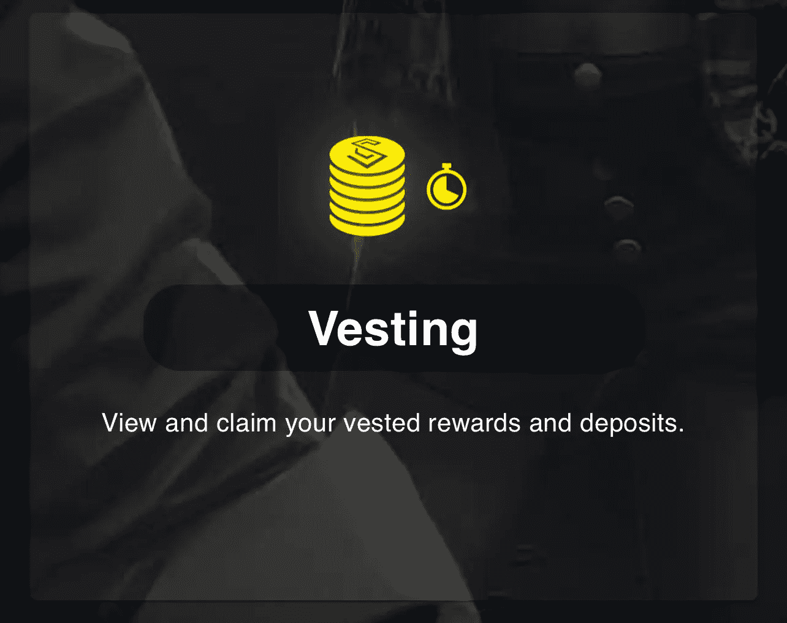

**赌注期越长，奖励的权重就越大。在我看来，这是保持网络内流动性的一个很好的举措。**

你可以在这里阅读更多关于如何下注的内容

## 令牌治理:

用户可以下注$SYNR，以获得治理令牌$sPOWER，该令牌将用于委托给辛迪加领导者。

元宇宙最大的 7 个辛迪加组成了“委员会”。委员会成员形成收入活动和奖励池。

*   最高供应量为 100 亿美元
*   团队；顾问；种子和战略分配加起来占总供应量的 48%。超高配置 IMO🚩
*   对于团队和顾问来说，13 个月的悬崖和 36 个月的授权时间表在一定程度上降低了这种高分配风险，这是非常好的。

## 结论

我对支持这个项目的投资者非常满意。此外，随着 P2E 游戏在加密领域的大量涌现，我觉得元宇宙移动已经在游戏领域采取了非常细致的方法。它看起来像一个精致的 AAA 游戏标题，会让玩家大吃一惊。

此外，这款游戏可以在 PC 和智能手机上使用，将为平台带来各种各样的受众。我希望这个团队能够完成任务，我们可能刚刚得到了一个💎项目(非财务建议)

## 社交媒体和社区链接:

*   **推特**:[https://twitter.com/MobLandHQ](https://twitter.com/MobLandHQ)
*   **不和**:[https://t.co/2pZsXSJljp](https://t.co/2pZsXSJljp)
*   **电报**:[https://t.me/MobLandAnnouncements](https://t.me/MobLandAnnouncements)
*   **中等【https://medium.com/@】:[中等](https://medium.com/@)**
*   **白皮书**:[https://mobland.gitbook.io/mob.land/](https://mobland.gitbook.io/mob.land/)
*   **网站**:[https://mob.land/](https://mob.land/)

…

非常感谢 [CoinDCX](https://medium.com/u/a30fa2b03c2f?source=post_page-----9e56ff0ed837--------------------------------) 给我这个机会来撰写如此详细的报告，并成为**# coindcxpathbaker**计划的一部分，使我能够与加密领域的每个人分享这些知识

> 加入 Coinmonks [电报频道](https://t.me/coincodecap)和 [Youtube 频道](https://www.youtube.com/c/coinmonks/videos)了解加密交易和投资

# 另外，阅读

*   [最佳加密分析或链上数据](https://coincodecap.com/blockchain-analytics) | [Bexplus 评论](https://coincodecap.com/bexplus-review)
*   [NFT 十大市场造币集锦](https://coincodecap.com/nft-marketplaces)
*   [AscendEx Staking](https://coincodecap.com/ascendex-staking)|[Bot Ocean Review](https://coincodecap.com/bot-ocean-review)|[最佳比特币钱包](https://coincodecap.com/bitcoin-wallets-india)
*   [Bitget 回顾](https://coincodecap.com/bitget-review) | [双子星 vs BlockFi](https://coincodecap.com/gemini-vs-blockfi) | [OKEx 期货交易](https://coincodecap.com/okex-futures-trading)
*   [美国最佳加密交易机器人](https://coincodecap.com/crypto-trading-bots-in-the-us) | [经常性回顾](https://coincodecap.com/changelly-review)
*   [在印度利用加密套利赚取被动收入](https://coincodecap.com/crypto-arbitrage-in-india)