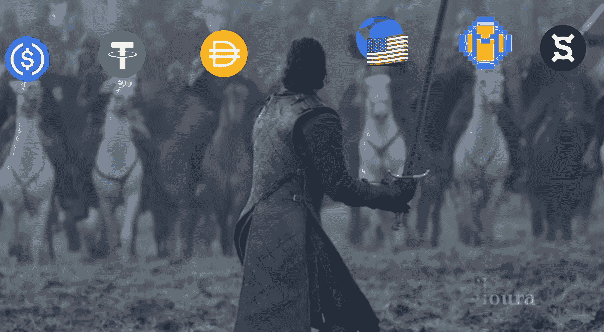
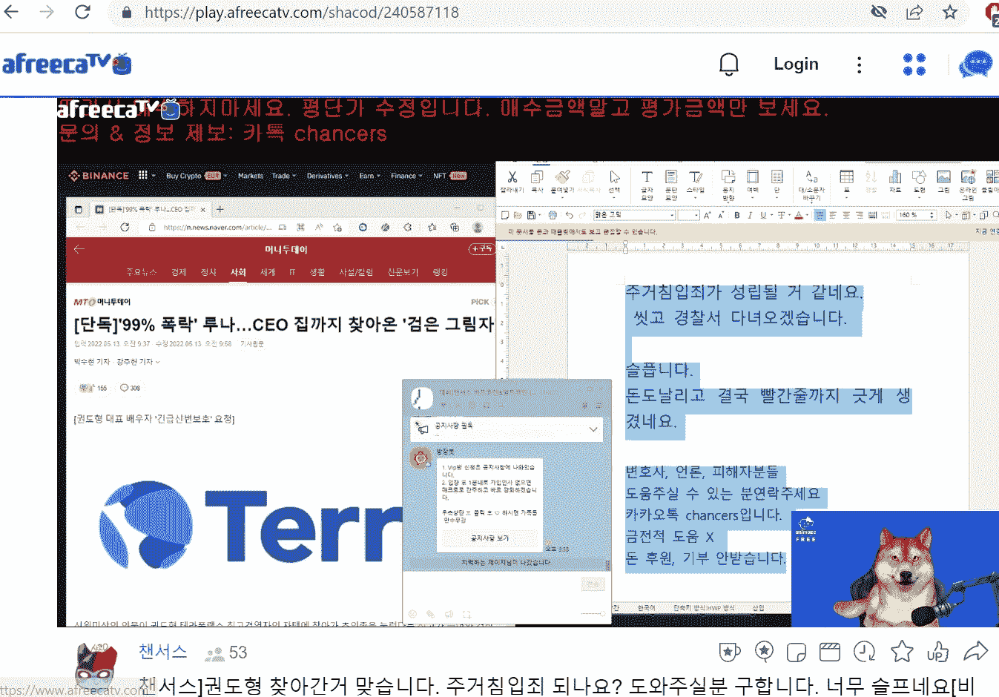

# 那么我们还能相信 stablecoins 吗？

> 原文：<https://medium.com/coinmonks/so-can-we-still-trust-stablecoins-2a36e0750404?source=collection_archive---------69----------------------->

The stablecoin wars.

我们从 Cryptogeddon 2022 中听到了太多可能是由 Terra / Luna 和无敌跆拳道的陨落引发的消息。我确实有一个迫切的问题:
那么稳定的账号可信吗？

也许吧。

稳定的货币可以是:
A)由真实的法定货币支持
B)由加密货币支持
C)算法稳定的

每种稳定币都有其自身的风险。USN 是这个街区的新成员，他们可能不会存在太久。USDC 目前似乎赢得了公众的信任，但他们是集权的，你的隐私在某种程度上受到了损害。
《USDD》是由臭名昭著的孙正义导演的，这已经很说明问题了。当我谈到这个喧闹的角色时，我无法不笑。USDT 是世界重量级冠军，但显然有这么多争议，你还不如投资回 UST。经验法则是分散投资，将风险敞口限制在不超过 10%。

A Luna investor went to Do Kwon house and wrote a note on livestream that he was going to surrender to the police.

“周五，韩国媒体 MoneyToday 写道，一名身份不明的人闯入她的公寓大楼，按门铃问权是否在家，在她说他不在家后离开了那里。”

这越来越失控了。
你不要惹别人家。不管是什么，让跆拳道承担责任，面对现实。不要把他的家人牵扯进来。话说回来，人们已经失去了一生的积蓄和全部资产净值。这令人心痛，我真的希望权的家人平安无事。
没有纵容也没有谴责，我理解。

对于那些受这种混乱影响的人，我没有任何安全的建议或激励智慧给你。我不想假装成一个圣人或一个神奇的秘密治疗师，可以洗去你的痛苦或悲伤，或者更好的是，神奇地恢复你的损失。从这一集吸取教训，在精神上更加强大。我总是听到人们说“哦，我早就告诉过你了”，而你为什么不“自己做研究”？哦，请拯救我的陈词滥调和虚假的智慧。来吧，一流的机构投资者、行业巨擘、智商超过 400 的加密爱因斯坦以及比我聪明得多的人都“做了自己的研究”,但还是损失惨重。
当然，其中掺杂了一些贪婪和疏忽，但这并不比生活中的其他事情多。有时候，你只是运气不好。

你可以做对每一件事，但仍然失败。别把自己打得太惨，昂起头就行了。这会持续一段时间，然后就没事了。我们失去的，我们可以重建。我们学到的东西，我们会永远记住。

-

我们还能相信 stablecoins 吗？

-

# startups # business # startupx # growth # success # social media # culture # entrepreneur # strategy # dokwon # luna # terra # terraformlabs # stable coin # luna crash # cryptoland # ust # cryptogeddon #比特币#死亡螺旋#bankrun

> 加入 Coinmonks [电报频道](https://t.me/coincodecap)和 [Youtube 频道](https://www.youtube.com/c/coinmonks/videos)了解加密交易和投资

# 另外，阅读

*   [加密货币储蓄账户](/coinmonks/cryptocurrency-savings-accounts-be3bc0feffbf) | [YoBit 审核](/coinmonks/yobit-review-175464162c62)
*   [Botsfolio vs nap bots vs Mudrex](/coinmonks/botsfolio-vs-napbots-vs-mudrex-c81344970c02)|[gate . io 交流回顾](/coinmonks/gate-io-exchange-review-61bf87b7078f)
*   [CoinFLEX 评论](https://coincodecap.com/coinflex-review) | [AEX 交易所评论](https://coincodecap.com/aex-exchange-review) | [UPbit 评论](https://coincodecap.com/upbit-review)
*   [AscendEx 保证金交易](https://coincodecap.com/ascendex-margin-trading) | [Bitfinex 赌注](https://coincodecap.com/bitfinex-staking) | [bitFlyer 点评](https://coincodecap.com/bitflyer-review)
*   [Bitget 回顾](https://coincodecap.com/bitget-review)|[Gemini vs block fi](https://coincodecap.com/gemini-vs-blockfi)cmd |[OKEx 期货交易](https://coincodecap.com/okex-futures-trading)