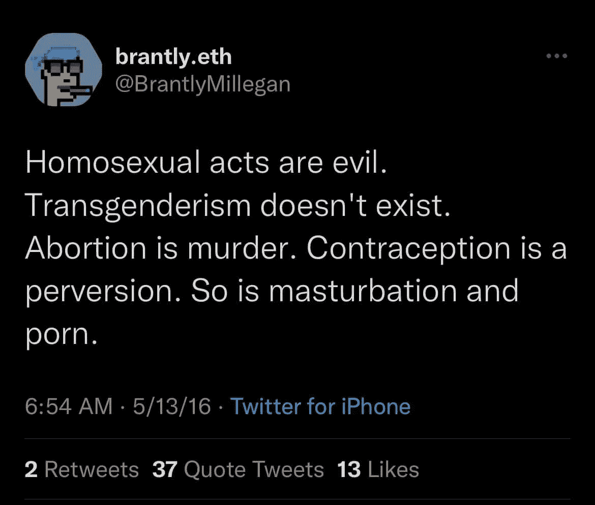
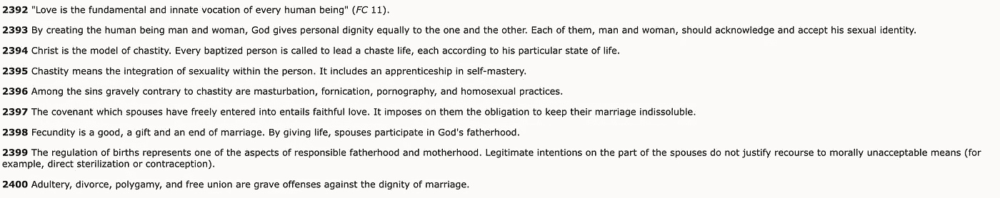
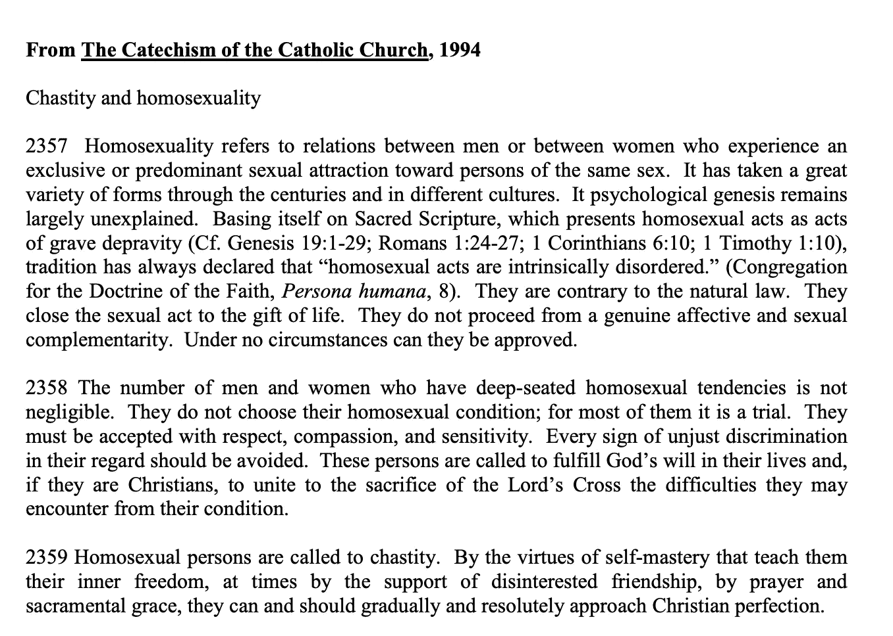

# 所以我复印了布兰特利·米莱根的空间录音。

> 原文：<https://medium.com/coinmonks/so-i-got-the-brantley-ens-spaces-recording-transcribed-9a7308667764?source=collection_archive---------3----------------------->

我在 Fiver 上转录了这段录音，所以转录是由一个不参与 web3 的人一字不差地进行的。我将“道”改为“道”，并做了一些小的更正，但我“照原样”提交文稿，没有修改或编辑。如果成绩单中有任何错误，请在评论中注明。

## 上下文和个人注释

*如果你知道这个故事，不在乎我的想法，只想得到文字记录，请随意跳过这一部分。*

**语境:**

布兰特利·米莱根在 2010 年皈依天主教，此前他是一名新教福音派教徒。他笃信宗教，在圣托马斯大学(2015 年)获得神学硕士学位，并为几家天主教出版物撰稿，有 7 个孩子。2016 年早在他成为 ENS 运营总监之前，他就在推特上写道。

You might want to compare this tweet to the [literal Catechism of the Catholic church](http://www.scborromeo.org/ccc/p3s2c2a6.htm#2396)

2019 年，他成为以太坊名称服务的运营总监。工作了 3 年没有任何事故或指控。

今年，2016 年的推文被挖掘出来，他发了以下推文作为回应，并参加了本文所述的 Twitter spaces 活动。他随后被投票取消了他在 ENS DAO 的代表职位，他的[实名合同也终止了](https://twitter.com/nicksdjohnson/status/1490581937375027202?s=20&t=LpN4gaPIhbDZ5w60yoPtiQ)，尽管尼克自己说“[我已经和布兰特利一起工作了很多年，我从来没有见过布兰特利因为任何人的身份而对他们区别对待或轻视”。](https://twitter.com/nicksdjohnson/status/1490196337463533569?s=20&t=LpN4gaPIhbDZ5w60yoPtiQ)

**个人笔记**

我不是天主教徒，我是无神论者，根据[天主教教义问答](https://www.vatican.va/archive/ENG0015/_INDEX.HTM)无神论是违反第一条戒律的。因此我要下地狱了。

我不同意布兰特利在 2016 年关于同性恋等的推文中表达的观点。然而，我确实对以太坊社区决定驱逐一位伟大的专业人士的方式深感不安，他们正在建立可信的中立的抵制审查的全球基础设施，仅仅因为 T2 持有和表达现代左翼美国人不接受的宗教信仰。因为某人的宗教信仰和表达这种信仰而拒绝与他合作或想剥夺他的职业角色，这是非常黑暗的事情的开始，实际上是拯救无数生命和避免无数战争的宗教宽容、良心自由和不歧视的社会规范的终结。(说得直白一点，这和我拒绝和素食主义者一起工作一样愚蠢，他们说“*肉是谋杀*”。我还感到不安的是，叙事似乎已经被扭曲，以某种方式暗示布兰特利[【双倍下注】](https://twitter.com/search?q=Brantly%20doubled%20down&src=typed_query)，不否认他根深蒂固并得到梵蒂冈官方认可的宗教信仰(教义问答 [**2357**](http://www.scborromeo.org/ccc/p3s2c2a6.htm#2357) ， [**2393**](http://www.scborromeo.org/ccc/p3s2c2a6.htm#2393) **，**[**2396**](http://www.scborromeo.org/ccc/p3s2c2a6.htm#2396)**&2399**)。

听了几遍 spaces 的对话并阅读了文字记录后，个人观察..

*   这次谈话有一种奇怪的心理感觉。不是美国人，也没有上过美国大学，这感觉就像看到了一种外来的治疗文化，就像是一种我以前只在电影中见过的“干预”。我们在这里是倾听而不是攻击，是同情，是爱，但同时也是单方面的被动攻击。*这是关于感情和权利的，但把它变成关于你的感情和权利就不是表现出同理心*。他们还试图让他重复他原来推文中的陈述，他小心翼翼地避免这样做。
*   有几次，有人声称布兰特利“*在空间和推特上双倍下注*”*嘿，看起来我有了第一个暴徒。很高兴看到有人终于读了我的简历的第一个字。我爱你们所有人，我将继续在 web3* 上工作”，但这显然是“双倍下注”，并不意味着他重复了他在 2016 年最初的推文中的声明，这只是意味着他没有否定他的信仰，承诺永远不再发表或发推文，或乞求原谅。显然，不把选择被一条 5 年前的推文冒犯的人视为最严重的问题是令人不快的。

> 说话者 10: (23:31)
> 我理解你们的公众，你们的宗教观点。我明白了。我在各种各样的人身边长大，但这并不重要。你不能因为你已经说过了。然后就是五年前了。**首先，这不像，好吧，但然后回来，加倍下注，好像这是一个笑话，回答人只是在你的答案**只是你。哦，我有，我有我的第一个暴徒。我们是不同意你的暴民。

*   大多数演讲者似乎无法区分谴责**行为**为邪恶和谴责**人**为邪恶。这种区分很重要，也是天主教教义问答中小心穿过的一根针，天主教教义问答将“同性恋行为”命名为“本质上不道德且违反自然法则”，并将“同性恋倾向”命名为“客观上紊乱”。而天主教会并不认为“同性恋倾向”本身是有罪的，并重申每个人，无论其性取向如何，都应该得到尊重，避免不公正的歧视。

[http://www.scborromeo.org/ccc/p3s2c2a6.htm#2358](http://www.scborromeo.org/ccc/p3s2c2a6.htm#2358)

> 说话者 17: (42:51)
> 是啊。对不起我很困惑同性恋行为和同性恋有什么不同？”。

*   没有一个演讲者成功地抓住了布兰特利的主要观点，即他可以相信并说某些行为是邪恶的，而不排斥任何人或区别对待任何人。然而，持有和表达某些信仰的人不能在 web3 中工作或担任领导职位的政策或态度确实排斥了数百万相信这些事情的宗教人士，这比一条潜在有害的推文更具排他性，对增长更不利。

> 布兰特利发言人 1 : (48:07)
> 对。所以我明白你在说什么。所以我的意思是我实际上并不排斥人。所以我并不是说你不能成为这个行业的一部分。我不会和你一起工作。我不会买你的艺术品，因为我不同意，你知道的，关于你或你的信仰之类的东西。我不这样做。我可以思考问题，我可以表达它们，我仍然可以和人们一起工作，即使我和他们有强烈的分歧，从字面上来说，这是字面上的包容性。好像这就是宽容的字面意思。意思是你不同意。你不一定喜欢，但你仍然愿意和他们一起做事。就像，你什么都不能忍受。如果你们都达成了完美的协议。
> 
> 说话人 6: (48:49)
> 你说的话本来就排斥人。他们会读到这些，并自然而然地感到被排斥。所以，这正好和你刚才说的相矛盾。

*   普遍的观点似乎是，潜在的伤害比真正的排斥更糟糕。当务之急应该是创造某种心理上安全的空间，在这里某些事情不能说，某些观点不能持有，而不是一个容忍差异的空间，人们可以自由持有和表达观点，只要他们不欺负、骚扰、歧视或排斥他人。

# 真实的抄本

> 演讲者 1: (00:00)布兰特利
> 我想说的是。我是一名天主教徒，成年后皈依天主教，当时我 22 岁。我想我刚满 22 岁。我相信天主教会的教义。我知道这是有争议的。我知道人们不同意。
> 
> 说话者 2: (00:14)
> 布兰特利，我能打断你一下吗？我认为这个房间里的很多人都不明白，你假设这个房间里的很多人都知道你在说什么。我想这个房间里 75%的人都不知道你在说什么。所以，你结束了一场大多数人可能不知道开始的对话。
> 
> **说话人 1: (00:34)**
> 你说的没错。
> 
> 说话者 3: (00:34)
> 耶！你不需要。我们是来真正倾听你的心声的。我们不是要攻击什么的。每个人都知道并看到一些事情正在发生。所以，这就是我们来的地方。
> 
> 说话者 4: (00:45)
> 耶！
> 
> 说话者 2: (00:46)
> 但是这个房间里的大多数人来这里是为了深夜 d 干扰，然后你进来，他们不知道你在说什么。所以这就像，你在捍卫他们不知道的东西。
> 
> **说话人 1: (00:55)**
> 好的。对不起我想也许人们已经谈论过了，我不知道。
> 
> 说话人 2: (00:59)
> 号
> 
> 说话人 4: (00:59)
> 我们什么都没聊。在我们了解你的观点之前，我不想谈论任何事情。所以我有点理解那个帖子的意思，因为它伤害了包括我和其他一些人在内的所有人。这伤害了很多人，但我们想了解你对事情的看法，或者那条推特，或者基本上是什么。说话者 2: (01:25)
> 我甚至会更进一步，解释发生了什么事，然后直接切入正题。
> 
> 说话者 4: (01:28)
> 耶！说话者 1: (01:33)
> 是的，人们几年前就开始分享一些推文了。我会说，我认为堕胎是错误的，我反对同性恋行为，诸如此类的话。这些是天主教会有争议的立场。我知道这是有争议的，但人们也知道天主教会有这个，人们不喜欢它。我真的要说的是，我相信这一切。这是主流传统，天主教，这并不新鲜。这并没有什么争议，从某种意义上来说，它不是新的或边缘的东西，人们可以不同意它。那很好。我意识到了。
> 
> **演讲人 1: (02:20)**
> 我会挑战这种想法。
> 
> 网络三是为每个人准备的。我真的相信，作为一个社区，我真的相信宽容，我愿意与任何人合作，不管他们是谁，他们的信仰是什么。我认为这种观点是极端的，如果人们不同意我的观点，那也没关系。他们可以，辩论没问题。但是重新考虑一下。信奉世界上最大的宗教就像在网络三产业中不受欢迎一样，
> 
> 发言人 5: (03:08)
> 我想说的是，不是每个人，世界上最大的宗教的一部分都信奉基督教信仰的特定子集。
> 
> **说话人 1: (03:18)**
> 确实如此。但是 rhat 是官方的教义，即使没有几十亿人也有几亿人这么做。这不是边缘位置。
> 
> 说话者 2: (03:27)
> 伙计们，让我们继续说下去。说话者 7: (03:32)
> 每个人都用了手。我们不要谈论彼此，因为我相信每个人都有话要说。所以这就是我们如何使用手的东西，因为它会失去控制。
> 
> 说话者 5: (03:43)
> 对。挺好的。
> 
> 说话者 2: (03:44)
> 每个人都要保持冷静，我们正在进行负责任的、理性的对话，而不是争论。说话者 6: (03:52)
> 耶。我有一个实际的问题。我的第一部分是陈述。我不认为这个空间应该涉及宗教话题，因为这本身就是一个有争议的话题，如果这个空间是平等的，欢迎每个人，这些话题需要被排除在外。我只是很好奇，为什么一开始就要发微博。
> 
> **说话人 1: (04:40)**
> 你在问，你在问我吗？
> 
> 说话者 6: (04:43)
> 耶。
> 
> **演讲者 1: (04:43)**
> 哪条推文？
> 
> 说话人 6: (04:46)
> 大家好像都在炸的那个具体的推文？
> 
> **说话人 1:**
> 哦，好像堕胎是谋杀，事情。
> 
> 说话人 6: (04:51)
> 是的。为什么有必要说明这一点？
> 
> 说话者 1: (04:54)
> 我可以发我想发的微博。我不记得 2016 年我在想什么，但是，我认为我可以发我想发的微博，我认为这完全没问题，我可以接受人们发微博表示不同意。没关系。
> 
> 演讲者 3: (05:10)
> 我想说吧，我的坏，那双手，我的背。去吧。
> 
> 发言人 7: (05:13)
> 是的，我们会一直注意手，各位。所以我知道 tweet 是在 2016 年制作的，我也知道这个空间，只是大家去年才回到 Twitter。对吗？我听到的问题是，我听到人们说这个问题是当你双倍下注的时候，今天，我想是今天你看到了对它的反应，而不是感同身受。世界在变，尽管你有你的观点，我也是基督徒。我有我的观点，但如果这是过去说过的话，我们不想处理取消文化，这只是你现在如何处理它。你知道我在说什么吗？所以我想让其他想知道的人知道。为什么你觉得需要加倍努力，而不是像人们所说的那样感同身受？
> 
> **演讲人 1: (06:04)**
> 所以，耶。你指的是我的推特，我今晚说，“嘿，看起来我有了第一个暴徒。很高兴看到有人终于读了我的简历的第一个字。我爱你们所有人。我会继续做第三网。”我确实相信这些事情，不，我认为有些人在这里说的是一个极端激进的立场，这是极端排外的，那就是如果你坚持世界上最大的宗教，顺便说一下，许多其他非天主教徒也相信这些事情。我的意思是，我们谈论的是数以亿计，如果不是数十亿计的人，你不能在这个行业。即使你工作出色，待人友善，我认为这也是一个极端的立场。我对其他事情不持那个立场。所以我在很多事情上和其他人意见非常不一致，但是我不愿意和他们一起工作，我认为这是不宽容的。我认为这对行业有害，而且我认为这根本不切实际。所以我想那会是我的位置。
> 
> 发言人 7: (07:12)
> 你说你愿意与你在 2016 年推文中提到的人合作。你是这个意思吗？说话者 1: (07:20)
> 是的，我现在有。我当然知道。我从来没有暗示过。
> 
> 发言人 7: (07:26)
> 所以这就是那些从事这些不同事情的人所说的，如果他们是同性恋者、双性恋者和跨性别者，或者他们有什么感觉，你所说的话是没有同情心的。你知道他们会从哪里来吗？
> 
> **说话者 1: (07:41)**
> 对，我还想说，我不确定这里的人是否同情我，我认为我有完全合法的立场，你可以不同意。人们说，“哦，那是可耻的，如果你和你离开这个行业”。我不会那样对待别人，我也不认为别人那样对待我是可以接受的。因此，我认为应该尊重每一个人，即使我们意见不一致，也应该容忍各种各样的观点。所以我是这么想的。就像有人说的，哦，我对他们太刻薄了。好像我欺负人什么的。我的意思是不。我想人们会说，哦，我对人很好，和我一起工作很愉快。我希望是这样。所以我们并不是真的在说，哦，我对别人太刻薄了。演讲者 7: (08:33)
> 好的，亚当，好的，阿什利
> 
> 演讲者 8: (08:37)
> 阿什利:我不会坐在这里攻击你的宗教信仰，这绝对不是我们在这里的目的，但我知道你一直提到，每当你谈论推特时，你就提到堕胎的事情，但你有点绕过这个话题，称同性恋为邪恶之类的。
> 
> **说话人 1: (09:00)**
> 我没那么说。
> 
> 说话人 8: (09:01)
> 耶。上面写着同性恋行为。
> 
> 说话者 5: (09:04)
> 同性恋。是啊。
> 
> **说话人 1: (09:05)**
> 不，我说的是同性恋性行为。
> 
> 说话人 5: (09:07)
> 都是邪恶的。
> 
> 说话人 1: (09:07)
> 比如说喜欢。
> 
> 说话者 5: (09:08)
> 那不是天生的不敬。
> 
> 说话人 9: (09:11)
> 小兔子，让她说。
> 
> **说话者 1: (09:12)**
> 对不起。说话者 8: (09:14)阿什利:说吧。每当你说某人正在做的事情是邪恶的，然后你感到不安，人们对你很生气，认为你说的话是邪恶的，不要看到那里的虚伪。
> 
> **说话者 1: (09:33)**
> 不，因为我对别人说他们认为我错了没有意见。我的问题是人们会说，你不允许进入这个行业。所以，我完全可以接受人们说他们认为我的立场是邪恶的或类似的。这当然是一个完全公平的游戏。我没说任何人不能成为这个行业的一部分。所以我不认为人们应该说我不能成为这个行业的一部分。我是说，你明白我在说什么吗？
> 
> 演讲人 8: (10:00)
> 如果你不能，如果你看到，如果你认为人们在做邪恶的事情。但是你。
> 
> 这是我不能理解的，因为我的家人非常虔诚，他们甚至不会和他们不同意的人在一起，因为他们理所当然地觉得自己是邪恶的，他们永远不会在社交媒体上发布这种言论。所以，这是非常令人困惑的，你可以和别人一起工作，然后上网说他们是邪恶的，甚至是手淫。
> 
> **演讲人 1: (10:38)**
> 我真的不想争论我们是否可以进入神学领域。我就提一下，只是这里的人知道我的背景。我有神学硕士学位。我实际上做了人类神学的博士工作，如果人们真的想谈论这些事情，那是另一回事。但是，我不了解你的家庭，那不是我做的。很明显是我做的。所以，我想这跟我没什么关系。演讲者 5: (11:09)
> 我想弗兰先举手了。我想尽快去利得公司，因为她以前也想进去。
> 
> 演讲者 3: (11:17)
> 利润。不，是利润。说话者 2: (11:19)
> 你可以先走。
> 
> 说话人 3: (11:21)
> 说吧。说话者 2: (11:23)
> 我跟着你。挺好的。
> 
> 说话者 3: (11:25)
> 好的。所以我就想问一下，圣经的背景所有这些，不是谈话的重点，但我确实想提出你的信仰，你是在什么样的环境中长大的，所有这些都是值得尊重的，但我很确定在你的圣经中没有任何地方说要打倒其他不同意你的人。那是你的上帝的工作。所以，这是我唯一要反驳的，而且，这是几年前的事了，对吗？我们可能处于不同的精神状态。我知道事实上，我的推文有一些疯狂的事情。我说我大概 16 岁的时候，当然也是，可能还在。我不成熟。所以，你认为它可能来自那个角度，还是你坚持你在 2016 年发推文的声明？
> 
> **说话人 1: (12:12)**
> 我还是同意那个。我是说像。我不记得我当时的确切心理状态，但我记得它的基本内容。是啊。我知道。我仍然百分之百相信。所以这不像，哦，我不成熟或类似的事情。我要强调，我不想争论这些事情本身。我不认为这是有帮助的，但同样，这些职位是由字面上可能是数亿，而不是数十亿人持有的。这不像世界上的边缘。如果你在一个完全被认为是边缘群体的社区，那也没什么。我不是在攻击你，但我想请你注意，这些实际上是非常普遍的。如果网络 3 是为每个人服务的，我们将会有一个艰难的工作。
> 
> **Speaker 1: (13:01)**
> If excluding those things requires for the industry, we’re gonna be excluding massive chunks of the world. It’s not I’m bullying people or something like this. It’s just simply having those beliefs. Right? I would say what a lot of people are doing to me is bullying. They’re calling me names, they’re swearing at me, they’re saying shame, shame. It’s like a caricature of a religious fundamentalist or something like this. Like how coming at me. I think that’s silly. I think this is not how the web three industry should work.
> 
> Speaker 2: (13:34)
> So, like Prophet said, I believe you’re entitled to your views and opinions and, beliefs. I don’t know who asked before they asked you, I think it was Ella. Squirrels asked you, “why did you send out that tweet?” , and your response was, “you’re allowed tweet, whatever you want, then it’s free will.” You know, you’re allowed to voice your opinion, correct?
> 
> **Speaker 1: (14:03)**
> Yeah. I understand, like I can express my opinion. Other people can express their opinion.
> 
> Speaker 2: (14:08)
> A hundred percent. I agree with that. You should be able to allow to express your opinion, but with that expression and with that right to express, you’re gonna bring on the heat. That’s there and may be millions or billions of people that are having the same beliefs as you, but there are not millions and billions of people who are out there inflaming people by sending out tweets. So I think that maybe in the future, I’m not telling you not to express your beliefs, but if you wouldn’t have sent out that tweet, you wouldn’t have gotten the heat. So maybe you should be more conscious about the tweets that you’re sending out. So then that way you don’t have people coming down on you and saying that you’re excluded. No one’s saying that you can’t have your beliefs.
> 
> Speaker 2: (14:56)
> They may not agree with them and they may not support them, but that doesn’t mean you don’t need. You need to go out there and inflame people, and then when they come back at you, because you hurt their feelings, whether they agree with you or not, and they’re like, oh, you’re not welcome here, your not welcome . You know, a lot of people feel that what you said makes them not welcome, so you have to be conscious that your actions have consequences and your words have meaning and they may hurt people, even though if that’s not your intent and that’s just your belief. Again, billions of people may believe exactly the way you do, but they’re not out there tweeting all those things. So when you’re gonna put that out there, you have to be aware that the heat’s gonna come back at you and for every cause is an effect. And you are responsible for that effect.
> 
> Speaker 3: (15:44)
> Know that you are a part of something where there’s a community behind it, you are more than entitled to feel and think and say what you say but know that you have people buying into what you are behind. You have to know that’s going to ruffle some feathers.
> 
> Speaker 2: (16:00)
> Does that make sense?
> 
> **Speaker 1: (16:01)**
> Yeah, so I agree with you in the sense that I’m not like a sociopath or something. I’m completely aware of the fact that these things are controversial and it upsets people, I’m aware, and by the way, people get upset on many sides of this issue. It’s not just one side of the issue. It’s upset. It’s everybody gets upset about these things. I’m aware of that. I have no problem. I’m aware that many people in the industry disagree, maybe vehemently disagree. That’s completely legitimate. They can express that. They can say Brantly, we think you’re totally wrong. Perfectly legitimate. I can say, Hey, I think you’re wrong. It’s legitimate. Okay. What I think is not legitimate, which I think would be a terrible precedent, is this idea that if you hold these beliefs, you can’t be in the industry.
> 
> **Speaker 1: (16:44)**
> So, my point of saying “a lot of people think” is I’m not making an argument of authority or popularity. I don’t believe in that. What I’m trying to say is I think it’s a radical position to say that if you believe, adhere to the tenants of the world’s largest religion, you are excluded from web three. I think that is a radical position. I believe in tolerance in the sense that people can believe all sorts of things. I can disagree vehemently. We can even maybe have friendly disagreements if people want to or not. I can work with anybody I’ve done this for years. This is not anything new, and so like in terms of people’s feelings, right? No, I don’t think just people getting upset means like I’ve done something wrong or that I need to stop doing something necessarily.
> 
> **Speaker 1: (17:33)**
> I think that’s one factor, another thing I’d say is that I think people are really underestimating. There’s hundreds and millions of, not billions of people who agree with me. They don’t feel very welcome when they see people saying not just that we think you’re wrong, but you are not welcome in this space. If you think this way, many people, in fact, it’s funny, my notifications have blown up here and I’ve gotten, tons of people saying they don’t like me or they disagree and that’s fine. People say, oh, thank you Brantly. First of all, I wanna make it clear too. I’m not interested in being some sort of like conservative martyr. I don’t want to adds, I’m interested in web three, obviously everybody knows. I’m extremely passionate about ENS. This is where I’m interested in putting my time and energy. I don’t wanna be like a figurehead or I’m not an activist or anything like that. But.
> 
> Speaker 2: (18:21)
> Would you say?
> 
> Speaker 6: (18:23)
> We’re still waiting on hands up.
> 
> **Speaker 1: (18:27)**
> Yeah. Hey,
> 
> Speaker 2: (18:29)
> No, I didn’t finish my part though.
> 
> **Speaker 1: (18:30)**
> Oh, I’m sorry. Go ahead. Hey Farooq
> 
> Speaker 2: (18:32)
> Yeah, that’s what I’m saying. So I’m just saying, my last part to finish it. So, would you say? It’s safe to say what you’re trying to basically say is that everyone should be able to accept people who have different views, which I agree with, but instead of them excluding you from the space, if they wanna boycott you, that’s the way they should do it versus allowing you to be in that space versus not just not supporting you in the space.
> 
> **Speaker 1: (18:54)**
> Obviously people are allowed to do whatever they want, if they wanna boycott me or something.
> 
> Speaker 2: (18:58)
> That’s not what I’m trying to say about you. Obviously your view is that you should be allowed to be in the space and everyone with different views should be allowed in the space. If they want take an opinion stand, it should be to not support you in this space.
> 
> **Speaker 1: (19:11)**
> People are free to do that. What I would say though is, I personally don’t take the view that if I disagree with somebody, on even something I care very deeply about that I can’t work with them or something like that in the space, obviously. I couldn’t work with many people. I’m perfectly fine working with people that I disagree very strongly with things about, and still being friends with them and, building web three together. I believe in that in general, and I think it’s narrow minded and showing people being maybe in an insular communities. If they really think that we’re building web three for the world, and you can’t even hold these positions or express them, then you can’t be in the industry.
> 
> **Speaker 1: (20:01)**
> I think that’s an extreme position. People of course are free to disassociate with me if they’d like, that’s their decision. But yeah, I don’t mind people saying they think I’m wrong. That’s completely legitimate. So I can say my thing, I think they can say their thing. Frankly, again, too, I’m not really interested in getting into big, like theological or moral or social wars right now. Maybe in other times in my life, I had more energy from that. Although say, at least now it’s not something I’m interested in. I don’t really have time, building ENS. ENS has done great things in the last year. So, we have lots of work to do. That’s really where I’m spending all my time. So I’d also say, I don’t wanna be conservative martyr. I’m not really trying to have these battles. Yes. I do believe this. I’ve said this publicly in the past. It’s not new. I don’t feel like it was like hiding this. Anyway, that’s what I think.
> 
> Speaker 10 Farooq (20:59)
> 
> 但是你不能这么说！！
> 
> 说话者 6: (21:06)
> 等一下。坚持住。手，手。
> 
> 说话人 10: (21:06)
> 没事了。如果你们不介意的话，我想恭敬地说几句。
> 
> **演讲者 1: (21:10)**
> 耶。
> 
> 说话人 10: (21:11)
> 说吧。你不能说天主教是世界上最大的宗教，当它实际上是基督教的时候，你错了。第二，基督教，你不能说基督教是世界上最大的宗教，因为那不是真的，你错了。是基督教，也不是天主教。其次，你不是这个世界上所有天主教徒所想的权威。同性恋，变性人，手淫的人，看黄片的人。好吗？你不是每个人想法的权威。代表我们的社区，我真的想说，我们不认为这个人是所有这些人的代表。因为想想你伤害了多少人，因为你两分钟前刚刚说我们这样做不公平。
> 
> 说话者 10:(22:07)[喊叫]
> 所以天主教徒不参与网络三，你把他们都放在同一个保护伞下，听起来好像天主教徒不能参与网络三。那是他们的同性恋恐惧症，你的变性恐惧症中的一切，你所说的一切，把这些人放在同一条船上是不对的。所以，如果有什么不同的话，你是看门最多的人。然后就没有了，这个世界上什么都没有了。没有人，也没有论据可以为你所说的辩护。当有人回答你，教皇不同意吗，而你说，不，教皇又同意我了。你把一个领导者，某个特定群体的一个人物，和你放在同一条船上。你猜怎么着？我很确定教皇比你更进步，但这是我个人对宗教的看法。我不想谈论它，然后说你真的不需要解决任何事情，因为我坚持世界上最大的宗教和祈祷。这在网络三中是不允许的。没有比这更假的了。这就是为什么我的血液在沸腾和兔子，艾拉摩根，这只是，我很抱歉。就像你不能说那样的话。作为一个被认为是为文化变革和开放思想铺路的社区的强势代表，你不能这么做。
> 
> 说话者 5: (23:25)
> 百分之百。百分之百的法鲁克
> 
> 说话者 10: (23:25)
> 你不能这么做。我们不能有…
> 
> **说话者 1: (23:28)**
> 很多事情都在说…
> 
> 说话者 10: (23:31)
> 我理解你们的公众，你们的宗教观点。我明白了。我在各种各样的人身边长大，但这并不重要。你不能因为你已经说过了。然后就是五年前了。首先，这不像，好吧，但然后回来，加倍努力，好像这是一个笑话，回答别人只是在你的答案只是你。哦，我有，我有我的第一个暴徒。我们是不同意你的暴民。
> 
> **说话人 1: (23:57)**
> 不是这样的。
> 
> 说话者 10: (23:58)
> 这是不对的。
> 
> 说话人 2: (23:59)
> 伙计们。让我们冷静下来。
> 
> 说话者 10: (24:01)
> 我们很好地利用了你今晚所做的一切。我们建立了他妈的同性恋恐惧症网站，每一笔捐款都会捐给 LGBT+社区。所以如果有人想支持，只是你们谁都不认识，甚至舞台上的主持人也支持像这样的人说的话。这不对。我们不能只是坐在那里，我肯定每个人都在沸腾。我很生气，我为那些必须处理这件事的人感到难过。明天早上，人们醒来后会说，“妈的，我们又要处理同性恋和变性恐惧症了。”这是不对的，尊敬的布兰特利，去你的。
> 
> **说话人 1: (24:35)**
> 好的。嗯，这不是很尊重，但没关系。你曲解了我法鲁克，法鲁克我很难过我们在这里，因为我喜欢和你一起工作。我过得很好…
> 
> 说话者 10: (24:45)
> 我也喜欢和 ENS 一起工作，在这之后我就不喜欢你了。这是不对的。没人知道。你不能这么说。醒醒投票。人们把这个人带出来。
> 
> 说话者 2: (24:54)
> 大家冷静一下。让我们冷静下来。让我们在这里进行一次理性的辩论。
>  **说话人 1: (24:57)**
> 这就是我这是聚众闹事的行为。说话者 2: (24:59)
> 好了，布兰特利，布兰特利，我们明白了。我们让每个人深呼吸。我们到了。我们是成年人了。我们是来进行理性对话的。每个人都可以有自己的观点和意见。让每个人说话，不要对每个人说贬义的话。让我们保持冷静和团结。
> 
> 说话者 1: (25:15)
> 那正是法鲁克正在做的。法鲁克正在做我所说的事情。谢谢你。
> 
> 发言人 2: (25:15)好的。显然我们控制不了。
> 
> 说话者 1: (25:22)
> 就像，不，我知道。我同意。不要指责任何人。我是说
> 
> 说话者 11: (25:27)
> 法罗群岛人可以说任何他想说的话，就像你一样。
> 
> **说话人 1: (25:28)**
> 随便你挑
> 
> 说话人 10: (25:30)
> 自慰这样有什么不好？
> 
> 说话者 4: (25:33)
> 好的。我明白了。我们都有奇怪的观点，我有我自己的观点，我把这些都留在心里，因为我在创造空间听他，听他的故事，听正在发生的事情，我明白，我明白，我的意思是，我根本不同意这些帖子，但就像我们让他在台上说话，如果我们想让他继续说话，如果我们想让他无论如何，分享他的观点，那就这样吧。我们不能骚扰那个人。我们现在面对的是 1，400，500 人，不管是谁，他整天都在推特上被骚扰。我们都知道发生了什么。我们都有评论。我们都贴出来了。所以他在舞台上分享他的故事，在连锁电视上，你不知道已经是，是人们分享他们的声音的能力，而不是听和听，并尽可能尊重。我们是一个社区。我们只是想了解整个事件，这是 Twitter 的一件大事，网络三巨头。所以这是一次非常重要的谈话，因为我们真的很想知道到底发生了什么，我们不偏袒任何一方。所以我们就像在这里的中间，我们只是听，并试图找出真正的快速，我们在这里就像提供一个平台。
> 
> 说话者 12: (26:43)
> 像一个平台。是的，松鼠你是下一个。去吧。
> 
> 说话者 12: (26:46)
> 耶。我的意思是，我只是，我想我只是想说我相信，我相信爱会赢。好吧。我知道这听起来很荒谬，但我只是，我是说，我，我，我们应该彼此相爱。我们都是兄弟姐妹。我们都在这里，这是任何宗教，任何精神中最重要的事情之一，爱你的邻居和我，哦，我不知道你是否能从我的声音中听出来，Amit，听到你说的话，我很难过。你和其他人一样有权发表自己的意见。我只是不相信四处传播那种负面能量，因为那不是无条件的爱。我们应该无条件地爱对方。我就不说了。谢谢你。
> 
> 我爱你，莎拉。
> 
> 说话者 1: (27:51)
> 好的。谢谢你。我只是想，很抱歉让你难过，很明显。我不想让你难过。我不想，我不想让人们难过。我会说，有人同意我的观点，他们非常不安。他们不喜欢人们在这里说话，对待我，对待他们。我认为这个故事有两个方面。我认为人们变得非常非常狭隘、偏狭和不宽容，我认为如果 web 要成功，人们必须愿意与持有许多不同信仰的广泛人群合作。嗯，还有，还有法鲁克就像我说的，我很难过。我们到了。因为我和你有美好的回忆。我知道你说过你现在不喜欢我了。我很抱歉。
> 
> 说话者 10: (28:29)
> 但是，这与记忆无关。我不能忍受有人说变性和堕胎的人是邪恶的。我女朋友，我们已经说过
> 
> 音箱 12: (28:37)
> 全部
> 
> **音箱 1: (28:37)**
> 这个，好吧。我真的很想讨论这个问题。我们可以下次再做。我仍然不认为，但是
> 
> 说话者 10: (28:42)
> 你，但是那里的人。
> 
> 说话人 6: (28:43)
> 什么都没有。听着，深呼吸一下。我我感应到了另一波。对吗？深呼吸一下。好吧。深呼吸。我不同意布兰特利的观点。我才不管他的观点是什么。世界上绝大多数人可能都反对它。除非你真的这样看他的观点，世界上大多数人可能会这样说，不管怎样，我们都同意。大多数人不这样想。嗯，但是是的。无论如何，继续向前，它的
> 
> **说话者 1: (29:16)**
> 实际上并非其事实上并非如此。
> 
> 说话者 6: (29:16)
> 真实，但它实际上，
> 
> **说话人 1: (29:18)** 这不
> 
> 说话者 6: (29:18)
> 有那么重要吗？事实上，大多数人
> 
> 说话者 12: (29:21)
> 这不是说话。
> 
> **演讲者 1: (29:23)**
> 我的意思是，这实际上不是真的，但你知道，对我来说辩论它并不重要，因为
> 
> 演讲者 6: (29:28)
> 我的意思是，我可以分解统计数据，但不管怎样，向前看，是的，我们
> 
> **演讲者 1: (29:31)**
> 可以
> 
> 世界上很大一部分人。呃，同意我。是的。说话者 10: (29:36)
> 天哪伙计们。说话者 7: (29:38)
> 事情就是这样，关于这件事，这个房间里的每个人布兰特利，都是对的。当我环游世界时，很多人都感受到了他的感受。很多人都有这种感觉。尤其是当你到了美国中部，那就是事实。你知道我在说什么吗？问题是布兰特利是，你是一个网络三公司的头。网络三是大多数来这里的人觉得这是一个安全的空间。对吗？你让很多人都不安全了。
> 
> **说话人 1: (30:08)**
> 我不同意。说话者 7: (30:08)
> 你是天主教徒。
> 
> 说话者 1: (30:10)
> 对天主教徒来说安全吗？
> 
> 演讲者 7: (30:10)
> 没错，但如果应该没问题，
> 
> 演讲者 13: (30:11)
> 那就。我是天主教徒，听着，我不是。
> 
> 演讲者 7: (30:19)
> 加油老弟。
> 
> 说话人 7: (30:24)
> 好像我和他在说什么。然后我要站出来，你是下一个发言的。伙计们，我们现在不能这么做。我知道大家都很激动。我们很多人可能都信教。有人。我们中的一些人甚至可能不信教。我们是精神上的，但我们都是人，我们都应该有自己的观点，因为这就是这个地方。这个地方是分散的，不受审查的。所以应该是，他说每个人都应该受到欢迎。即使是和你观点一致的人也是对的。我们都应该受到欢迎。问题是这个网络三，和现实世界没什么不同。如果你，作为这家公司的所有者，被公之于众，你将会被那家公司除名，因为你的观点是如此强烈，你的很多客户群将会被那些观点所影响。
> 
> 说话者 7: (31:06)
> 你会被带离底线。所以你会因此被解雇。因此，当你进入这个领域时，你必须意识到，仅仅因为它是分散的，我们不是，我们是股东，我们的社区不是客户，也不是粉丝群。这是一个社区。所以当你说，你会继续建立第三网站，你真的是自相矛盾，因为你说，好吧，我不会被这里的每个人尊重或同情。我希望每个人都把我包括进来，并对我的观点感同身受。太酷了。只要你把那些观点和仇恨言论留给自己，我们就会包括你，因为我们你让人们感到不安全，我们不想让你感到不安全，但你不能回头。还有你做的门，今晚人们感到不安全。你明白我在说什么吗？
> 
> **说话人 1:**
> 耶。所以我，我明白你在说什么。我显然不同意这是仇恨言论。我认为那是，你在做一个价值判断，你可以这样认为，但我只是说我不同意这一点，然后从安全的角度来说，同意我的基督徒或穆斯林或犹太人或世界上许多同意我的人。我知道你们否认这些人的存在，但这实际上是世界上很大的一部分，他们在这里感觉如何受欢迎？这就是我的观点。我在这里欢迎所有人，这意味着对许多人的观点持宽容态度，再说一次，人们没有批评我。我对人很粗鲁或者喜欢欺负人，否则我不会和人一起工作。不是这么回事。我和各种各样的人一起工作，但是我有这个职位，我可以接受和我意见不同的人，我们可以一起工作。
> 
> 说话人 10: (32:41)
> 我们不能尽管
> 
> **说话人 1: (32:43)**
> 好了。我愿意一起工作。你不愿意工作，我很难过。
> 
> 说话者 4: (32:46)
> 一起。我认为整件事不是因为你相信那是你，你相信某些事情。我们都相信某些事情是整体，我认为这是推特的整个方面，以及它是如何被说的，它就在周围，人们正在阅读它。有特定观点的人，有不同观点的人，来自不同的地方。是啊。所以同性恋者和人有不同的东西。他们正在阅读它，他们感到不受欢迎，他们感到不安全，我认为就像这条推文一样，它甚至与你的宗教信仰无关。我们都有自己的事情。我们都有不同的，你知道吗？但是，呃，是的。所以，我只是来调解这件事的。我就呆在这里。
> 
> **演讲人 1: (33:35)**
> 感谢邀请。我很感激。就推特而言，我真的认为，我会说，不，我坚决反对这种观点，虽然人们可以思考这些事情，但他们确保自己不会说，说错话。因为只允许说出某些信念。嗯，我坚决反对。我认为人们是被允许说出他们的想法的，只要这样做了，你知道，真诚地，像这样的事情，你知道，尊重地。嗯，我可以接受不同意我的人，这是完全合法的。你可以说布兰特利，我认为你完全错了，这是为什么，这是完全可怕的。这是合法的，当我，所以不，我坚决反对，呃，这个观点，这个世界上只有一个，相当狭隘的观点，我不是说这意味着它是错的。我不相信我能吸引人口。
> 
> 说话者 10: (34:24)
> 问你一个问题。如果你认为每个人都有权表达自己的观点是公平的。你认为基于大多数投票者的意见而被选举出 ENS 公平吗？
> 
> **说话人 1: (34:37)**
> 耶。道指又来了，道指可以做什么，道指想做什么，人们可以自由投票。他们想怎么投票？我不同意。我会表达我的观点，我会强烈地说，我认为这是道的一个不好的先例，但实际上从广义上讲，我们将排除那些占据世界上许多地方的人。即使你认为这是错的。我认为这是一个非常狭隘的立场。我觉得不实用。我认为这会导致网络三的失败。我当然不能。我不能。
> 
> 发言人 10: (35:10)
> 但它是由。
> 
> **演讲者 1: (35:11)**
> 人们可以投票，
> 
> 演讲者 4: (35:12)
> 好的，等等，我们要去找妮可。
> 
> 说话者 10: (35:17)
> 好像有…
> 
> **说话者 1: (35:17)**
> 法鲁克想结束
> 
> 说话者 10: (35:19)
> 阿美，我们投你出局？这有可能吗？是还是不是？
> 
> **说话人 1: (35:23)**
> 嗯，我估计要看你说的投票出局是什么意思了。所以我的意思是，在 ens DAO 工作的方式中，所以我是一个代表。人们总是可以委托给别人。出于任何原因。它不一定是，它可以是人们想要的任何东西，然后就 out 而言，我的意思是，它不是这样工作的。所以就像我拿着 ENS，我自己的代币，我可以用它投票。你不能把他们从你身边带走。不能把他们从任何人那里拿走，但是人们可以以任何理由改变他们的授权或其他事情。但是就像我说的，在我们的道琼斯和第三网，一般来说，我认为这将是一个非常有害的破坏性的先例，嗯，说基于他们的宗教或道德或社会或政治观点的人在这里不受欢迎。那不是食谱。这是为整个世界建立一个新的互联网。
> 
> 说话者 10: (36:12)
> 这是反社会。你们都聊过了
> 
> **演讲者 1:**
> 骂我反社会
> 
> 演讲者 6: (36:18)
> 坚持住，再呼吸一秒。再来一次，不过松鼠，
> 
> 说话人 1: (36:21)
> 不要觉得这应该是 alowd。我不是其他反社会的人，他打电话给我？
> 
> 说话人 6: (36:25)
> 反社会气息。
> 
> 说话者 15: (36:27)
> 人虽恶。像狗一样
> 
> 说话者 6: (36:28)
> 像男人一样，男人们呼吸着说
> 
> 说话者 10: (36:30)
> 我们允许宗教人士进入。我们三个…
> 
> 说话者 6: (36:32)
> 我知道我知道。我知道。坚持住。我只想放松一下心情。说拥有我一生中见过的最华丽的头发。我爱你，法鲁克，我爱你的头发。
> 
> 说话者 10: (36:43)
> 
> 我只是我的头发现在不爱你，兄弟。我会告诉你为什么，因为我们我是在开玩笑，但这就像我削减宗教人士，我的朋友，我们有天主教人士在我之前的阶段，我们削减了这是告诉我们，他们不袖手旁观这一点，他们是网络三的一部分。
> 
> **演讲人 1: (36:59)**
> 很多人，都明白法鲁克的意思。我很清楚这一点。好吧。你表现得好像我不知道有不同的观点。我明白，但事实上很多人确实给我发了很多信息，比如，我同意，比如布兰特利保持坚强之类的。好的，
> 
> 扬声器 13: (37:14)
> 请稍等，请稍等。
> 
> **说话人 1: (37:17)**
> 法鲁克刚刚说我反社会。
> 
> 说话者 13: (37:20)
> 我们知道，我们知道这很可怕。
> 
> 说话者 10: (37:21)
> 我们知道 tweet 那个！法鲁克称布兰特利为反社会的 NFT 影响者，法鲁克称布兰特利为反社会者。如果你想的话可以发微博。好吧。
> 
> **说话人 1:(37；30)** 认为他应该
> 
> 说话者 5: (37:30)
> 如果影响者和一只兔子，最好的朋友，Farooq 打电话给 Brantly tweet。
> 
> **说话人 1: (37:37)**
> 如果我叫反社会者呢？说话者 1: (37:41)
> 这样可以吗？
> 
> 说话者 4: (37:42)
> 哇哦，你都别说话了。
> 
> **说话人 1: (37:43)**
> 我觉得不是。
> 
> 说话者 4: (37:48)
> 
> 我的天啊。我只是去转转。我现在很冷静。现在很酷。我实际上在我的整个房子里踱步。我想我已经走了，我不知道走了多少步，但是，我想听妮可说她想说些什么。它出现在 NFT 并泄漏了。我只想知道人们的问题。
> 
> 说话者 3(妮可)
> 
> 我不会再哭了，我保证
> 
> 说话者 4: (38:11)
> 
> 说话者 2: (38:27)
> 妮可，我是妮可。ENS
> 
> 说话者 3: (38:30)
> 有很多。
> 
> 演讲者 4: (38:31)
> 兔女郎，台上的人越多。我们只是想继续下去。所以让我们继续前进。演讲者 3: (38:43)
> 谢谢你们，摩根，布兰特利。
> 
> **演讲者 1:**
> 
> 说话者 3: (38:47)
> 嘿，我不想对你撒谎。我很苦恼。我没有。我会试着不对你发火，但是你知道，在我参加的一个活动中，你和法鲁克
> 
> **是演讲者之一。演讲者 1: (39:02)**
> 我很感激。
> 当他看到这个的时候，他很受伤。他认识你的时候很喜欢你。你知道，我觉得很难去谈论它。我理解你为自己辩护的方式，因为我了解政治。我们在政治中经常看到这种情况。这不是政治，你知道我的意思吗？像这样的是人的感情。这是一个正在形成的全新生态系统，我们试图确保它是积极的，包容所有人。所以，首先，2016 年的那条被发现的推文，一开始就很伤人。然后推文加倍关注它，然后你用天主教作为仇视同性恋的借口，问题不在于我们不被允许有不同的信仰。我们被允许持有不同的信仰。当我看到你的推文时，我真的检查了谁喜欢它，2016 年的第一条。伙计们，我很难过地说，这个社区里有一些我们称之为朋友的人点击了喜欢按钮，这意味着布兰特利不是唯一一个有这种感觉的人。好吗？
> 
> **说话人 1: (40:47)**
> 很多很多人都同意我的观点。
> 
> 说话者 3: (40:48)
> 我明白，我对那些人也不满意。我想从这里开始，但我想告诉你的是布兰特，把这当成一个质疑你自己信仰的机会，因为不是所有你被教导的都是正确的，我不是在责怪天主教。我知道很多天主教徒不相信同性恋是邪恶的或罪恶的，不管你怎么称呼它。我的观点是我们在人类身上进化，并且是进化的一部分。这就是人类可以进化的美好之处。进化的一部分是意识到，也许不是我所学到的一切。正确，让我听听其他人的不同经历。让我去和那些同性恋者，那些认为自己是变性人的人谈谈，听听 futurealisha，听听他的故事。你可能已经从同性恋艺术家那里买了艺术品，而你甚至还不知道。你坐在那里说，这个艺术家是邪恶的。
> 
> **说话人 1: (41:56)**
> 妮可我已经。我真的很感激你，我很抱歉。你受伤了。我和你有美好的回忆。我希望继续一起工作。你可能不想，但我愿意。我已经说过了，我显然和那些想各种各样的事情，做各种各样的事情的人一起工作过。我知道这一点。这对我来说并不陌生。又不是我幼稚什么的。我对此没有问题，因为我相信包容性和不容忍性，因为我愿意与各种各样的人一起工作
> 
> 说话者 3: (42:24)
> 关于我理解。好吧。所以，你的意思是你愿意和一个同性恋一起工作，同时仍然相信他们是邪恶的。你就是这个意思。
> 
> **说话人 1: (42:34)**
> 不，好吧，那甚至不是我的位置。我不认为…
> 
> 说话者 3: (42:37)
> 嗯，然后呢？你为什么不道歉并收回？比如什么？
> 
> **说话人 1: (42:40)**
> 嗯，因为我不是这么说的。
> 
> 说话者 3: (42:42)
> 推特上说的。你想要我为你打印它吗？
> 
> **说话人 1:**
> 不是我说的。我是说…
> 
> 说话者 6: (42:48)
> 从你说的话推断出来的。
> 
> 说话人 17: (42:51)
> 耶。对不起我很困惑同性恋行为和同性恋有什么不同？
> 
> **说话人 1: (43:00)**
> 好的。无论如何，我真的不想进入杂草的家伙。我对这些事情的道德、神学或哲学辩论不感兴趣。我只是不认为这会有什么结果。因为我甚至不认为这是主要问题。好吧。我认为主要的…
> 
> 说话者 6: (43:16)
> 这正是问题所在。
> 
> **演讲者 1: (43:18)**
> 不，我不认为问题是我们必须像一个社区一样解决这个问题。我的观点是这对我们的社区来说是不可能的。如果我们要发挥作用，为整个世界做点什么，我们要解决这个问题，我们就必须允许广泛的信仰和观点不仅被持有，而且被表达出来，只要这样做了，你知道，在诚信和诸如此类的事情上，你必须，我们必须这样做。事实上，我练习过。事实上，以我的经验，我会说是加密社区，事实上，我已经成为这个社区的一员很长时间了。在某些方面，由于 2013 年有很多人在想各种各样的事情，我想说在许多方面这是一个极其宽容的社区。它并不完美。我认为这是一个非常宽容的社区，人们谈论安全的空间。再说一次，我从未排除任何人。我从来没有说过我不会和任何人一起工作。我从各种各样的人那里购买艺术品。我觉得这很好。我对此没有意见。当人们说这让人们感觉如何时，我很抱歉，这让人们感觉不好。这不是，显然不是我的意图，但我会把它反映回来，它让我感觉到人们是如何回应的？它是如何让世界上这么多的人同意我的观点的？他们的感受。我是说他们不喜欢，他们觉得受欢迎吗？显然不是。现在我相信，我们必须能够和各种各样的人一起工作。坦白地说，我认为这是 web 唯一可行的前进方式。
> 
> Speaker 6: (43:42)
> Okay. So I’ve been patient in letting everyone else speak. I just gotta get one thing off my chest.
> 
> Speaker 6: (43:52)
> Ever heard the age old saying some opinions, regardless of you having the right to express them? Some opinions should be kept to yourself because that’s exactly what that comment that you posted was it was a comment that should have been kept to yourself, regardless if you wanna express yourself in another fashion or somewhere else, go for it by all means, but you should not put that out on a very large platform and broadcast that message of hate, regardless of if you view it as hate or not, it was viewed as hate by a vast majority of people. I was very patient. Just let me finish my thoughts, and you keep coming back to this point of a vast majority of people in the world. Agree with you. I agree that there are a lot of people who agree with you around the world. Yeah, sure, but if you factor in every other fucking person in, they outnumber you. So have you ever heard of the thing where it’s, if 20 people in the room think you’re wrong, you’re probably wrong? That’s the same situation here.
> 
> **Speaker 1: (44:03)**
> I could easily gather a large number of people who agree with.
> 
> Speaker 6: (44:07)
> Obviously it’s, it’s, it’s not, it’s not irrelevant because you keep bringing up statistic data.
> 
> **Speaker 1: (44:15)**
> Statistics. I’m sorry. Let me be clear. On the point of the statistics is not to say that I’m right. As a result. I, I don’t believe in, in truth by popularity. That’s irrelevant. My point in bringing that up is that I don’t think it’s practical for the web three community to take a stance that, that saying that holding and expressing the beliefs that are held by huge numbers of people is not allowed in the industry. We literally will not be able to have a worldwide thing if that’s the case. That’s my point. There it’s a practical argument. I agree. I don’t believe in truth by popularity. If I wouldn’t be Catholic. Okay.
> 
> Speaker 2: (44:48)
> I think pizza’s been waiting pizza.
> 
> Speaker 16: (44:50)
> Yeah. I just wanna say something. There’s a lot of people, like, why is Morgan doing this? She needs to shut the room down, all these like things like, why aren’t she doing this? I think what I’m redoing is something different. Okay. I’m not comfortable. Okay? A lot of people in this space are not comfortable right now, and I’m trying my best right now to stay, a sane person. Because I think like there’s really, really hard to find the spaces where you can go in and just, you know, share opinions in a sane way. So people who are telling me, why is she doing this? Why is she? I’m not supporting anything right now. I’m just simply the middle man right now. Hosting a very, very difficult space, and it’s unfortunate that maybe a lot of people can’t see that right now.
> 
> Speaker 16: (44:28)
> I’m allowing Brantly to come up here and talk because he is, ENS is the big thing. We’re all dot Eth I’m a dot E you everyone’s a dot Eth. So I think it’s important to hear his voice, you know, and listen to him, although I may not believe, and a lot of the things that he says at all, but I’m saying like, this is a safe space and that I’m allowing in this civil manner. So we don’t talk over each other. We’re not yelling at him. We’re not doing what majority of Twitter’s doing to him. He has enough of people, attacking him, making these dot E you know, like bullying him. We’re not doing that right now. Okay, as much as we all want to, we’re trying to just have remain a civil conversation and he doesn’t need to be here.
> 
> Speaker 16: (45:06)
> I guess he can leave, but right now he’s having a civil conversation because this conversation is safe. I’m trying to do this my best, and I’m sorry that people who may not, agree with me and that’s fine, you don’t have to, but yeah, so I’m sorry to the people who are mad that I’m hosting this space, but right now I think its important to have an in between I’m not running a one side space. I’m running a space where we can see both sides and remain civil. So that’s it.
> 
> **Speaker 1: (45:38)**
> Yeah and Morgan, I’m gonna say thank you very much. I respect that. I know you may completely disagree with me, but I respect the fact that you’re still wanting to have a flexible conversation with me, and I really appreciate that. Frankly, that’s what I believe in. I know that you guys disagree with me, but look, I’m here willing to talk to you. I’m here willing to engage with you and I’m glad you’re willing to engage with me, because that’s what I believe in.
> 
> Speaker 7: (46:07)
> You know, I think my big thing is I’m more willing to understand everyone has their own side and their own opinion. I’m obviously very obvious to that, especially over the current climate, well, the climate over the past four years in our country, but, I think one of the biggest things that I can have a problem with is the fact that you keep saying, Hey, I want an all inclusive space. I want all inclusive space, and I’ll be honest. I’m a 30 year old, white male straight. So like, I wouldn’t say I’m the best to speak on this, but one thing I would say, and this would be my only question to you is you bring up inclusivity, but don’t you, you know, do you see the fact that what you tweeted out, it out could be a problem to some people in the transgender community or the homosexual community that might not want to do business with you guys because of that, because of what you tweeted out. You know, you’re not really bringing inclusivity. If you tweet out those views and are very public under standing behind them and not understanding of what they believe.
> 
> **Speaker 1: (48:07)**
> Right. So I understand what you’re saying. So what I mean is I don’t actually exclude people. So it’s not like I’m saying you can’t be a part of the industry. I won’t work with you. I won’t buy your art because I disagree with, you know, this thing about you or your beliefs or something like that. I don’t do that. I can think things, I can express them and I can still work with people, even if I have strong disagreements with them, and in terms of like literal, that’s literal inclusivity. Like that’s literally what tolerance means. It means you disagree. You don’t like it necessarily, but you’re still willing to, to do things with them. That’s like, you’re not tolerating anything. If you all are in perfect agreements.
> 
> Speaker 6: (48:49)
> What you said inherently excludes people. They’re gonna read that and inherently, automatically be feeling excluded. So, it just contradicts what you just said.
> 
> **Speaker 1: (48:59)**
> No, it doesn’t.
> 
> Speaker 6: (49:00)
> Yes, it does. Because you want inclusivity, but it excludes people.
> 
> Speaker 16: (49:05)
> OK. I just wanna say, I’m not like making Brantly a victim,. Oh my God. Like, oh, poor Brantly. Like, trying to say, everyone’s attacking, (mock crying) ner ner ner he’s a victim. Like, it’s not good. I don’t like it. Okay, but I’m just gonna say that, but I’m here to listen. I’m not like trying to say like, everyone’s bullying him. Like we need to like, like making him like the good guy. I’m not simple. I’m not doing that. I’m just seeing these tweets and I don’t know, here’s different sides of things, and I think like my whole thing is positive vibes and understanding and loving community. I love everyone. I love wherever you come from your religion, whatever. I love you. I don’t care. You can do whatever you want. I’m building a community like this whole, we are like the onchain TV. Like we are have amazing people on team that are also holding their cool and yeah. So I’m getting a lot of mixed messages. I’m not trying to, I don’t know.
> 
> Speaker 17: (50:08)
> Real quick. Real quick.
> 
> Speaker 9: (50:10)
> Just ignore Twitter for right now Morgan cause these people, everyone got an opinion right now. All that matters is what’s going on in here PM.
> 
> **Speaker 1: (50:18)**
> Yeah. Focus on the space. I wanna say I’ve. I think I’m incapable of looking at what’s on Twitter. Not, I have Twitter opened on my computer, but there’s too many messages and things that I’m not able to go through at all right now.
> 
> Speaker 17: (50:30)
> Okay. I have a hypothetical that goes based on kind of what folks said, like voting you off delegation, ENS, whatever. So Let’s your tweet literally says, this is just the hypothetical. Your tweet literally says that homosexuality acts or whatever the exact wording was are evil. Right? And if we have a very, non broad, definition of evil in, in the core that it’s just evil, right. You’re saying that you would be inclusive. And if there was a vote against somebody that was a homo or, or a, that was, you know, um, gay or lesbian or masturbated or something, because even though you thought that they were evil, you would still vote to keep them, like you would vote to keep them, even though like, they’re just as evil as some people think that you are, you would vote. No, because you wanna be inclusive instead of voting off somebody that you actually think is evil or does evil act.
> 
> **Speaker 1: (51:37)**
> Okay. Good question. So, first of all, I don’t think like people are evil. I didn’t say that. I don’t think that I wanna be clear. You can think it implies that not what I’m saying also. Of course not. I’ve never exclude anybody based on these things, and again, it’s kind of a weird question since I’ve really been in this industry for a very long time, I have a long track record of how I interact with people. I’m not gonna say it’s perfect, because nobody’s perfect, but it’s not like, I have a track record of like being mean to people or excluding them or voting against them for these things. It’s like literally the opposite, and in fact, people right now, including like, Farooq I love you man but you’re literally saying I should be actually excluded. Okay, I don’t think that. I don’t think Farooq should be excluded, although I think it was wrong for him to be calling me a sociopath, making an ad homian attack and all the other people calling me names and swearing at me. I think this is toxic behavior. I think it’s wrong, and I think it’s bad for web three but I don’t exclude people.
> 
> 说话者 9: (52:46)好的。所以我们接下来要做的，就是阿什莉。
> 
> 说话者 8: (52:52)
> 阿什利:我只是听到，就像，我没有试图，你能听到我吗？是啊。好吧。稍等一下。
> 
> 演讲者 9: (53:08)
> 你现在很好。
> 
> 扬声器 8: (53:09)05
> 好的。我现在好多了。
> 
> 说话人 8: (53:13)
> 耶。好吧。所以基本上，我想让你注意的是，我觉得你整晚都在给出同样的答案，因为人们都很沮丧。所以我只是想知道，因为你说你不，你对这种关于神学和所有那些东西的谈话不感兴趣。嗯，但是，但是你，你做了一个大的声明，你坚持在这个空间。所以我喜欢。对我来说，这是非常矛盾的理解，就像如果你对这种神学上的对话不感兴趣，你为什么要张贴出来？如果你不想和不理解你的人争论，我不明白你怎么会没有先见之明，不知道这会给你带来什么样的后果。
> 
> **说话人 1: (54:09)**
> 好的。好问题。所以，我现在要说的是，我认为就这些问题进行一般性辩论不会有什么结果。实际上。我很乐意与人讨论这些事情。也许在其他时间，但我不认为因为我在 2016 年发了推文，因此在未来的任何时候，我都需要你，就此与愤怒的人接触。我认为这显然不是真的。所以我不想讨论这个问题。当然，伙计们，我做了道德神学的博士研究。我很有兴趣讨论人们的感觉。我只是说，如果有很多人感到不安，我不认为这会有什么结果。他们只是想说你已经不在这个行业了或者类似的话。现在真的不是对他们进行真诚合理对话的时候，而且无论如何，我不会试图说服任何人。所以这对我来说并不重要，你明白我在说什么吗？所以我想这就是我的想法。
> 
> 说话人 9: (55:15)
> 耶。你必须意识到，这听起来很麻木不仁，布拉德利，你就像是行业的领导者。你是 a 的头，你是公司的形象代言人。你是这个领域中最聪明的人之一，但你没有利用上帝给你的所有智慧，大脑和所有的感觉和智慧来产生共鸣，因为如果你是，我是基督徒，就像你是基督徒一样，我们都是上帝的孩子，这应该被证明不是评判，而是你评判别人，这让我想知道，你会雇用一个公开的同性恋吗？你雇佣过公开的同性恋吗？
> 
> **说话者 1: (55:50)**
> 我毫不介意雇佣一个公开的同性恋者。如果我有，我不知道，我实际上在我的生活中没有雇佣过非常多的人，但坦率地说，我不知道人们生活的所有事情。因为我不问不关我的事。如果有人想告诉我，我想他们可以，但这不会影响事情，但我对试图找出这些事情并包括人们对这些关于移情的事情并不特别感兴趣。我同意。我是说，我想我是。我想我实际上是一个善解人意的人。我在和我认识的人说话，你知道，我很抱歉这让人们感觉不好。不过，我会要求同样的事情，回到我和同意我的人身上。
> 
> Speaker 9: (56:28)
> Yeah, but you would get that.
> 
> **Speaker 1: (56:37)**
> That large numbers of people in our web industry. Agree with me. They see me being tacked. They know that they are not welcome. They are very upset by this too. I know this because people tell me.
> 
> **Speaker 1: (56:40)**
> That’s precisely why I advocate tolerance and inclusivity in the sense of we have to be willing to agree, to disagree sometimes and work with a wide range of people, which is exactly what I do, and what many people are obviously trying to not do with me.
> 
> Speaker 9: (57:03)
> Yeah, but you would get that empathy back. If you were to say, just like you just said it, if you were to write that tweet back, like I understand I’m sorry that I hurt people. These are my views, but I don’t mean to hurt anybody that would at least give a veil of empathy, but you’re saying, oh, I’m sorry, but people should be empathetic with me because you saying it, and then you it’s like a backhanded apology and you just trying to win an argument and prove a point by you’re saying you agree with people, but then, and you’re sorry, but then you’re doubling back and doubling down on what you’re saying. Right. John what’s up.
> 
> **Speaker 1: (57:26)**
> Hold thing, hold just kinda respond to that real quick. Just good. I mean, people, you know, in some people, people like you guys here are being respectful Morgan. Again, I appreciate it. I don’t know how to say your name, Ella, the producer. I mean, others are being respectful. I appreciate that. So I don’t think you guys need to, like you guys are being respectful to me, but the huge mobs of people and yes, I will call the mob. Not, I’m not making a value judgment on whether they’re right or wrong, but who are acting out of anger and, and calling me names and, and swearing at me and bullying me, that is mob behavior regardless of what causes its for. And no, I’m not particularly interested in being empathetic with a mob.
> 
> Speaker 9: (58:09)
> Farooq then John.
> 
> Speaker 13: (58:11)
> No, go ahead, John, go ahead. He hasn’t spoken yet. I’ll go after it.
> 
> Speaker 12: (58:15)
> So my question to you, if this had to do, let’s say with a situation where someone tweeted, I’m pro child abuse or I’m pro animal abuse or I’m pro racism, would they be, let’s say, or let’s say I’m pro Holocaust, would this person deserve empathy?
> 
> **Speaker 1: (59:53)**
> That’s a good question. So I mean, what you’re bringing up is the idea of tolerance is not absolute in the sense of there have to be kind of maybe some things that we are where we draw the line. What I’m trying to say is that I think we have to have as a wide of net as we think we can and maybe even is what practically possible, so I obviously I think Holocaust Nile is terrible and child abuse is terrible. I mean, this is obviously terrible and I wouldn’t support people like that. There are many other things that I think are also terrible, but because there are so many people who, who disagree with me, I practically have to be, I have to be willing to work with them. That like, again, I’m just kind of repeating and things like this.
> 
> **Speaker 1: (1:00:12)**
> So I’m sorry if you’re just hearing this again and again, but that’s like why I bring up, there’s a lot of people who agree with me in the industry and around the world. I really don’t think it’s practical that we’re gonna say, Hey, this position is just not allowed in the way the world works is you have to be willing to get along with people who disagree with, does that mean literally anything? No, obviously not. We could press that issue, but I think what I think here is in my opinion, well, within the bounds of what can be acceptable and it’s not like I’ve been mistreating people myself. So I think people should afford me the same respect intolerance that I give to them.
> 
> Speaker 12: (1:01:24)
> Okay. So let me ask you this by tweeting, let’s say what you tweeted and standing by what you tweeted. Would you say that is not mistreating people?
> 
> **Speaker 1: (1:01:49)**
> No, I don’t think it is. It’s just stating what I think. I didn’t like target. Target somebody
> 
> Speaker 12: (1:01:52)
> back to my original statement? So if I were to say something racist and that were to trigger people, would that be mistreating people?
> 
> **Speaker 1: (1:01:56)**
> Well, I think racism is wrong or I think that’s evil too.
> 
> Speaker 12: (1:01:58)
> Okay. So, when we go to let’s just say anti-abortion, and let’s just go to a situation where a young child is in a situation where they’re raped and they’re end up pregnant by their father and they’re nine years old and we’re in a situation where they’re gonna be a mother. That’s an extreme situation. So let’s talk about that and with be okay in that situation with that person, not allowed to have an abortion. I’m sorry. I’m just a little heated. So I’m trying to get through my words here, but what would you think about that type of situation? I’m just trying to get where your head is at so I can understand because I’m not trying to bully. I’m just trying to understand.
> 
> **Speaker 1: (1:02:38)**
> Okay. So, yeah. I don’t really wanna debate it. My position’s that of the Catholic church. Yes it is Farooq You’re mistaken. It is the world’s largest religion. Wikipedia has 1.2 billion followers. That’s more than half of all Christians. That’s around the same number of Muslims. Maybe a little bit more and more or less,
> 
> 让我们抓住要点。谢了。是啊。
> 
> 说话者 12: (1:02:57)
> 不考虑宗教因素，你对一个孩子被强奸后堕胎的道德观有何看法。
> 
> **说话者 1: (1:03:01)**
> 反正我是说天主教会的观点不是什么秘密。它们是公开发表的。我反对堕胎。具体要看。如果要深入细致，你说的堕胎是什么意思？诸如此类的事情。嗯，不太感兴趣。你说你反对采访反对辩论反对…
> 
> 演讲者 12: (1:03:32)
> 谩骂，对吗？
> 
> **说话人 1: (1:03:34)**
> 对不起。
> 
> 说话者 12: (1:03:35)
> 你说你反对虐待，对吗？虐待儿童。
> 
> **说话人 1:**
> 是的。我反对虐待儿童。
> 
> 说话人 12: (1:03:41)
> 好的。所以一个九岁的孩子被迫生孩子。那是她被父亲强奸的时候。这算不算虐待儿童或者只是完全，好吗？
> 
> 说话人 5: (1:03:51)
> 好的。我不是，不是
> 
> 说话者 12: (1:03:53)
> 是或不是，很简单的是或不是的问题。