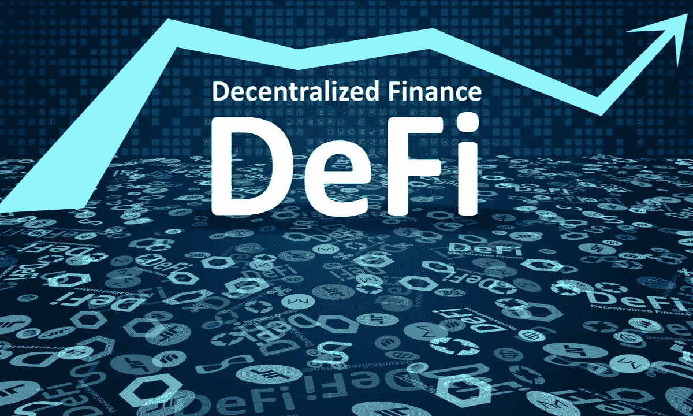

# 那么 Defi 到底是什么？分散金融解释

> 原文：<https://medium.com/coinmonks/so-what-exactly-is-defi-decentralized-finance-explained-e88c2d6e380a?source=collection_archive---------28----------------------->

这是中国社交媒体平台知乎上的一篇翻译文章，作者是用户“司马懿”

来源:https://www.zhihu.com/question/324838085

Defi 的意思是去中心化财政。

通过令牌化的过程，加密货币的世界希望金融交易可以使用 Defi 变得完全去中心化。

然而，金融去中心化的困难不在于技术本身，而在于如何取代我们当前的衍生品交易系统。

当比特币和 Etherium 被转让给另一方时，数字资产主权被全部转让。如果我拥有一个比特币，并转让给你，所有权现在属于你。这种交易的性质赋予了数字资产抵制审查和监管的特殊特征。这很重要，因为政府很容易控制借贷双方的关系。普通人的钱被冻结所需要的只是政府的一个指令，突然他的资金就没有了。

然而，当谈到比特币时，除非普通人受到外力的物理胁迫，否则他现在拥有的比特币将永远是他的，任何外力都无法改变这一点。

回到传统金融，当你寻求银行贷款时，可用于贷款的资金来自银行的储户。理论上，该银行不会向储户过度借贷，因为它有一笔准备金，并受央行监管，因此如果该银行有 100 万英镑，它应该能够贷出 300 万英镑。

但问题就在这里，它与所有权有关。如果我有一台相机，让你使用，但现在你想从我这里借三台相机，作为交换，你在拍完照片后会给我五台新相机，我怎么保证你会归还我给你的相机？我怎么能保证你会履行你的承诺。现在缺乏监管是一个问题。

Defi 需要在区块链以数字方式解决这一问题，以便我们能够开展普通和高级的金融服务。

从区块链的角度来看，先进的金融服务是完全可能的，因为实施了所谓的“智能合约”这些合同创建并执行贷款、抵押或所有权转让协议。它是一个基于算法的去中心化的借贷系统。

通过区块链，Defi 解决了抵押品管理方面的问题，使融资融券交易商能够进行杠杆交易；最终使衍生品有可能拥有与传统金融市场相似的功能。

让我们以比特币和 Etherium 为例。假设有一种叫做“X 链”的区块链，它的本地代币叫做“X 币”

如果我想用比特币做抵押借 Etherium，可以:
1。拿走我的比特币，把它锁在一个特殊的位置，那时我可以在“X 链”上铸造一个合成版本的比特币——让我们称之为伪 BTC(实际上这被称为包装 BTC 或 WBTC)。
2。然后在这个区块链上，我可以利用智能合约提供我的伪 BTC 作为抵押品。这将允许我铸造本地令牌:“X 令牌。”
3。然后，我可以用这个“X 令牌”购买“伪 ETH”(实际上这也称为包装 ETH 或 WETH)
4。然后，我可以使用这个伪 ETH 来获得相应数量的 Etherium，交易就完成了。

整个过程是使用智能合同完成的，没有一个人的输入。然而，如果在商定的时间内贷款没有偿还，我作为抵押品的比特币将会消失，因为智能合同将识别条款中的违约行为，并相应地处理你的抵押品。

这是一个平等抵押贷款比率的实施。然而，提供的金融服务可以是灵活的，因为你可以选择提供更高数额的抵押品相比，你的贷款。与此同时，你也可以选择提供 1 BTC 作为抵押品，但可以借入 2 BTC 甚至 10 BTC 用于投机。

假设我们之前提到的这个“X 链”充当银行，每个人锁定他们的比特币都不会有问题，这些比特币随后将被转换为伪 BTC，供“银行”使用。有了这些可用的资金，问题是不计后果的借贷和利息的存在会不会产生许多不良贷款？

去中心化财务对坏账零容忍。当不存在坏账的可能性时，反过来说，Defi 的结果是“非常宽容”。道教有一个教义是这样的。'国乱之时，有忠臣'这个想法是，如果每个人，包括部长们，都被视为潜在的叛徒，他们都会表现得最好。同样，对于 Defi，如果每笔贷款都不能容忍任何形式的失败，那么整个系统将保持和谐。

坏账究竟是如何防范的？通过智能合约强制清算。

智能合约的优势在于，所有采取的行动都是在区块链上自动完成的。你可以用 1 BTC 作为抵押品，现在你可以得到 10，但在你得到它之后，如果你账户中的资产价值下降到 9.05btc，那么对不起，智能合约要清算你的抵押品了。

这与股票、期货或外汇保证金交易是一样的，但唯一的区别是，它是在区块链以分散的方式进行的。

有杠杆、抵押品和资金池；金融的所有基本方面都在那里，理论上更复杂的衍生品也可以在同一个地方创造出来。

当然，这项新技术有许多陷阱。例如，黑客可能会找到让区块链过载的方法，以减缓智能合约的运行速度，在此期间，价格可能会发生变化，导致坏账增加(由于没有清算本应清算的账户)。

> 加入 Coinmonks [Telegram group](https://t.me/joinchat/Trz8jaxd6xEsBI4p) 并了解加密交易和投资

DeFi 是一个非常有趣的概念。早在 2018 年，我在研究 stablecoins 的时候，就觉得未来肯定会有 DeFi。但我也非常担心应用程序定义。一个反监管、反审查，还依赖计算机技术具体实施的去中心化的金融衍生品平台，可以称之为金融丛林；就算是银行家，更别说普通人了。事实上风险非常大。

— — — — — — — — — — — — — — — — — — — — — — — — — — — — — — — — — — — — —

🔴点对点加密货币交易现在是、将来也会是规避日益恶化的资本管制的最重要工具。加入点对点加密交易革命。立即报名—[https://wild-west . trade](https://www.youtube.com/redirect?event=video_description&redir_token=QUFFLUhqbEs0WWgybWhXelY1SGZoRC1mN1FYS2tyZGRFd3xBQ3Jtc0tueUt1d01FcS00ZllzQzBBTndkOXktbVZnY2Rha1c1Q0xVWHp6aVJpNjdqMXUyN0FzMmpoaWJWT3NGQm5acE84V1Qtc0lUcGpaYU9ralN0NUVINlBlNGVzb1JCV3c3RElqaVVsQXRrUm9pR0RnTEFYaw&q=https%3A%2F%2Fwild-west.trade%2F&v=snmHTbk-DSU)