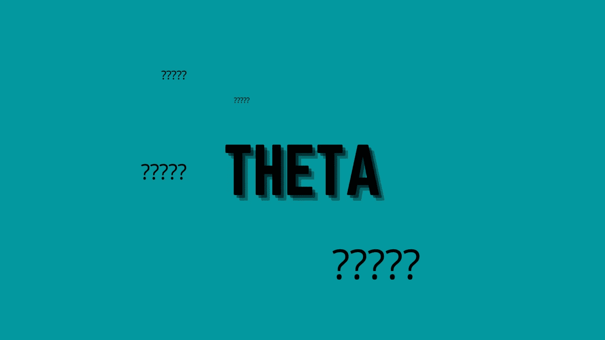

# 那么什么是θ，它有什么作用？

> 原文：<https://medium.com/coinmonks/so-what-is-theta-and-what-does-it-do-31cd8c97a253?source=collection_archive---------36----------------------->

西塔区块链是一个加密货币和分散的视频传输网络。这个创新的平台为流媒体行业的问题提供了技术和经济的解决方案。因此，θ区块链被创造出来，以激励网络带宽共享。特别是，用户将能够贡献他们多余的带宽和计算资源来换取代币奖励。

Theta 的开发人员使用一种创新的新区块链来解决当今视频流行业面临的各种挑战。该平台的设计尤其致力于消除传统内容交付渠道中的“瓶颈”。专业人士称之为“最后一英里”问题。这是 4k、8k 和下一代平台等高分辨率、高比特率流媒体平台的主要问题。

Theta 的用户可以访问视频内容和数据传输的全球基础设施。这个开源项目提供电子竞技、音乐、电视/电影、教育、企业会议、点对点流媒体和其他服务。此外，该平台的分散性质确保了 Theta 由自己的用户供电。

正如我们提到的，Theta 网络中的节点由用户组成，他们拥有各种类型的硬件和资源来观看视频内容。

所有这些节点都可以成为 Theta 网络中的“缓存节点”，存储视频并转发给世界各地的观众。这旨在减少传统内容交付系统对地理上分散的数据中心的依赖，这些数据中心与客户位置的距离会降低视频流的质量。

取而代之的是，视频数据将由地理上靠近观众并且数量足够大的节点进行缓存和中继，以便在不损失质量的情况下传送视频。不再依赖 cdn，Theta 网络中的“对等节点”将能够从彼此那里获取视频流。

作为继续共享带宽和吸引新节点加入 Theta 网络的激励措施，参与该模式的节点将获得 Theta 令牌奖励。如果该模式成功，Theta 团队预计将节省高达 80%的内容交付成本，因为无需维护昂贵的数据中心。

加密货币市场中的许多项目在 2021 年经历了过山车般的旅程，但由于加密的性质，许多代币达到了历史新高，然后在接下来的几个月里随着围绕该项目的炒作消退和交易者转向更绿色的牧场而逐渐走低。

这正是θ发生的情况。

Theta token 于 2020 年 12 月 11 日开始运行，2021 年 4 月 16 日，它从 0.621 美元的价格上涨了 2，468 美元，达到 15.90 美元的新高，因为谷歌和索尼欧洲等全球 500 强公司加入了该网络的验证程序，Theta Labs 获得了其第二项关于分散式区块链视频和数据传输设计的专利。

根据 Cointelegraph Markets Pro 和 TradingView 的数据，随着更广泛的加密货币市场承压下跌，Theta 的价格在 12 月 27 日达到 5.98 美元的高点后，已下滑至 3.85 美元附近的主要支撑位置。

Theta 的利害关系证明机制是多层或多 BFT 的。利益证明机制要求用户标记令牌，以便成为“节点”并验证通过网络发送的数据。

同样的过程适用于多 BFT 利益相关证明；然而，有多个层来提高效率。Theta 的初始层有 20–30 个企业验证器节点。更大的组织经营这些，他们给区块链增加新的街区。第二层由成千上万个守护节点组成，这些节点是社区的成员。监护节点完成块创建过程并保护网络。它是用户用 THETA 创建的守护节点。

赌注可以被认为是一种被动收入。守护节点在促进区块链更新和安全的最小启动动作之后在 TFUEL 中被奖励。用户的奖励与他或她下注的金额成比例。改善桩接入是另一个潜在的积极因素，为西塔和它的 t 燃料公用事业和天然气令牌。

当该网络首次推出时，用户必须投入至少 10，000 THETA 才能运行一个 guardian 节点并帮助保护网络。所需的最低限额最终降至 1000，但 Theta 的价格在 2021 年初超过 14 美元，这意味着大多数代币持有者也无法达到这一门槛。这导致了一些网站的建立，比如 GPooL，以及最近的 Thetaboard，它为 THETA 和 TFUEL 的持有者提供了一个获取赌注的机会，以换取一小笔佣金。为了服务于不断增长的 NFT 生态系统，Thetaboard 还推出了自己的 NFT 市场，其中包括凯蒂·佩里等流行名人发布的限量版 NFT 系列。

那么 2022 年和未来呢？

如果西塔的看涨趋势继续下去，到 2022 年底可能会达到 20 美元，你需要再次去做自己的研究，这不是财务建议。此外，在达到 5 美元大关后，2022 年上半年可能会出现快速增长。随着即将到来的合作伙伴关系和 theta 的开发在管道中，达到 20 美元的价格是非常乐观的，但不可否认的是在不久的将来是可行的。θ可能下降，但它肯定没有出来，所以它肯定是一次观看