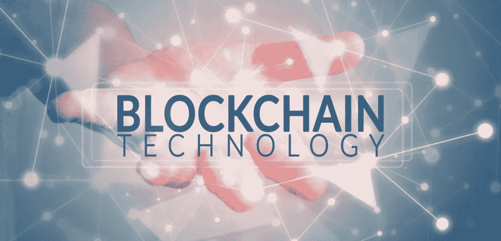

# 那么，区块链到底是什么？

> 原文：<https://medium.com/coinmonks/so-whats-the-blockchain-actually-is-254bd0f6e19?source=collection_archive---------39----------------------->



知道吗？

为什么所有的人都在为此大喊大叫？那么，它一定有很大的价值，对吗？

酷！让我们看看这到底是什么。

*区块链*字面意思是区块(节点)的链，每个区块都包含一些数据，并且相互链接。该数据可以是一些值，如*交易参考号*、*交易 id* ，或者我们可以说是可以公开存储的任何信息。这意味着区块链是一个公共的(*去中心化的*)数据库。

《哈佛商业评论》将区块链定义为“一个开放的、分布式的分类账，能够有效地、可验证地、永久地记录双方之间的交易。”它也被称为“点对点”网络，这意味着任何添加到区块链网络的新交易，都可以被该网络中的所有对等体访问。

如果所有对等体都可以访问数据，那么任何人都可以篡改数据，对吗？但是，为什么它如此受欢迎呢？好奇吧？

我们来看看为什么。

因为区块链是*不可变的*。这意味着一旦新数据被添加到块(节点)中，任何人都不能删除或修改它。等等，但这怎么可能呢？

让我们想象一下，在一个区块链网络中有 5 个可用的节点，并且所有节点都相互*链接*。

```
<-->  Node 1 <--> Node 2 <--> Node 3 <--> Node 4 <--> Node 5 <-->
```

如果您想修改*节点 5* 的一些数据，那么您必须需要修改*节点 4* 的数据。像这样，你需要修改*节点 3* 、*节点 2* 、*节点 1* 。因为每个*新节点*包含来自*前一个*节点的参考数据。让我们假设您修改了所有 5 个节点。但是如果是 100 万个*节点*的链呢？如果 1000 万个节点呢？因此，不可能从一个节点修改数据。

这就是为什么*区块链*是

*   分布的
*   分散的
*   高度可用
*   不变的
*   透明的
*   安全的

这是区块链是什么的一个基本思路。我希望你会觉得它很有启发性。

感谢您阅读本文。如果你喜欢这个内容，请给我一颗心。新博客见！

```
Happy Coding!
```

> 加入 Coinmonks [电报频道](https://t.me/coincodecap)和 [Youtube 频道](https://www.youtube.com/c/coinmonks/videos)了解加密交易和投资

# 另外，阅读

*   [CoinDCX 评论](/coinmonks/coindcx-review-8444db3621a2) | [加密保证金交易交易所](https://coincodecap.com/crypto-margin-trading-exchanges)
*   [红狗赌场评论](https://coincodecap.com/red-dog-casino-review) | [Swyftx 评论](https://coincodecap.com/swyftx-review) | [造币厂评论](https://coincodecap.com/coingate-review)
*   [Bookmap 评论](https://coincodecap.com/bookmap-review-2021-best-trading-software) | [美国 5 大最佳加密交易所](https://coincodecap.com/crypto-exchange-usa)
*   [如何在 FTX 交易所交易期货](https://coincodecap.com/ftx-futures-trading) | [OKEx vs 币安](https://coincodecap.com/okex-vs-binance)
*   [CoinLoan 审查](https://coincodecap.com/coinloan-review) | [YouHodler 审查](/coinmonks/youhodler-4-easy-ways-to-make-money-98969b9689f2) | [BlockFi 审查](https://coincodecap.com/blockfi-review)
*   [XT.COM 评论](https://coincodecap.com/profittradingapp-for-binance)币安评论 |