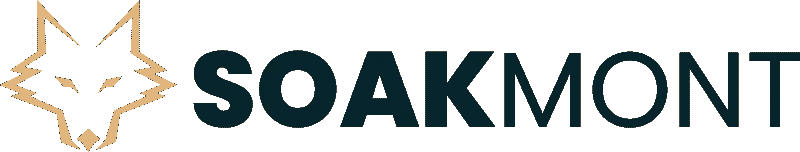

# 索克蒙特与大西洋信托公司签署意向书

> 原文：<https://medium.com/coinmonks/soakmont-signs-letter-of-intent-with-atlantic-trust-company-8773a472e4aa?source=collection_archive---------40----------------------->

SKMT BSC 令牌背后的公司索克蒙特集团公司(Soakmont Group Inc)今天朝着实现其使用 web3 和区块链技术扰乱和改善一系列行业的雄心迈出了一大步，但通过宣布与加拿大监管金融机构**大西洋信托公司** (ATC)签署意向书，仍保持完全监管。

Soakmont Group，Inc——正在开发一系列金融技术产品和解决方案，包括 *Soakmont 投资平台、Soakmont 旅游和租赁平台、Soakmont DeFi 应用程序和 staches NFT—*, ATC 的意向书规定了双方将如何努力正式达成协议，为加密货币和区块链提供独特、突破性和完全受监管的产品。

该协议将见证 Soakmont 和 ATC 的合作:

*   在 2022 年推出一家*新的数字子公司信托/金融机构*，以满足加密货币和区块链行业的需求
*   推出完全安全、受监管和审计的 1:1 菲亚特资产支持*加元和美元稳定账户*
*   ATC 及其子公司将与 Soakmont 合作，确保即将推出的 *Soakmont 投资平台*在资产令牌化和部分所有权方面得到充分监管。
*   ATC 将为索克蒙特官方 NFT 收藏的持有者提供优质服务

即将成立的子公司将成为创新的 *Soakmont 投资平台*的基石，这是一种利用区块链和 Web3 技术将资产令牌化的革命性方法，允许完全受监管的部分所有权和资产投资。$SKMT 将在该平台的功能中发挥关键作用。与 ATC 的合作将使 Soakmont 专注于所有形式的私募股权和房地产投资。

Soakmont 和 ATC 正式授权 ARCHER 律师和公证人确保协议的完成和新子公司的成立。

向 StachesNFT 持有人提供优质服务是 NFT 行业的一个重大变化，使 StachesNFT 成为唯一一家由完全受监管的金融机构支持的 NFT。 *StachesNFT* 持有者还将受益于大范围的索克蒙特生态系统和日常设施，以及 10，000 个独特的 NFT 中每一个的精美艺术品。

一旦 Soakmont 与 ATC 之间的协议在 2022 年第三季度最终确定，该附属金融机构将推出多链 stablecoins。这将标志着一个重要的 Soakmont 活动的开始，首先是推出 Soakmont 投资平台和第一个部分所有权的私人股本资产的虚拟化。

Soakmont 和 ATC 看到了这一合作伙伴关系的巨大潜力，共同打造一系列产品和服务，为金融科技和加密货币领域带来巨大价值。进一步的更新将在适当的时候公布。

欲了解更多信息:

info@soakmont.com

[www.soakmont.com](http://www.soakmont.com/)

www.stachesnft.com

$SKMT 合同地址为:0x 1 b 2 fdb 1626285 b 94782 af 2 FDA 8 e 270 e 95 cebc 3 b 4

并可在此处购买:

[https://pancakeswap . finance](https://pancakeswap.finance/swap?outputCurrency=0x1b2fdb1626285b94782af2fda8e270e95cebc3b4)

 [## 如何购买索克蒙特(SKMT)指南-币安

### 币安正在不断审查和添加可以在币安平台上使用的加密货币。如果你愿意…

www.binance.com](https://www.binance.com/en/how-to-buy/soakmont) 

> 加入 Coinmonks [电报频道](https://t.me/coincodecap)和 [Youtube 频道](https://www.youtube.com/c/coinmonks/videos)了解加密交易和投资

# 另外，阅读

*   [OKEx vs KuCoin](https://coincodecap.com/okex-kucoin) | [摄氏替代品](https://coincodecap.com/celsius-alternatives) | [如何购买 VeChain](https://coincodecap.com/buy-vechain)
*   [币安期货交易](https://coincodecap.com/binance-futures-trading)|[3 comas vs Mudrex vs eToro](https://coincodecap.com/mudrex-3commas-etoro)
*   [如何购买 Monero](https://coincodecap.com/buy-monero) | [IDEX 评论](https://coincodecap.com/idex-review) | [BitKan 交易机器人](https://coincodecap.com/bitkan-trading-bot)
*   [CoinDCX 评论](/coinmonks/coindcx-review-8444db3621a2) | [加密保证金交易交易所](https://coincodecap.com/crypto-margin-trading-exchanges)
*   [红狗赌场评论](https://coincodecap.com/red-dog-casino-review) | [Swyftx 评论](https://coincodecap.com/swyftx-review) | [CoinGate 评论](https://coincodecap.com/coingate-review)
*   [Bookmap 点评](https://coincodecap.com/bookmap-review-2021-best-trading-software) | [美国 5 大最佳加密交易所](https://coincodecap.com/crypto-exchange-usa)