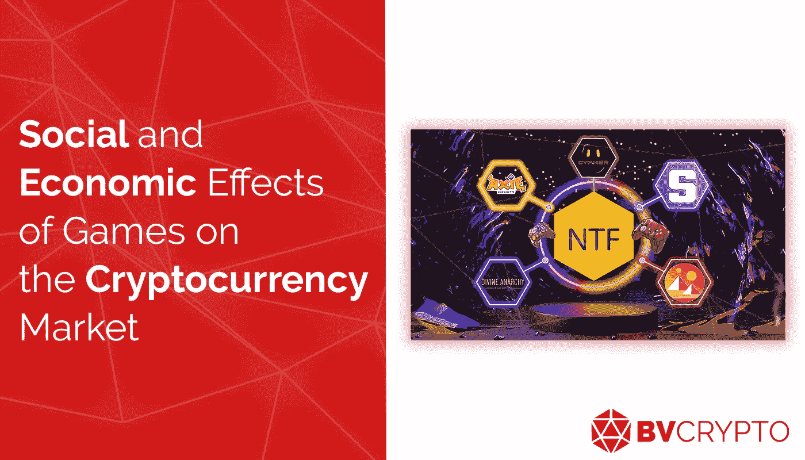
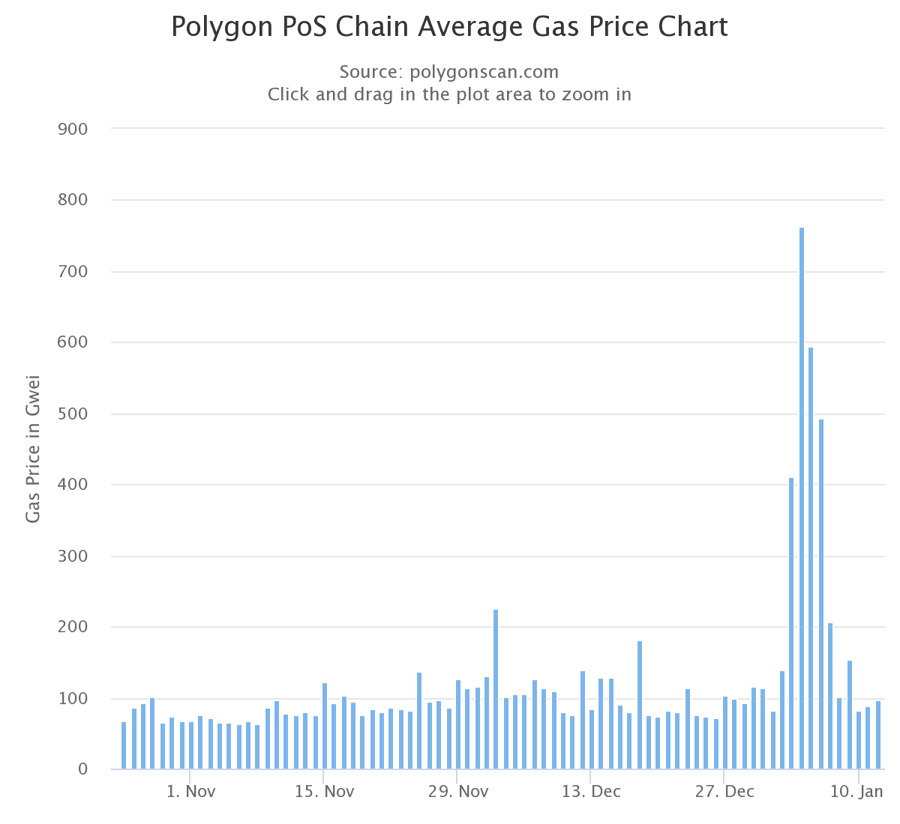

# 游戏对加密货币市场的社会和经济影响

> 原文：<https://medium.com/coinmonks/social-and-economic-effects-of-games-on-the-cryptocurrency-market-414dd644327a?source=collection_archive---------19----------------------->

在 NFTs 流行之前，加密货币市场正在分散平台上开发基本的银行服务。金融自由所走的道路，加上 NFTs，使得加密货币尤其触及了艺术和游戏领域。这两个领域在 NFT 市场吸引了最多的关注，也是最活跃的领域，为加密货币在银行服务之外的生活中的应用做出了重要贡献。虽然艺术世界正在快速发展，但由于世界知名的拍卖行迅速适应了 NFT 和艺术家的兴趣，游戏行业将需要时间来发展其所需的基础设施。尽管由于 NFT 市场的推动，交易量与日俱增，但很难断定加密货币已经有了一个发达的游戏行业。由于长期以来一直试图解决的围绕去中心化、可伸缩性和安全性的三难问题，区块链网络的可伸缩性困难可以在这一问题的根本原因的开始显示出来。在这篇文章中，我们将重点关注去年首次出现在市场上的“玩赚”游戏如何触发区块链网络的边界以及它们对玩家的社会影响。

**日常使用**

这是一个每个人都很好奇的问题，到底什么时候加密货币会取代法定货币在日常生活中积极使用。虽然支付系统已经开始在这一领域发展，但仍然不能宣布加密货币已经完全取代法定货币。这是因为加密货币被视为一种投资工具，而不是一种日常消费的货币。例如，让我们假设一个人在加密货币交易所使用信用卡。由于加密货币价格的高波动性，对于这个人来说，将他/她的钱留在交易所不是很有吸引力。另一方面，由于其集中的结构，将其作为稳定的货币储存并没有提供与银行非常不同的解决方案。此外，由于交易所是集中的，它们在这方面并不比银行有多大优势。因此，尽管投资加密货币是有意义的，但在日常生活中使用它们还不是很有利。

另一方面，含有 NFT 内容的游戏有可能使加密货币不仅仅是一种投资工具，而是一种日常需求的社交工具。除了管理金融交易和投资的交易所、NFT 市场或 DeFi 平台之外，NFT 的游戏也开始被积极用于缓解压力和与一群朋友共度时光，它被认为是揭示加密货币最重要的社会发展过程的候选对象。

术语“日常使用”主要指我们在外面购买的东西。然而，我们大多数人花大量的时间在虚拟世界中。因此，在虚拟世界中购买的东西也应该在“日常使用”的标题下进行评估。因此，游戏对加密货币领域的贡献可以在“日常使用”类别下讨论。

**区块链的极限**

加密货币市场中的游戏组织在 NFTs 流行之前就已经存在。Crypto Kitties 是以太坊网络上的一款流行游戏，可能被认为是这一趋势的早期先驱之一。然而，游戏变得流行的事实并没有给以太坊网络带来多少积极的后果。随着玩家频繁向网络发送交易请求，支付给矿工的瓦斯逐渐增加，导致网络变得昂贵且低效。这个问题，最早出现在 2017 年，不幸的是，今天依然存在。在 1 月的第一周，一款名为“向日葵”的游戏导致汽油价格大幅上涨，在以廉价、快速和可靠著称的 Polygon 网络上造成了相当大的拥堵。

这里需要注意的最本质的一点是，无论是 2017 年的以太坊网络，还是现在的多边形网络，都在经历这样的气增，尽管事实上只有一款游戏是热门的。考虑到几乎每天都有新的 NFTs 游戏项目发布，随着更多游戏的流行，区块链网络可能会变得越来越昂贵。

出于上述原因，游戏项目开发自己的网络或使用 Avalanche 和 Solana 等替代网络。例如，标志着过去一年的 Axie Infinity 在自己的网络 Ronin 上运行。简而言之，区块链网络公司现有的能力无法支持许多流行的游戏，如 Axie Infinity。因此，可以说我们正在接近区块链网络的自然极限，游戏是加密货币市场的最新趋势。作为解决方案，跨链和多链平台，允许游戏代币到达以太坊等主流网络。随着现有可扩展性研究的成熟，游戏行业有可能实现完全发展的生态系统，并将加密货币市场推向下一个水平。

**社会困境**

具有 NFT 内容的游戏的基本游戏原则被表达为“玩到赚”。对于许多希望通过玩游戏赚钱的人来说，现有的游戏项目可能被视为朝着这个方向迈出的重要一步。然而，当前游戏行业的玩家似乎对游戏中包含加密货币和 NFT 不太感兴趣，因为当前游戏行业并不基于该系统。这是因为用户可以出于娱乐目的免费或一次性购买访问现有游戏，但是预计“玩赚”游戏将创造一种需要玩家经常性成本的经济。此外，认为游戏不仅会被玩家使用，而且还会被那些希望利用或操纵游戏赚钱机会的用户使用的预期，产生了一种负面看法。

当我们考虑关于 Axie Infinity 的问题时，我们可以看到，在游戏最受欢迎的时候，3 Axie 玩游戏的成本是数千美元。进入游戏的初始成本如此之高，使得新玩家难以进入游戏，并导致游戏远离娱乐因素，而娱乐因素是游戏最基本的功能。因此，在以玩赚原则为基础的游戏中，进入游戏的成本低，以及 NFT 产品的升值，实际上在很大程度上解决了问题。事实上，Axie Infinity 最近宣布，它正在努力使游戏免费开始。Axie Infinity 因其受欢迎程度而成为行业领导者。所以，新推出的游戏项目要想和 Axie 竞争，降低进入成本是当务之急。因此，可以看出，NFT 游戏正处于一个新时代的门槛上，玩家在成本领域的担忧将被消除。由于游戏中的费用也存在于当前的游戏市场中，因此预计不会引起玩家的反应。

**金字塔式批评**

对使用“玩赚”概念的游戏最常见的批评之一是，这是一个金字塔系统，当新玩家停止进入时，它就会倒塌。随着游戏的普及，游戏 NFT 需求的增加自然也就提高了价格。因此，在消除金字塔批评方面，诸如以最小成本提供游戏入口和鼓励玩家在游戏中进步的机制的改进是极其重要的。

进入市场的成本并不是需求不可持续的唯一原因。正常情况下，由于游戏行业的需求每年都在增加，因此没有严重的行业需求减少问题。然而，令人担忧的是，玩家对游戏的需求可能会减少，这是因为游戏行业的大公司并不急于投资 NFT 的游戏。

在文章的开头，我们提到了艺术领域的 NFT 是由世界知名的拍卖行与传统买家汇集在一起的。拍卖行的迅速采用很快平息了公众关于艺术品采用 NFT 格式是否合理的辩论。由于拍卖行的声望和艺术的主观性，艺术 NFT 很快被采用。在游戏 NFT 的问题上，行业的领先公司避免快速决策。其中的原因可以总结为，与艺术相比，游戏具有复杂得多的流程和组件。今天，尽管育碧和 EA 等领先公司对具有 NFT 内容的游戏进行了各种研究，但游戏的开发和采用过程需要时间。因此，玩赚游戏的 NFTs 需要时间来与传统买家互动，也就是说，对加密货币不感兴趣的玩家，就像对艺术品一样。

随着金字塔批评中看到的与需求连续性相关的问题、进入成本的降低以及该行业领先公司在未来几个月内完成当前工作，以及许多成功游戏(如 Axie Infinity)的出现，玩家对基于游戏赚取的游戏的适应将迅速增加，现有问题将得到解决。采取这些行动将确保基于 NFT 的游戏在加密货币市场的崛起不仅限于去年，而是在未来几年继续迅猛发展。

**结论**

毫无疑问，每年产生约 2200 亿美元收入的游戏业务拥有丰富的人力和资本来推动加密货币市场向前发展。区块链网络缺乏可扩展性表明，加密市场还没有为一个完全发展的游戏生态系统做好准备。尽管如此，游戏市场的动态结构和新项目的高数量表明市场的投资胃口很大。基于这一点，许多成功的游戏项目，如 Axie Infinity，将在未来几个月或几年内实现，这并不奇怪。事实上，许多游戏可以在现有平台密度的分散网络中顺利运行，这使得加密货币市场获得了更广泛、更全面的轮廓，不再是一个仅用于投资和货币转移的市场。可以说，随着 NFT 趋势而获得动力的游戏行业代表了加密货币市场的未来。

**编制人:贝尔凯·艾比**

*此处表达的观点和评论归 BV Crypto 所有。BV Crypto 对基于此帖子的任何金融交易概不负责。每一次投资和交易都有风险。当你做决定时，你应该自己做调查。*

> *加入 Coinmonks* [*电报频道*](https://t.me/coincodecap) *和* [*Youtube 频道*](https://www.youtube.com/c/coinmonks/videos) *了解加密交易和投资*

# 另外，阅读

*   [Bookmap 评论](https://coincodecap.com/bookmap-review-2021-best-trading-software) | [美国 5 大最佳加密交易所](https://coincodecap.com/crypto-exchange-usa)
*   最佳加密[硬件钱包](/coinmonks/hardware-wallets-dfa1211730c6) | [Bitbns 评论](/coinmonks/bitbns-review-38256a07e161)
*   [新加坡十大最佳加密交易所](https://coincodecap.com/crypto-exchange-in-singapore) | [购买 AXS](https://coincodecap.com/buy-axs-token)
*   [红狗赌场评论](https://coincodecap.com/red-dog-casino-review) | [Swyftx 评论](https://coincodecap.com/swyftx-review) | [CoinGate 评论](https://coincodecap.com/coingate-review)
*   [投资印度的最佳密码](https://coincodecap.com/best-crypto-to-invest-in-india-in-2021)|[WazirX P2P](https://coincodecap.com/wazirx-p2p)|[Hi Dollar Review](https://coincodecap.com/hi-dollar-review)
*   [加拿大最佳加密交易机器人](https://coincodecap.com/5-best-crypto-trading-bots-in-canada) | [库币评论](https://coincodecap.com/kucoin-review)
*   [用于 Huobi 的加密交易信号](https://coincodecap.com/huobi-crypto-trading-signals) | [HitBTC 审查](/coinmonks/hitbtc-review-c5143c5d53c2)
*   [如何在 FTX 交易所交易期货](https://coincodecap.com/ftx-futures-trading) | [OKEx vs 币安](https://coincodecap.com/okex-vs-binance)
*   [OKEx vs KuCoin](https://coincodecap.com/okex-kucoin) | [摄氏替代度](https://coincodecap.com/celsius-alternatives) | [如何购买 VeChain](https://coincodecap.com/buy-vechain)