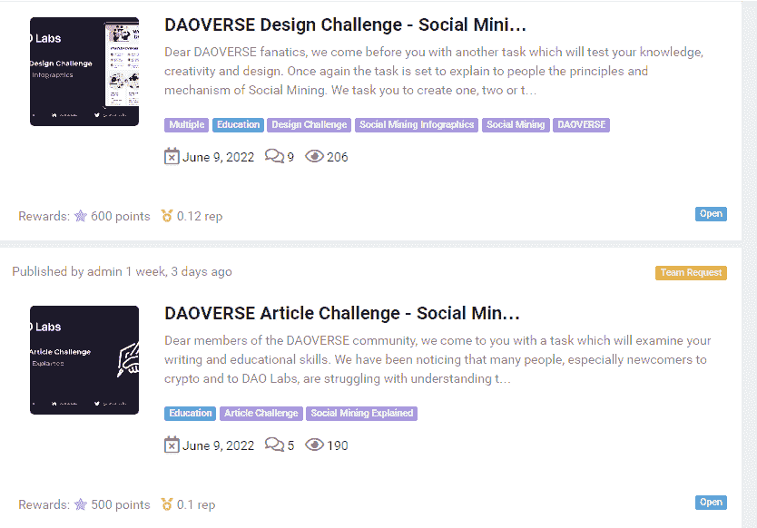
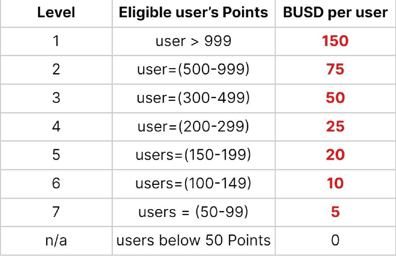
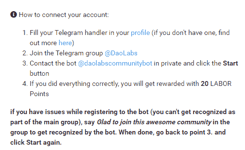
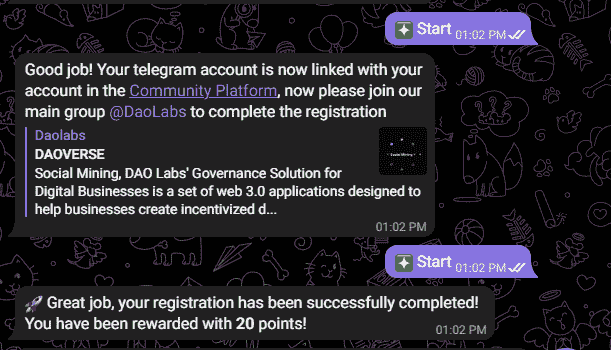
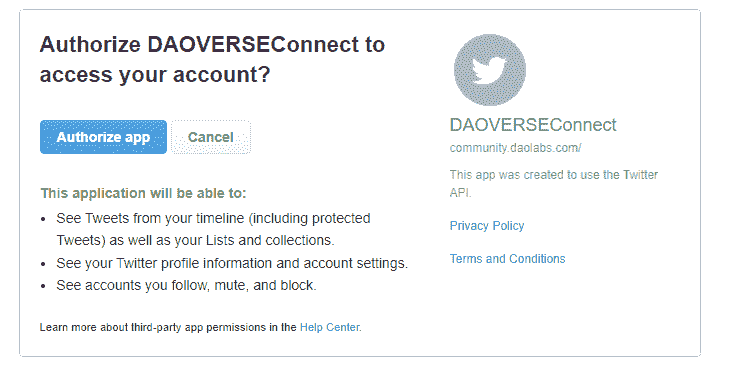

# 社会挖掘——新世界中的新概念

> 原文：<https://medium.com/coinmonks/social-mining-a-new-concept-in-a-new-world-924ba9750733?source=collection_archive---------21----------------------->

根据 DAOVERSE 文件**，社会挖掘**是一个多链的社区建设和治理生态系统，由不同的区域和实体组成:**社会挖掘 SaaS** 、**道实验室**、**道 VERSE** 、**社会挖掘治理**。基本上，这是 DAOVERSE 生态系统中社交挖掘的定义。我不会详细说明这些术语的意思，因为这篇文章是针对初学者和新手的。

在更广泛的背景下，社交挖掘是一种 DAO 治理解决方案，它激励来自任何组织的社区和网络的公平治理和优质内容监管。社交挖掘旨在帮助集中式和分散式组织生成数字足迹，并通过一种激励 UGC(用户生成内容)的 DAO 来传播公众意识。你可能想知道什么是刀。DAO 是分散自治组织的缩写。今天，Dao 在加密领域是一个很常见的现象，因为 crypto 的根源涉及无政府资本主义方面，它应该是厌倦了腐败的政府金融系统的普通人的替代选择，而且今天在加密领域存在的 Dao 不属于任何想要控制组织方向的中央实体或政府。Dao 允许他们的成员对许多事情和话题进行投票。通过这个系统，几乎任何人都可以对任何事情进行投票，但为了对 Dao 进行投票，成员通常需要持有某种加密货币或 NFT。然而，Dao 并不完全公平，因为虽然每个人的声音都会被听到，但拥有最大份额的人最有可能决定结果。但无论发生什么，投票过程中发生的一切都将被记录在区块链上，任何欺骗或恶作剧都不会有任何好处，投票过程中的任何投票操纵都将是不可能的。

现在，回到社交挖掘的话题。Social mining 的目标是奖励那些为项目发展做出重大贡献的人，奖励措施与他们的努力相匹配。现在，奖励机制不仅在秘密中，而且在现实生活中是完全不平衡的。例如，我敢肯定，我们都遇到过马屁精，他们什么都不做，却在工作中获得了所有的荣誉和晋升，对我来说，这真的让我很激动，因为我知道像这样的人可能正在困扰和摧毁许多希望和梦想。别担心。社交挖掘就是为了解决这个问题…..可能不会太快，但希望在不久的将来。

我将介绍社交挖掘在 DAOVERSE 平台上是如何工作的，以及你如何充分利用它。

1.  了解你的角色

平台上有许多可用的角色。当前可用的角色有:

*   发展
*   业务发展
*   营销
*   区块链爱好者
*   美术设计员
*   网页设计师
*   社交媒体影响者
*   内容作者
*   内容翻译器
*   战略伙伴

从这个列表中，我很确定几乎每个人都有自己的角色，无论是像设计这样的技术角色，还是像社交媒体影响者这样的传统角色。仔细想想，现在几乎每个人不都是有影响力的人吗？

2.有哪些任务？

到今天为止，DAOVERSE 上可用的任务主要涉及内容创作，如创建视频、设计、创建模因以及写文章(嘿，我现在正在做这件事！)

3.积分和声誉

点数代表用户工作的数量，信誉代表用户贡献的质量。简而言之，积分等同于数量，信誉等同于质量。

当然，你想从你为任务付出的所有努力中得到一些回报，回报是分数和声誉。然而，这并不是获得积分的唯一途径，你也可以通过治理和在社区委员会上做出贡献来获得积分。此外，你可以从社交媒体项目和推荐中获利。请注意，为了获得推荐收入，推荐人也需要完成任务。

4.我如何得到报酬？

我打赌你在想，别担心，因为我们都在想。这个平台支付你的方式是通过使用 workdrops。根据项目的不同，您需要持有最低数量的代币才能参与工作放弃。但是现在在 DAOVERSE 上，你所需要做的就是参与任务，获得一些积分(至少 50 分才有资格获得 5 BUSD ),你将在工作结束后获得报酬。如果您目前的积分超过 999 分，最高可获得 150 BUSD，但将来奖励可能会增加。

5.连接到电报和推特

这是赢得你的第一个 5 BUSD 的最简单的方法。通过完成这些简单的社交媒体任务，你将能够获得至少 50 分。只需按照以下步骤连接到 Telegram。

一旦完成，你将自动获得 20 点奖励。接下来，推特。

要连接到 Twitter，请转到您的个人资料，滚动到社交帐户详细信息，然后单击 Twitter 旁边的“连接”。您将被重定向到授权 DAOVERSEConnect 访问您的帐户的页面。

授权该应用程序，您的帐户将会连接。然而，要获得 30 分来解锁您的奖励，您必须使用@TheDAOLabs。一旦你做到了，你将得到 30 分。

社会挖掘仍然是一个相对较新的概念，肯定会继续发展和演变久而久之。也许社会挖掘会成为新的范式和新的劳动方式，也许不会。谁知道会发生什么，但有一件事是肯定的，那就是社交挖掘将会持续下去。

> 加入 Coinmonks [Telegram group](https://t.me/joinchat/Trz8jaxd6xEsBI4p) 并了解加密交易和投资