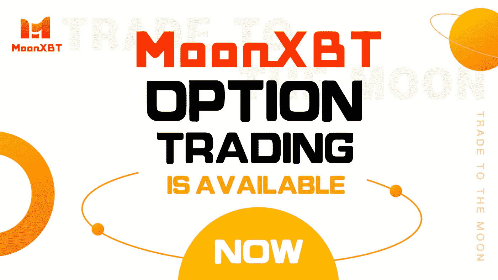

# 社交交易平台 MoonXBT 可能是你治愈 FOMO 的良方

> 原文：<https://medium.com/coinmonks/social-trading-exchange-moonxbt-may-be-your-cure-to-fomo-fdd7ec3d21c0?source=collection_archive---------23----------------------->

即使许多人没有投资加密货币，他们也无法逃避人们在工作中或与朋友的闲聊中谈论它。事实上，当世界各地从名人到金融新闻媒体都在谈论投资加密货币时，许多人在害怕错过的驱动力下进入加密世界，更好的说法是 FOMO。

FOMO 是需要全面研究才能克服的人性。对于许多人来说，FOMO 可能是他们加入加密货币交易的原因，但它从来都不是他们获取利润的关键。

幸运偏爱有准备的人。为了克服谈论最多的情绪，加密交易者必须让自己了解加密交易的风险和收益。

一种方法是通过社会交易。一个年轻的社交交流平台 [MoonXBT](http://www.moonxbt.com/) 自 2021 年成立以来引起了轰动。

在加密交易交易所 MoonXBT 中，除了传统的交易功能，还创建了一个成熟的加密生态系统，将交易与社交相结合。交易者将接受一个加密社区，这个社区有一群专业的、有经验的交易者或新手，他们可以提供指导和友好的建议，让他们先熟悉环境。

在 MoonXBT，当涉及到社交交易时，还有更多事情要做。为了丰富用户在加密交易中的体验，它提供了一键复制交易，为交易者，尤其是新手，提供了顺畅的交易之旅。

MoonXBT 的首席运营官乔治·李(George Lee)说，“MoonXBT 不仅在名称上，而且在实质上把自己展示为一个社交交易平台，”他认为互联性可以用来推动创新和创造力。

有了 T2、复制交易和社交交易等功能，这个平台让专业交易者成为有影响力的人。他强调说，加上复制交易者和交易者之间的社交活动，它形成了更强的共识，迫使交易者在平台和其他场景中使用加密，这推动了加密的采用。

加密教育是 FOMO 的关键，也是促进更多人采用加密技术的关键。这也是 MoonXBT 在各种加密交易交易所中脱颖而出的原因。

“我感到自豪的是，我们的员工有着强烈的热情，通过促进其流动性来推动 crypto 作为交易媒介和价值储存手段的发展。每当用户在我们的平台上遇到困难时，几乎可以立即获得社区支持，这也让我感到谦卑，”Lee 说。

在加密交易中避免 FOMO 的另一个可能的工具是[期权交易](https://www.moonxbt.com/options?tags=TURBINE)，交易者在加密货币的价格趋势上下赌注，如果他们的预测是正确的，他们就会获利。它被认为是管理风险和创造利润的一个伟大的投资工具。

如果交易员忙于家庭和工作，期权交易也降低了他们接触加密货币的门槛。这样，他们就可以不用整天盯着价格图表，避免被 FOMO 进一步左右。

目前，一些交易所提供期权交易服务。幸运的是，MoonXBT 已经将它添加到其投资组合中，并设法使期权交易变得简单，便于加密玩家轻松获利。

它提供最低的期权溢价，是其他主流交易所成本的一半，这意味着交易者购买期权时有 50%的折扣和可能的双倍利润。与任何其他交易所相比，使用 MoonXBT 的交易者极有可能在加密期权交易中获得更高的利润。

在期权产品的到期时间方面——期权交易的另一个关键概念，MoonXBT 也是一个突出的例子。加密交易所通常提供到期时间较短的期权，比如 5 分钟到 1 天，以增加交易量。MoonXBT 则不是这样，它提供的选项的到期时间从 5 分钟到 6 个月不等。

为了满足各种交易者的需求，MoonXBT 还提供权证期权、接触期权、美式独立期权和欧式差价期权。

此外，MoonXBT 对期权交易不收取交易费用。

FOMO 对加密玩家来说可能是一把双刃剑。然而，MoonXBT 通过让交易者消息灵通并与社区中的其他交易者保持同步，为这一问题提供了及时的解决方案。没有必要成为 FOMO 的牺牲品，来 MoonXBT 和其他交易者交往，去面对它，去征服它！

加入 MoonXBT 社区

下载 APP:【www.moonxbt.com/download】T2 商务
联系人:[Selina@moonxbt.com](https://t.me/Selina_0603)电报:[https://t.me/MoonXBTGlobal](https://t.me/MoonXBTGlobal)脸书:[https://www.facebook.com/MoonXBT](https://www.facebook.com/MoonXBT)推特:[https://twitter.com/MoonXBT_Global](https://twitter.com/MoonXBT_Global)

> 加入 Coinmonks [电报频道](https://t.me/coincodecap)和 [Youtube 频道](https://www.youtube.com/c/coinmonks/videos)了解加密交易和投资

# 另外，阅读

*   [AscendEx 保证金交易](https://coincodecap.com/ascendex-margin-trading) | [Bitfinex 赌注](https://coincodecap.com/bitfinex-staking) | [bitFlyer 点评](https://coincodecap.com/bitflyer-review)
*   [Bitget 回顾](https://coincodecap.com/bitget-review)|[Gemini vs block fi](https://coincodecap.com/gemini-vs-blockfi)cmd |[OKEx 期货交易](https://coincodecap.com/okex-futures-trading)
*   [AscendEx Staking](https://coincodecap.com/ascendex-staking)|[Bot Ocean Review](https://coincodecap.com/bot-ocean-review)|[最佳比特币钱包](https://coincodecap.com/bitcoin-wallets-india)
*   [霍比评论](https://coincodecap.com/huobi-review) | [OKEx 保证金交易](https://coincodecap.com/okex-margin-trading) | [期货交易](https://coincodecap.com/futures-trading)
*   [网格交易机器人](https://coincodecap.com/grid-trading) | [Cryptohopper 审查](/coinmonks/cryptohopper-review-a388ff5bae88) | [Bexplus 审查](https://coincodecap.com/bexplus-review)
*   [7 个最佳零费用加密交换平台](https://coincodecap.com/zero-fee-crypto-exchanges)