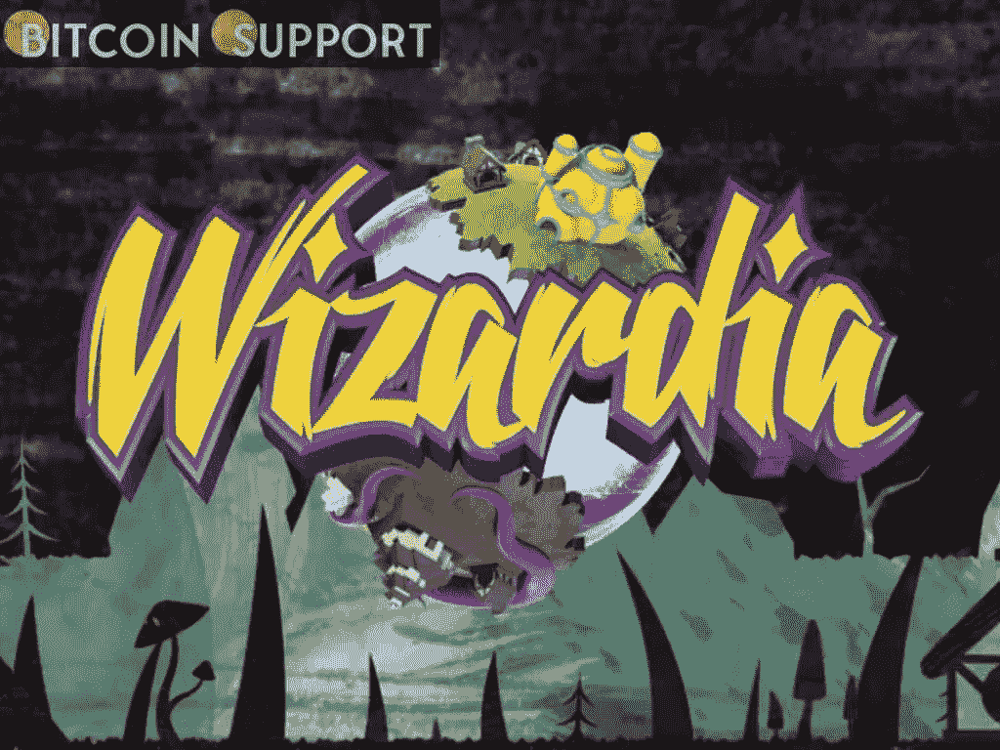

# 索拉纳为基础的游戏赚取元宇宙挑战市场

> 原文：<https://medium.com/coinmonks/solana-based-play-to-earn-metaverse-challenges-the-market-7179a441e3b1?source=collection_archive---------70----------------------->

[https://bitcoinsupports.com/](https://bitcoinsupports.com/)

基于 Solana 生态系统的游戏性和 Wizard NFTs GameFi 项目必须改变游戏赚取模式对短期激励的依赖，以确保其寿命。许多分散融资(DeFi)项目的出现为现有的游戏玩家提供了赚钱的机会。不幸的是，仅仅承诺利润不足以鼓励长期游戏，尤其是在市场变得更加饱和的情况下。玩家正在寻找有丰富历史、人物和背景的知识和复杂的故事情节，一个社区可以围绕着它们团结起来。否则，他们就有可能成为区块链游戏中的一员，被专门设计来从这些游戏项目中吸钱的自动化机器人所控制。

另一方面，故事情节对于游戏的沉浸式元素至关重要，让玩家在旅程中迷失自我，就像在电影、书籍或传统视频游戏中一样。因此，吸引注意力和培养铁杆玩家的新项目必须以此为榜样，首先精心制作故事，然后融入“游戏赚钱”(P2E)机制。

《巫师》是一款试图改变叙事的游戏。据他们的一名团队成员称，“在不完全贬低 GameFi 空间的情况下——毕竟，在 2021 年底，仅它一家就占了 DeFi 空间中 50%的活跃钱包——开发者必须从以前的错误中吸取教训，并建立解决方案来克服它们。”巫师打算通过开发一款经得起时间考验的游戏来实现这一目标，这款游戏可以吸引玩家而不考虑金钱上的刺激。认识到这一市场缺口，Wizardia 开始利用所谓的“clickbaity”短期激励措施来吸引用户，从而改变 GameFi 新趋势的叙事。相反，该平台依赖于他们的游戏，创造了一个精心制作的游戏世界，即使在市场低迷时期也能娱乐大众。这部分是由于团队在 3a 游戏上的工作经验，如《使命召唤:黑色行动:冷战》、《泰坦陨落 2》和《极品飞车 2015》。

**扭转趋势**

为了完成这个任务，巫师带领玩家穿越无边无际的迷雾，在这片逃离未知的土地上，安全港已经开发出来。然后，玩家通过一个大型的基于图形的大陆地图与游戏互动，在这里他们可以通过探索自然资源、建立防御和学习如何改进策略来尝试统治。在引人注目的艺术中，对细节的精心关注使故事情节更加生动。Wizardia 的团队表示感谢，因为他们找到了一个支持团队，可以将游戏的复杂性概念化，从而改善项目的游戏性。

的确，并不是所有的生态系统参与者都会像对赚取机会一样对故事情节感兴趣。因此，该团队通过提供竞技场创世纪 NFTs 实现了持续发展，这些 NFTs 从游戏中产生版税，而无需入侵巫师世界本身。这一进步确保了只有最专注的玩家才能参与游戏。

另一方面，那些将自己定义为激情游戏玩家的人在参与《巫师》时面临的准入门槛更低，因为新玩家开始参与没有入场费。相反，以巫师化身为核心的 NFT 经济可以通过成功的游戏来提升玩家角色。成功的玩家将来可能会选择出租他们的 NFT。

**一个欣欣向荣的社区**

在过去的六个月里，该项目的私人轮次已经完成了 90 %,其种子轮次在不到一周的时间内就结束了，该社区已经发展到超过 233，000 名成员。Wizardia 已经报道了超过 2000 个竞技场创世纪 NFT 已经售出，有超过 60 个 kol 和一群知名的顾问加入。今年的重点将是类似的指标，目标是将游戏的社区基础扩大到 50 万用户，同时推出一些关键功能，每个功能都将分阶段发布，从战场开始，以 VR 和 ar 集成结束。用户还可以期待游戏令牌的初始交换产品(IEO)和初始分散交换产品(IDO)可供使用。

**访问我们的网站:-**[**【https://bitcoinsupports.com/】**](https://bitcoinsupports.com/)

**免责声明:以上为作者观点，不应视为投资建议。读者应该自己做研究。**

> *加入 Coinmonks* [*电报频道*](https://t.me/coincodecap) *和* [*Youtube 频道*](https://www.youtube.com/c/coinmonks/videos) *了解加密交易和投资*

# 另外，阅读

*   [币安期货交易](https://coincodecap.com/binance-futures-trading)|[3 commas vs Mudrex vs eToro](https://coincodecap.com/mudrex-3commas-etoro)
*   [如何购买 Monero](https://coincodecap.com/buy-monero) | [IDEX 评论](https://coincodecap.com/idex-review) | [BitKan 交易机器人](https://coincodecap.com/bitkan-trading-bot)
*   [CoinDCX 评论](/coinmonks/coindcx-review-8444db3621a2) | [加密保证金交易交易所](https://coincodecap.com/crypto-margin-trading-exchanges)
*   [红狗赌场评论](https://coincodecap.com/red-dog-casino-review) | [Swyftx 评论](https://coincodecap.com/swyftx-review) | [CoinGate 评论](https://coincodecap.com/coingate-review)
*   [Bookmap 评论](https://coincodecap.com/bookmap-review-2021-best-trading-software) | [美国 5 大最佳加密交易所](https://coincodecap.com/crypto-exchange-usa)
*   [如何在 FTX 交易所交易期货](https://coincodecap.com/ftx-futures-trading) | [OKEx vs 币安](https://coincodecap.com/okex-vs-binance)
*   [CoinLoan 评论](https://coincodecap.com/coinloan-review) | [YouHodler 评论](/coinmonks/youhodler-4-easy-ways-to-make-money-98969b9689f2) | [BlockFi 评论](https://coincodecap.com/blockfi-review)