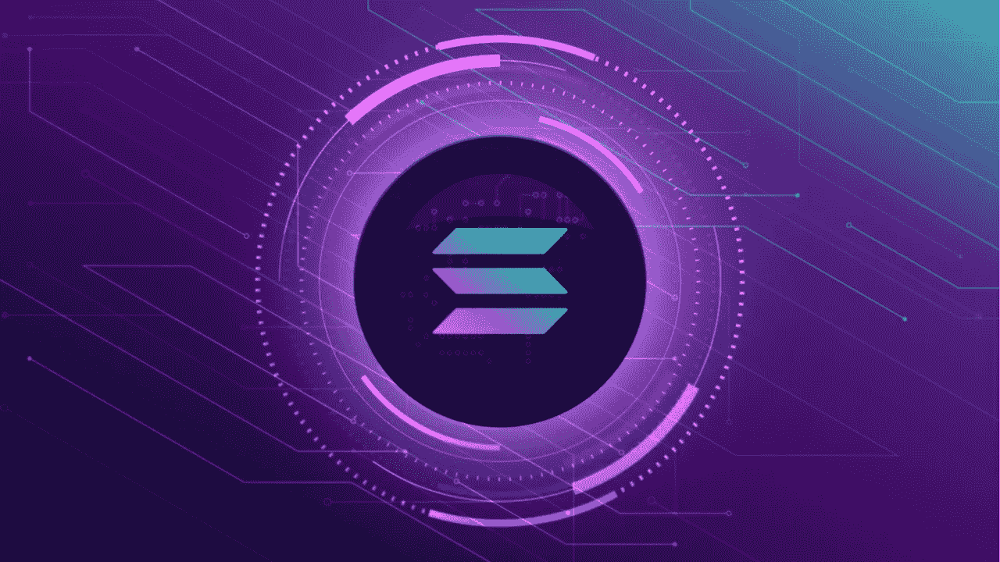

# 索拉纳区块链

> 原文：<https://medium.com/coinmonks/solana-blockchain-91e8b639dad7?source=collection_archive---------25----------------------->

十多年前，在 2008 年金融危机爆发后，世界上第一种加密货币首次亮相全球舞台。尽管比特币继续在加密市场占据主导地位，但它也为成千上万的其他数字资产铺平了道路。从一个暂时的泡沫，加密货币——现在是一个 2 万亿美元的产业——已经走过了漫长的旅程，但仍有一段路要走。

尽管推出了如此多的数字资产，但新的加密货币继续进入市场，试图解决其他资产尚未能解决的问题。市值排名第一和第二的加密货币比特币和以太网(Ether)都对区块链行业的增长起到了推动作用，开创了该技术的许多当代用例。

然而，与区块链的新平台相比，它们在某些领域也有不足之处。可扩展性仍然是他们面临的最大挑战。

当以太坊作为“世界计算机”推出时，它旨在成为一个单一的、可组合的、无权限的网络，可以在无信任的环境中运行代码——它在大多数领域都取得了成功。然而，它缺乏吞吐量，使用一种不受欢迎的编程语言，高延迟和高汽油费使它成为开发者的一个相当具有挑战性的生态系统。

看似无穷无尽的网络已经推出了解决伸缩问题的方案，但没有一个能完全成功实现目标。所谓的区块链三难困境长期困扰着分布式网络，因为新项目试图创建一个既可扩展又安全的分散式网络。

挑战在于实现三重困境的所有三个方面:去中心化、安全性和可伸缩性。虽然一些项目已经成功地建立了解决问题的一个或两个方面的网络，但很少有人接近实现所有三个方面。

就数字资产的价格和越来越广泛的应用而言，区块链产业已不再处于萌芽阶段。人们已经开始赶时髦，区块链网络需要有能力处理额外的需求。索拉纳网络旨在解决所有这些问题。

Solana 是第三代区块链，支持一系列 DeFi 解决方案，包括分散应用程序(DApps)和智能合同的开发。与其他区块链不同，Solana 使用一种混合共识算法，该算法结合了历史证明(PoH)和利害关系证明(PoS)，使网络每秒钟能够执行高达 50，000 次交易。

这种开源倡议还允许比当前仅使用几百个节点的模型更高的效率。虽然 DApps 目前由于其可组合性而停留在以太坊平台上，但鉴于它变得如此昂贵和缓慢，许多人正在寻找替代品。

**解决三难问题**

在创立索拉纳之前，阿纳托利·亚科文科是美国跨国公司高通公司的高级工程师经理。不久后，亚科文科跳槽到 Dropbox 担任软件工程师，最终在 2017 年离开公司开始打造 Solana。

Solana 在 2017 年 ICO 热潮期间推出，并在公共和私人融资轮中筹集了 2500 万美元。它的首要任务是解决比特币和以太坊等网络达成共识所需的时间，这导致 PoH 被纳入其共识算法，这与更广为人知的既定共识机制形成对比。

一年后，Anatoly 聘请他在高通的前同事 Greg Fitzgerald 作为 Solana 的首席工程师，用 Rust 编程语言编写区块链网络的代码。该项目的官方白皮书和内部 testnet 于 2018 年 2 月发布，随后是多个 testnet 阶段，最终导致其激励测试网络于 2020 年发布。

Solana 的 main-net beta 于 2020 年 3 月推出，此后该项目(当时名为 Loom)向其他几位前高通员工敞开了大门，其中包括联合创始人 Stephen Akridge。

Solana 的 PoH 算法使用加密技术为系统建立一个无信任的时间源，同时保持网络的去中心化程度。它提供了区块链上以前事件的不可改变的记录，这有助于按时间顺序存储历史数据。然而，这不仅仅局限于跟踪时间戳和本地时区。

网络的 PoH 算法主要用于确保节点同步，而不是直接用于一致性。它与其 PoS 层并行运行。这允许节点创建自己的时间戳，每个节点的领导者对消息排序，而其他节点处理事务。一旦事务被排序并且已经从领导者节点被接收，验证器/复制器就结算事务，并且一得到确认就发布它们的签名。

这些确认对索拉纳的功能至关重要，并被共识算法视为投票。这是 PoS 展开翅膀的地方，提供它的投票机制来选举网络上的领导者。

Solana 在其平台上还包括许多其他创新，这使它能够匹配其他系统的功能，甚至是集中式系统。这包括它的 BFT 共识，类似于 20 世纪 90 年代末引入的实用的拜占庭容错(PBFT)系统。

然而，虽然 PBFT 有助于达成共识，但索拉纳的 BFT 塔通过 PoH 提供了一个全球时间源。这不仅使其能够监督整个区块链的功能，而且通过最大限度地减少交易延迟和消息传递开销，加快了共识过程。索拉纳生态系统的另一个重要组成部分是涡轮机，它有助于将数据无缝传输到区块链上的节点。

参照 BitTorrent 的传播技术，Turbine 将数据分解成更小的数据包，然后与擦除代码一起发送出去。Solana 还使用其湾流协议来减少确认和领导者转换时间，减少未确认交易池中验证者的内存压力。

此外，Solana 还采用了一个名为 Sealevel 的超并行事务处理引擎，该引擎允许网络同时处理数千个智能合约调用。

通过其管道基础设施，Solana 还可以更快地验证事务，并跨节点复制事务信息，而不管它们的硬件规格如何。Cloudbreak 协议提供了网络上所需的所有可扩展性，可确保通过网络同时读写数据，同时使用归档程序将数据从区块链下载到其分布式分类帐存储中。

使用这种多样化的技术，Solana 网络不需要依赖分片或任何其他类型的第 2 层解决方案来保持其速度和可扩展性。这使得开发人员可以直接在区块链上构建，这比在以太坊或比特币上工作要快几千倍。

SOL 的本地加密货币 SOL 在最近几个月获得了很多关注，尤其是在最近的加密集会期间。SOL 的工作方式类似于 ETH 在以太坊上的使用方式，但持有者持有令牌，以便通过 PoS 共识机制验证交易。它还使用户能够参与治理过程，获得奖励并支付燃气费。

尽管 SOL 的最大供应量接近 5 亿枚代币，但其目前的流通供应量仅为 2.72 亿枚，略高于这个数字的一半。大约 60%的代币由项目创始人和索拉纳基金会控制，只有 38%留给社区。

**索拉纳的灵魂**

当世界刚刚开始与新冠肺炎疫情打交道时，索拉纳证明了自己在紧张的经济和国际金融体系中的韧性。SOL 的市场价值在过去一年中经历了高水平的增长，包括币安、Bitfinex 和 OKEx 在内的几个主要交易所迅速将 token 上市，美国的比特币基地后来也紧随其后，批准其上市。

该网络本身也见证了前所未有的增长，在其平台上部署了多个项目，包括 Chainlink、USDC、USDT、Serum、Terra 和其他几个项目。支持者已经开始将 Solana 称为下一个“以太坊黑仔”，因为它更快，更具扩展性。

Solana 不需要第 2 层解决方案来保持其高性能，这一事实也允许许多主要的 DeFi 项目开始在其上构建，包括 O3Swap、Arweave、SolStarter 和 Oxygen。著名的 DEX 聚合器 OpenOcean 在收到来自社区的大量请求后，也将 Solana 集成到其平台中。

对于区块链的可扩展性来说，第 2 层绝不是一个糟糕的解决方案，开发人员肯定会采用这种方法来创建成功的应用程序。尽管如此，索拉纳的独立性可以支持不受吞吐量限制的更强大的应用程序。在不同的用例中，由于 Solana 如何抽象复杂性，开发人员根本不需要考虑他们的应用程序将如何扩展。

宣称网络是分散的很简单，但实际上，在网络上保持分散比听起来要困难得多。索拉纳声称已经解决了区块链难题，尽管人们仍然认为该平台并不像它声称的那样分散。

毫无疑问，索拉纳速度很快，非常安全，但其权力下放程度仍有待商榷。评论员一再强调，运行一个索拉纳节点的成本比其他节点高得多。要成为索拉纳的验证者，个人将需要花费数千美元的硬件，这与其他区块链不同，在那里任何人都可以以更少的成本成为验证者。

亚科文科似乎意识到了这个问题，并表示索拉纳正在致力于开发更多的验证器节点。目前，在一个 DeFi 应用程序比以往任何时候都受到更多关注的领域，索拉纳同时继续满足开发者和社区的需求。可以说，快速的交易和可扩展性使该网络比目前更分散的替代方案更具优势，尽管这是一个相对较新的项目，但索拉娜在过去两年里积累了大量粉丝。

毫无疑问，SOL 令牌及其价值的疯狂升值可能在吸引投资者进入网络方面发挥了重要作用。在开发方面，索拉纳看到了比其他处于类似发展阶段的区块链项目更广泛的采用。尽管它仍处于测试阶段，但该社区预计在未来几年内会看到对该协议的持续更新和升级。

**本文作者为 Anupam Varshney。**

> 加入 Coinmonks [电报频道](https://t.me/coincodecap)和 [Youtube 频道](https://www.youtube.com/c/coinmonks/videos)了解密码交易和投资

# 此外，请阅读

*   [bookapp Review](https://coincodecap.com/bookmap-review-2021-best-trading-software)|[美国 5 大最佳加密交易所](https://coincodecap.com/crypto-exchange-usa)
*   最佳加密[硬件钱包](/coinmonks/hardware-wallets-dfa1211730c6) | [Bitbns 点评](/coinmonks/bitbns-review-38256a07e161)
*   [新加坡十大最佳加密交易所](https://coincodecap.com/crypto-exchange-in-singapore) | [收购 AXS](https://coincodecap.com/buy-axs-token)
*   [红狗赌场评论](https://coincodecap.com/red-dog-casino-review) | [Swyftx 评论](https://coincodecap.com/swyftx-review) | [CoinGate 评论](https://coincodecap.com/coingate-review)
*   [投资印度的最佳加密软件](https://coincodecap.com/best-crypto-to-invest-in-india-in-2021)|[WazirX P2P](https://coincodecap.com/wazirx-p2p)|[Hi Dollar Review](https://coincodecap.com/hi-dollar-review)
*   [加拿大最佳加密交易机器人](https://coincodecap.com/5-best-crypto-trading-bots-in-canada) | [库币评论](https://coincodecap.com/kucoin-review)
*   [火币的加密交易信号](https://coincodecap.com/huobi-crypto-trading-signals) | [HitBTC 审查](/coinmonks/hitbtc-review-c5143c5d53c2)
*   [如何在 FTX 交易所交易期货](https://coincodecap.com/ftx-futures-trading) | [OKEx vs 币安](https://coincodecap.com/okex-vs-binance)