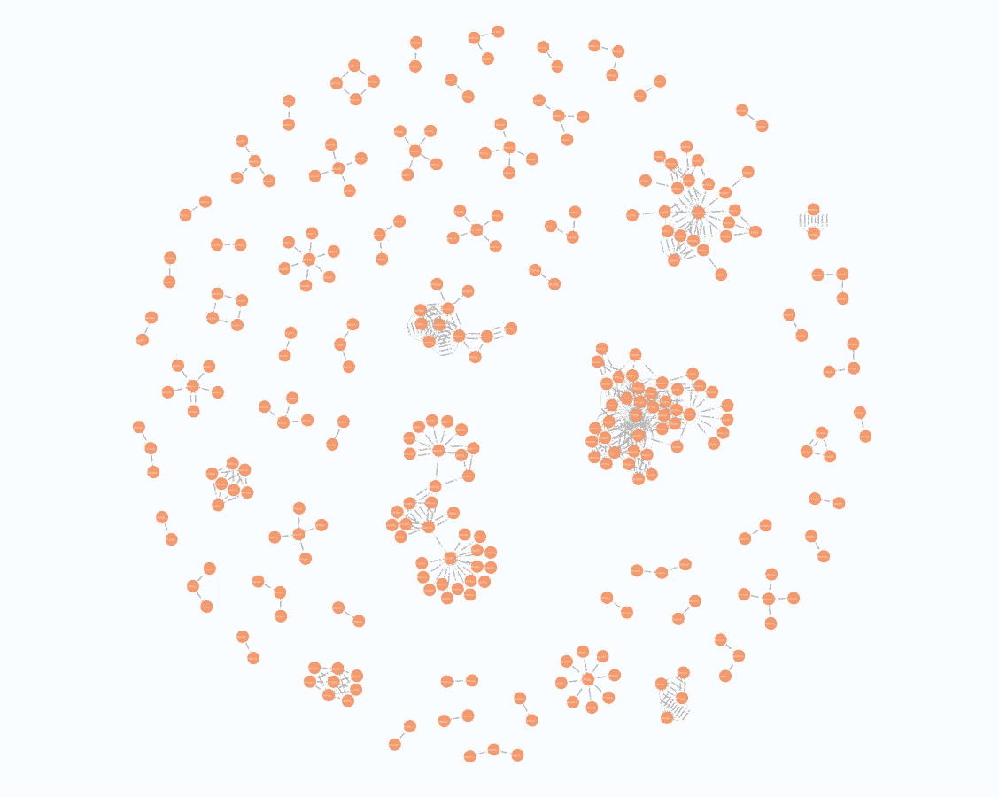
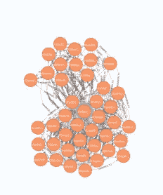
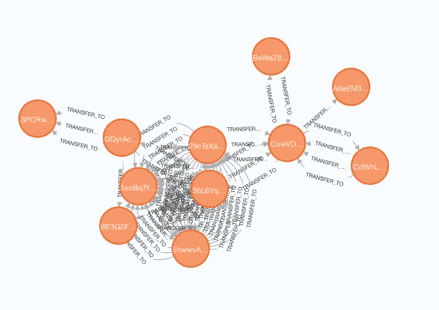

# Solana 区块链数据抓取

> 原文：<https://medium.com/coinmonks/solana-blockchain-data-scraping-2cca0dc056aa?source=collection_archive---------4----------------------->

由于区块链上的交易可以作为公共数据访问，我们可以开发一个抓取客户端来检索每个区块中的数据进行分析。

这里是我用来访问索拉纳区块链的 [Rust API](https://docs.solana.com/developing/clients/rust-api) 中的代码。

创建 RPC 客户端。

```
RpcClient::new("https://solana-api.projectserum.com".to_string());
```

获取当前纪元

```
client.get_epoch_info().unwrap();
```

获取历元间隔的时隙号(`absolute_slot`)。

```
start_slot = epoch_start.absolute_slot;
end_slot = epoch_end.absolute_slot;
```

获取两个时隙号之间的事务块。

```
let blocks = _client.get_blocks(start, Some(end)).unwrap();
for s in blocks {
    let _blk = _client.get_block(s);
    // get the data we need from each block
```

每个块包含一个事务列表。每个交易都有元数据、消息、交易前后的余额以及帐户列表。

有许多不同种类的信息。从我的测试中，我发现下面的 2 个消息将表明转移。

```
"Program 11111111111111111111111111111111 success""Program log: Instruction: Transfer"
```

我过滤掉这些信息，然后从前期余额中减去后期余额。可以追踪账户密钥之间转移了多少端口。

我提取了每笔交易的这些信息，并输入 Neo4J graph DB，以建立不同账户之间所有转账的关系。下面是在 Neo4J 中构建转移关系的 Cypher 查询。

```
MATCH (ac1:Account {key: $ckey}),(ac2:Account {key: $dkey}) 
MERGE (ac1)-[rel:TRANSFER_TO]->(ac2)")
```

下面显示了传递图的可视化。每个红色节点代表一个 Solana 帐户，有向链接是 transfer_to 关系。



图中显示了几个繁忙的集群，其中的帐户相互传输。



图形数据库可以实现许多分析，例如查询哪些帐户是最大的接收者。我们可以很容易地追踪到频繁转账到某个可疑账户的账户群。这有助于识别洗钱。

刮刀的完整代码可以从我的 [Git repo](https://github.com/iwasnothing/solana_scraper/blob/main/src/main.rs) 下载。

> 加入 Coinmonks [电报频道](https://t.me/coincodecap)和 [Youtube 频道](https://www.youtube.com/c/coinmonks/videos)了解加密交易和投资

# 另外，阅读

*   [如何匿名购买比特币](https://coincodecap.com/buy-bitcoin-anonymously) | [比特币现金钱包](https://coincodecap.com/bitcoin-cash-wallets)
*   [瓦济里克斯 NFT 评论](https://coincodecap.com/wazirx-nft-review)|[Bitsgap vs Pionex](https://coincodecap.com/bitsgap-vs-pionex)|[Tangem 评论](https://coincodecap.com/tangem-wallet-review)
*   [如何使用 Solidity 在以太坊上创建 DApp？](https://coincodecap.com/create-a-dapp-on-ethereum-using-solidity)
*   [币安 vs FTX](https://coincodecap.com/binance-vs-ftx) | [最佳(SOL)索拉纳钱包](https://coincodecap.com/solana-wallets)
*   [如何在 Uniswap 上交换加密？](https://coincodecap.com/swap-crypto-on-uniswap) | [A-Ads 评论](https://coincodecap.com/a-ads-review)