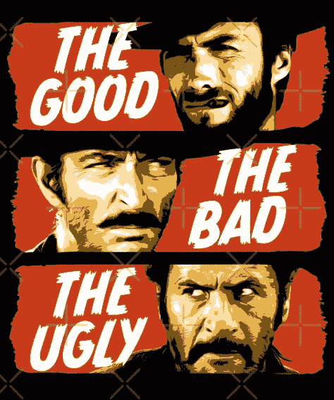

# 索拉纳核心概念

> 原文：<https://medium.com/coinmonks/solana-core-concepts-b74bbaf027f0?source=collection_archive---------2----------------------->

# 好的，坏的，丑陋的

## 好的

索拉纳在不断发展的生态系统中很受欢迎。一些重要的索拉纳项目是公民，奥迪斯，雷迪姆，血清，FTX 和许多 NFT 市场(感谢 Metaplex)。

Solana 使用 Rust，使得现有的 Rust 开发者更容易投入开发。在此之上，他们有一个稳定的框架称为锚，抽象…