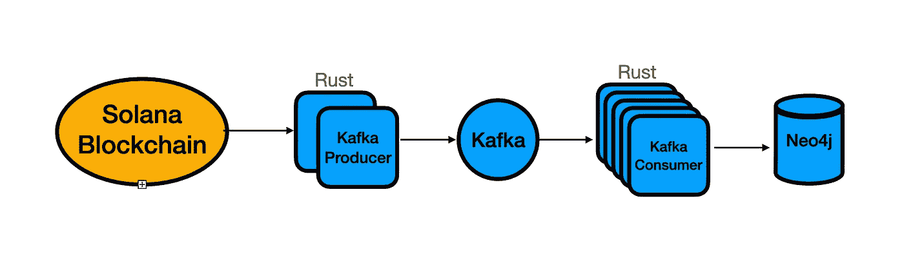

# 310 tps 的 Solana 数据流

> 原文：<https://medium.com/coinmonks/solana-data-streaming-at-310-tps-6f93f76a964e?source=collection_archive---------4----------------------->

在我之前的[帖子](/coinmonks/solana-blockchain-data-scraping-2cca0dc056aa)中，我创建了一个 rust data scraper 从索拉纳区块链网络中提取交易数据。由于 Solana 交易的数据量如此之大，我想进一步研究我以前的高吞吐量数据流系统。

数据流管道体系结构如下:



Rust Solana 客户端线程会反复从 Solana 区块链网络获取最新的数据块。对于每一笔支付交易，它都会向 Kafka 主题发布一条消息。另一个线程池(Kafka consumers)将从 Kafka 代理中提取消息，然后将数据插入 Neo4j 数据库。

上面所有的蓝色组件都运行在我的个人 Mac 上的 docker 容器中，该 Mac 有 6 个 CPU 内核和 8G 内存。代码可以在我的 Git [库](https://github.com/iwasnothing/solana_scraper)中找到。

在达到吞吐量之前，我遇到了很多问题——平均每秒 310 个事务(tps)。在这里，我分享了我学到的经验教训。

1.  数据库连接泄漏和生锈多线程编程

我在使用 neo4j rust 客户端时犯了一个严重的错误。我错误地将 GraphDB 客户端设置放在消息拉线程的执行中。如果线程过早失败而没有回收客户机对象来关闭连接，这将导致数据库连接急剧增加。解决方案是在生成线程之前创建 DB 客户机连接。然而，这在 Rust 中并不是微不足道的，因为 Rust 中严格的变量所有权。基本上，客户端对象不能简单地通过全局变量引用在线程间共享。我们必须使用“[原子引用计数](https://doc.rust-lang.org/std/sync/struct.Arc.html)”(ARC)，这是一个线程安全的引用计数指针。根据 Rust 文档，Arc 解释如下:

> 类型`Arc<T>`提供在堆中分配的类型`T`的值的共享所有权。在`Arc`上调用`[clone](https://doc.rust-lang.org/std/clone/trait.Clone.html#tymethod.clone)`会产生一个新的`Arc`实例，它在堆上指向与源`Arc`相同的分配，同时增加一个引用计数。当指向给定分配的最后一个`Arc`指针被销毁时，存储在该分配中的值(通常称为“内部值”)也被丢弃。默认情况下，Rust 中的共享引用不允许变异，`Arc`也不例外:通常情况下，您不能获得对`Arc`内部某个对象的可变引用。如果您需要通过`Arc`进行变异，请使用`[Mutex](https://doc.rust-lang.org/std/sync/struct.Mutex.html)`、`[RwLock](https://doc.rust-lang.org/std/sync/struct.RwLock.html)`或`[Atomic](https://doc.rust-lang.org/std/sync/atomic/index.html)`类型之一。

这意味着在我们的情况下，我们应该:

1.  使用连接参数创建`graph`客户端对象。
2.  为其做圆弧参考:`Arc::new(graph)`。
3.  通过借用上下文将`Arc`引用传递给衍生的线程，这可以通过在线程创建时添加关键字`move`来完成。
4.  在执行任何图形查询之前，在线程内部传递对`Arc::clone`的`graph`引用。

基本上，对于线程内部的代码访问父线程的变量，我们需要在线程执行时使用关键字`move`(`pool.execute(move||…` )，这样线程就可以借用父上下文。代码将是这样的:

```
let pool = ThreadPool::new(pool_size);
let graph = Arc::new(Graph::new(&uri, user, pass).await.unwrap());pool.execute(move|| {
     let g = Arc.clone(&graph)
     g.execute(query(......
```

2.Neo4j 数据库索引和约束。

我发现当数据增长到一定程度后，Graph DB 会崩溃。这是因为我们在密码查询中使用了`MERGE`来避免账户重复。但是，这将导致每次创建帐户之前对现有帐户进行全表扫描。通过添加唯一性约束解决了这个问题，因为默认情况下将使用该约束创建索引。

```
CREATE CONSTRAINT unique_account_key FOR (a:Account) REQUIRE a.key IS UNIQUE
```

3.数据库批量更新

Kafka 的一个关键性能指标是消费者滞后。我发现消费者滞后现象持续增加。这表明瓶颈在数据库端。因此，我尝试将后续的数据插入合并到 1 DB 事务中，这样可以消除每次插入的开销。`batch_size`大约是 100–200。这可以提高 DB 插入吞吐量。消费滞后不会一直增加。

> 加入 Coinmonks [电报频道](https://t.me/coincodecap)和 [Youtube 频道](https://www.youtube.com/c/coinmonks/videos)了解加密交易和投资

# 另外，阅读

*   [AscendEx 保证金交易](https://coincodecap.com/ascendex-margin-trading) | [Bitfinex 赌注](https://coincodecap.com/bitfinex-staking)
*   [最好的卡达诺钱包](https://coincodecap.com/best-cardano-wallets) | [Bingbon 副本交易](https://coincodecap.com/bingbon-copy-trading)
*   [印度最佳 P2P 加密交易所](https://coincodecap.com/p2p-crypto-exchanges-in-india) | [柴犬钱包](https://coincodecap.com/baby-shiba-inu-wallets)
*   [8 大加密附属计划](https://coincodecap.com/crypto-affiliate-programs) | [eToro vs 比特币基地](https://coincodecap.com/etoro-vs-coinbase)
*   [最佳以太坊钱包](https://coincodecap.com/best-ethereum-wallets) | [电报上的加密货币机器人](https://coincodecap.com/telegram-crypto-bots)