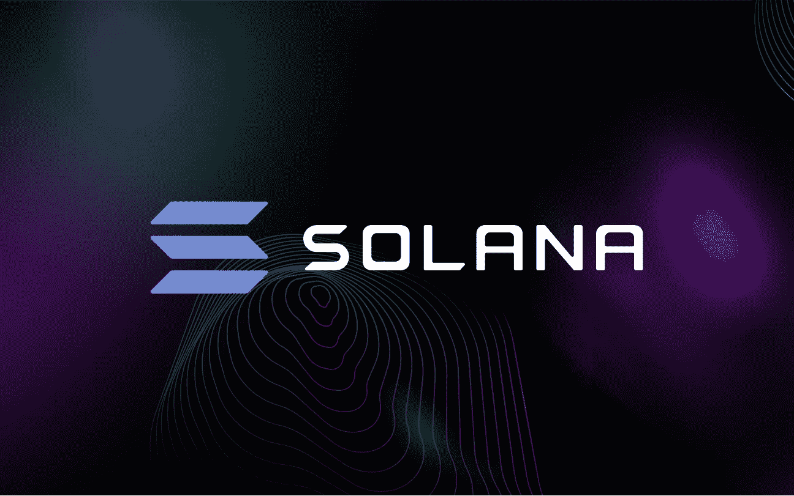

# 索拉纳推出了一款“专门为加密货币设计的”安卓手机。

> 原文：<https://medium.com/coinmonks/solana-introduces-an-android-phone-designed-specifically-for-cryptocurrency-822d7ef3005a?source=collection_archive---------51----------------------->

# 据该公司称，Solana Mobile Stack 软件和 Saga Android 智能手机已经发布。

6 月 23 日，sola(SOL)网络背后的组织 Solana Labs 宣布发布 Saga Android 智能手机和面向 Android 的 Solana Mobile Stack 软件生态系统。

开源的 Solana Mobile Stack (SMS)软件开发工具包(SDK)使程序员能够创建与 Solana 区块链网络集成的原生 Android 应用程序。

SDK 在 Solana 的 Saga 智能手机上首次亮相，使开发人员能够“创建美丽、无缝的 web3 移动体验”

# 最近的改进

移动钱包适配器是将 web 应用程序和原生 Android 应用程序链接到移动设备钱包的标准，是 SDK 的一部分。该公司表示，这项技术可以在所有移动平台上运行，而不仅仅是运行 Android 操作系统的平台。

另一个功能是 Seed Vault，这是一个预安装在移动设备上的安全环境，除了应用层之外，它还可以存储私钥、种子短语和秘密，同时仍然支持与应用程序和移动浏览器的交互。该功能通过将敏感数据与应用层隔离开来，试图阻止由应用程序攻击和利用导致的盗窃。

随着 Solana Pay for Android 功能的加入，用户现在可以在全球“数千万家企业”进行非接触式移动支付，这些支付由他们自保管钱包中的资金支持。

此外，Solana Labs 正在引入 Solana Dapp 商店，这将让用户通过他们的手机访问 Web3 生态系统，用于移动设备上的分散应用程序。索拉纳网络的 dapps 和钱包将免费提供给用户。

Solana Labs 声称，Solana Mobile Stack 将使人们能够使用智能手机铸造(即生产和引入)不可替代的令牌(NFT)。此外，他们将能够玩由 Solana 驱动的游戏，在网络上进行移动金融交易，并更简单地访问 Solana 生态系统中的各种 dapps 和协议，包括 Defi 应用程序。

除了种子库之外，Saga 还将包含一个基于硬件的“安全元素”，以更好地保护用户的私人数据免受漏洞和黑客攻击导致的盗窃。Android 和 iOS 设备的用户面临着由于虚假应用而丢失加密货币的危险，因此这种额外的安全预防措施可能是有用的。

Solana 基金会也正在建立一个 1000 万美元的开发者生态系统基金，通过赠款支持移动创作者和开发者。这发生在索拉纳推出 1 亿美元基金以吸引韩国加密货币项目之后。

# 功能和发布日期

Saga 由 OSOM 创建和制作，该公司是一家 Android 开发公司，之前曾为谷歌、苹果和英特尔等客户开发计算硬件。这款智能手机拥有 6.67 英寸有机发光二极管显示屏、512GB 存储空间、12GB 内存和骁龙 8+ Gen 1 引擎。

Solana 的 Saga 智能手机计划于 2023 年上半年上市，建议零售价约为 1000 美元。索拉纳实验室现在接受 100 美元的押金，索拉纳的开发者在等候名单上有优先权。为了纪念智能手机的推出，早期购买者将收到限量版的 NFT。

[https://thisdaycrypto . com/Solana-introduces-an-Android-phone-designed-specific-for-cryptocurrency/](https://thisdaycrypto.com/solana-introduces-an-android-phone-designed-specifically-for-cryptocurrency/)

> 加入 Coinmonks [电报频道](https://t.me/coincodecap)和 [Youtube 频道](https://www.youtube.com/c/coinmonks/videos)了解加密交易和投资

# 另外，阅读

*   [5 款最佳加密交易终端](https://coincodecap.com/crypto-trading-terminals) | [最佳 DeFi 应用](https://coincodecap.com/best-defi-apps)
*   [最佳网上赌场](https://coincodecap.com/best-online-casinos) | [币安评论](/coinmonks/binance-review-ee10d3bf3b6e) | [BitMEX 评论](https://coincodecap.com/bitmex-review)
*   [麻雀交换评论](https://coincodecap.com/sparrow-exchange-review) | [纳什交换评论](https://coincodecap.com/nash-exchange-review)
*   [美国最佳加密交易机器人](https://coincodecap.com/crypto-trading-bots-in-the-us) | [经常性评论](https://coincodecap.com/changelly-review)
*   [在印度利用加密套利赚取被动收入](https://coincodecap.com/crypto-arbitrage-in-india)
*   [Godex.io 审核](/coinmonks/godex-io-review-7366086519fb) | [邀请审核](/coinmonks/invity-review-70f3030c0502) | [BitForex 审核](https://coincodecap.com/bitforex-review)