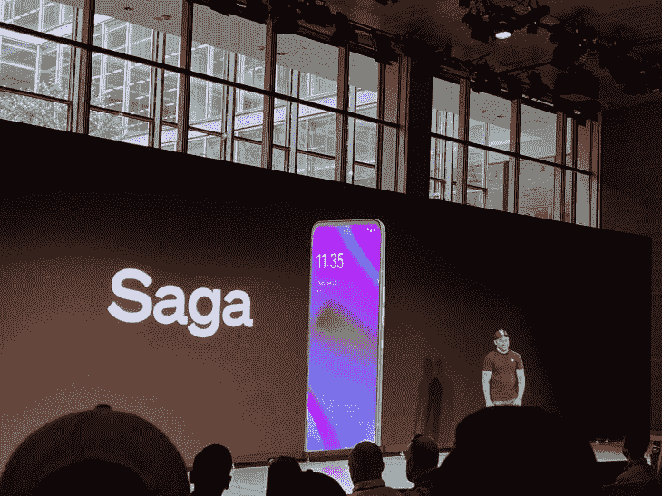
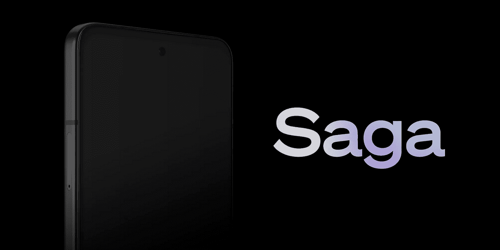
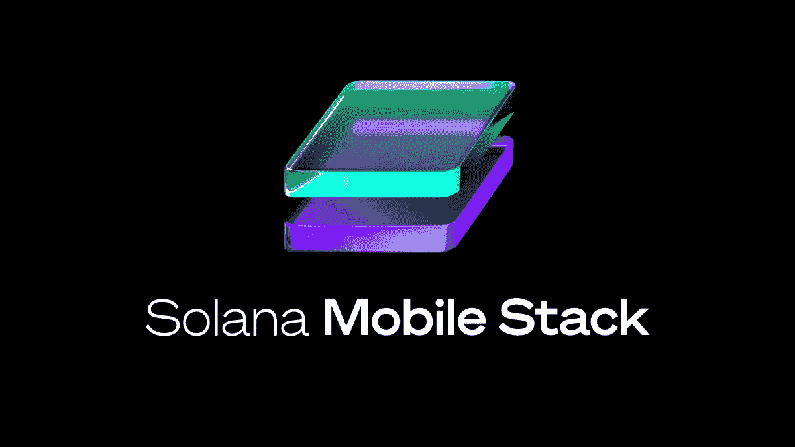
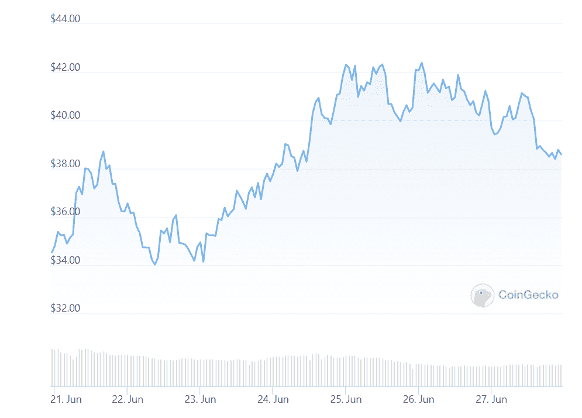

# 索拉纳实验室宣布 Web3 手机“传奇”

> 原文：<https://medium.com/coinmonks/solana-labs-announces-web3-mobile-phone-saga-47e2e7c17033?source=collection_archive---------32----------------------->

## 索拉纳的传奇和索拉纳移动堆栈将促进 Web3 的发展。

**Image Credits:** Jacquelyn Melinek

# **【TL；【T1 博士】**

区块链平台 Solana Labs 的一个分支 Solana Mobile 已经公布了推出一款名为 Saga 的 Web3 优化 android 智能手机的计划。该公司将进一步涉足 Web 3 领域，并首次推出了 Solana Mobile Stack，这是一款基于 android 的开源软件套件。6 月 23 日，索拉纳创始人阿纳托利·亚科文科上周在纽约的一次活动上分享了这一消息。

一系列的博客文章概述了网络最新发展的更多细节。在其中一份出版物中，亚科文科解释了索拉纳的动机，强调了该网络在过去两年中的爆炸性增长。他还指出，它目前的地位是进入加密领域的一个入口，也是不可替代令牌的主要平台之一。

亚科文科和索拉纳将引领加密用户和 Web 3 开发者的移动体验。

关键词；索拉纳，佐贺，手机，电话

# 索拉纳的 Saga 智能手机的特点

在其基础上，Saga 是一款经过修改的 OSOM 设备，是一款由科技初创公司 Essential 的前员工设计的安卓智能手机。该设备旨在与苹果、谷歌和三星等大牌科技品牌竞争。Saga 将拥有骁龙 8+ Gen 1 移动平台和 6.67 英寸有机发光二极管显示屏。[这款手机还将配备 12GB 内存和 512GB 存储空间。](https://techcrunch.com/2022/06/23/solana-launches-web3-focused-smartphone-saga-to-improve-crypto-mobile-relationship/)

Source; [Solana](https://solana.com/news/saga-reveal)

鉴于其对 Web 3 的关注，Saga 的核心产品之一是专门针对分散应用程序(dapp)和 NFT 市场的应用程序商店。Saga 还将推出一款名为“Solana Pay”的内置手机钱包；该钱包与安卓系统协同工作，允许用户使用二维码、NFC 点击、信息或网络浏览器在区块链进行交易。这些功能是可能的，因为 Solana 即将推出的设备将拥有一个移动钱包适配器。

另一个基本的世家财产是种子库。骁龙处理器允许设计者启用种子库，种子库是硬件编码的，允许用户安全地存储他们的私钥、种子短语和其他私人信息。Seed Vault 将数据与应用程序层分开，但仍然确保它可以与手机或浏览器上的应用程序互操作。

# Solana 移动堆栈如何与即将到来的 Saga 发布相结合

Solana Mobile Stack 被称为 SMS，是一个开源软件开发工具包(SDK)。它使开发人员能够围绕索拉纳区块链网络创建和推出他们自己的基于 android 的分散式应用程序。

Source; [Solana](https://solana.com/news/solana-mobile-stack-reveal)

上面已经强调了 SDK 的一些功能，首先是移动钱包适配器，这显然不是 Android 设备独有的。该适配器是一种协议，用于将基于网络的原生 android 应用程序链接到手机上的钱包。此外，它可以与钱包应用程序配合使用，让用户在主设备之外的其他设备上登录。

该工具包还包括种子库，索拉纳 dApp 商店，和索拉纳支付。除了促进交易，Solana Pay 还授权用户保管他们的资金，并允许他们使用即时虚拟卡进行相关资产的非接触式操作。

.

SMS 提供了一个环境，其中储存了基于 Solana 的开发人员创建平台所称的“丰富的移动体验”所需的资源。其以创建者为中心的设计允许开发者通过 Solana dApp 商店直接与用户联系。值得注意的是，该商店不鼓励社区参与，这与谷歌和苹果等品牌的应用商店明显不同。

总的来说，该套件提供的服务包括从任何地方进行的 swift 交易和 NFT 铸币服务。《亚科文科邮报》还指出，手机短信可以让索拉纳更容易地玩 Web3 游戏。SDK 在消息出来的同一天上线。

# 发布和进一步开发详情

索拉纳实验室表示，它将邀请其他公司参与设计这款手机。这些公司将为 SMS x Saga 生态系统提供动力。其中包括 NFT 市场魔术伊甸园，钱包供应商幻影，和 DeFi 协议奥卡。

该平台将于 2023 年初正式推出智能手机，Solana 基金会提供了 1000 万美元的支持，以帮助“启动”新推出的 mobile sphere，并促进基于手机的 dApp 的增长。Solana 实验室正在通过提供赠款来支持开发人员和创作者。

Saga 的预期零售价约为 1000 美元；然而，感兴趣的个人可以向索拉纳实验室支付 100 美元的预购款。该平台给予 Solana devs 优先购买权，并以限量版数字收藏品奖励早起的鸟儿。索拉纳说，这些“传奇通行证”将随着设备的发布而出现，并将有助于短信平台的发展。

# 索拉纳的传奇如何改变游戏

《区块链议定书》即将出台，这是一个令人振奋的进展；然而，佐贺并不是第一个这样的。大约五年前，区块链解决方案公司 Sirin Labs 冒险发布了一款以区块链为中心的旗舰设备。然而，释放并不成功；后来，该公司不得不处理许多法律纠纷和裁员。类似的项目包括 HTC 的 Exodus line 和三星的 Katyn release。

当然，这引发了关于失败可能性的问题。然而，对于上述失败的尝试，阿纳托利·亚科文科表示，佐贺有更好的机会成功起飞。他指出，自 2018 年以来，加密开发者的数量有所增加。佐贺有一个伟大的团队和更大的潜在客户群。

OSOM 首席执行官兼联合创始人杰森·济慈对索拉纳最近的举动发表了评论。Keats 指出，随着世界的进步，创新的 Web3 优化设备是必要的。亚科文科也谈到了这一点，指出“我们生活在移动设备上”，短信为 Solana 的未来铺平了道路，它是开源的，安全的，可访问的，并与 Web 3.0 集成。

FTX 创始人 Sam Bankman-Fried 证实了上述说法，同时指出现有的加密移动功能“笨重”且过时。

# 结论

Solana 的推出预示着一个基于移动的区块链互动时代的到来。除了让区块链和加密服务更容易获得，它也有助于向 Web 3 的过渡。目前还无法准确预测事态的发展。尽管如此，该团队和其他相关个人以及一些热情的索拉纳用户似乎非常乐观。

Source; [Coingecko](https://www.coingecko.com/en/coins/solana)

这些声明对 SOL token 的交易价格几乎没有影响，因为它目前停留在 38.52 美元，比消息首次披露时略有上涨。

> 加入 Coinmonks [电报频道](https://t.me/coincodecap)和 [Youtube 频道](https://www.youtube.com/c/coinmonks/videos)了解加密交易和投资

# 另外，阅读

*   [3 商业评论](/coinmonks/3commas-review-an-excellent-crypto-trading-bot-2020-1313a58bec92) | [Pionex 评论](https://coincodecap.com/pionex-review-exchange-with-crypto-trading-bot) | [Coinrule 评论](/coinmonks/coinrule-review-2021-a-beginner-friendly-crypto-trading-bot-daf0504848ba)
*   [莱杰 vs n rave](/coinmonks/ledger-vs-ngrave-zero-7e40f0c1d694)|[莱杰 nano s vs x](/coinmonks/ledger-nano-s-vs-x-battery-hardware-price-storage-59a6663fe3b0) | [币安评论](/coinmonks/binance-review-ee10d3bf3b6e)
*   [加密交易机器人](/coinmonks/crypto-trading-bot-c2ffce8acb2a) | [Bingbon 评论](https://coincodecap.com/bingbon-review)
*   [Bybit 交易所评论](/coinmonks/bybit-exchange-review-dbd570019b71) | [Bityard 评论](https://coincodecap.com/bityard-reivew) | [Jet-Bot 评论](https://coincodecap.com/jet-bot-review)
*   [3 commas vs crypto hopper](/coinmonks/3commas-vs-pionex-vs-cryptohopper-best-crypto-bot-6a98d2baa203)|[赚取加密利息](/coinmonks/earn-crypto-interest-b10b810fdda3)
*   最好的比特币[硬件钱包](/coinmonks/hardware-wallets-dfa1211730c6) | [BitBox02 回顾](/coinmonks/bitbox02-review-your-swiss-bitcoin-hardware-wallet-c36c88fff29)